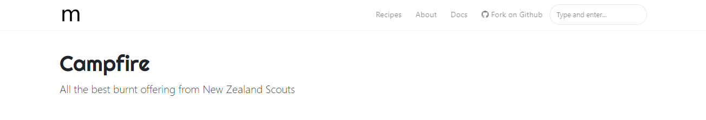

# Jekyll Template - Mediumish by WowThemes.net

[Live Demo](https://wowthemesnet.github.io/mediumish-theme-jekyll/) &nbsp; | &nbsp; [Download](https://github.com/wowthemesnet/mediumish-theme-jekyll/archive/master.zip)

### Features

- Built for Jekyll
- Compatible with Github pages
- Featured Posts
- Index Pagination
- Post Share
- Post Categories
- Prev/Next Link
- Category Archives (this is not yet compatible with github pages though)
- Jumbotron Categories
- Integrations:
    - Disqus Comments
    - Google Analaytics
    - Mailchimp Integration
- Design Features:
    - Bootstrap v4.x
    - Font Awesome
    - Masonry
- Layouts:
    - Default
    - Post
    - Page
    - Archive
    
### Using Mediumish

- Open <code>_config.yml</code>. If your site is in root, for <code>baseurl</code>, make sure this is set to <code>baseurl: /</code>. Also, change your Google Analytics code, disqus username, authors, Mailchimp list etc.
- Mediumish requires 2 plugins: 
    - <code>$ gem install jekyll-paginate</code>
    - <code>$ gem install jekyll-archives</code>.
- Edit the menu and footer copyrights in <code>default.html</code>
- Start by adding your .md files in <code>_posts</code>. Mediumish already has a few as an example. 
- YAML front matter
    - featured post - <code>featured:true</code>
    - exclude featured post from "All stories" loop to avoid duplicated posts - <code>hidden:true</code>
    - post image - <code>image: assets/images/mypic.jpg</code>
    - page comments - <code>comments:true</code>
    - meta description (optional) - <code>description: "this is my meta description"</code>
    
YAML Post Example:
<pre>
---
layout: post
title:  "We all wait for summer"
author: john
categories: [ Jekyll, tutorial ]
image: assets/images/5.jpg
featured: true
---
</pre>

YAML Page Example
<pre>
---
layout: page
title: Mediumish Template for Jekyll
comments: true
---
</pre>

### Copyright

Copyright (C) 2018 WowThemes.net.

**Mediumish for Jekyll** is designed and developed by [Sal](https://www.wowthemes.net) and it is *free* under MIT license. 

### Contribute

- [Clone the repo](https://github.com/wowthemesnet/mediumish-theme-jekyll).
- Create a branch off of master and give it a meaningful name (e.g. my-new-mediumish-feature).
- Open a pull request on GitHub and describe the feature or fix.

-----------------

[Live Demo](https://wowthemesnet.github.io/mediumish-theme-jekyll/) &nbsp; | &nbsp; [Download](https://github.com/wowthemesnet/mediumish-theme-jekyll/archive/master.zip)
