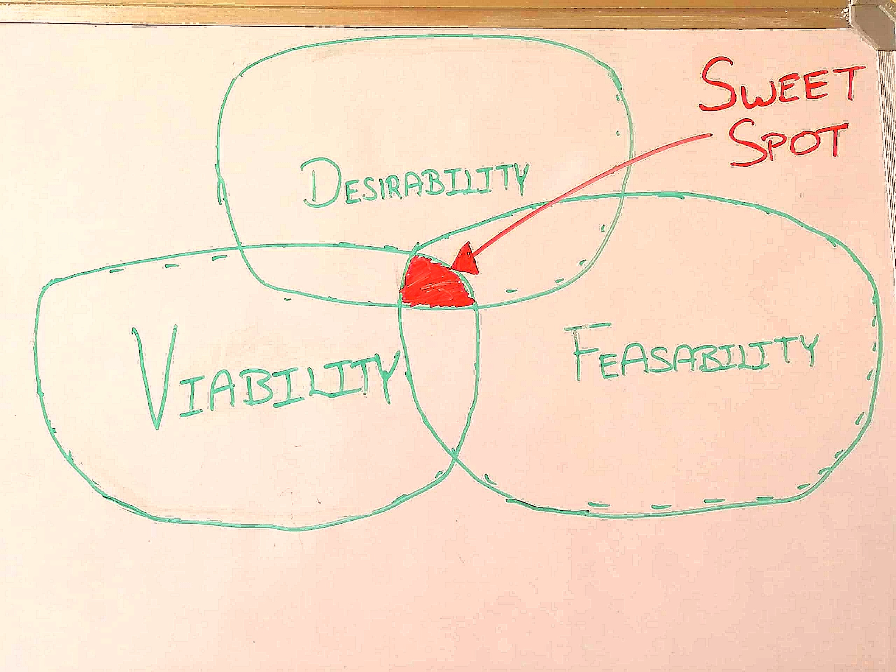

If I have to explain UX Design to a business owner and how it can help to achieve business goal than this is the picture that can sum up any business.

 

This is a sweet spot which every business is trying to achieve.  Lets break this down:

1. Desirability - Wished for being useful.

2. Viability - Ability to work successfully

3. Feasibility - The state of being easily or conveniently done

   **Desirability** is the human aspect of business, are we creating a product solution that anyone needs or meets an unfulfilled need? **Viability** is the business model behind the product which helps to sustain and **Feasibility** is tech behind it.dont

   To put it simple words one may have a desire to travel to Europe for vacation.  In order to fulfil this desire we need Money and Carrier (aeroplane/ship).  Money answers the feasibility aspect, only if we have money than we can plan the trip.  The trip will be viable only if air tickets are available to travel to Europe. 

   

Why do the most of startups fail?  I am certainly not an expert in this area but if we listen to experts like Paul Graham, founder of YCombinator which is an incubator and resulted in startups like : Airbnb, Stripe, Dropbox and lot more. 

> "There's just one mistake that kills startups: not making something users want. If you make something users want, you'll probably be fine, whatever else you do or don't do. And if you don't make something users want, then you're dead, whatever else you do or don't do."

This leads to the question how can startups make something that user desires.  If we have to answer this question than I would think more about the problem than the solution.  

**What are obstructions that is preventing to create a solution that customer wants.**  

Its a known devil and a friend : Technology.  Technology is both a friend and foe.  I will focus why its a foe because out society has been conditioned to invest in engineering.  In engineering what gets taught is technology i.e. Microprocessors, RAM.  With such a technology oriented mindset when engineers join businesses they start from technology and go all the way up to creating product or solution.  

A tech company is  conditioned to think from perspective of what technology can offer not what user wants.  Steve Jobs has clearly reasoned success behind Apple:

> **'You've got to start with the customer experience and work backwards to the technology. You can't start with the technology and try to figure out where can I sell it.' Steve Jobs**

There are lot more obstructions but this is the root cause of the problem.  Personally I have worked in tech and I strongly advocate to not to start a company by hiring engineers.  Start with people who care about needs, people who are deeply interested in knowing about customers.  

If we have to start from customer experience than how can we do that?  For a person who is starting a business he will not be impressed by this idea because it creates a chicken :chicken: and egg :egg: problem.  We want to build a product but we  haven't shipped anything. Where to start from? What will I show to my customer?

I will cover this in my next post.

# 