macOS 환경 기준입니다.
macOS의 경우 Xcode가 설치돼있기 때문에 Ruby도 함께 설치되어 있어 바로 사용할 수 있습니다.
만약 설치가 안되어 있다면 terminal창을 열고 다음의 command를 통해 Xcode Development Tool과 Ruby를 설치해 주세요.

```sh
# xcode development tool이 없다면 다음 커맨드로 설치
xcode-select --install

# Homebrew가 없다면 다음 커맨드를 통해 Homebrew를 설치
/usr/bin/ruby -e "$(curl -fsSL https://raw.githubusercontent.com/Homebrew/install/master/install)"

# Ruby 설치 및 환경변수 설정
brew install ruby
echo 'export PATH="/usr/local/opt/ruby/bin:$PATH"' >> ~/.bash_profile

# Ruby가 설치되었는지 확인
which ruby
# /usr/local/opt/ruby/bin/ruby 가 나와야 합니다.
ruby -v
```

우선 ruby를 통해 jekyll을 설치해줍니다.

```sh
sudo gem install jekyll
```

내 `{깃헙 username}.github.io` 형식으로 jekyll 폴더를 생성합니다.
(깃헙 username이 대문자여도 소문자로 생성하는게 좋습니다. 저의 경우 `Enoch-Kim` 이지만 `enoch-kim.github.io`로 만들었습니다.)

```sh
jekyll new enoch-kim.github.io

# 폴더를 확인 후 해당 폴더로 이동
ls -al
cd enoch-kim.github.io
```

이제 자신의 github에 repository를 생성해줍니다. 이때, 위에서 생성한 폴더 이름과 동일한 repository를 만들어줘야합니다.

**여기서 잠깐!!! 이렇게 블로그를 만들면 처음부터 끝까지 커스텀해야하기 때문에 매우 ~~빡칩니다~~ 번거롭습니다.**
**만든 폴더를 삭제하고 좀 있다 소개할 블로그 템플릿을 이용하는 것을 권장합니다.**

```sh
# jekyll로 생성한 폴더로 이동
ls -al
cd enoch-kim.github.io

# git 생성 및 remote 연결
git init
git add .
git commit -m "jekyll initialize"
git branch -M master
git push -u origin master
```

이제 repository를 보면 jekyll 폴더들이 올라와 있음을 볼 수 있습니다.

***

## 이제 Jekyll Themes 에서 원하는 템플릿을 골라 블로그를 만드는 법을 다루겠습니다

[JEKYLL TEMES](https://jekyll-themes.com/) 사이트에 접속하여 원하는 테마를 고릅니다.
고른 테마의 repository로 이동합니다. (다음 화면의 REPOSITORY 버튼을 클릭)

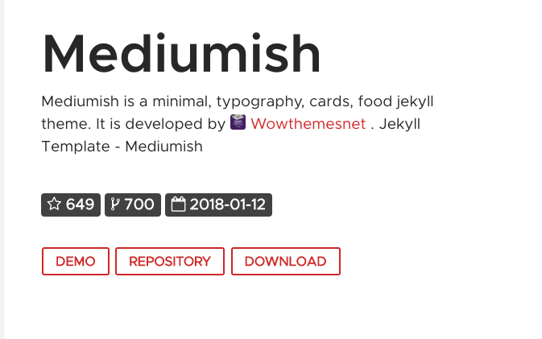

Repository 오른쪽 위의 Star을 한번 클릭해주고 Fork 해옵니다. (~~fork할 때 Star 박아주는게 국룰...~~)

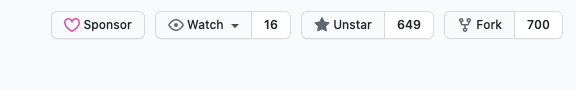

Fork 해온 repository의 setting으로 들어가 이름을 `{username}.github.io`로 변경해줍니다.

아래의 사진의 `mediumish-theme-jekyll` 을 `{username}.github.io`로 변경하고 Rename 버튼을 누릅니다.
(`{username}.github.io` 형식으로 repository를 생성하면 github이 이를 웹사이트로 인식하여
`https://{username}.github.io` 로 url 접속 시 `index.html` 또는 `index.md`를 웹 페이지로 출력해줍니다.)

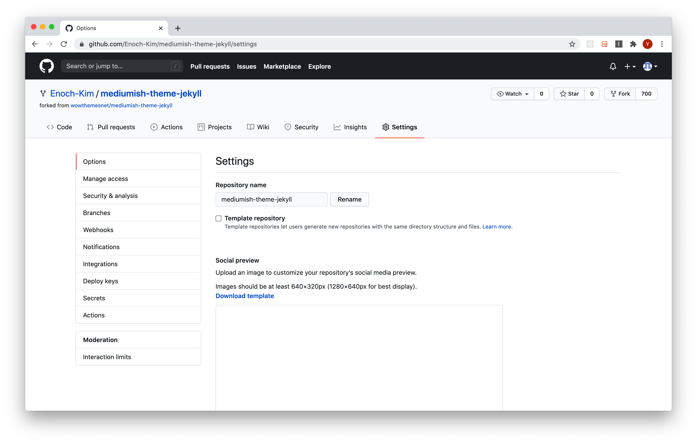

이제 해당 repository를 clone 해오면 기본 준비가 끝납니다!
repository의 SSH를 복사한 후 clone해 줍니다.

(SSH 설정을 안하셨다구요..? ~~Googling gogo~~ [Mac SSh](https://syung05.tistory.com/20) / [Window SSH](https://medium.com/beyond-the-windows-korean-edition/use-windows10-open-ssh-tips-e6e9c77de433) 참고)

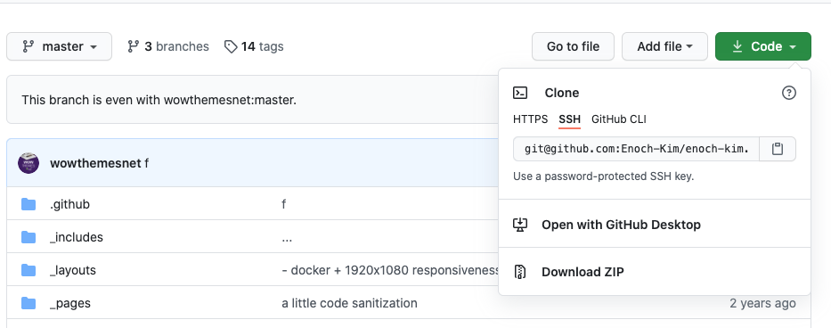

```sh
git clone git@github.com:Enoch-Kim/enoch-kim.github.io.git
cd enoch-kim.github.io.git
ls -al
```

***

이제 jekyll 서버를 동작해봅시다.

```sh
jekyll serve
```

이런 에러가 발생할 거예요.

```sh
/Library/Ruby/Gems/2.6.0/gems/bundler-2.0.1/lib/bundler/spec_set.rb:87:in
`block in materialize': Could not find public_suffix-3.0.3 in any of the sources (Bundler::GemNotFound)
```

당황하지 말고 `index.html` 혹은 `index.md`를 열고 다음의 사진에서 `jekyll-seo-tag` 와 `jekyll-archives`를 제거해주세요.

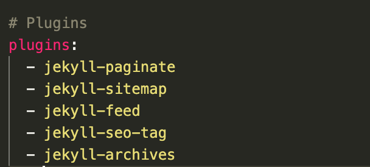

아래쪽에 있는 `archives` 관련 코드들도 없애주세요.

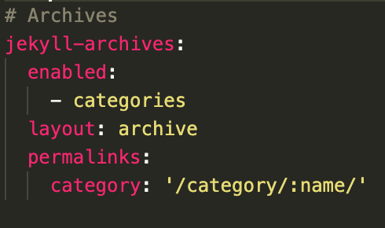

`/_layouts/default.html` 에 있는 `seo` 관련 코드도 삭제해주세요.

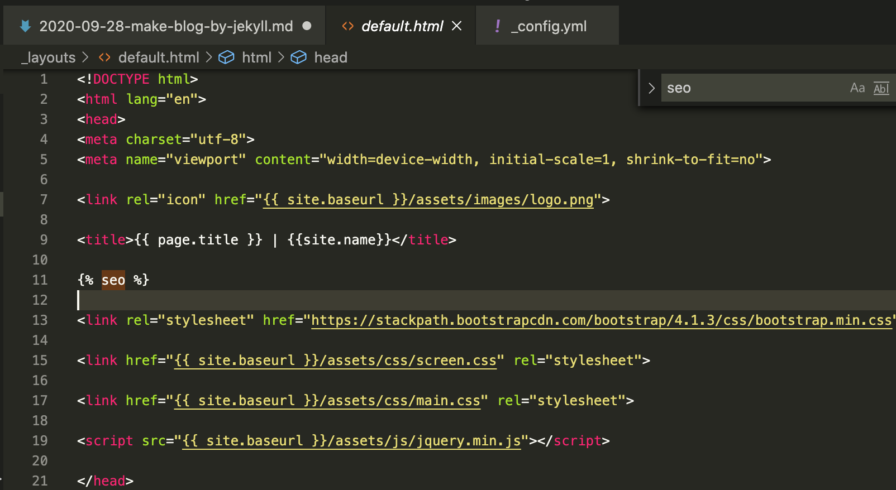

여기서 `{ %seo% }` 를 제거해주시면 됩니다.
(이 외에도 나중에 `jekyll serve` 실행 시 오류가 발생하면 관련 코드들을 제거해주어야합니다.)

그리고 이와 관련된 다음 파일들을 삭제해주세요

- `/Gemfile`
- `/Gemfile.lock`
- `/feed.xml`

**참고: 이 파일들은 각자 용도가 있으나 간단한 블로그를 만들기 위해 삭제한 거예요.
관심이 있으면 한번씩 구글링 해보셔서 사용하시는 것을 권장드립니다.**

이제 jekyll server를 실행해봅시다.

```sh
$ jekyll serve
Configuration file: /Users/enoc/github.com/Enoch-Kim/enoch-kim.github.io/_config.yml
            Source: /Users/enoc/github.com/Enoch-Kim/enoch-kim.github.io
       Destination: /Users/enoc/github.com/Enoch-Kim/enoch-kim.github.io/_site
 Incremental build: disabled. Enable with --incremental
      Generating...
                   done in 0.549 seconds.
 Auto-regeneration: enabled for '/Users/enoc/github.com/Enoch-Kim/enoch-kim.github.io'
    Server address: http://127.0.0.1:4000/mediumish-theme-jekyll/
  Server running... press ctrl-c to stop.
```

위의 주석에서 Server address 로 접속해보시면 잘 나오는 것을 알 수 있습니다!

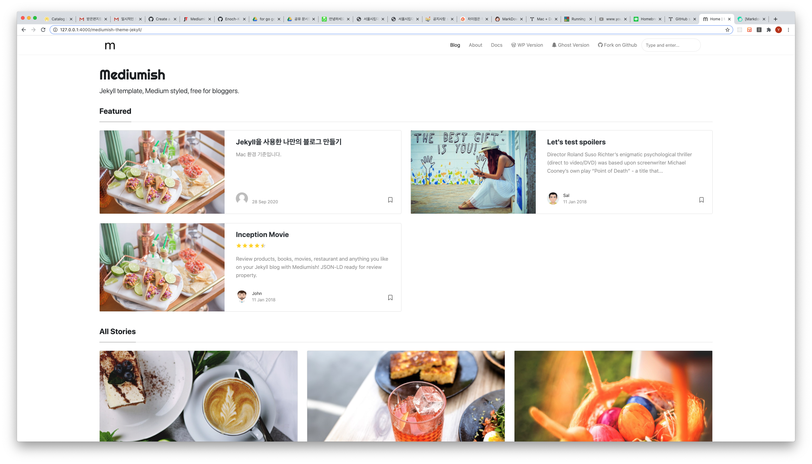

이제 한번 자신의 웹사이트에 접속해 봅시다. `{username}.github.io` 로 접속해보시면 됩니다. (저의 경우 [enoch-kim.github.io](https://enoch-kim.github.io) 입니다.)

그럼 다음과 같이 결과가?!

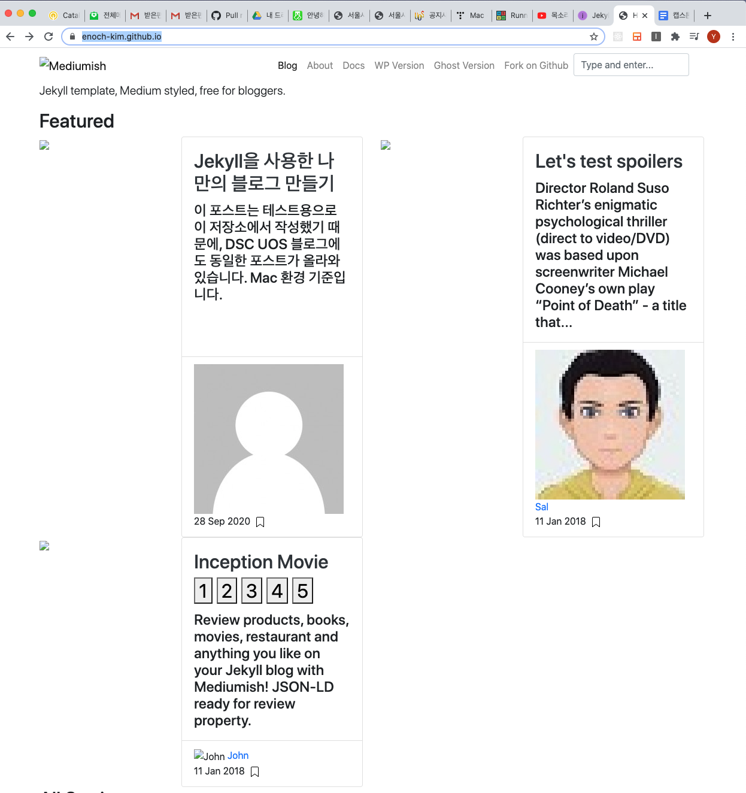

이렇게 되는 이유는 `_config.yml` 파일에서 `base_url`이 `/mediumish-jekyll-themes`로 되어있기 때문입니다.
repository의 `root` 디렉토리가 `index.html`과 동일한 위치이고, `/assets` 파일은 `root` 디렉토리에 있으나
`/mediumish-jekyll-themes/assets` 으로 파일 경로를 불러와서 이렇게 되는 것입니다.

`_config.yml` 파일의 `base_url`을 `/` 로 바꿔 `root` 디렉토리로 연결해줍시다.
이제 다시 push 후 자신의 웹사이트로 접속해보면 정상적으로 작동할 것 입니다.

다들 눈치채셨겠지만, 사실 author도 그렇고 로고도 그렇고 바꿔야할 부분이 많습니다.
지금까지 해온 방식대로 하나하나 제거해 나가면 됩니다.

저는 이보다 다른 부분들을 다룰 생각인데요, google-analytics와 disqus를 연결해줍시다 !

***

### Google Analytics

Google Analytics는 저희가 만든 블로그의 접속 등을 분석하기 위한 구글에서 제공하는 분석 툴입니다.
추적 ID를 설정함으로써 간단하게 이 분석 툴을 활용할 수 있습니다. 이 추적 ID를 설정하는 법을 다루겠습니다.

우선 [Google Analytics](https://analytics.google.com/analytics/web/provision/#/provision) 에 들어가서 계정 만들기를 클릭합니다.

1. 첫 단계인 계정 설정에서 계정 이름을 입력하고 다음을 누릅니다.

2. 측정하려는 대상을 웹으로 선택하고 다음을 누릅니다.

3. 웹 사이트 이름은 그냥 url(`{username}.github.io`)과 동일하게 설정해주세요. (관리가 편합니다)
또한, 웹사이트 URL 부분에서 http를 https로 변경후 동일하게 `{username}.github.io` 로 적어주신 후 시간을 한국으로 변경하여 만들어주세요.

위의 방법대로 계정을 생성하면 다음과 같이 UA로 시작하는 추적 ID가 생성됐을 거예요.

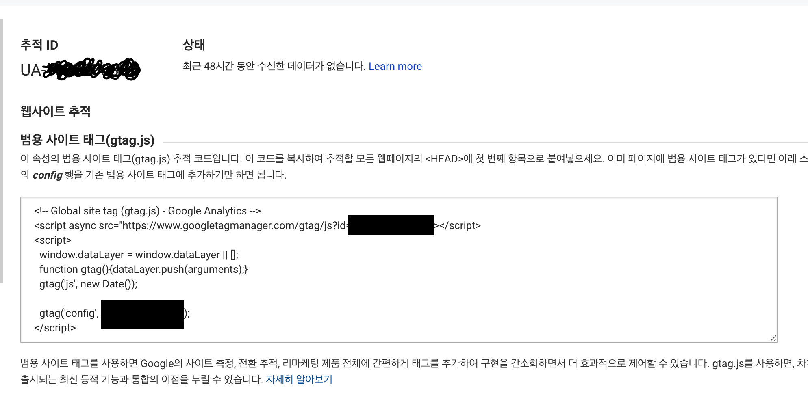

해당 추적 ID를 복사하여 `_config.yml` 파일의 `google_analytics`의 값에 넣어줍니다.
이제 Push 후 `{username}.github.io`에 들어가보면 Google Analytics 콘솔에 기록이 남을 겁니다.(~~추가적인 부분은 구글링 합시다.~~)

***

### Disqus

Disqus는 여러 블로그에서 사용하고 있는 댓글 플랫폼입니다.
다음과 같은 댓글을 보셨다면 모두 Disqus를 사용하고 있는 겁니다 !

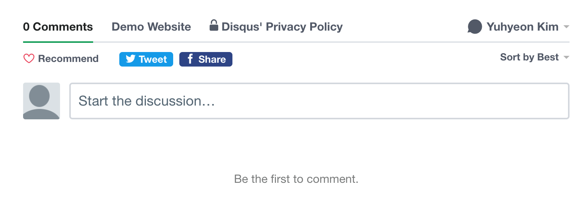

Disqus는 단순히 한 블로그에만 국한되지 않고, 다른 블로그들에서도 계정이 연동되어 활동할 수 있습니다.
만약 댓글을 달고 댓글에 다른 사람들이 답글을 달면, 메일로 알려주는 기능 등의 서비스도 제공합니다.

[Disqus](https://disqus.com/)에 접속해 계정을 생성하고 아무 블로그에 가서 댓글을 달아보세요.
그 후 Disqus 홈페이지에서 자신의 프로필 페이지에 접속하면 댓글을 단 기록을 볼 수 있습니다.

이제 블로그와 연동해볼까요??

1. [Disqus](https://disqus.com/) 홈페이지에서 Get Started를 클릭합니다.

2. I want to install Disqus on my site를 클릭합니다.

3. 간단한 이름을 적습니다. 저는 enoch-kim으로 작성했습니다.
카테고리와 언어를 선택해줍니다.
(보시면 한국어가 언어 리스트에 없습니다.
~~만약 한국어 설정을 하고 싶으시면 [이 곳](https://dololak.tistory.com/663)을 참고해주세요.~~
-> Disqus가 React로 코드를 옮기면서 정해진 언어만 사용하도록 고정해서 위의 방법이 안됩니다.
어쩔 수 없이 영어로 사용해야할 것 같아요...)

4. Basic Plan을 선택한다. (스크롤을 아래로 내리면 보입니다.)
다음으로는 Platform 선택 화면에서 Jekyll을 선택합니다.

5. General Setting에서 `Website URL` 부분에 `{username}.github.io`를 입력합니다.

6. 이제 위에 적혀있는 Short Name을 `_config.yml` 파일의 `disqus`의 값에 넣어줍니다.

Push 후에 댓글을 달아봅시다!!

**바꿔야할게 많은데요, Author, favicon 등은 개인 취향에 따라 변경해주면 될 것 같습니다!!**
