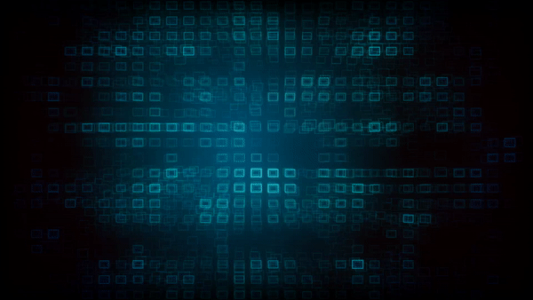
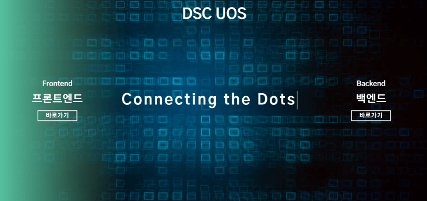

### web 팀의 첫 미션이 공개됐습니다. HTML 과 CSS를 다들 기본적으로 하신적이 있으셔서 이에 대한 감을 다시잡기 위해서 공개된 미션을 살펴봅시다!

---

https://www.estsecurity.com/


바로 이사이트의 UI부분을 클론코딩 하는것인데 직접 살펴보면 배경화면으로 영상이 실행되고 있고 상단 로고, 중앙 슬로건이 있네요.

그리고 왼쪽, 오른쪽에는 커서를 갖다대면 버튼이 반응하여 변화하는 모습을 보이는 효과를 줘야합니다. 그리고 추가로 한가지더 요구사항이 있는데요 바로 중앙 슬로건이 처음 접속할때 타이핑 효과를 주는 것 입니다.

그러면 요구사항을 한번 정리해보면

```sh
1. 메인화면 background 에는 영상이 실행될 것

2. 상단에는 DSC UOS 로고, 중앙에는 Connecting the Dots 라는 슬로건이 들어갈 것

3. 단 가운데 슬로건은 바로 나타나지 않고 타이핑 효과를 통해서 나타낼 것

4. 화면의 좌, 우측 에는 각각 Frontend, Backend 버튼이 있으며 버튼에 커서를 가져가면 버튼에 transition 효과를 줄 것
```

이렇게 4가지로 정리할 수 있습니다. 한 번 HTML과 CSS만을 이용해 작성해봅시다💻💻

---

우선 배경영상은 제공받은 아래의 영상을 이용하여 꾸며야 합니다.



아무래도 영상을 그냥 삽입한다면 화면 비율에 따라 여백이 생기거나 짤리는 현상이 생깁니다.. 그래서 보이는 화면의 비율에 알맞게 꽉 채우기 위해 position을 fixed로 두고, 비율에 맞게 크기를 조절해주는 object-fit 을 cover로 설정해 줍시다!

참고로 width와 height의 % 단위는 부모요소에 대해서 차지하는 비율이니까 backvid를 감싸고 있는 부모요소를 화면에 꽉 채우는것 명심하세요!

```sh
#backvid{
    position: fixed;
    width:100%;
    height:100%;
    object-fit: cover;
}
```

이제 전체적인 구도를 살펴보면 왼쪽 버튼, 가운데 슬로건, 오른쪽 버튼이 column 비율이 1:2:1 정도 되는걸로 보이네요! 따라서 저는 전체 화면을 grid 레이아웃을 적용해서 나누고 버튼과 중앙 slogan을 넣어보겠습니다.

세개의 column이 grid layout을 적용할 container 안에 있어야 하는것 명심하세요😎

그리고 버튼에 커서를 가져다대면 반응하는 hover 를 css에 추가해봅시다.

```sh
.container {
  z-index: 1;
  display: grid;
  grid-template-columns: 1fr 2fr 1fr;
}
.btn {
  cursor: pointer;
  position: relative;
  width: 100%;
  font-size: 3em;
  height: 100vh;
  text-align: center;
  display: flex;
  align-items: center;
  justify-content: center;
  color: white;
  z-index: 2;
  transition: background-color 1s;
  background-color: transparent;
}
#main-column {
  position: relative;
  height: 100vh;
  text-align: center;
  display: block;
  align-items: center;
  justify-content: center;
  color: white;
}
.btn:hover {
  background-color: rgba(164, 230, 230, 0.15);
}
```

그리고 상단 로고는 가운데 column 내에서 absolute 로 배치를 상위요소를 기준으로 정해줍니다.

```sh
#top {
  width: 100%;
  margin-top: 3%;
  position: absolute;
  text-align: center;
  z-index: 2;
}
```

자 이제 마지막으로 남은 중앙 슬로건에 타이핑효과가 남았습니다. 보통이면 js를 활용해서 텍스트의 size에 변화를 주는 방식으로 적용하면 되겠지만 이번에는 css만을 사용해서 구현해보기로 했으니 어떤 방식을 쓰면 좋을까요??

바로 css의 animation과 @keyframes를 적용하는 것입니다. 이렇게 하면 한 글자 단위로 나타내기는 힘들겠지만 슬로건이 차지하는 길이의 일정 비율만큼 시간차로 나타내면서 나름 타이핑 효과를 줄 수 있게 됩니다!

아래 코드를 살펴보면 슬로건 텍스트가 들어간 main-slogan에 animation을 설정해주고, @keyframes 함수를 통해 몇초마다 얼마만큼의 길이를 보여줄 것인지, 깜박이는 커서의 색상과 간격의 시간을 설정한 것을 볼 수 있습니다.

```sh
#main-slogan {
  position: absolute;
  display: inline-block;
  top: 50%;
  left: 50%;
  font-size: 1.8em;
  text-align: center;
  overflow: hidden;
  transform: translate(-50%, -50%);
  border-right: 0.1em solid white;
  white-space: nowrap;
  letter-spacing: 0.3em;
  animation: typing 3s steps(30, end), blink-caret 1.2s step-end infinite;
}

@keyframes typing {
  0% {
    width: 0;
  }
  100% {
    width: 15em;
  }
}
@keyframes blink-caret {
  from,
  to {
    border-color: transparent;
  }
  50% {
    border-color: rgb(255, 255, 255);
  }
}
```

---

이러한 과정을 통해 만들어진 저희 WEB 멤버분들중 수빈님 작품을 보면
타이핑 효과와 버튼의 transition 효과까지 디자인도 아주 잘 적용된 것을 볼수 있습니다👍👍👏


HTML,CSS 만으로도 이렇게 멋진 사이트를 만들 수 있다는게 놀라울 따름이네요! JS까지 적용한다면 멤버 분들께서 더욱 멋진 사이트를 만들 것으로 기대됩니다😎

결과물로서 수빈님의 작품 링크와 형진님이 미션을 만들기 위해 작성한 미션 요구사항 사이트를 따로 첨부해드릴테니 참고해보시기 바랍니다!

https://mobumin.github.io/DSC-web/missionpage/mission1.html

https://www.notion.so/1-Mission-Clone-from-scratch-1e0106275ca1460683bbc444dc7417d6
