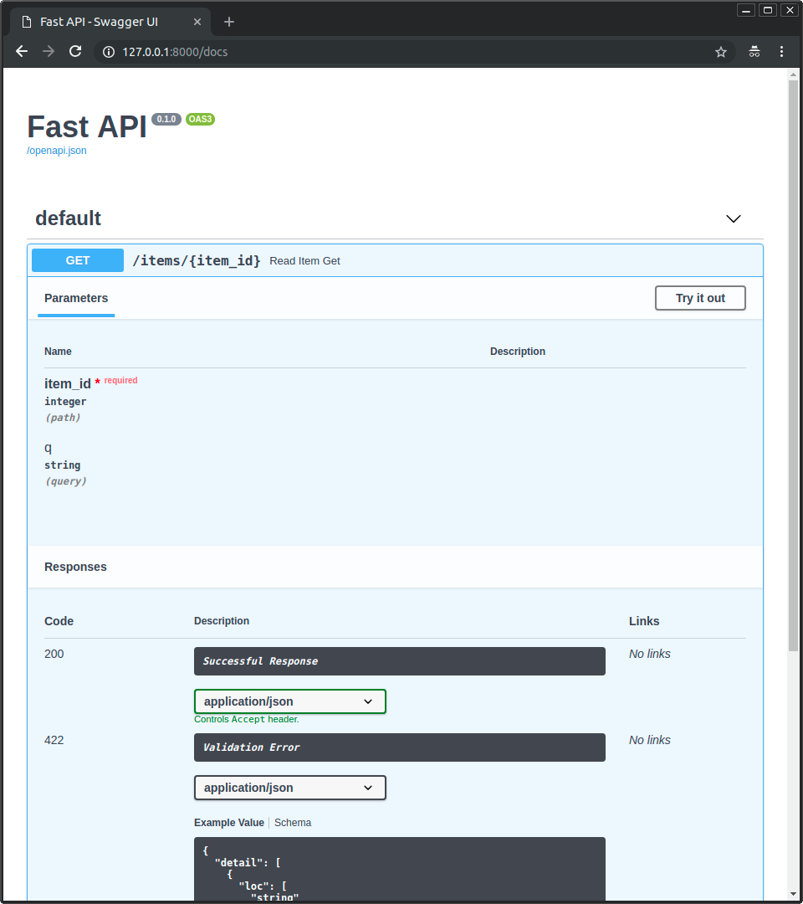

Web Team의 Mission3는 REST API 웹 서버를 구현하는 것입니다! 부족한 설명에도 불구하고, 끝까지 포기하지 않고 동료들과 함께 결과물을 완성한 Web Team 멤버들에게 박수👏를 보냅니다😁

> [#3 Mission : Something behind](https://www.notion.so/r4k0nb4k0n/3-Mission-Something-behind-b507a0cf07004ac5b569aed4ffafbdc4){: target="\_blank"}

지금부터 제가 요구사항에 따라 만드는 과정을 설명드리겠습니다.

## 목표 및 요구사항

웹 관련 예제들 중 단골 소재는 Todo list입니다. 단순하지만 대부분의 컴퓨터 소프트웨어가 가지는 기본적인 데이터 처리 기능인 Create, Read, Update, Delete(CRUD)를 다룰 수 있기 때문이죠. 이번 미션의 목표도 **Todo list 기능을 하는 REST API 웹 서버를 구현하는 것**입니다.

세부적인 요구사항은 아래와 같습니다.

- Resource Model `todo`
  ```json
  {
    "id": 0,
    "content": "string",
    "completed": false
  }
  ```
- `GET /todos`
  - request
    - no parameters required.
  - response
    - `db.json`에 들어있는 `todos` 리스트를 리턴합니다.
      ```json
      {
        "todos": [
          { "id": 1, "content": "HTML", "completed": false },
          { "id": 2, "content": "CSS", "completed": true },
          { "id": 3, "content": "Javascript", "completed": false }
        ]
      }
      ```
- `POST /todos`
  - request
    - parameter type - `body`
      ```json
      {
        "content": "종강하기"
      }
      ```
  - response
    - `db.json`에 들어있는 `todos` 리스트에 `body`로 담겨져서 들어온 `content`를 내용으로 하는 새로운 `todo`를 추가하는 작업을 하고, 리턴합니다.
      ```json
      {
        "success": true,
        "todo": {
          "id": 4,
          "content": "종강하기",
          "completed": false
        }
      }
      ```
- `PATCH /todos/{todo_id}`
  - request
    - parameter type - `path`
      - `todo_id`
    - parameter type - `body`
      ```json
      {
        "content": "제발 종강하기",
        "completed": true
      }
      ```
  - response
    - `db.json`에 들어있는 `todos` 리스트에 `path`로 담겨져서 들어온 `todo_id`를 가지는 `todo`를 `body`로 담겨져서 들어온 내용으로 수정을 하는 작업을 하고, 이를 리턴합니다.
      ```json
      {
        "success": true,
        "todo": {
          "id": 4,
          "content": "제발 종강하기",
          "completed": true
        }
      }
      ```
- `DELETE /todos/{todo_id}`
  - request
    - parameter type - `path`
      - `todo_id`
  - response
    - `db.json`에 들어있는 `todos` 리스트에 `path`로 담겨져서 들어온 `todo_id`를 가지는 `todo`를 삭제하는 작업을 하고, 이를 리턴합니다.
      ```json
      {
        "success": true
      }
      ```

## 환경 설정

여러 가지의 프로그래밍 언어와 프레임워크로 위 요구사항을 구현할 수 있습니다. 저는 이전에 Node.js + Express.js 조합으로 구현을 해본 경험이 있기 때문에, 새로운 것들을 접해보고자 Python과 FastAPI를 이용해보기로 결정했습니다.

아래 과정은 macOS를 기준으로 합니다.

```bash
$ brew install python               # 패키지 매니저 Homebrew를 이용해서 python 설치
$ easy_install pip                  # Python 패키지 관리 시스템인 pip를 설치
$ pip install virtualenv            # 필요한 모듈들을 글로벌 설치하지 않고 로컬로 사용하기 위해 virtualenv 모듈 설치
$ python3 -m venv .venv             # .venv 디렉토리에 virtualenv 생성
$ . .venv/bin/activate              # virtualenv 활성화
(.venv) $ pip install fastapi[all]  # virtualenv에 fastapi 모듈 설치
(.venv) $ pip freeze > requirements.txt # 해당 프로젝트에 필요한 모듈들을 기록
```

Python 프로젝트에서 필요한 모듈들을 해당 시스템에 전역 설치를 하지 않고 virtualenv를 사용하여 설치하는 이유는 다른 프로젝트나 환경과 충돌을 방지하기 위함입니다.

```python
from fastapi import FastAPI

app = FastAPI()


@app.get("/")
async def root():
  return {"message": "Hello World"}
```

위 `main.py`를 아래와 같이 실행하면 접속해볼 수 있습니다.

```bash
(.venv) $ uvicorn main:app --reload
INFO:     Uvicorn running on http://127.0.0.1:8000 (Press CTRL+C to quit)
```

FastAPI의 장점 중 하나는 아래와 같이 API를 테스트할 수 있는 Interactive API Documentation을 자동으로 생성하여 제공한다는 점입니다. 이러면 다른 사람들과 협업할 때 매우 편하죠😊



## 구현하기

먼저, 실제 데이터베이스를 사용하는 대신 이를 모사하기 위해 `db.json` 파일을 사용하기 때문에 이에 필요한 내용들을 작성합니다.

```python
# `db.json` 파일을 Python의 dict로 변환하기 위해 필요한 모듈
import json

# `db.json` 파일을 불러서 읽은 뒤 이를 dict로 변환한다.
db = None
with open('./db.json', 'r+', encoding='utf-8') as f:
  db = json.load(f)

# python dict인 `db`를 다시 `db.json` 파일에 담아서 저장하는 메소드.
def dbSync():
  with open('./db.json', 'w', encoding='utf-8') as f:
    json.dump(db, f, indent='\t')

# 특정 `todo_id`를 가지는 `todo`를 찾아서 리턴해주는 메소드.
def findTodoInDB(todo_id):
  return next(i for i, x in enumerate(db["todos"]) if x["id"] == todo_id)
```

그리고 FastAPI 인스턴스를 생성하도록 합니다.

```python
from fastapi import FastAPI

app = FastAPI()
```

FastAPI에서는 Python의 decorator를 이용하여 정해진 Path와 HTTP Method에 decorated가 된 메소드가 실행되도록 합니다.

```python
@app.get("/todos/")
async def readTodo():
  return "Implement this!"

@app.post("/todos/")
async def createTodo():
  return "Implement this!"

@app.patch("/todos/{todo_id}")
async def updateTodo(todo_id: int):
  return "Implement this!"

@app.delete("/todos/{todo_id}")
async def deleteTodo(todo_id: int):
  return "Implement this!"
```

먼저 `GET /todos`를 구현하겠습니다. 이는 크게 어려울 것은 업습니다. `db.json`에 담긴 내용을 그대로 리턴하면 됩니다. 이 때 `try..except` 구문을 사용하는 이유는 도중에 예외가 발생하더라도 서버가 종료되지 않고 계속 실행되게 하여 안전성을 높이기 위함입니다.

```python
@app.get("/todos/")
async def readTodo():
  try:
    return db
  except Exception as ex:
    return ex
```

다음은 `POST /todos`를 구현하겠습니다. 여기서는 `body` parameter를 받아서 작업을 해야 하는데요. 이 때 `body`의 schema를 정해주는 방법이 `pydantic` 모듈의 `BaseModel` 클래스를 이용하는 것입니다. 이를 통해 받아온 내용을 사용하여 새로운 `todo`를 만들고 `db.json`에 반영까지 해주면 끝입니다.

```python
from typing import Optional
from pydantic import BaseModel

class RequestBodyTodo(BaseModel):
  content: Opitonal[str] = None
  completed: Optional[str] = None

@app.post("/todos/")
async def createTodo(body: RequestBodyTodo):
  try:
    created = {
      "id": len(db["todos"]) + 1,
      "content": body.content,
      "completed": False
    }
    db["todos"] += [ created ]
    dbSync()
    return {
      "success": True,
      "todo": created
    }
  except Exception as ex:
    return {
      "success": False
    }
```

이젠 수정, 갱신을 담당하는 `PATCH /todos/{todo_id}`입니다. 이 경우에는 `body`, `path` parameter 두 개를 받아와야 하는데요. decorated method의 parameter에 정의해주면 간단하게 가져다 쓸 수 있습니다. `findTodoInDB()` 메소드를 통해 수정하고자 하는 `todo`의 index를 찾은 뒤 `body` parameter에서 받은 값들로 수정해주고 이를 `db.json` 파일에 반영하면 끝입니다.

```python
from typing import Optional
from pydantic import BaseModel

class RequestBodyTodo(BaseModel):
  content: Opitonal[str] = None
  completed: Optional[str] = None

@app.patch("/todos/{todo_id}")
async def updateTodo(todo_id: int, body: RequestBodyTodo):
  try:
    idx = findTodoInDB(todo_id)
    if body.content is not None:
      db["todos"][idx]["content"] = body.content
    if body.completed is not None:
      db["todos"][idx]["completed"] = body.completed
    dbSync()
    return {
      "success": True,
      "todo": db["todos"][idx]
    }
  except Exception as ex:
    return {
      "success": False
    }
```

마지막으로 `DELETE /todos/{todo_id}`입니다. `path` parameter로 받아온 `todo_id`를 가지는 `todo`를 찾은 뒤 지우기만 하면 끝입니다! 물론 `db.json` 파일에 반영하는 것도 잊지 않아야겠지요 😎

```python
@app.delete("/todos/{todo_id}")
async def deleteTodo(todo_id: int):
  try:
    idx = findTodoInDB(todo_id)
    db["todos"].pop(idx)
    dbSync()
    return {
      "success": True
    }
  except Exception as ex:
    return {
      "success": False
    }
```

> [r4k0nb4k0n/something-behind](https://github.com/r4k0nb4k0n/something-behind)

지금까지 구현한 REST API 웹 서버 코드를 위 깃허브 링크로 들어가시면 보실 수 있습니다!

> [r4k0nb4k0n/something-behind-express-skeleton](https://github.com/r4k0nb4k0n/something-behind-express-skeleton)

node.js + express.js로도 해당 미션을 핵심 부분만 구현할 수 있도록 뼈대를 만든 코드를 위 깃허브 링크로 들어가시면 보실 수 있습니다!

> [something-behind - FastAPI - Swagger](https://something-behind.herokuapp.com/docs)

지금까지 구현한 REST API 웹 서버를 현재 Heroku로 배포해둔 상태입니다. 언제든지 마음껏 만져보세요! Free 요금제이기 때문에 sleep mode일 떄 접속하면 최대 1분 정도 접속 시간이 소요됩니다😁

## 마치며

미션 3의 부족한 설명에도 불구하고, 끝까지 포기하지 않고 동료들과 함께 결과물을 완성한 Web Team 멤버들에게 다시 한번 박수👏를 보냅니다😁

개인적으로 새로운 언어와 프레임워크/라이브러리를 빠르게 습득하고 이를 해결하려는 문제에 적용해보는 연습을 할 수 있는 기회가 되었다고 생각합니다😎

최종 목표인 실시간 퀴즈 서비스를 위해 열심히 나아가겠습니다! 웹 팀 다 같이 힘내봐요!🙌
