Image Translation 논문 리뷰(상)

Wang, Xinrui, and Jinze Yu. "Learning to Cartoonize Using White-Box Cartoon Representations." Proceedings of the IEEE/CVF Conference on Computer Vision and Pattern Recognition. 2020.
<https://github.com/SystemErrorWang/White-box-Cartoonization/>.
에 대해서 리뷰합니다.

## 1. Introduction & Related Work

CartoonGAN

- 기존에 사용하던 CartoonGAN은 일반적인 GAN에서 사용하는 Adversarial loss를 사용하지 않음

    ⇒ 만화에서는 외곽선이 가장 중요한 특징이지만, 전체 이미지에서 차지하는 부분이 작기 때문에 output 이미지의 edge가 clear 하지 않음.

    ⇒ 따라서 기존의 GAN에서 사용하는 loss를 사용하기에는 적합하지 않음.

    ⇒ 이를 조정하기 위해 (1) Canny edge detector (2) dilate the edge regions (3) Gaussian smoothing 방법 3가지를 적용한 edge-smoothed image 생성

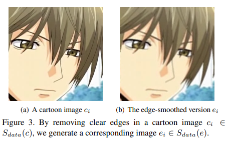

- 그러나 Black-box model을 사용하여 data를 학습시키기 때문에 학습이 중구난방이고 quality가 낮은 Output image를 생성할 가능성이 높음.

## 2. This work

- 따라서 저자는 좋은 퀄리티의 Output 이미지를 얻기 위해 3가지 decompose 방법을 제안함.

1)surface representation

- 만화가들이 디테일한 부분을 수정하기 전에, 초안을 그리는 것으로 부터 착안.
- 이미지로부터 smooth 한 surface를 나타내기 위해서 색깔 구성과 그림의 texture만 알아 볼 수 있도록 low-frequency component 만을 추출
- 이는 마치 가우시안 블러를 적용한 것과 같다.

2)structure representation

- celluloid cartoon style(Cell Animation)으로부터 착안
- 셀 애니메이션(Cell Animation) : Cell 이라는 투명한 종이를 뜻하는 Celluloid 를 의미. 기본적으로 하나의 배경셀과 여러 장의 전경 셀들을 여러겹의 층으로 구성하여 하나의 프레임을 형성하는 방식
- 입력 이미지로부터 segmentation map을 추출하여 Global한 구조 정보와 sparse한 color block을 효과적으로 포착함.

3)texture representation

- 이 특징은 미술가들이 먼저 윤곽과 디테일한 선 스케치를 그린 뒤 색을 입히는 방법에 의해 착안
- 3개의 채널을 가진 입력이미지를 1개의 채널로 변환하는 과정.
- 색상과 밝기가 제거되고 상대적인 픽셀 강도가 보존됩니다.

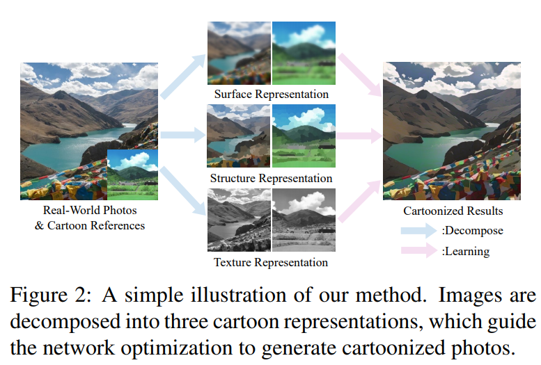

## 3. Proposed Approach

- 아래 그림을 보면, image 특징을 Decompose하는 3가지 방법이 어떻게 진행되는지 알 수 있음.

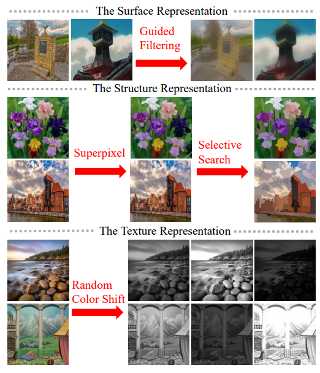

- 이미지가 Surface Representation, Structure Representation, Texture Representation으로 분해되고 해당 Representation을 추출하기 위해 세 개의 독립 모듈을 도입함.
- GAN framework는 Generator G와 Discriminator인 D_s, D_t로 구성됨.
- D_s는 Surface Representation을 기준으로, 생성된 image와 만화를 구별하고 D_t는 Texture Representation 으로 생성된 image와 만화를 구별함.

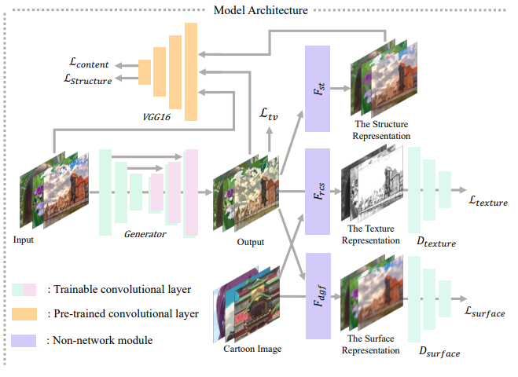

3-1) Learning From the Surface Representation

- 화가들이 붓으로 초안을 그리는 스타일을 모방하여 만화와 유사한, 매끄러운 표면을 가진 화풍을 생성하고자 함.
- F_dgf는 이미지 I를 입력으로 받아서 texture 와 디테일한 부분을 제거한 surface를 추출함.
- D_s는 모델이 생성해낸 이미지와 기준이되는 만화 이미지가 비슷한 surface를 갖는지 판단하고 generator G가 surface representation를 잘 추출할 수 있도록 가이드를 제공함.

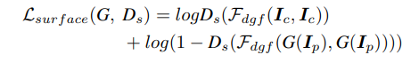

- I_c는 reference cartoon images를, I_p는 input photo를 의미함.

3-2) Learning From the Structure representation

- felzenszwalb algorithm를 사용해서 이미지를 여러 개의 지역으로 segmentation 합니다.
- superpixel algorithms을 사용하여 픽셀들의 색 등 low level 정보를 바탕으로 비슷한 픽셀끼리 묶어서 '커다란 픽셀'을 만듭니다.

### felzenszwalb algorithm

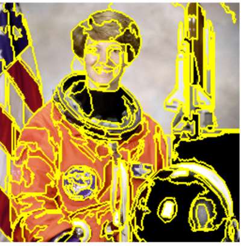

### superpixel algorithms

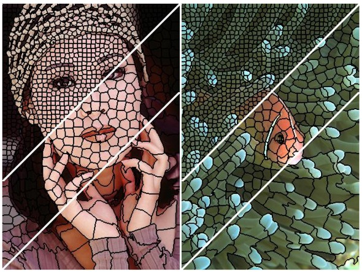

- 이후 Adaptive coloring algorithm을 사용하여 이미지에 대한 Haze를 줄입니다.
- Haze란 '대상 물체와 관찰자 사이에 존재하는 물질들에 의해 빛이 진행을 방해받아 대상이 뿌옇게 보이는 현상'을 의미합니다.  아래 그림에서 (a)가 Haze가 있는 사진, (b)는 Haze를 제거한 사진입니다.

### Adaptive coloring algorithm

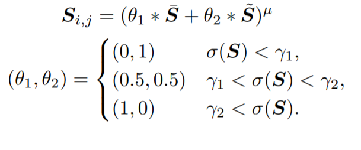

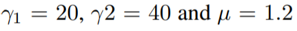

### Haze 유무

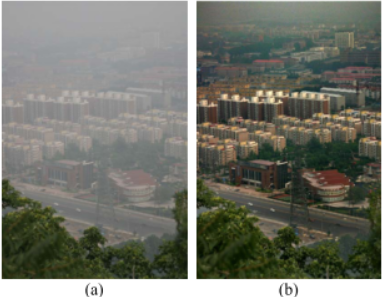

- 입력 사진은 Generator에도 들어가고 VGG 네트워크에도 들어갑니다. VGG 네트워크에서는 High level  feature를 추출해냅니다.  Structure 특징을 뽑아내기 위한 loss는 아래와 같습니다.

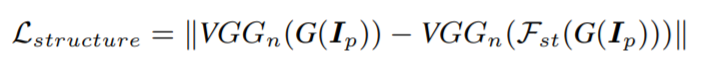

3-3) Learning From the Textural Representation

- 만화영상과 실제 사진을 구분하기 위해서는 High frequency 특징과 밝기, 색 정보를 이용해야한다. 특히 High frequency 특징 정보는 남기고 밝기와 색 정보가 주는 영향을 최소화 해야한다.
- F_rcs라는 random color shift algorithm을 제안했는데, 식은 아래와 같다.
- I_rgb는 RGB 채널을 갖는 이미지이고 I_r, I_g, I_b는 color channel을 의미한다. Y는 RGB 이미지를 grayscale한 것을 의미한다.
- Alpha와 Beta 값은 사용자가 변경 할 수 있다. 논문에는 Alpha- 0.8, Beta = ~U(-1,1)을 사용했다.

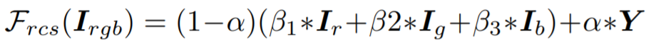

- random color shift algorithm은 밝기와 색상 정보를 제거한 상태에서 무작위 intensity maps을 생성할 수 있다.
- Discriminator D_t는 모델 출력물과 만화에서 추출한 질감 표현을 구별하고, Generator가 질감 표현에 저장된 명확한 윤곽과 미세한 질감을 학습하도록합니다.
- Texture 정보를 뽑아낼 수 있는 loss는 아래 식과 같습니다.

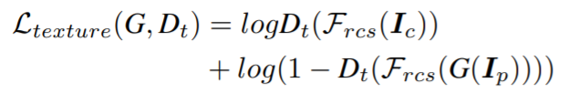

---

논문리뷰(상)은 여기서 마치겠습니다. 다음 post인 (하)편에는 구성한 loss를 어떻게 전체 모델에서 통합시켰는지, 실험은 어떻게 진행했는지를 작성하겠습니다.

추가적으로 DSP(Digital Signal Processing)에 대한 필요한 지식,  (상)편 추가 설명을 담겠습니다.
