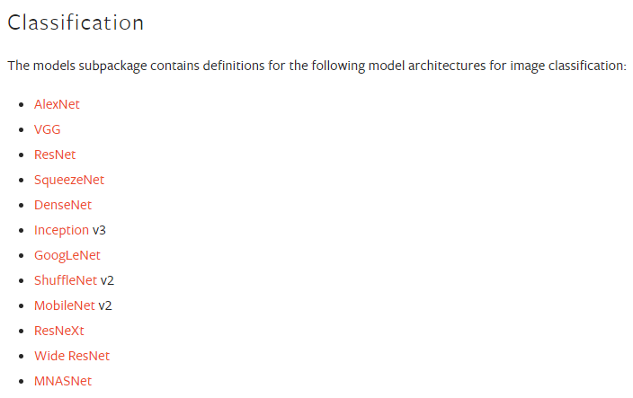
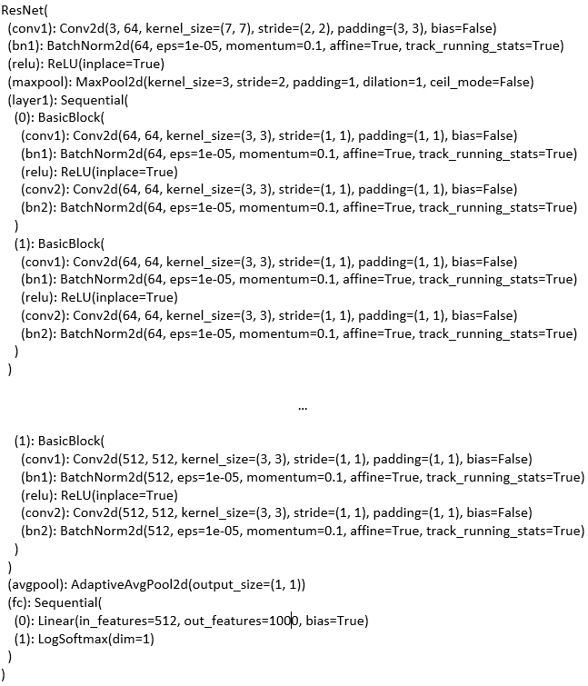
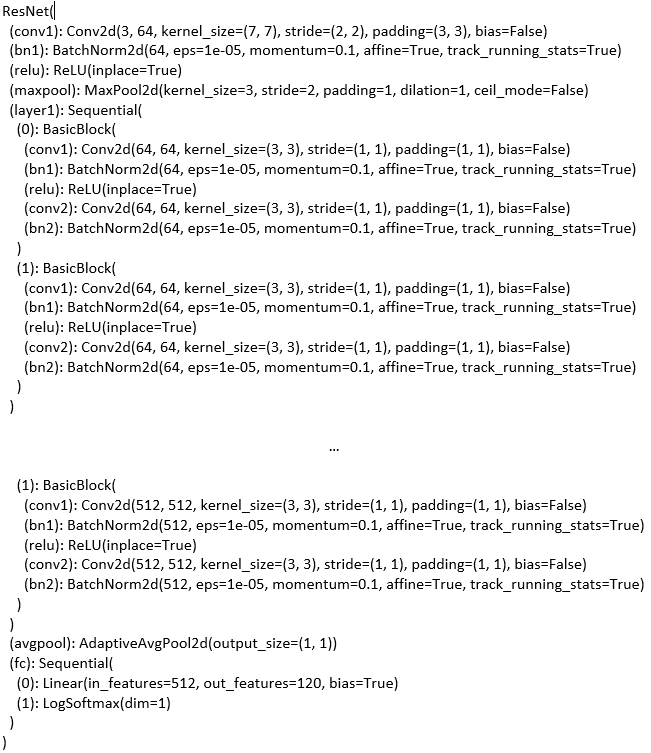
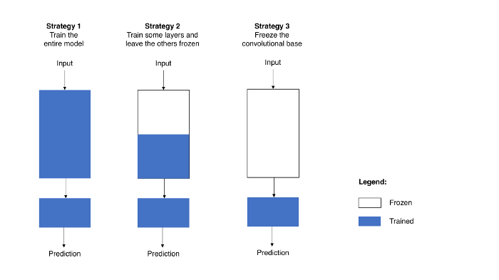

Flask를 통해 구축한 서버의 모델은 사전 학습된 ResNet18 모델을 그대로 사용하고 있었습니다.

그렇기에 강아지 사진을 업로드하면 품종을 파악하여 그에 대한 정보를 알려주는 <PyTorch, Flask를 통한 강아지 이미지 분류>에 그대로 사용하기에는 한계가 있었습니다.

따라서, 사전 학습된 모델의 Classifier로써 작동하는 Fully-connected layer를 변경한 뒤 전이 학습을 거쳐 사용하기로 결정하였습니다.

이 포스트는 Pytorch를 사용하는 저희 프로젝트에서 사전 학습된 모델과 전이 학습을 어떤 방식으로 적용하였는지를 보이고자 합니다.

### 사전 학습된 모델 불러오기

먼저, PyTorch에서 어떤 모델을 제공하고 어떻게 사용할 수 있는지 알아보겠습니다.

PyTorch는 이미지 분류, 객체 탐지, 영상 분류 등 다양한 목적에 맞는 사전 학습된 모델을 제공합니다.

그 중 저희 프로젝트의 주제에 부합하는 이미지 분류용 사전 학습된 모델 리스트는 아래와 같습니다.



이 모델들은 torchvision 라이브러리의 models 서브패키지를 import한 다음 적절한 함수를 호출하는 간단한 과정을 통해서 사용할 수 있습니다.

````python
# 필요 라이브러리 import
import torchvision.models as models

# 모델 생성 함수 호출
resnet18 = models.resnet18(pretrained=True)
vgg16 = models.vgg16(pretrained=True)
alexnet = models.alexnet(pretrained=True)
densenet = models.densenet161(pretrained=True)
````

이때, 매개 변수로 `pretrained=True`를 사용하였는데, 이를 명시하지 않으면 구조는 동일하지만 weight가 무작위로 초기화된 모델을 반환하게 됩니다.

따라서 사전 학습된 모델을 사용하기 위해서는 반드시 `pretrained`를 `true`로 명시해야 합니다.

위 예시 코드 외의 PyTorch에서 제공하는 모델에 맞는 생성 함수는 [PyTorch official document](https://pytorch.org/docs/stable/torchvision/models.html)에서 확인하여 사용할 수 있습니다.

### 모델 수정하기

위 과정을 통해 불러온 모델을 바로 사용할 수 있으면 좋겠지만, 실제 프로젝트에 사용하기 위해서는 모델의 구조를 일부 수정한 뒤 weight를 사용할 dataset에 맞춰 다시 학습해야하는 경우가 대부분입니다.

저희 프로젝트의 경우도 PyTorch가 제공하는 모델과 분류 대상의 클래스 수가 달라 모델 구조를 일부 수정해야 했는데, 그 과정은 다음과 같습니다.

````python
# 필요 라이브러리 import
import torchvision.models as models

# 모델 생성
net = models.resnet18(pretrained=True)

# 모델의 구조 출력
print(net)
````



print() 함수를 통해 모델 구조를 확인해 Classifier로써 작동하는 fc 레이어를 다음 코드를 통해 변경합니다.

````python
# fc 레이어의 input 수는 유지
num_in = net.fc.in_features

# 우리 프로젝트의 클래스 수는 120개이므로 output 수를 변경
num_out = 120

# input, output에 맞는 레이어 사용
net.fc = nn.Linear(in_features = num_in, 
                   out_features = num_out, 
                   bias=True)

print(net)
````



다시 한번 print() 함수를 통해 모델의 구조를 확인하면 정상적으로 변경된 것을 확인할 수 있습니다.

### 전이 학습

위와 같은 방법으로 수정한 모델을 학습하여 사용하는 것을 전이 학습이라고 하는데, 이때 학습을 시키는 방법은 아래와 같이 크게 3가지로 구분할 수 있습니다.



처음 전이 학습에 대해 알아보면서 이 3가지 방법 중 어떤 방법을 채택하는 것이 적합할지 의문이였습니다.

다행스럽게도 추가적인 조사를 하면서 데이터셋의 특징에 따라 일반적으로 어떤 방법을 채택하는 것이 유리한지 나타낸 아래 도표를 찾아 참고하였습니다.


저희 프로젝트의 경우 사전 학습된 모델이 분류하는 클래스에 강아지가 있었고, 전이 학습을 위한 데이터셋 자체도 이미지 2만장 정도로 크지 않다고 판단하여 feature-based learning을 하기로 결정했습니다.

학습을 위한 모델 준비 최종 소스코드는 아래와 같습니다.

````python
# 필요 라이브러리 import
import torchvision.models as models

# 모델 생성
net = models.resnet18(pretrained=True)

# 사전 학습 모델의 layer들을 freeze
for param in net.parameters():
    param.requires_grad = False

# fc 레이어의 input 수는 유지
num_in = net.fc.in_features

# 우리 프로젝트의 클래스 수는 120개이므로 output 수를 변경
num_out = 120

# input, output에 맞는 레이어 사용
net.fc = nn.Linear(in_features = num_in, 
                   out_features = num_out, 
                   bias=True)

# 학습 루프 실행, 이하 생략
````
