WEB 팀의 4번째 미션은 아래의 교재로 React 공부를 하는 것입니다.

이번 포스팅에서는 교재의 2장과 3장을 리뷰하겠습니다.

> [#4 Mission : React](https://react.vlpt.us/)

이번 미션은 이전 미션과 다르게 조건에 맞춰 코딩하는 것이 아닌 React를 배우는 것이 목표임으로 정해진 요구사항은 없습니다.

교재의 각 장에 맞춰서 리뷰하겠습니다.

## [2장] 리액트 컴포넌트 스타일링하기

### 1. Sass

  Sass는 CSS의 전처리기로써 웹에서 컴파일이 안되지만, CSS보다 간단한 문법을 제공합니다.

  'node-sass' 라이브러리를 통해 Sass가 CSS로 변환되어 웹에서 컴파일 됩니다.

  Sass는 CSS와 상당히 유사한 문법을 가지고 있습니다. 지금부터 소개할 몇 가지 문법은 CSS와 다른 Sass의 문법입니다.

  1. 변수 선언

      ```css
      $변수명: 값;
      ```

      CSS는 변수명 앞에 '$'를 붙이지 않는다는 차이점이 있습니다.
      Sass는 변수 사용 시 '$변수명;'을 사용합니다.

  2. 셀렉터 선언

      - css로 작성시

      ```css
      div.container h4 {
        color: blue;
      }
      div.container p {
        color: green;
      }
      ```

      - sass로 작성시

      ```scss
      div.container {
        h4 {
          color: blue;
        }
        p {
          color: green;
        }
      }
      ```

      셀렉트는 h4, p와 같이 html 스타일 요소를 뜻합니다.

      css와 달리 sass는 관련된 class 안에 셀렉터들을 선언합니다. css보다 코드가 간결해지고 셀럭터 해석이 편하다는 장점이 있습니다.

### 2. CSS Module

  코드가 길어지면 중복되는 클래스 이름이 생길 수 있습니다. CSS Module은 클래스 이름을 고유하게 만들어 겹치지 않도록 해줍니다.

  따로 라이브러리를 설치할 필요 없이 기존 css 파일 확장자를 .module.css로 설정하면 됩니다.

  Sass에서도 사용 가능합니다. .module.scss로 바꿔주면 됩니다.

  가령 Box.css를 Box.module.css로 바꾼 후 js 파일에 import할려면 아래와 같이 하면 됩니다.

  ```react
  import React from "react";
  import styles from "./Box.module.css";

  function Box() {
    return <div className={styles.Box}>{styles.Box}</div>;
  }
  ```

  import로 불러온 styles 객체 안에 있는 값을 참조해야 합니다.

### 3. styled-components

  styled-components는 js 안에 css(CSS in JS)를 작성할 수 있는 리액트 라이브러리입니다.

  보통 react 컴포넌트를 스타일링할 때 외부 css 파일을 className으로 속성을 전달 받아서 렌더링하여 사용했는데요.

  styled-components을 사용하면 css를 컴포넌트 내부에 넣기 때문에 수정이 훨씬 쉽다는 장점이 있습니다.

  `npm add styled-components` 설치해주세요.

  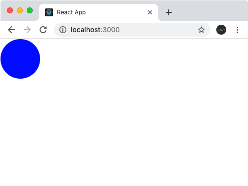

  styled-components를 이용하여 css 파일없이 위의 파란원을 만들어봅시다.

  [App.js]

  ```react
  import React from 'react';

  import styled from 'styled-components';

  const Circle = styled.div`
      width: 5rem;
      height: 5rem;
      background: ${props => props.color || 'black'};
      border-radius: 50%;
      `;
      <!-- ` ` <= 사용 주의! -->

  function App() {
  return <Circle color="blue" />;
  }

  export default App;
  ```

  App.js 파일의 Circle 컴포넌트에 css가 들어갔습니다.
  이제 js파일 내에서 바로 css 수정이 가능합니다!

  div를 스타일링하였으므로 `styled.div`를 사용했습니다.

  Circle 컴포넌트에 color라는 props를 넣어 색깔도 변경 가능합니다.

  `props: <컴포넌트이름: props이름 = "값">`

## [3장] 멋진 투두리스트 만들기

3장에서는 react를 사용해 투두리스트를 만듭니다.
아래 사진은 벨로스터님이 만든 투두리스트 완성본이지만 디자이너 제제는 더 멋지게 만들 것이므로 완성본이 다릅니다.
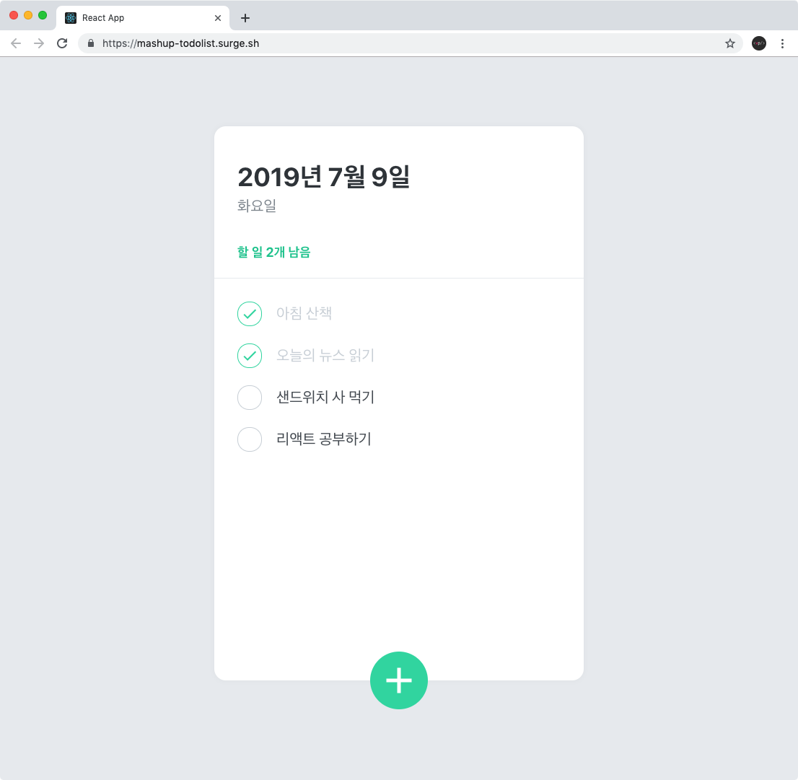

이번 장을 어떻게 리뷰해야 할지 고민이 많았어요.
긴 코드를 제가 리뷰하는 것보다 교재를 보면서 직접 해보시는게 훨씬 이해가 빠를 거라 생각이 들었습니다. 고민 끝에 저는 코드 리뷰보다는 개념 설명에 더 집중하기로 했답니다.
~~(그리고 리액트를 이해하기 포기했다고 합니다.)~~

### 1. 컴포넌트 만들기

  `create-react-app`을 사용해 새로운 프로젝트를 만든 후
  `npm add styled-components` 설치해주세요.

  만들어야 할 컴포넌트는 총 5개 입니다.

  1. todoTemplate: 페이지의 중앙에 그림자가 적용된 흰색 박스.
  2. todoHead: 오늘의 날짜와 요일을 보여주고, 앞으로 해야 할 일이 몇 개 남았는지 보여줌.
  3. todoList: todos 배열을 map() 을 사용하여 여러 개의 TodoItem 컴포넌트를 렌더링.
  4. todoItem: 할 일의 정보를 렌더링 해주는 컴포넌트. 체크 버튼 누르면 텍스트 색상이 연해지고 텍스트에 마우스를 올리면 휴지통 아이콘이 나타남. 휴지통 아이콘 누르면 항목 삭제됨.
  5. todoCreate: 새로운 할 일을 등록할 수 있게 해주는 컴포넌트.

  컴포넌트를 본격적으로 만들기 전에 `createGlobalStyle`을 이용해서 `App.js`에서 화면 배경을 설정합시다.

  `createGlobalStyle`은 js파일에서 `body {}` 태그를 호출해 태그 내부에서 css 적용을 시킬 수 있습니다. 이름에서부터 알 수 있듯이 글로벌 스타일을 설정할 때 사용합니다. `createGlobalStyle`을 안 쓰고 따로 css 파일에 적용해도 똑같습니다.

#### App.js

  ```react
      import React from "react";
      import { createGlobalStyle } from "styled-components";

      const GlobalStyle = createGlobalStyle`
        body {
          background: pink; 
        }
      `;

      function App() {
        return (
          <>
            <GlobalStyle /> {/* 배경 적용 */}
            <div>제제는 리액트가 싫어요.</div>
          </>
        );
      }

      export default App;
  ```

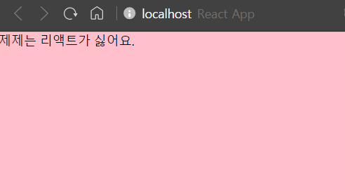

  분홍색 배경이 적용 되었습니다.

  이제 to do list 컴포넌트를 만들어보겠습니다.

  `src` 폴더 내에 `components` 폴더를 만들고 `components` 폴더 내에 컴포넌트 파일을 모두 저장하겠습니다.

  현재 폴더 구조는 아래와 같습니다.

  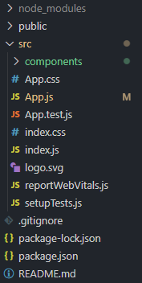

#### 1) TodoTemplate.js

첫 번째로 만들 컴포넌트입니다.

페이지의 중앙에 그림자가 적용된 흰색 박스. 라고 위에서 소개 드렸지만 그림자 코드를 추가해도 그림자가 안 나타나서 그림자가 적용되지 않는 흰색 박스 컴포넌트를 소개하겠습니다.^^

```react
import React from "react";
import styled from "styled-components";

const TodoTemplateBlock = styled.div`
  width: 512px;
  height: 768px;

  position: relative; /* 추후 박스 하단에 추가 버튼을 위치시키기 위한 설정 */
  background: skyblue;
  border-radius: 30px; /* 모서리 둥근 정도 */

  margin: 0 auto; /* 페이지 중앙에 나타나도록 설정 */

  margin-top: 96px;
  margin-bottom: 32px;
  display: flex;
  flex-direction: column;
`;

function TodoTemplate({ children }) {
  return <TodoTemplateBlock>{children}</TodoTemplateBlock>;
}

export default TodoTemplate;
```

작성한 TodoTemplate.js를 사용하도록 App.js를 조금 수정합시다.

[App.js]

```react
...
import TodoTemplate from './components/TodoTemplate';

...

function App() {
  return (
  ...
      <TodoTemplate>제제는 리액트가 싫어요.</TodoTemplate>
    </>
  );
}

export default App;
```

기존 App.js에서 TodoTemplate.js를 호출하고 TodoTemplate.js에서 만든 `div`태그를 적용 시킵니다.

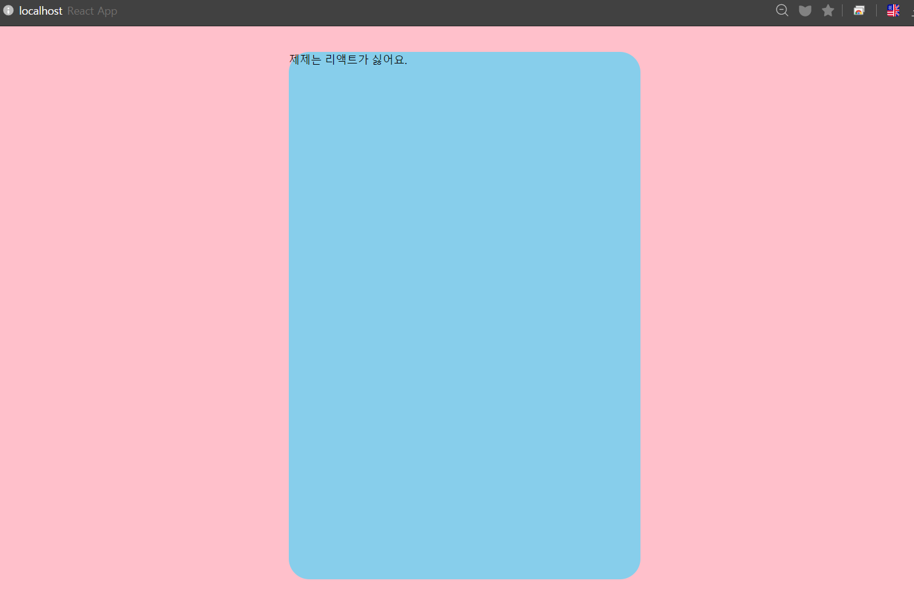

배경색은 유지된 채, TodoTemplate.js에서 만든 TodoTemplateBlock이 잘 적용 되었습니다.

#### 2) TodoHead.js

두 번째로 만들 컴포넌트는 날짜, 요일, 남은 할 일 개수를 보여줄 겁니다.

```react
import React from "react";
import styled from "styled-components";

const TodoHeadBlock = styled.div`
  padding-top: 48px;
  padding-left: 32px;
  padding-right: 32px;
  padding-bottom: 24px;
  border-bottom: 5px solid pink; /* 헤더 구분하는 실선 */
  h1 {
    margin: 0;
    font-size: 36px;
    color: white;
  }
  .day {
    margin-top: 4px;
    color: black;
    font-size: 21px;
    font-weight: bold;
  }
  .tasks-left {
    color: red;
    font-size: 18px;
    margin-top: 40px;
    font-weight: bold;
  }
  /* 게으름뱅이의 이스터에그 */
  .hurry_up_zeze {
    color: white;
    font-size: 10px;
    margin-top: 1px;
    text-decoration: line-through;
  }
`;

function TodoHead() {
  return (
    <TodoHeadBlock>
      <div className="hurry_up_zeze">제제 글을 마저 써...</div>
      <h1>2021년 2월 21일</h1>
      <div className="day">일요일</div>
      <div className="tasks-left">할 일 2개 남음</div>
    </TodoHeadBlock>
  );
}

export default TodoHead;
```

TodoHead.js 코드를 작성한 후 TodoHead.js와 마찬가지로 App.js에 파일을 적용시킵니다.

[App.js]

```react
...
import TodoHead from './components/TodoHead';


...

function App() {
  return (
  ...
      <TodoTemplate>제제는 리액트가 싫어요.
      <TodoHead />
      </TodoTemplate>
    </>
  );
}

export default App;
```

파란색 배경의 컴포넌트 내에 글이 보여야 하므로`<TodoTemplate>` 태그 안에 `<TodoHead />`를 삽입합니다.

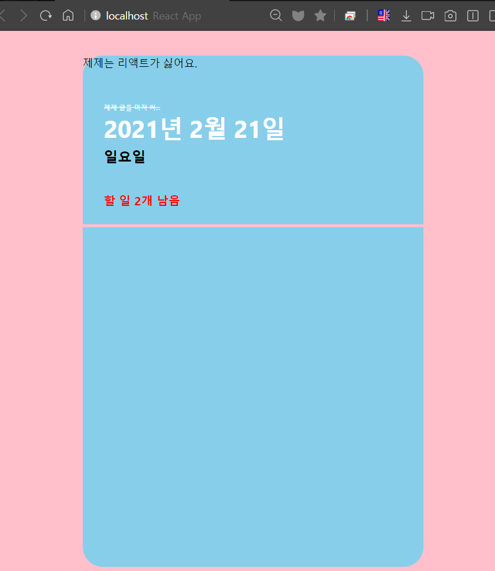

#### 3) TodoList.js

여러 개의 할 일을 보여주는 컴포넌트를 만들겠습니다.

```react
import React from "react";
import styled from "styled-components";

const TodoListBlock = styled.div`
  flex: 1;
  padding: 20px 32px;
  padding-bottom: 48px;
  overflow-y: auto; /* 자동으로 세로 스크롤바 생성 */
`;

function TodoList() {
  return <TodoListBlock> TodoListBlock </TodoListBlock>;
}

export default TodoList;
```

[App.js]

```react
...
import TodoList from './components/TodoList';
...
function App() {
  return (
    <>
      <GlobalStyle /> {/* 배경 적용 */}
      <TodoTemplate>제제는 리액트가 싫어요.
      <TodoHead />
      <TodoList />
      </TodoTemplate>
    </>
  );
}
...
```

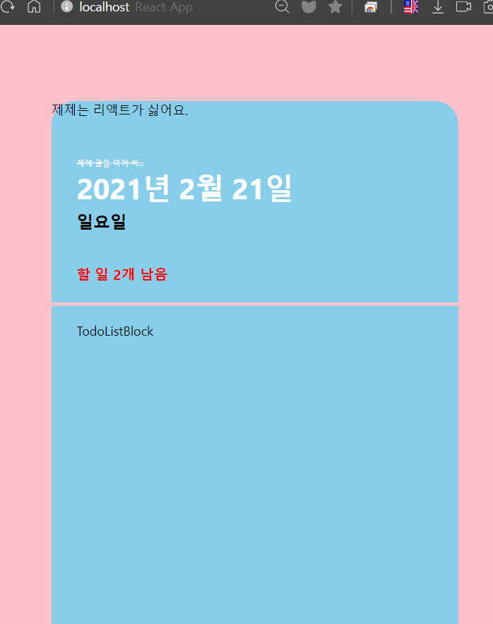

#### 4) TodoItem.js

TodoList 위에 할 일의 항목을 보여줄 컴포넌트를 만들겠습니다.

```react
import React from "react";
import styled, { css } from "styled-components";
import { MdDone, MdDelete } from "react-icons/md";

const Remove = styled.div`
  display: flex;
  justify-content: center;
  color: white;
  font-size: 24px;
  cursor: pointer;
  &:hover {
    color: black; /* 아이콘을 커서로 가르키면 색 변함 */
  }
  display: none; /* 커서가 항목 위에 올라오면 그 때 아이콘 보여줌 */
`;

// 커서가 위에 있을 때 Remove 컴포넌트를 보여줌 => 쓰레기통 아이콘 뜸
const TodoItemBlock = styled.div`
  display: flex;
  align-items: center;
  padding-top: 12px;
  padding-bottom: 12px;
  &:hover {
    ${Remove} {
      display: initial;
    }
  }
`;

const CheckCircle = styled.div`
  width: 32px;
  height: 32px;
  border-radius: 16px;
  border: 1px solid white;
  font-size: 24px;
  font-weight: bold;
  display: flex;
  align-items: center;
  justify-content: center;
  margin-right: 20px;
  cursor: pointer;

  /* check가 된 항목만 적용 */
  ${(props) =>
    props.done &&
    css`
      border: 1px solid white;
      color: red;
    `}
`;

const Text = styled.div`
  flex: 1;
  font-size: 21px;
  color: white;

  /* check가 된 항목만 적용 */
  ${(props) =>
    props.done &&
    css`
      color: gray;
    `}
`;

function TodoItem({ id, done, text }) {
  return (
    <TodoItemBlock>
      <CheckCircle done={done}>{done && <MdDone />}</CheckCircle>
      <Text done={done}>{text}</Text>
      <Remove>
        <MdDelete />
      </Remove>
    </TodoItemBlock>
  );
}

export default TodoItem;
```

TodoItem은 TodoList에서 렌더링 됩니다. 따라서 App.js 호출하지 않고 TodoList.js에서 불러오겠습니다.

[TodoList.js]

```react
...
import TodoItem from './TodoItem';
...
function TodoList() {
  return (
  <TodoListBlock > TodoListBlock
  <TodoItem text = "양치하기" done = {false} />
  <TodoItem text = "야식먹기" done = {true} />
  </TodoListBlock>
  );
}
...
```

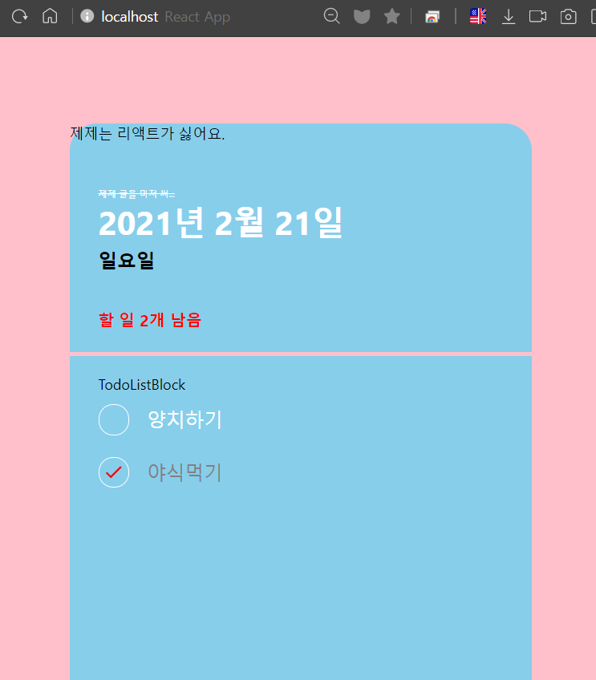

#### 5) TodoCreate.js

할 일 항목을 추가하는 버튼을 추가할 겁니다.

버튼을 누르면 할 일을 쓸 수 있는 `InsertForm`이 하단에 뜹니다.

`CircleButton`을 통해 버튼을 누르면 버튼의 색깔이 바뀌는 등의 이벤트가 발생합니다.

```react
import React, { useState } from "react";
import styled, { css } from "styled-components";
import { MdAdd } from "react-icons/md";

const CircleButton = styled.button`
  background: white;
  &:hover {
    background: red;
  }
  &:active {
    background: yellow;
  }

  z-index: 5;
  cursor: pointer;
  width: 80px;
  height: 80px;
  display: block;
  align-items: center;
  justify-content: center;
  font-size: 60px;
  position: absolute;
  left: 50%;
  bottom: 0px;
  transform: translate(-50%, 50%);
  color: pink;
  border-radius: 50%;
  border: none;
  outline: none;
  display: flex;
  align-items: center;
  justify-content: center;

  transition: 0.125s all ease-in;
  ${(props) =>
    props.open &&
    css`
      background: #ff6b6b;
      &:hover {
        background: #ff8787;
      }
      &:active {
        background: #fa5252;
      }
      transform: translate(-50%, 50%) rotate(45deg);
    `}
`;

const InsertFormPositioner = styled.div`
  width: 100%;
  bottom: 0;
  left: 0;
  position: absolute;
`;

const InsertForm = styled.form`
  background: #f8f9fa;
  padding-left: 32px;
  padding-top: 32px;
  padding-right: 32px;
  padding-bottom: 72px;

  border-bottom-left-radius: 16px;
  border-bottom-right-radius: 16px;
  border-top: 1px solid #e9ecef;
`;

const Input = styled.input`
  padding: 12px;
  border-radius: 4px;
  border: 1px solid #dee2e6;
  width: 100%;
  outline: none;
  font-size: 18px;
  box-sizing: border-box;
`;

function TodoCreate() {
  const [open, setOpen] = useState(false);

  const onToggle = () => setOpen(!open);

  return (
    <>
      {open && (
        <InsertFormPositioner>
          <InsertForm>
            <Input autoFocus placeholder="zeze는 사랑스러워" />
          </InsertForm>
        </InsertFormPositioner>
      )}
      <CircleButton onClick={onToggle} open={open}>
        <MdAdd />
      </CircleButton>
    </>
  );
}

export default TodoCreate;
```

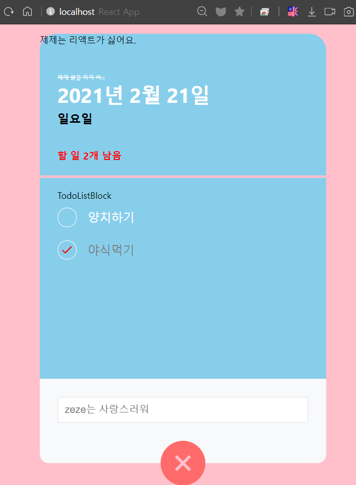

이렇게 5가지 컴포넌트 작성이 완성 되었습니다. 다음 파트는 `Context API 를 활용한 상태 관리`입니다.

### 2. Context API 를 활용한 상태 관리

   이 파트는 개념적인 부분을 대부분 이해를 못 했습니다😢
   따라서 실습 위주로 적겠습니다!

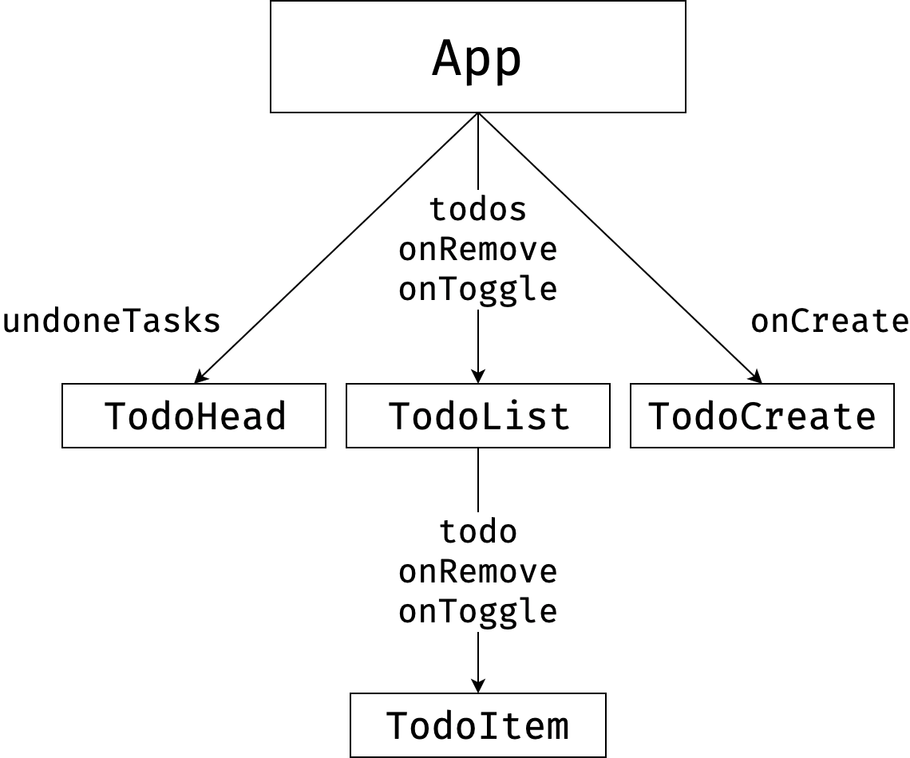

다음과 같은 구조로 상태관리를 한다면 프로젝트 규모가 커질 시 최상위 컴포넌트인 App의 컴포넌트에서 모든 상태 관리를 하기엔 코드가 너무 복잡해질 수 있고, 여러 컴포넌트를 거쳐 props를 전달해야 하는 불편함이 있을 수 있습니다.

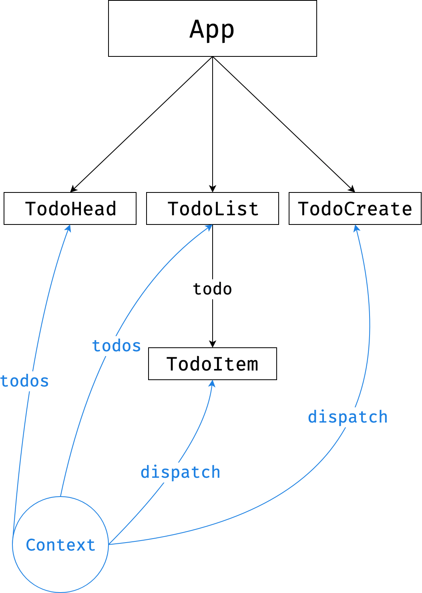

ContextAPI를 활용하면 위처럼 구현할 수 있습니다.

먼저 Context가 무엇인지 소개드리겠습니다. 앞서 1-22에 Context API에 대해 설명 됐는데요.

간단히 설명드리자면 context는 다양한 레벨의 컴포넌트에게 props를 전달하는 것입니다.

일반적으로 react에서는 첫 번째 사진 처럼 부모가 자식에게 하향식으로 값을 전달하는데요. Context API를 이용하면 두 번째 사진처럼 트리의 모든 레벨에 값을 공유할 수 있습니다.

상위계층에서 하위계층으로 props를 넘기는 것이 아니라 필요한 컴포넌트가 데이터에 접근할 수 있기 때문에 전역적으로 데이터 관리가 가능합니다.

Context API를 알기 위해서는 먼저 Hook 개념을 이해하셔야 합니다.
Hook은 간단히 설명하자면 class를 사용하지 않고 function에서 state를 관리할 수 있는 기능입니다.

개념적으로 이해하기는 class 컴포넌트가 더 편하지만 function 컴포넌트는 코드가 간단해진다는 장점이 있습니다!

1장에 hook 관련 개념에 대해서 자세히 나와 있는데요.

이번 장에서 한 번더 언급되는 개념들만 간단히 설명하고 넘어가겠습니다.

1. 1.7: `useState()`: 배열에 두 값을 넣어 return 됩니다. 첫 번째 배열에는 useStete의 인자값이, 두 번째 배열애는 state를 변경할 수 있는 함수가 return 됩니다.

2. 1.20: `useReducer()`: useState()와 비슷한 함수입니다. useStete()가 컴포넌트 내부의 stste를 업데이트 한다면 useReducer()는 state를 컴포넌트 외부에서 업데이트 할 수 있습니다.

   Context API를 한 번에 이해하기 힘들었습니다. react는 업데이트가 상당히 빠른 라이브러리기 때문에 현재의 쓰임새를 이해하기 위해서는 그 전의 사용법도 알아야 했습니다. 현재의 사용법이 과거의 불편사항의 개선 결과이기 때문이죠.

   Context API가 react에서 업데이트 하기 전까지 프로젝트의 규모와 상관없이 전역 state 관리는 redux를 사용했습니다.
   redux는...뭔지 잘 모르겠습니다...

   Context API를 알기 위해서는 redux를 알아야 한데서 알려고 했는데...알 수 없었습니다...😥

   리액트 너무 어려워요...엉엉...
   Context API 코드를 마저 짜봅시다.

   src 폴더에 TodoContext.js를 생성하고 `useReducer`를 사용하여 상태 관리하는 `TodoProvider`라는 컴포넌트를 만들어봅시다.

   `TodoProvider` 함수에는 todo 들이 저장 되어 있는 `initialTodos`와 todo 기능인 `CRAET`, `TOGGLE`, `REMOVE`를 모아놓은 `todoReducer`를 컴포넌트들에 전달하여 컴포넌트들이 직접 렌더링 할 수 있게 합니다.

   [TodoContext.js]

   ```react
   import React, { useReducer, createContext, useContext, useRef } from "react";

   // TODO 저장
   const initialTodos = [
     {
       id: 1,
       text: "zeze는 귀여워", // TODO
       done: true, // 버튼 체크 유무, 체크하면 true
     },
     {
       id: 2,
       text: "zeze는 바보야",
       done: true,
     },
   ];

   function todoReducer(state, action) {
     switch (action.type) {
       // TODO 생성시 이벤트
       case "CREATE":
         return state.concat(action.todo);
       // 버튼 클릭시 이벤트
       case "TOGGLE":
         return state.map((todo) =>
           todo.id === action.id ? { ...todo, done: !todo.done } : todo
         );
       // 휴지통 아이콘 클리시 이벤트
       case "REMOVE":
         return state.filter((todo) => todo.id !== action.id);
       default:
         throw new Error(`Unhandled action type: ${action.type}`);
     }
   }

   const TodoStateContext = createContext();
   const TodoDispatchContext = createContext();
   const TodoNextIdContext = createContext();

   export function TodoProvider({ children }) {
     const [state, dispatch] = useReducer(todoReducer, initialTodos);
     const nextId = useRef(5);

     return (
       <TodoStateContext.Provider value={state}>
         <TodoDispatchContext.Provider value={dispatch}>
           <TodoNextIdContext.Provider value={nextId}>
             {children}
           </TodoNextIdContext.Provider>
         </TodoDispatchContext.Provider>
       </TodoStateContext.Provider>
     );
   }

   export function useTodoState() {
     return useContext(TodoStateContext);
   }

   export function useTodoDispatch() {
     return useContext(TodoDispatchContext);
   }

   export function useTodoNextId() {
     return useContext(TodoNextIdContext);
   }
   ```

### 3. 기능 구현하기

   앞서 컴포넌트를 구현하면서 to do list의 UI 구현을 마쳤습니다. 이제 기능 구현을 해보겠습니다.

   앞서 만들어진 컴포넌트에 기능 구현 코드를 추가하겠습니다.

#### 1) TodoHead.js

`today.toLocaleDateString` 함수로 실제 오늘 날짜를 띄웁니다.

to do list의 헤드의 날짜가 오늘 날짜로 바뀌는 것을 확인할 수 있습니다.

```react
...
import { useTodoState } from '../TodoContext';
...

function TodoHead() {
  const todos = useTodoState();
  const undoneTasks = todos.filter(todo => !todo.done);

  // 실제 오늘 날짜 보여주기
  const today = new Date();
  const dateString = today.toLocaleDateString('ko-KR', {
    year: 'numeric',
    month: 'long',
    day: 'numeric'
  });
  const dayName = today.toLocaleDateString('ko-KR', { weekday: 'long' });


  return (
    <TodoHeadBlock>
    <div className="hurry_up_zeze">제제 글을 마저 써...</div>
      <h1>{dateString}</h1>
      <div className="day">{dayName}</div>
      <div className="tasks-left">할 일 {undoneTasks.length}개 남음</div>
    </TodoHeadBlock>
  );
}

export default TodoHead;
```

#### 2) TodoList.js

TodoContext.js에서 저장할 todo 두 개를 임시로 적어놨습니다.

TodoList는 TodoContext의 `initialTodos`의 state를 `map` 함수 받아올 것입니다.

```react
...
import { useTodoState } from '../TodoContext';
...
function TodoList() {
  const todos = useTodoState();

  return (
  <TodoListBlock >
  {todos.map(todo => (
        <TodoItem
          id={todo.id}
          text={todo.text}
          done={todo.done}
        />
      ))}
  </TodoListBlock>
  );
}

export default TodoList;
```

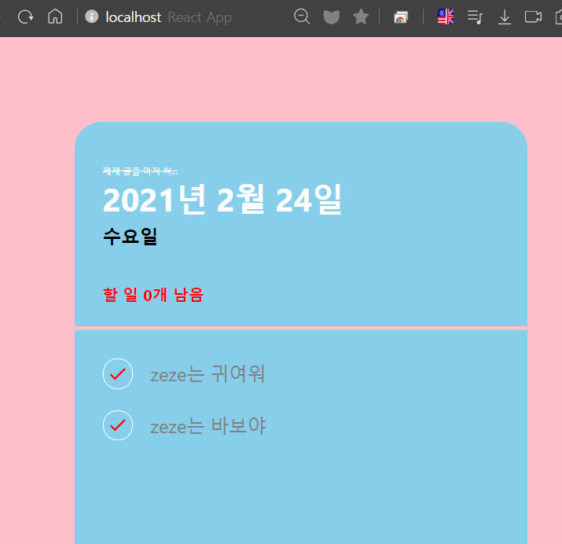

TodoContext의 state를 제대로 불러와서 렌더링 한 것을 확인할 수 있습니다.

#### 3) TodoItem.js

TodoContext의 `dispatch`를 사용해 `TOGGLE`함수와 `REMOVE`함수를 사용할 수 있습니다.

글을 삭제 시 TodoHead에서 TodoContext의 `useTodoState`함수를 이용해 아직 완수 되지 않은 todo의 개수를 바로 반영합니다.

```react
...
import { useTodoDispatch } from '../TodoContext';
...
// todo id/ 완료 true, flase / todo 내용 전달 받음
function TodoItem({ id, done, text }) {
  const dispatch = useTodoDispatch();
  const onToggle = () => dispatch({ type: 'TOGGLE', id });
  const onRemove = () => dispatch({ type: 'REMOVE', id });
  return (
    <TodoItemBlock>
    {/* 체크버튼 누릴 시 TodoContext의 TOGGLE 이벤트 발생 */}
      <CheckCircle done={done} onClick={onToggle}>
        {done && <MdDone />}
      </CheckCircle>
      <Text done={done}>{text}</Text>
      {/* 쓰레기통 아이콘 누릴 시 TodoContext의 REMOVE 이벤트 발생 */}
      <Remove onClick={onRemove}>
        <MdDelete />
      </Remove>
    </TodoItemBlock>
  );
...
```

#### 4) TodoCreate.js

마지막으로 클라이언트가 input form에 작성하면 todolist가 렌더링 해줘 새로운 todo가 뜨게 만드는 기능을 구현해 봅시다.

```react
...
import { useTodoDispatch, useTodoNextId } from '../TodoContext';
...

function TodoCreate() {
  const [open, setOpen] = useState(false);
  const [value, setValue] = useState('');

  const dispatch = useTodoDispatch();
  const nextId = useTodoNextId();

  const onToggle = () => setOpen(!open);
  const onChange = e => setValue(e.target.value);
  const onSubmit = e => {
    e.preventDefault();            // 새로고침 방지

    // TodoTemplate에서 CREATE 이용해 todoInitial 추가
    dispatch({
      type: 'CREATE',
      todo: {
        id: nextId.current,
        text: value,
        done: false               // 디폴트가 체크하지 않은 상태
      }
    });
    setValue('');
    setOpen(false);
    nextId.current += 1;        // CREATE 호출 할 때 마다 id 1씩 증가
  };

  return (
    <>
      {open && (
        <InsertFormPositioner>
          <InsertForm onSubmit={onSubmit}>
            <Input
              autoFocus
              placeholder="할 일 작성 후 엔터를 눌러주세요. 쫍😘"
              onChange={onChange}
              value={value}
            />
          </InsertForm>
        </InsertFormPositioner>
      )}
      <CircleButton onClick={onToggle} open={open}>
        <MdAdd />
      </CircleButton>
    </>
  );
}
...
```

이로써 모든 기능을 구현했습니다!

[여기](https://www.youtube.com/watch?v=pH76lDisyUU&feature=youtu.be)서 구현된 모습을 영상으로 확인할 수 있습니다.

---

### 글을 마치면서

게으른 완벽주의자가 얼마나 해로운지 다시 한 번 깨달았습니다.

WEB팀 멤버 분들에게 너무 송구합니다...😥

완벽주의자가 아닌 완성주의자가 되는 제제가 되도록 노력하겠습니다.

글을 쓸 수 있게 인내심을 가지고 응원해 준 모든 WEB 팀 여러분 사랑해요.💓💓💓
