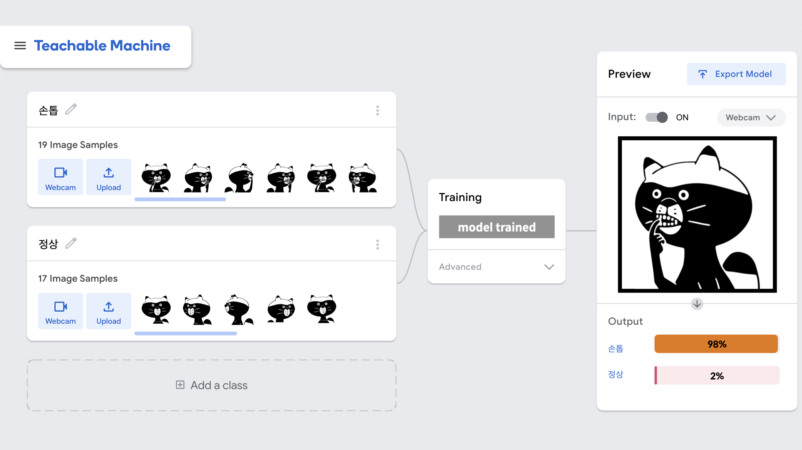

머신러닝이라는 것이 복잡하고 어려운 것만은 아니라고 저의 심리적 장벽을 낮춰준 것이 바로 Teachable Machine입니다. 이번 기회에 Teachable Machine을 공부한 내용을 기반으로 소개해보고자 합니다.  

## Teachable Machine  

Teachable Machine은 구글에서 제공하는 웹 기반의 머신러닝 툴입니다. 여기서 머신러닝 코드 없이 이미지, 소리, 포즈 자료를 업로드하여 인식 모델을 만들 수 있습니다. 만든 모델은 export 하여 원하는 사이트, 어플리케이션 제작에 활용 가능합니다. 머신러닝과 코딩에 대한 사전 지식이 필요하지 않고, 비개발자들도 툴을 이용해서 머신러닝을 이용한 결과물을 쉽고 빠르게 얻을 수 있다는 것이 특징입니다.

## 원리  

Teachable Machine은 미리 만들어진 신경망을 활용해 사용자로부터 입력받은 데이터를 처리합니다. 새로운 데이터들을 기존 모델으로부터 전이학습을 시키는 것이기 때문에 새로운 모델의 구현과 같은 복잡한 과정 없이 결과물을 얻을 수 있습니다. 다음은 Teachable Machine FAQ에 나오는 문장입니다.

(전이학습 : 사전에 훈련된 모델의 가중치를 가지고 와서 새로운 case에 재보정해서 사용하는 것)

>"There’s a pretrained neural network, and when you create your own classes, you can sort of picture that your classes are becoming the last layer or step of the neural net.” [1](#footnote_1)

Teachable Machine의 사전 학습 모델들은 크게 2가지가 있습니다.
image와 관련된 프로젝트의 모델로는 MobileNet[2](#footnote_2)이 사용되고, audio와 관련된 프로젝트의 모델로는 speech command recognizer[3](#footnote_3) 이 사용되었습니다. 이를 통해 사용자는 적절한 데이터와 라벨링만으로 원하는 머신러닝 결과물을 얻을 수 있습니다.

## 활용 방법(이미지 분류의 경우)

출처 : 생활코딩  

앞에서 언급한 사전 학습된 모델을 바탕으로 Teachable Machine에서 코딩 없이 이미지 분류 모델을 만들고 결과물을 확인하는 과정을 알아보겠습니다.

1. 기존의 이미지를 활용하거나, 웹캠을 통해 input 데이터를 만듭니다.
2. 만들어진 input 데이터들을 최소 2개 이상의 클래스로 분류합니다.
3. `train model` 버튼을 눌러 모델을 생성합니다.
4. 만들어진 모델에 대한 결과를 우측 화면에서 확인합니다.

### Advanced

Teachable Machine은 `advanced` 설정을 통해  머신러닝의 다양한 파라미터들을 사용자가 쉽게 조정할 수 있게 해줍니다. 이를 통해 일반적인 모델을 조금 더 사용자가 구체적으로 모델을 수정할 수 있게 도와줍니다. `advanced`를 통해 세부 조정 가능한 항목들은 epoch, batch size, learning rate입니다.  

> **Epoch** : 전체 데이터 셋에 대해 한 번 학습을 완료한 상태(epochs = 40이라면 전체 데이터를 40번 사용해서 학습을 거치는 것)  
&nbsp;&nbsp;- Epoch가 너무 작다면, 학습횟수가 부족해서 적절한 학습을 달성하지 못합니다.  
&nbsp;&nbsp;- Epoch가 너무 크다면, 기존 데이터 셋에 대한 의존도가 너무 큰 과적합(overfitting)이 발생해서, 새로운 데이터에 대한 예측률이 떨어질 수 있습니다.
> **Batch Size** : 메모리의 한계와 속도 저하문제로 모든 데이터를 한번에 집어넣을 수 없으므로, 학습에 사용하기 위해 분할하는 데이터(batch) 샘플들의 크기  
&nbsp;&nbsp;- 총 데이터가 512개, batch size가 16이라면, 1번의 epoch(512개의 데이터) 당 batch size(16개의 데이터)단위로 32번의 반복(iterator)학습을 진행합니다.
> **Learning rate** : 현재 학습의 결과를 다음 번 학습에 반영하는 효율 (일반적으로 기본값은 0.01)  
&nbsp;&nbsp;- Learning rate이 너무 작다면, 목표 최적값에 수렴하기 위한이 굉장히 많은 시간이 소요됩니다.  
&nbsp;&nbsp;- Learning rate이 너무 크다면, 학습 반영이 과다하게 이루어져서 목표값에 수렴하지 못하고 발산(overshooting)하게 됩니다.

## 마무리

Teachable Machine은 분명 머신러닝과 프로그래밍에 대한 지식이 없더라도 쉽게 모델을 통해 머신러닝을 체험할 수 있게 해줍니다. 다만 원하는 문제를 해결하기 위한 맞춤형 모델이 아닌 범용적으로 활용 가능한 사전 학습된 모델을 사용하기 때문에 섬세한 모델의 구현은 어렵다는 단점이 있습니다. 뚜렷한 장단점이 존재하지만 이 글을 통해 다른 분들이 Teachable Machine을 접하고 머신러닝에 관심을 가져보시면 좋을 것 같습니다.

> <a name="footnote_1">1</a>: <https://teachablemachine.withgoogle.com/faq>  
> <a name="footnote_2">2</a>: <https://minimin2.tistory.com/42>  
> <a name="footnote_3">3</a>: <https://github.com/tensorflow/tfjs-models/tree/master/speech-commands>
