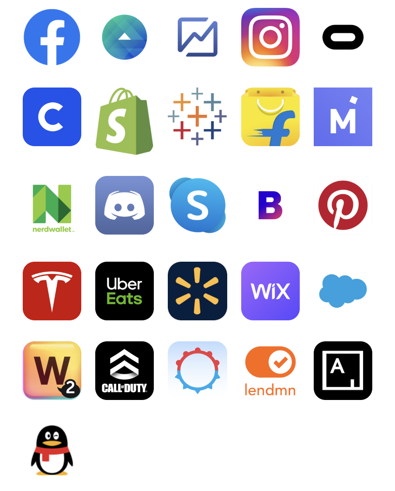
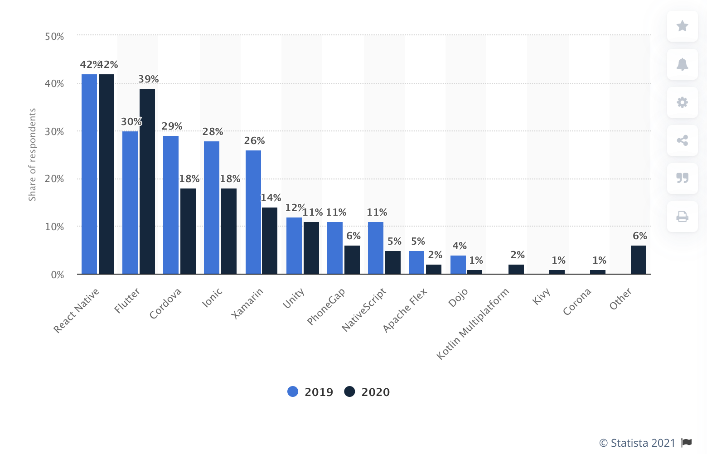
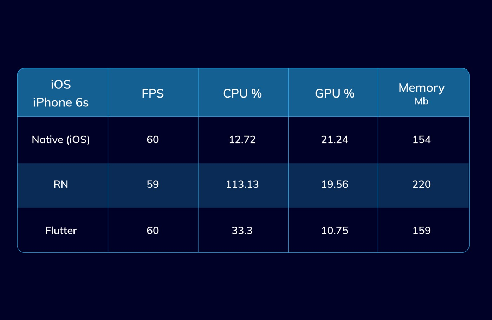

## Intro

안녕하세요 DSC UOS 모바일팀의 권순형입니다.  
모바일팀에서 주로 React Native를 사용한 앱 개발을 했습니다.  
이번 포스팅에서는 React Native에 대한 간략한 소개, 다른 크로스 플랫폼 앱 개발 프레임워크(Flutter)와의 비교 그리고 React Native의 작동 원리에 대해 알아보는 시간을 갖겠습니다.

## React Native란

React Native는 React를 사용해서 iOS와 Android앱을 개발할 수 있는 프레임워크이다. JavaScript를 사용해서 앱 개발을 할 수 있다는것이 큰 이점이다. 기존에 React를 사용해서 웹 개발을 했던 분들이라면 더욱 쉽게 네이티브 앱 개발을 시작할 수 있다.

React Native는 facebook이 주도하는 오픈소스 프레임워크이다.
다음과 같은 앱들이 React Native로 작성되었다고 한다.

React Native를 활용해서 모바일 앱 개발 뿐만 아니라 [Windows](https://github.com/microsoft/react-native-windows#readme), [macOS](https://github.com/microsoft/react-native-macos#readme) 그리고 [web](https://github.com/necolas/react-native-web#readme) 같은 다양한 플랫폼의 앱도 개발할 수 있다.

## 다른 앱 개발 플랫폼과 React Native의 비교

Shanhong Liu가 2020년 7월에 발표한 전세계 개발자가 사용하는 크로스 플랫폼 모바일 프레임워크 현황이다.

차트를 보면 1위가 React Native이고, 그 다음으로 Flutter와 Cordova가 있다. 2019년과 2020년을 비교해보았을때 React Native의 점유율은 유지된 반면 Flutter의 점유율은 큰 상승이 있다.

점유율의 큰 상승이 있었던 Flutter에 대해 잠시 간단하게 알아보겠다.

### Flutter

Flutter는 구글이 만든 크로스 플랫폼 앱 개발 프레임워크이다. 여타 크로스 플랫폼 프레임워크와 마찬가지로 단 하나의 코드베이스를 통해 iOS, Android, Web 그리고 데스크톱의 앱을 개발할 수 있다.

Flutter는 Dart라는 언어를 통해 개발할 수 있다. Dart도 Google이 만든 프로그래밍 언어이다. 구글이 server side와 front-end 코드를 작성하는데 JavaScript보다 더 나은 언어를 원했기에 만들어졌다. Dart는 배우기 쉽고 친숙한 언어이다. Dart만으로 UX를 쉽게 작성할 수 있다. Dart로 UX를 작성하는데 markup language는 필요없다.

### React Native vs Flutter

#### 성능

React Native 앱, Flutter 앱 그리고 Native 앱들의 [벤치마크](https://medium.com/swlh/flutter-vs-react-native-vs-native-deep-performance-comparison-990b90c11433)를 보면 위와 같다. 대부분의 경우 Flutter가 React Native보다 빠르며 특히 CPU 집중 작업의 경우는 Flutter의 성능이 월등하다. 다른 [벤치마크](https://medium.com/swlh/flutter-vs-native-vs-react-native-examining-performance-31338f081980)에서도 마찬가지이다.

성능의 차이가 나는 근본적인 이유로 Native bridge의 존재 유뮤가 있다. React Native는 Native bridge를 통해 JavaScript코드가 Native side와 통신을 하기 때문에 bridge에서의 병목현상이 발생하는 반면 Flutter는 bridge를 사용하지 않고 실제 native코드로 컴파일되기 때문에 앞선 병목현상이 발생하지 않기 때문이다.

#### 그럼에도 React Native?

크로스 플랫폼 앱 개발 프레임워크를 선택하는 데에 있어서 100% 정답은 없다. 결국 어떤 도구를 선택하는것은 전적으로 여러분의 생각이며 현재 상황에 맞는 가장 적합한 도구를 선택해야 한다. 그래도 필자가 처음 프레임워크를 선택하며 고민하는 과정의 생각을 쓰면 다음과 같다.

Flutter가 React Native에 비해 성능상의 이점을 갖는 것은 다들 큰 이견이 없다. 하지만 필자가 개발했던 앱과 같이 복잡한 비즈니스 로직이 들어가지 않는 소규모의 앱의 경우 많은 CPU연산을 수행하지 않기 때문에 두 프레임워크 간의 성능 차이가 크지 않을 것이다.

또한 React Native는 이미 웹개발 영역에서의 큰 형님인 React를 사용하기 때문에 이미 다양한 자료들이 존재한다. Flutter의 [공식문서](https://flutter.dev/docs)를 보았을때 친절한 문서들이 있지만 이미 형성되어있는 React개발 커뮤니티는 이를 넘는 큰 장점이다. 또한 JavaScript의 여러가지 훌륭한 라이브러리를 사용 할 수 있다. 이 외의 차이점은 프레임워크를 선택하는데 큰 문제가 되지 않는다고 생각했다.

결국 Flutter와 달리 React Native가 갖고 있는 React와 JavaScript의 커뮤니티로 인해 React Native를 선택했다.

## React Native의 작동원리

앞서 React Native와 Flutter간 성능 차이가 나타나는 이유로 Native bridge라고 했는데 이 bridge가 무엇인지에 대해 알아보고 facebook에서 제시한 native bridge의 개선방향에 대하여 알아보겠다. 또한 React Native의 4가지 Thread의 종류에 대해, React Native앱이 실행되는 과정에 대해서도 알아보겠다.

### React Native의 4가지 Thread

React Native앱이 실행되는 과정을 알아보기 이전에 React Native에서 사용하는 4가지의 Thread에 대해 알아보아야 한다.

1. UI Thread
   - 메인 스레드
   - Android 혹은 iOS의 UI렌더링에 사용된다.
2. JavaScript Thread
   - JavaScript로직이 실행되는 Thread
   - 각종 API호출, 터치 이벤트가 처리되는 등의 스레드가 있다.
   - 네이티브 뷰에 대한 업데이트는 일괄 처리되며 JavaScript Thread의 각 이벤트 루프 끝에서 네이티브 측으로 전달되며 결국에는 UI Thread에서 실행된다.
   - 좋은 성능을 유지하기 위해 JavaScript Thread는 프레임 렌더링 데드라인 전에 배치 업데이트를 UI Thread에 전달할 수 있어야 한다.
     - iOS의 경우 초당 60프레임을 표시하며 새로운 프레임을 생성하기까지는 16.67ms가 소요된다.
     - UI를 느리게 하지 않기 위해서는 JavaScript 이벤트 루프에서 UI 변경으로 이어지는 복잡한 처리를 16.67ms이내로 처리해야 한다.
     - ScrollView혹은 navigatoriOS의 경우는 JavaScript Thread에서 실행되지 않고 UI Thread에서 100% 실행 되기 때문에 위의 제약조건에 해당하지 않는다.
3. Native Modules Thread
   - 앱이 플랫폼 API에 엑세스 하는 경우에 Native Modules Thread의 일부로 나타난다.
4. Render Thread
   - Android L(5.0)에서만 React Native의 Render Thread가 UI를 그리는데 사용된다. Render Thread는 UI를 그리는데 필요한 OpenGL명령을 생성한다.

### React Native앱이 실행되는 과정

1. 앱이 시작하면서 Main Thread(UI Thread)가 실행되며 JavaScript 번들을 로드한다.
2. JavaScript번들의 로드가 완료되면 Main Thread(UI Thread)는 JavaScript코드들을 JavaScript Thread로 보낸다.
   - 그래야 JavaScript Thread가 무거운 작업을 하더라도 Main Thread(UI Thread)가 문제를 일으키지 않기 때문이다.
3. React가 렌더링을 시작하면서 조정자(Reconciler)는 **diffing**을 시작한다. 새로운 virtual DOM(layout)을 생성하고 변경점들을 다른 thread(Shadow Thread)로 전달한다.
4. Shadow Thread가 레이아웃의 계산을 끝마치면 레이아웃의 parameter혹은 object를 Main Thread(UI Thread)에 보낸다.
5. Main Thread는 shadow thread가 보낸 레이아웃을 화면에 렌더링한다.

> Diffing Algorithm이란?
>
> 컴포넌트 내에 스테이트가 변경된 경우 React는 해당 컴포넌트를 dirty하다고 표시하고 batch에 추가한다.
>
> 그리고 virtual Dom element와 실제 Dom element를 비교 순회하면서 dirty 체크가 되어있는 엘리먼트를 처리한다. 처리하는 과정에서 속성값만 변한 경우에는 속성값만 업데이트하고 해당 엘리먼트의 태그 혹은 컴포넌트가 변경된 경우라면 해당 노드를 포함한 하위 모든 노드를 제거한 후 새로운 virtual dom으로 대체한다.
>
> 이러한 일련의 과정이 모두 마무리 한 후에 실제 Dom에 결과를 업데이트 한다.

### Native Bridge

- React Native에서는 JavaScript 스레드가 Native Bridge를 통해 Native Thread와 통신한다.
  - Native Bridge가 없다면 JavaScript코드가 Native코드와 통신할 수 없다.
- JavaScript side에서 전송되는 데이터들은 JSON object로 Native Bridge를 통해 Native Side로 전달된다.
- JavaScript에서 사용되는 callback(button의 onPress와 같은 것들)의 경우는 Native side에서 버튼이 눌러졌다는 event를 다시 JavaScript side로 보낸 후 해당 이벤트에 맞는 callback function이 실행된다.
- React Native는 Main Thread → JavaScript Thread → Shadow Thread → Native side의 일련의 실행과정으로 실행이 되는데 많은 수의 연산이 필요할 경우(예를들어 매우 빠른 속도로 큰 규모의 리스트를 스크롤 할 경우) Native Bridge에서의 traffic jam이 발생한다.
  - 위와 같은 traffic jam을 피하기 위해 레이아웃을 미리 계산(pre calculating)하는 방법도 있다.
  - pre calculating을 통해 애초에 bridge를 건너는 횟수를 최소화하는 것이다.

### Future Of Native Bridge

- Facebook도 native bridge를 사용하는것에 있어서의 성능하락을 인지하고 있으며 React Native를 위한 완전히 새로운 architecture를 작업하고 있으며 결국에는 bridge사용을 제거할것이다.
- Facebook은 JavaScript Interface라는것을 구현하는 중이다.
  - JavaScript Interface(JSI)는 JavaScript코드와 JavaScript엔진 사이에 위치하는것으로, 결국은 JavaScript엔진을 제거할 것이다.
- 추가적으로 JSI를 사용하게 되면서 React Native는 Debug모드에서 Chrome브라우저(V8엔진 사용)에서도 작동될 예정이다.
- JSI의 사용으로 JavaScript side와 Native side가 통신하기 위해 더이상 JSON메시지를 보낼 필요가 없으며 Native Bridge를 사용할 필요도 없다.
- 또한 현재는 React Native앱이 실행되면서 JavaScript side에서 사용되는 모든 native모듈들은 실행과 동시에 초기화 되어야 하지만 새로운 architecture에서는 필요할때만 초기화될것이다. 따라서 앱의 초기 실행 성능에도 이점이 있을것이다.
  - bridge를 사용하지 않고 JavaScript코드들이 직접적인 reference를 갖고 있기 때문에 가능한일이다.

## 참고자료

[React Native Documentations](https://reactnative.dev/)

[Cross-platform mobile frameworks used by developers worldwide 2019 and 2020](https://www.statista.com/statistics/869224/worldwide-software-developer-working-hours/)

[How React Native Works?](https://www.codementor.io/@saketkumar95/how-react-native-works-mhjo4k6f3)

[How the React Native bridge works and how it will change in the near future](https://dev.to/wjimmycook/how-the-react-native-bridge-works-and-how-it-will-change-in-the-near-future-4ekc)
