## 들어가며

작성자 : DSC uos ML 논문 팀(황제홍, 임호연)

DSC CV 논문팀에서는 SRGAN과 관련하여 기존에 나와있는 모델에서 일부분을 수정하여 개선하는 것을 목표로 하고 있다. SRGAN은 Super-Resolution Generative Adversarial Network의 약어로 간단하게 말하면 이미지의 화질을 개선하는 인공지능 모델이다. 이번 포스팅은 우리 논문팀에서 base로 참고하고 있는 논문을 소개하고자 한다.

논문 링크 : [https://arxiv.org/pdf/1609.04802.pdf](https://arxiv.org/pdf/1609.04802.pdf)

참고 블로그 : [https://aigong.tistory.com/51](https://aigong.tistory.com/51)

## Introduction

저해상도(low resolution, LR) 이미지에서 고해상도 (high resolution, HR) 이미지를 추정하는 작업을 초해상도(super resolution, SR)이라고 한다. 최근의 작업들은 저해상도에서 복원된 HR 이미지와 원본 이미지 간의 MSE를 최소화하는 알고리즘으로 최적화하였다. MSE를 사용함으로써 당시 흔히 SR 알고리즘을 평가할 때 사용하는 PSNR(Peak Signal-to-Noise-Ratio)를 최대화할 수 있었다. 그러나 높은 질감적인 디테일 표현 같은 데에 있어 MSE와 PSNR의 사용은 제한적이었다. 아래 사진을 보면 구체적으로 알 수 있다.

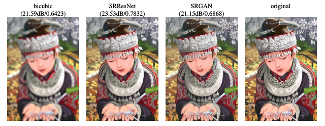

사진에서 가장 최상단에 적혀있는 것은 저 해상도에서 고해상도로의 복원에 사용한 알고리즘 이름이 적혀있고, 아래의 데시벨과 숫자가 의미하는 바는 PSNR, SSIM 수치이다. PSNR 수치로만 보면 SRResNet이 SRGAN보다 높지만 사진으로 비교했을 때의 디테일은 SRGAN이 더 좋아 보이는 것을 확인할 수 있다. 마찬가지로 PSNR의 수치가 bicubic과 SRGAN을 비교했을 때 거의 비슷한 수치를 보이나 실제 결과물을 보면 극명한 차이가 나고 있음을 볼 수 있다. 이와 같은 점을 미루어 보았을 때 PSNR은 SR 성능의 절대적인 지표가 되기는 힘들어 보인다.

그래서 본 논문에서는 ResNet 구조와 perceptual loss를 이용한 SRGAN을 제안하고, MOS(Mean opinion score)라는 설문조사 방식의 성능지표를 이용해 제안한 모델이 잘 작동함을 보였다.

## Method

SR의 목표는 LR input image로부터 SR image를 추정하는 것이다. 논문에서의 궁극적인 목표는 LR input image로부터 HR image를 생성하는 Generating function G를 훈련시키는 것이다.

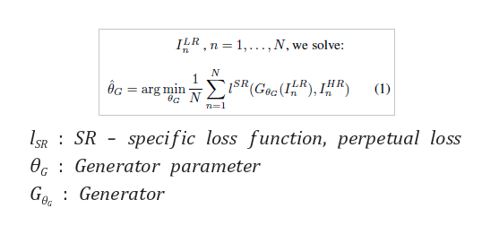

### Adversarial network architecture

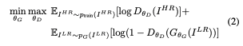

SRGAN이 하는 방식은 실제 파트에서는 HR 이미지를 넣음으로써 Discriminator가 HR 이미지로 구분하게 하고 가짜 파트에서는 LR image로 Generator가 생성한 이미지를 넣음으로써 SR 이미지를 HR 이미지로 속이는 적대적 학습을 한다는 것이 핵심이다. 이 결과로 Generator는 Discriminator를 속이기 위해 HR 이미지를 계속해서 만들어낼 것이다. Generator와 Discriminator의 네트워크 구조를 그림으로 표현하면 다음과 같다.

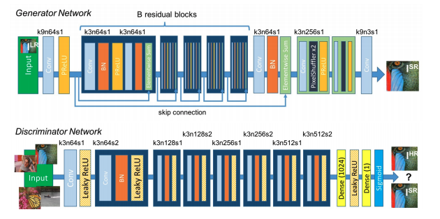

다음 그림에서 보이는 k는 kernel size, n은 channel, s는 stride를 의미한다. Generator에서 보이는 활성화 함수는 PReLU를 사용했다. Discriminator에서는 Leaky ReLU를 사용하며 마지막 활성화 함수로 sigmoid를 사용하며 0,1로 최종적으로 구분한다.

### Perceptual loss function

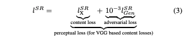

논문에서 소개하는 가장 중요한 부분으로 Perceptual loss function을 위의 식과 같이 정의한다. 해당 함수는 두 개의 파트로 나누어지는데 앞부분의 content loss와 뒷부분의 adversarial loss로 나뉜다.

### Content loss

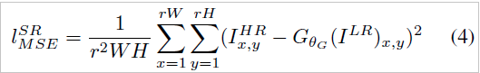

보통의 MSE 기반으로 loss function을 사용할 때 위의 (4) 식과 같이 pixel-wise MSE Loss를 사용한다. 위에서 계속 얘기했듯 이 방법은 과도하게 질감(texture)를 부드럽게(smooth)하기 때문에 고품질의 디테일을 온전하게 구성하지 못하고 흐릿(blur)하게 보이는 특징이 존재한다.

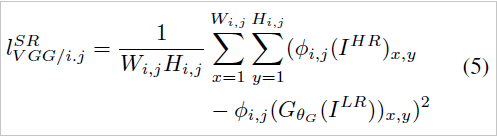

때문에 이 논문에서는 위의 식 (5)와 같이 미리 학습된 VGG 네트워크에 HR 이미지와 LR 이미지를 각각 넣는다. 그 후, 마지막 layer에서 특징맵을 뽑아내고 이를 pixel-wise로 비교한다.

### Adversarial loss

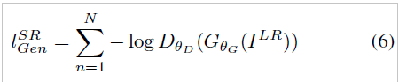

위에서의 Content loss에 더하여 GAN에서 사용하는 Adversarial loss를 덧붙여준다. 기본적으로 log(1-x)는 훈련 초기의 gradient가 매우 flat 한 경향이 있어 이것을 역으로 바꾼 -log(x) 방식을 사용한다. 그렇게 되면 gradient 초깃값이 매우 커져 학습이 더 잘 되는 경향을 보인다. 이 부분을 넣은 가장 큰 이유는 Generator가 고해상도인 상태로 훈련되기를 희망하기 때문이다.

## 실험 결과

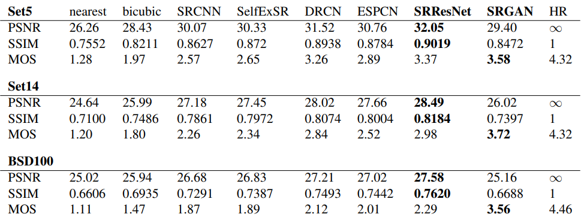

test data인 SET-5, SET-14, 그리고 BSD100에 대해 PSNR, SSIM, MOS 지표를 적용하여 자신들이 제안한 SRResnet, SRGAN과 다른 SR 알고리즘을 비교하였다.

## 성능 개선 방안

### 요약

우리 팀은 SRGAN의 perceptual loss를 구성하는 네트워크 구조가 성능에 얼마나 영향을 미치는지 비교하고, 최적의 네트워크를 찾아냄으로써 SRGAN의 성능을 향상시키고자 했다.

### 성능 개선에 활용한 네트워크

기존 SRGAN 논문에서 perceptual loss function으로 사용하던 vgg 네트워크를 imagenet 데이터에 대해 미리 학습된 네트워크로 대체했다. 사용하고자 하는 네트워크는 다음과 같았다.

- VGG16
- VGG16_BN
- resnet152
- densenet201
- resnext101_32x8d
- wide_resnet_101
- inception_v3

모든 네트워크의 마지막 layer를 특징맵으로 사용했다. set5,set14,bsd100를 test data로 이용하여 성능을 측정했다.

### 진행상황

image net data 35만장에 대해 100에포크 가량을 학습해야 하다 보니, 학습시간이 너무 오래 걸려서 아직까지 많은 결과를 확인하지 못했다. baseline인 vgg16와 resnext101_32x8d에 대해 결과를 확인한 상태이고, 현재 densenet201을 perceptual loss로 지정하여 학습을 진행하고 있다.

학습 결과는 다음과 같다.

- vgg, PSNR = 24.54675320150087, SSIM = 0.7118159342212838
- resnext101_32x8d, PSNR = 24.254839593217472, SSIM = 0.7028170706344252

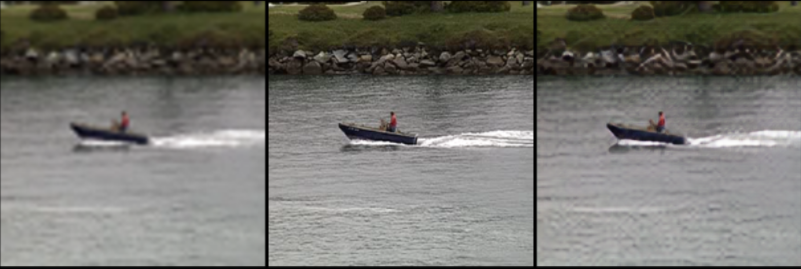

perceptual loss - vgg

perceptual loss - resnext101_32x8d

가장 왼쪽 사진이 LR 이미지, 중간 사진이 HR 이미지이며, 가장 오른쪽 사진은 학습된 SRGAN으로부터 얻어낸 SR 이미지이다.

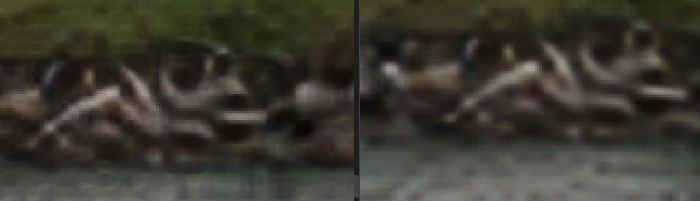

왼쪽 vgg16 SR 이미지의 일부, 오른쪽 resnext101_32x8d SR 이미지의 일부

위에 제시된 이미지와 PSNR, SSIM 지표를 보면, perceptual loss의 네트워크 종류가 결과에 영향을 꽤 미친다는 것을 확인할 수 있다.

### 남은 작업

- 아직 학습시키지 못한 네트워크를 돌려보며 성능을 비교해 볼 예정이다.
- SRGAN에서 성능 지표로 사용된 PSNR, SSIM, MOS 중 MOS같은 경우에는 실제 사람에게 설문을 받아야 하는 부분이기 때문에 이를 지표로 사용하기는 어려운 부분이 많았다. 이를 대체할 수 있는 성능지표를 이용해서, 기존 SRGAN 보다 성능이 향상되었다는 것을 보일 수 있어야 한다.
- 현재 미리 학습된 네트워크는 classification 문제를 해결하기 위한 학습을 했는데, image segmentation, instance segmentation 등 다른 종류의 문제를 해결하기 위해 미리 학습된 네트워크를 이용했을 때 성능에 얼마나 영향을 미치는지 측정해볼 예정이다.
