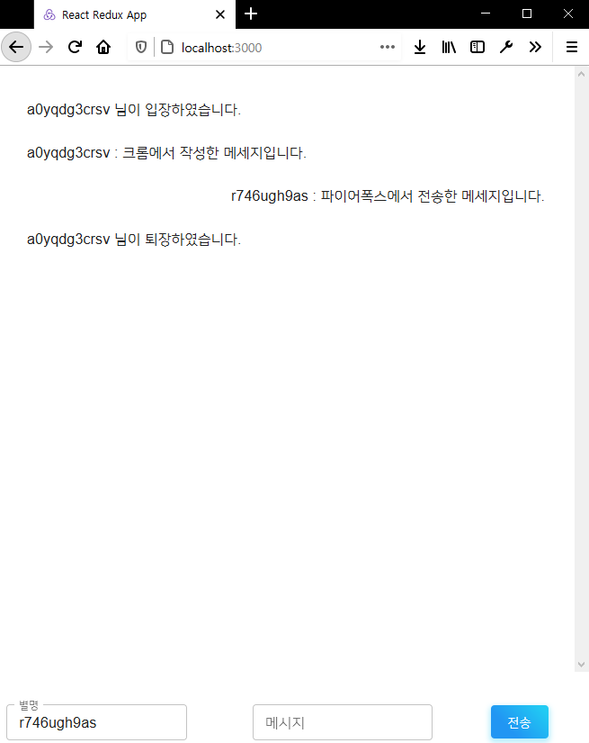

WEB 팀의 Mission 5는 Socket.io를 이용한 웹소켓 구현입니다. 웹 스터디 팀의 코어 멤버인 형진 님이 미션 수행 목표와 웹 소켓에 관한 자세한 설명을 아래 노션 문서에 작성해 주셨습니다.

[#5 Mission : WebSocket](https://www.notion.so/5-Mission-WebSocket-af63722f93f84a438d7659a18f525741)

## 웹소켓이란?

먼저 웹소켓이 무엇인지부터 알아보도록 하겠습니다!

웹소켓은 사용자의 브라우저와 서버 사이에 실시간 양방향 데이터 전송을 위한 기술로, HTTP와 다르게 WS 라는 프로토콜을 사용합니다. 따라서 브라우저와 서버가 WS 프로토콜을 지원하면 사용할 수 있으며, 최신 브라우저들은 대부분 웹 소켓을 지원합니다. (IE9 등의 오래된 브라우저에서는 지원하지 않습니다!)

웹소켓 이전에는 HTTP 기술을 사용하여 실시간 데이터 전송을 사용하였는데, 그 중 한가지가 **폴링 (polling)** 방식입니다. HTTP가 클라이언트에서 서버로 향하는 단방향 통신이므로, 주기적으로 서버에 새로운 업데이트가 있는지 확인하는 요청을 보낸 후, 있다면 새로운 내용을 가져오는 방식이었습니다.

이에 반해 웹소켓은 클라이언트와 서버 사이의 **양방향 통신 세션 (two-way interactive communication session)** 입니다. 따라서 서버에 메시지를 보낼 때, 업데이트를 확인하기 위해 주기적으로 서버에 요청을 보낼 필요 없이 (without having to poll the server for a reply) 이벤트 기반 응답을 받을 수 있습니다.

아래는 폴링 방식과 웹소켓 방식을 비교한 그림입니다.


(출처: <https://docs.microsoft.com/ko-kr/azure/application-gateway/application-gateway-websocket>)

그럼 웹 소켓을 언제 사용해야 할까요? 웹소켓은 기존의 기술에 비해 더욱 진보되었지만, 몇 가지 단점이 있습니다. 먼저 미지원 브라우저가 존재한다는 점입니다. 인터넷 익스플로러 (IE) 구버전에서는 웹소켓이 지원되지 않으며, 기존의 프로그램 구현에 보다 많은 복잡성을 불러올 수 있습니다. 따라서 양방향 통신이 필요한 경우에 사용해아하며, 아래에서 다룰 실시간 채팅 등에 사용되어야 합니다.

## 목표 및 요구사항

이번 미션의 목표는 다음과 같습니다!

1. Echo Service
    - 웹소켓으로 전송된 메시지를 그대로 답신합니다.
2. Simple Chat Service
    - 브로드캐스트 기능을 이용하여 받은 메시지를 웹소켓에 접속한 인원들에게 모두 전달합니다.
3. Bledding-Edge Chat Service
    - 별명 기능을 추가합니다.
    - 누군가 접속하거나 나가면 이를 접속한 인원들에게 브로드캐스트 기능을 이용하여 알립니다.
    - `{user nickname}이 입력 중입니다...` 기능을 추가합니다.

## Socket.IO

미션에 들어가기 앞서, 웹소켓 구현을 위한 자바스크립트의 socket.IO 라이브러리에 대해 알아보겠습니다. Socket.IO는 웹소켓을 지원하지 않는 브라우저에서는 웹소켓 대신 폴링 방식을 사용하여 실시간 전송을 가능하게 합니다. 클라이언트를 먼저 폴링 방식으로 서버와 연결한 후, 웹소켓을 사용할 수 있다면 웹소켓으로 업그레이드 합니다. 따라서 웹소켓을 지원하는 않는 브라우저는 폴링 방식으로, 웹소켓을 지원하는 브라우저는 웹소켓 방식으로 사용 가능합니다.

1. Socket.IO 설치

    ```bash
    npm install socket.io
    ```

2. 웹소켓 서버 생성

    ```javascript
    const http = require("http")
    const express = require("express")
    const socket = require("socket.io")

    const app = express();
    const server = http.createServer(app);
    const io = socket(server, { path: "/socket" }); 
    ```

    socket.IO를 사용할 때 http 모듈을 이용해 직접 작업해야하므로, express 모듈의 앱에 대하여 http.createServer() 함수를 이용해 http 서버를 생성합니다. 그리고 생성된 http 서버를 socket.IO의 서버로 업그레이드 합니다.

3. 웹소켓 서버 연결

    ```javascript
    io.on("connection", (socket) => {
        // socket 객체에 대하여 이벤트 연결
    })
    ```

    웹소켓 서버 io 에 connection 이벤트 핸들러를 연결합니다. connection 이벤트는 클라이언트가 접속했을 때 발생하고, 콜백으로 소켓 객체 socket을 제공합니다. 이 소켓 객체 socket에 다른 이벤트를 연결하여, 클라이언트에서 발생하는 이벤트를 서버에서 처리합니다.

4. 소켓 객체 이벤트 연결

    - disconnect 이벤트 연결

        ```javascript
        socket.on("disconnect", (data) => {
            // disconnect 이벤트가 발생했을 때 처리할 서버의 코드
        })
        ```

        소켓 객체 socket에 disconnect 이벤트를 연결합니다. disconnect 이벤트는 클라이언트가 접속을 종료했을 때 발생합니다.

    - 사용자 정의 이벤트 연결 (client->server)

        ```javascript
        // index.html (client)
        socket.emit("client_event", data)

        // index.js (server)
        socket.on("client_event", (data) => {
            // client_event 발생 시 클라이언트가 보낸 data 를 처리할 서버의 코드
        })
        ```

    - 사용자 정의 이벤트 연결 (server->client)

        ```javascript
        // index.js (server)
        socket.emit("client_event", data)

        // index.html (client)
        socket.on("custom_event", (data) => {
            // server_event 발생 시 서버가 보낸 data 를 처리할 클라이언트의 코드
        })
        ```

        클라이언트와 혹은 서버 측에서 발생할 이벤트에 대하여, 데이터를 건네받을 쪽에서 데이터를 처리할 코드를 작성합니다. 이벤트 발생 시 socket.emit() 함수를 이용해 데이터를 전달하며, socket.on() 함수를 이용해 이벤트를 연결한 뒤 콜백에서 데이터를 전달받습니다.

## 구현하기

그럼 웹소켓과 Socket.IO 에 대하여 알아보았으니, 본격적으로 실시간 채팅을 구현을 해보도록 하겠습니다. 프론트엔드는 React + Redux, 백엔드는 Node.js 를 이용하였으며, 위의 목표 및 요구사항을 제외한 기본적인 boiler-plate는 형진님이 작성하여 올려주셨습니다. 아래 링크에 형진 님과 제가 fork 한 뒤 작성한 코드를 올려두겠습니다!

[boiler-plate](https://github.com/r4k0nb4k0n/mission-5-websocket-boilerplate)
[boiler-plate + Socket.IO](https://github.com/rxdcxdrnine/mission-5-websocket-boilerplate)

1. Echo Service 구현
    - 웹소켓으로 전송된 메시지를 그대로 답신합니다.

    ```javascript
    socket.on("chat", (message) => {
        // ECHO SERVICE
        socket.emit("chat", message);
    ```

2. Simple Chat Service 구현
    - 브로드캐스트 기능을 이용하여 받은 메시지를 웹소켓에 접속한 인원들에게 모두 전달합니다.

    ```javascript
    socket.on("chat", (message) => {
        //BRAODCAST SERVICE
        socket.broadcast.emit("chat", message);
    });
    ```

    Echo 와 Broadcast 통신은 각각 socket.emit(), socket.broadcast.emit() 함수를 이용해서 구현할 수 있습니다. 이외에도 특정 클라이언트의 id 를 입력하여 해당 클라이언트에만 메시지를 전달하는 private 통신이 있습니다.

3. Bledding-Edge Chat Service
    - 별명 기능을 추가합니다.

    ```javascript
    // chat.js
    const [inputNickname, setNickname] = useState(`${Math.random().toString(36).substr(2,11)}`);
    const handleNicknameChange = (event) => {
        setNickname(event.target.value);
    };
    ...

    <CardContent className={classes.dialogSection}>
        <Grid item xs={12}>
            <List>
            {logs.map((log, index) => (
                <ListItem key={index}>
                <Grid container>
                    <Grid item xs={12}>
                    <ListItemText
                        align={log.includes(`${inputNickname}`) ? "right" : "left"}
                        primary={log}
                    ></ListItemText>
                    </Grid>
                </Grid>
                </ListItem>
            ))}
            </List>
        </Grid>
    </CardContent>
    ...

    <Grid xs={4}>
        <TextField
            label="별명"
            variant="outlined"
            size="small"
            value={inputNickname}
            onChange={handleNicknameChange}
        />
    </Grid>
    ```

    react 프레임워크 렌더링 시에 랜덤 문자열을 별명으로 부여하며, 브라우저의 좌측에 별명을 변경할 수 있는 입력창을 만듭니다. 또한 유저가 메시지를 전달할 때, 메시지의 앞에 닉네임을 붙여 전달합니다.

    - 누군가 접속하거나 나가면 이를 접속한 인원들에게 브로드캐스트 기능을 이용하여 알립니다.

    ```javascript
    window.onload = () => {
        socket.emit("chat", `${inputNickname} 님이 입장하였습니다.`);
    }

    window.onunload = () => {
        socket.emit("chat", `${inputNickname} 님이 퇴장하였습니다.`);
    }
    ```

    window 객체에 대하여 유저가 브라우저 창을 키거나 닫을 때 랜덤으로 부여받은 닉네임을 포함한 메시지를 다른 유저들에게 전송합니다.

    - ~~`{user nickname}이 입력 중입니다...` 기능을 추가합니다.~~
    해당 기능은 브라우저의 메시지 입력 창에 유저가 입력할 경우, `{user nickname}이 입력 중입니다...` 와 같은 메시지를 다른 유저들에게 broadcast 통신으로 보내는 방법으로 구현 가능합니다. 하지만 저는 유저가 각 글자를 입력할 때마다 다른 유저들에게 메시지룰 매번 새로 보내도록 구현하여, 정확한 기능 구현까지는 다다르지 못했습니다.

구현을 마친 뒤의 모습은 아래와 같습니다.



## 마치며

형진님이 만들어주신 boiler-plate 덕분에 node.js 외에도 react 와 redux 를 간접적으로 사용해볼 수 있는 좋은 기회였습니다. 웹소켓 덕분에 프론트엔드와 백엔드의 통신 방식에 대해 더 깊게 알아볼 수 있어, 양 쪽 모두의 이해도를 더 높일 수 있었습니다.

2월을 마지막으로 2020 fall DSC UOS WEB TEAM의 활동이 마무리 되는데, 형진님을 비롯한 코어 멤버분들 덕분에 쉽지 않은 미션들을 헤쳐나갈 수 있어 감사했습니다!
