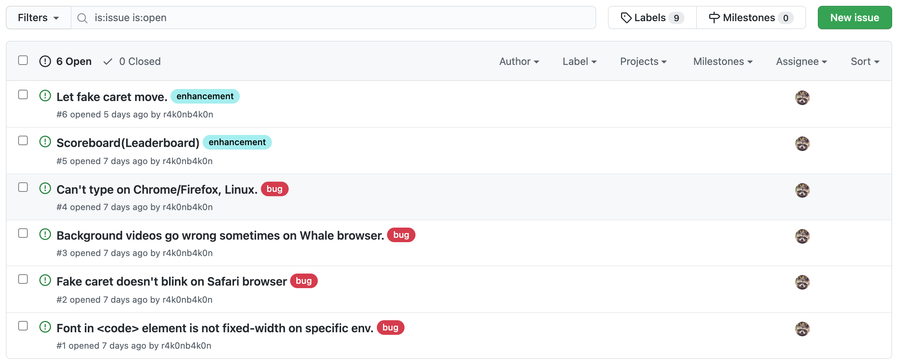

👋 안녕하세요! 제가 만든 [r4k0nb4k0n/typing-game](https://github.com/r4k0nb4k0n/typing-game)
프로젝트를 소개하겠습니다.
[r4k0nb4k0n.github.io/typing-game](https://r4k0nb4k0n.github.io/typing-game)
에서 사용해보실 수 있습니다!

## 🧐 이건 도대체 무엇인가요?

주어진 문자열들을 빠르고 정확하게 입력하는 것을 목표로 시간을 재어 자신의 실력을 파악하고 기를 수 있는 웹 사이트입니다.

## 💁 어쩌다가 만들었나요?

저는 `2021-spring-web-beginner` 팀에서 [microsoft/Web-Devs-For-Beginner](https://github.com/microsoft/Web-Dev-For-Beginners)
를 기반으로 웹 기초 지식을 학습하고, 프로젝트를 통해 이를 응용해보고 있습니다.


[Event-Driven Programming - Build a Typing Game](https://github.com/microsoft/Web-Dev-For-Beginners/tree/main/4-typing-game)
파트에서 위와 같은 데모를 봤습니다. 이걸 제가 원하는 형태와 방식으로 만들어보고 싶었습니다.

## 🧑‍🔧 어떻게 만들었나요?

[microsoft/Web-Devs-For-Beginner](https://github.com/microsoft/Web-Dev-For-Beginners)
를 통해 HTML/CSS/JS 기초를 학습하고 DOM 조작을 실습했습니다.
Typing game도 이를 기반으로 만들었습니다. 여기에 제가 원하는 형태의 움직임을 넣기 위해 CSS 애니메이션을 따로 찾아 구현했습니다.
Github Pages를 통해 배포했습니다.

아래는 directory listing입니다.

```text
📂 r4k0nb4k0n/typing-game
    📂 assets/
        📄 GitHub-Mark-32px.png
        📄 Typing_dark_01_Videvo.mov
        📄 Typing_dark_02_Videvo.mov
        📄 Typing_dark_03_Videvo.mov
    📄 README.md
    📄 index.html
    📄 quotes.js    # 타이핑할 문자열들을 배열로 저장하는 스크립트
    📄 script.js    # DOM 조작 등의 스크립트
    📄 style.css    # 스타일과 애니메이션 정의
```

## 🧗 어디서 삽질을 했나요?

### 1. Multiple videos on background

배경에 3개의 동영상이 차례대로 나와서 반복재생 하는 것을 구현했습니다.

처음에는 하나의 `<video>` element를 두고,
`onended` 이벤트 핸들러를 통해 해당 element DOM의 `src` 속성을 직접 교체하는 식으로 구현했는데,
이는 Flickering이 발생하여 느리고 오류가 걸린 것처럼 보였습니다.

따라서 동영상 개수만큼 `<video>` element들을 만들고,
각각 `style.visibility`를 먹여서 단 하나의 `<video>` 만 보이게 했다가
ended 이벤트가 발생하면 다음 동영상만 보이게 하고 나머지 `<video>` element들은 안보이게 가렸습니다.

아래는 해당 코드입니다.

```html
<!DOCTYPE html>
<video
  playsinline
  muted
  id="bgvid1"
  src="./assets/Typing_dark_01_Videvo.mov"
  onended="bgvid_onended()"
  style="visibility: visible;"
></video>
<video
  playsinline
  muted
  id="bgvid2"
  src="./assets/Typing_dark_02_Videvo.mov"
  onended="bgvid_onended()"
  style="visibility: hidden;"
></video>
<video
  playsinline
  muted
  id="bgvid3"
  src="./assets/Typing_dark_03_Videvo.mov"
  onended="bgvid_onended()"
  style="visibility: hidden;"
></video>
<html>
  <head></head>
  <body></body>
</html>
<script type="text/javascript">
  const bgvids = document.querySelectorAll("video");

  function bgvid_onended() {
    bgvids[bgvid_index].style.visibility = "hidden";
    bgvids[bgvid_index].currentTime = 0;
    bgvid_index = (bgvid_index + 1) % bgvids.length;
    bgvids[bgvid_index].play();
    bgvids[bgvid_index].style.visibility = "visible";
  }

  let bgvid_index = 0;
  bgvids[bgvid_index].play();
</script>
```

### 2. Fake caret

투명한 input을 만들고, 그 안의 caret도 제가 원하는 모양인 가래떡으로 구현했습니다.

`<input>` element의 css(border, background)를 수정하여 투명하게 만들어보려 했으나 잘 적용되지 않았습니다.
이는 `<h1>` element에 `contenteditable="true"` attribute를 추가하여 입력이 가능하도록 만들었습니다.
이를 통해 자연스럽게 투명하게 만들었습니다.
이 안의 caret을 내가 원하는 모양인 두꺼운 흰색 막대기 모양으로 바꾸려고 관련 attribute를 찾아봤으나
`caret-color`만 찾아서 사용했습니다.
또다른 `<h1>` element를 두꺼운 흰색 막대기 모양에 깜빡이는 애니메이션을 추가한 css를 적용하여 fake caret을 만들었습니다.
실제 caret의 `caret-color`를 transparent로 적용하여 가리고,
fake caret이 맨 끝에 있는 경우 가짜 caret이 그럴듯하게 보이게 만들었습니다.

@Taehee Lee 님의 기능 제안으로 Fake input을 통해 Fake caret도 화살표 키를 통해 움직이는 것을 구현할 에정입니다.
[관련 PR](https://github.com/r4k0nb4k0n/typing-game/issues/6)

## 🧑‍💻 마치며



많은 분들이 피드백을 해주셨습니다. 🙇‍♂️ 제보된 버그들과 기능 제안이 이만큼 쌓여있으니 시간 날 때마다 해치우겠습니다.

여러분들도 작게나마 원하는 것을 만드는 프로젝트를 해보셨으면 합니다. 👍
