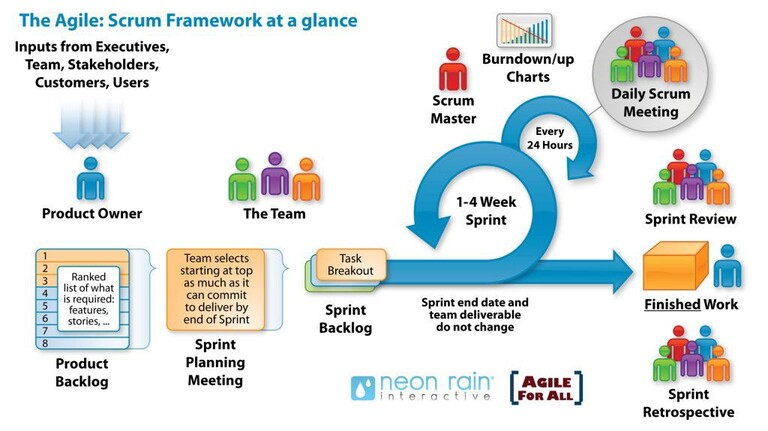
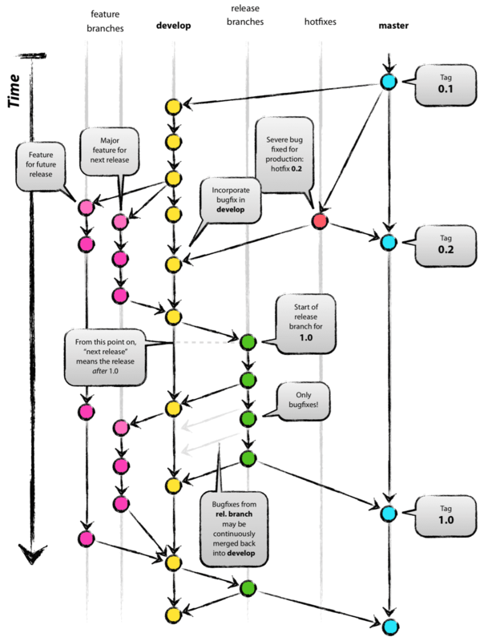
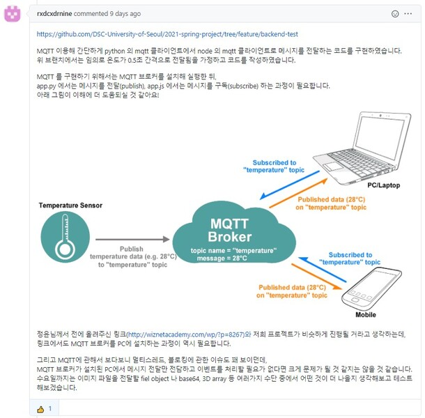
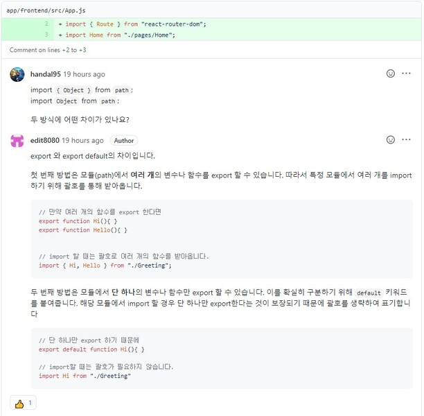
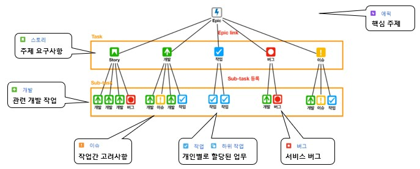
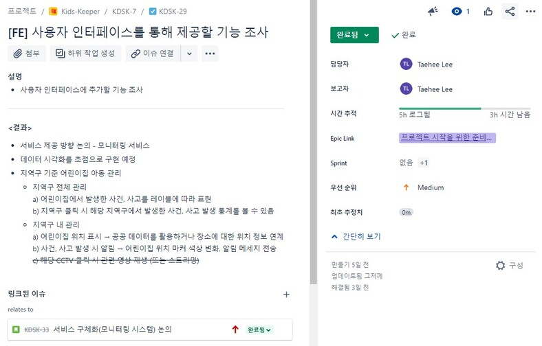
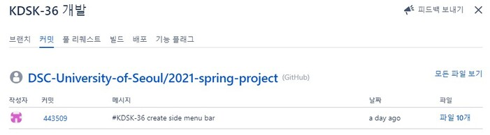
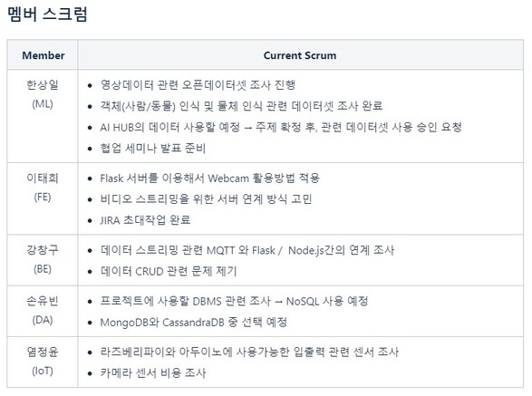

## Intro

이번 포스팅은 프로젝트 팀에서 다른 구성원들과 협업하기 위해 활용한 방법과 관련 프로그램 사용에 대한 경험을 공유하기 위해 작성하였습니다.
자신이 어떠한 팀에 소속해있거나 소속하여 개발할 예정이라면 협업을 위해 아래에 작성된 내용을 도입하는 것을 적극 추천합니다. 👍👍

## 스크럼(Scrum)

스크럼은 애자일(Agile) 개발 방법론을 수행하기 위한 프로세스입니다.
애자일 개발 방법론은 반복적인 개발을 중시하고 요구사항이나 이슈 발생에 유연하게 대응한다는 점에 초점을 맞춘 만큼
구성원들 간의 소통이 매우 중요합니다.
이러한 소통을 위해 가장 많이 사용하는 방법으로 스크럼 회의를 많이 사용합니다.
실제로 많은 소프트웨어 기업에서도 이러한 스크럼 기법을 많이 도입하여 사용하고 있습니다.

그렇다면 스크럼은 구성원들이 어떠한 역할을 가지고 어떻게 수행해야할까요?

스크럼의 구성원은 백로그를 작성하는 제품 책임자(Product Owner), 스크럼 마스터(Scrum Master),
개발 팀(Development Team)으로 구성되어있습니다. 각 구성원들이 하는 일을 살펴보면 다음과 같습니다.

- 제품 책임자 (Product Owner)
  - 제품을 만들기 위해 필요한 요구사항인 백로그를 작성하고 우선순위를 지정합니다.
  - 각 담당자에 맞게 작성한 백로그를 할당합니다.
  - 스크럼 회의 이후 발생하는 변경 사항에 대해서 백로그를 최신화합니다.

- 스크럼 마스터 (Scrum Master)
  - 스크럼 회의를 주도하여 스프린트의 진행 상황을 점검합니다.
  - 발생한 이슈를 공론화하여 처리함으로써 구성원들이 원활한 스프린트를 수행할 수 있도록 가이드합니다.

- 개발 팀 (Development Team)
  - 제품 책임자가 할당한 백로그를 달성하기 위한 기능을 구현합니다.
  - 스크럼 회의동안 본인이 수행한 업무와 앞으로 수행할 업무를 공유합니다.
  - 발생한 이슈에 대해 구성원들과 공유합니다.

> 스프린트는 백로그를 수행하기 설정한 일정한 기간을 말합니다. 보통 1~4주 정도 설정합니다.

위와 같은 역할을 담당한 후 전체적인 스크럼은 다음과 같이 수행할 수 있습니다.

1. 백로그 작성 : 제품 책임자(Product Owner)가 제품을 만들기 위해 필요한 요구사항인 백로그를 작성합니다.
2. 스프린트 계획 : 스프린트의 목표를 설정하고 목표를 달성하기 위해 수행할 백로그를 선정하여 스프린트 백로그를 작성합니다.
3. 일일 스크럼 회의 : 구성원들은 스프린트 동안 각자의 업무를 수행하고 매일마다 어제 한 일, 오늘 할 일, 발생한 이슈에 대해
짧막하게 공유합니다.
4. 스프린트 리뷰 : 스프린트가 종료되고 발생한 산출물을 사용자, 이해관계자들에게 시연하고 검토, 피드백을 받습니다.
5. 스프린트 회고 : 스프린트가 종료되고 마지막에 좋았던 점, 개선할 점을 논의하고 차후 스프린트를 더 나은 방향으로 개선합니다.

저희 팀은 멤버 구성 인원이 적고 매일 스크럼 회의를 진행할 수 없어 제품 책임자, 스크럼 마스터와 개발팀 업무를 겸임하고
주 2회 스크럼 회의로 변형하여 스크럼을 진행하였습니다. 이와 같이 전체적인 틀을 유지하면서 각자의 환경에 맞게 변형하여
스크럼을 수행하는 것도 좋은 방법입니다.

## Git을 통해 협업하기

Git은 로컬 파일의 변경사항을 추적해 여러 사용자와 해당 파일을 통한 작업을 조율할 수 있도록 도와주는 버전 관리 시스템입니다.
저희 팀은 Git을 통해 단순히 소스코드를 관리하는 것 이외에 다음의 기능을 사용하여 프로젝트 협업 작업을 수행하였습니다.

### Git Branch

Git에서 branch는 소프트웨어를 개발함에 있어서 필요한 작업을 독립적으로 진행하기 위한 작업 흐름의 단위입니다.
각각의 branch는 다른 branch의 영향을 받지 않기 때문에 여러 작업을 동시에 진행할 수 있습니다.
이렇게 만들어진 각각의 branch는 다른 브랜치와 merge함으로써 작업한 내용을 하나로 모을 수 있습니다.

저희 팀은 Git branch의 원활한 관리를 위해 Git Flow라는 개발 방법론을 도입하였습니다.
Git Flow는 간단하게 설명하자면 소프트웨어의 소스코드를 관리하기 위한 브랜치 관리 전략입니다.
Git Flow에서는 5가지 종류의 브랜치를 사용하여 브랜치를 관리합니다.

1. Master Branch : 제품을 배포하는 기준이 되는 Branch
2. Develop Branch : 개발의 진행 기준이 되는 Branch
3. Feature Branch : 각 단위 기능을 개발하는 Branch
4. Release Branch : 배포를 위해 Master로 합병 전 , 검토 단계의 Branch
5. Hotfix Branch : Master에서 발견 된 버그를 긴급 수정하는 Branch

저희 팀은 개발함에 있어서 `feature/react-sidemenu`와 같이 해당하는 branch에 맞게
branch 네이밍 컨벤션을 설정하여 branch를 관리하였습니다.

### Git Issue

Issue는 작업을 정리하는 단위입니다. 작업은 기능 설계, 구현, 버그 수정 등 개발함에 있어서 수행한 모든 작업이 될 수 있습니다.
Git Issue를 사용하면 프로젝트를 진행하는 과정에서 발생하는 모든 이슈를 다른 팀원들과 공유할 수 있습니다.
팀원들은 공유된 Issue를 확인하고 예상되는 문제점, 다른 방향성을 제시함으로써 Issue를 보다 좋은 방법으로 구현·해결할 수 있습니다.

### Git Pull Request

Pull Request는 branch를 merge하기 이전에 확인을 받는 절차입니다.
branch에서 작성한 코드를 팀원들과 리뷰함으로써 팀원들이 코드의 전반적인 내용을 확인하고 궁금한 내용을 서로 질문할 수 있습니다.
이를 통해 추후 기능 확장, 타 파트와의 연계에 대한 논의를 매끄럽게 진행할 수 있습니다.

## JIRA를 통해 협업하기

JIRA는 소프트웨어 프로젝트를 추적·관리할 수 있는 애자일 개발 방법론 기반 작업 도구입니다.
JIRA를 사용하면 다음과 같은 기능을 사용할 수 있습니다.

- 요구 사항(백로그) 및 테스트 사례 관리
- 프로젝트 진행 상황 관리
- 버그 및 이슈 트래커
- 프로젝트 릴리즈 버전 관리
- 프로젝트 문서 관리
- 칸반, 스크럼 보드 등 다양한 애자일 프로세스 수행 환경 지원

JIRA는 애자일 개발 방법론을 사용하는 환경에 최적화된 도구입니다.
따라서 각 스크럼 구성원들은 JIRA를 다음과 같이 활용할 수 있습니다.

- 제품 책임자
  - 전체 백로그 관리 및 할당 용이
  - 백로그 우선순위 설정
  - 제품 릴리즈를 위한 타임라인 관리
- 스크럼 마스터
  - 스프린트 진행상황 관리
  - 제품 개발을 위한 전체 리소스 관리
- 개발 팀
  - 개발 일정 관리
  - 관련 버그 및 이슈 추적 용이

JIRA는 프로젝트에 대한 핵심 주제(에픽)를 설정한 후 관련된 이슈를 연결하는 구조로 이루어져 있습니다.
제품 책임자와 스크럼 마스터가 스프린트 동안 수행할 에픽을 설정한 후 해당 에픽을 수행하기 위한 하위 작업들을
각 담당자에게 편리하게 할당할 수 있습니다.

### 백로그 관리

JIRA를 사용하면 스크럼 간에 발생한 모든 백로그를 관리할 수 있습니다.
스크럼 회의 후 발생하는 백로그에 대한 보고자, 담당자를 설정할 수 있고 관련된 이슈도 연결할 수 있습니다.
시간 추적 기능을 사용하면 일일 스크럼 회의 후 만들어지는 번다운/업 차트를 자동으로 생성할 수 있습니다.

> - 번다운 차트 : 남아있는 일 대비 시간을 나타내는 차트
> - 번 업 차트 : 총 작업량을 나타내는 차트

### Github 연동하기

JIRA의 백로그 키를 사용하면 진행중인 프로젝트의 코드를 저장하고 있는 Github의 Repository와 연동할 수 있습니다.
이 기능을 사용하여 백로그와 Github의 branch, commit, pull request를 연동해 개발 진행 상황을 쉽게
추적하고 관련 이슈도 손쉽게 연결할 수 있습니다. 백로그와 Github는 다음과 같이 연동할 수 있습니다.

- branch : branch명을 백로그 키로 설정
- commit : $git commit -m "#백로그_키 commit_메세지"
- pull request : #백로그_키 Pull_Request_메세지

### 프로젝트 문서 관리

프로젝트를 수행하면서 발생하는 모든 문서를 다른 클라우드 저장소를 사용하지 않고 JIRA를 통해 통합적으로 관리할 수 있습니다.
또한 프로젝트 문서 템플릿도 지원하고 있어 다양한 양식의 파일을 통해 쉽게 문서를 작성할 수 있습니다.

## 참고 자료

1. [애자일 Scrum(스크럼) 이해하기](https://medium.com/dtevangelist/scrum-dfc6523a3604)
2. [우린 Git-flow를 사용하고 있어요](https://woowabros.github.io/experience/2017/10/30/baemin-mobile-git-branch-strategy.html)
3. [JIRA 시작하기 자습서](https://www.atlassian.com/ko/software/jira/guides/getting-started/basics)
