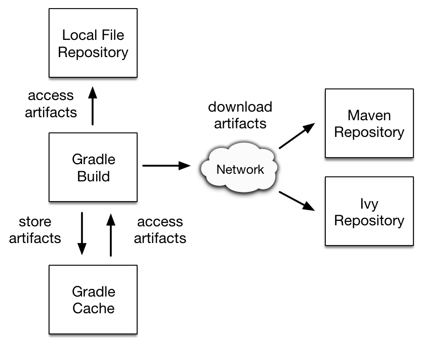

## Table of Contents

* [1. Hello Backend!](#1-hello-backend)
  * [1.1. 왜 프레임워크를 쓰나요?](#11-왜-프레임워크를-쓰나요)
  * [1.2. 프레임워크는 어떻게 구성되나요?](#12-프레임워크는-어떻게-구성되나요)
    * [1.2.1. 디자인 패턴](#121-디자인-패턴)
    * [1.2.2. 라이브러리](#122-라이브러리)
  * [1.3. Spring과 IntelliJ](#13-spring과-intellij)
    * [1.3.1. Spring의 장점](#131-spring의-장점)
    * [1.3.2. IntelliJ Idea](#132-intellij-idea)
  * [1.4. Gradle](#14-gradle)
    * [1.4.1. Gradle Build Lifecycle](#141-gradle-build-lifecycle)
    * [1.4.2. Gradle 사용법](#142-gradle-사용법)
      * [Plugin](#-plugin)
      * [Repository](#-repository)
      * [Dependency](#-dependency)
      * [Test](#-test)
* [2. Testcode](#2-testcode)
  * [2.1. 테스트코드를 왜 작성해야 하나요?](#21-테스트코드를-왜-작성해야-하나요)
  * [2.2. Spring boot 테스트코드는 어떻게 작성해야 하나요?](#22-spring-boot-테스트코드는-어떻게-작성해야-하나요)
    * [2.2.1. Given-when-then](#221-given-when-then)
    * [2.2.2. Given-when-then 연습](#222-given-when-then-연습)
  * [2.3. Lombok으로 자바를 더 편하게 써봅시다](#23-lombok으로-자바를-더-편하게-써봅시다)
* [3. Java Persistence Api](#3-java-persistence-api)
  * [3.1. JPA가 무엇인가요?](#31-jpa가-무엇인가요)
  * [3.2. JPA를 적용해봅시다](#32-jpa를-적용해봅시다)
  * [3.3. 게시글 등록 API를 만들어봅시다](#33-게시글-등록-api를-만들어봅시다)
  * [3.4. 테스트 코드로 JPA가 잘 돌아가는지 확인해볼까요?](#34-테스트-코드로-jpa가-잘-돌아가는지-확인해볼까요)
* [4. Template Engine](#4-template-engine)
  * [4.1. Server Side vs Client Side](#41-server-side-vs-client-side)
    * [4.1.1. Server Side Template Engine](#411-server-side-template-engine)
    * [4.1.2. Client Side Template Engine](#412-client-side-template-engine)
  * [4.2. Mustache](#42-mustache)
  * [4.3. Mustache를 사용해봅시다](#43-mustache를-사용해봅시다)
* [5. 게시판 만들기](#5-게시판-만들기)
  * [5.1. IndexController](#51-indexcontroller)
  * [5.2. Contents Delivery Network](#52-contents-delivery-network)
  * [5.3. 게시글 등록](#53-게시글-등록)
  * [5.4. 전체 조회](#54-전체-조회)
  * [5.5. 게시글 수정](#55-게시글-수정)
  * [5.6. 게시글 삭제](#56-게시글-삭제)
* [6. 로그인 기능 구현하기](#6-로그인-기능-구현하기)
  * [6.1. Spring Security](#61-spring-security)
  * [6.2. Google Login](#62-google-login)
* [7. References](#8-references)

## 1. Hello Backend

### 1.1. 왜 프레임워크를 쓰나요?

소프트웨어적 관점에서 **프레임워크**는 애플리케이션을 만들기 위한 큰 틀과도 같습니다.
앱의 골격을 프레임워크로부터 빌려쓴다면 개발자는 구현해야 하는 핵심 로직에만 집중할 수 있습니다.
> 프레임워크와 함께라면, 레스토랑의 셰프에게는 재료 수급이나 매장 관리에 신경쓸 필요 없이 요리만 할 수 있는 환경이 주어집니다.
>
> 프레임워크와 함께라면, 개발자에게는 XML 설정과 WAS 설치 등에 신경쓸 필요 없이 로직을 짜는 것에만 집중할 수 있는 환경이 주어집니다.

### 1.2. 프레임워크는 어떻게 구성되나요?

프레임워크는 **디자인 패턴과 라이브러리를 모아 프로그램 형태로 만든 것**입니다.
> 프레임워크 = 디자인패턴 + 라이브러리

#### 1.2.1. 디자인 패턴

**디자인 패턴은 객체 지향 설계를 위한 정형화된 설계 방법입니다.**
객체지향 언어로 넘어오며 개발자가 맞닥뜨릴 수 있는 문제를 피하기 위해 무엇을 객체로 정할지, 객체 간 관계를 어떻게 정할지가 중요해졌습니다.
디자인 패턴은 코드를 처음 보는 사람도 설계의 목적, 용도, 구현 방법을 쉽게 이해하고 개발할 수 있도록 돕습니다.

#### 1.2.2. 라이브러리

**라이브러리는 프로그램의 구성요소로 공통으로 사용될 수 있는 특정 기능들을 모듈화한 것입니다.**
중복된 코드를 반복해서 작성하지 않도록 하기 위해 재사용할 수 있도록 만들어둘 수 있습니다.

### 1.3. Spring과 IntelliJ

#### 1.3.1. Spring의 장점

* 복잡하지 않습니다.
  * 애플리케이션 기본 설정이 간편합니다.
* 프로젝트 전체 구조 설계에 유용합니다.
  * 스프링은 웹, 데이터베이스 등 어느 한 분야에만 집중하지 않고 전체를 설계하는 용도로 사용할 수 있습니다.
* 다른 프레임워크를 포용합니다.
  * 다른 프레임워크와의 상생을 추구하므로 최소한의 수정으로 여러 종류의 프레임워크를 혼용해서 쓸 수 있습니다.
* 개발 생산성이 좋습니다.
  * XML 설정을 이용해 유지보수가 용이하고 여러 플러그인을 지원해 새로운 개발 도구에 대한 별도의 적응 없이도 개발이 가능합니다.

그 중 **Spring Boot는 스프링의 프로젝트 중 하나로, 설정이 최소화되어 간단히 실행할 수 있다는 장점이 있습니다.**
버전관리가 쉽고 JUnit 등 테스트 관련 라이브러리들이 포함되어 있어 테스트 케이스를 쉽게 작성할 수 있습니다.
JAR 파일로 패키징해서 사용할 수 있어 빠르게 어플리케이션을 개발하는 데에도 효과적입니다.

#### 1.3.2. IntelliJ Idea

IntelliJ는 대표적인 자바 웹 개발도구입니다.

Eclipse vs IntelliJ

* 추천 기능이 강력합니다.
* 리팩토링과 디버깅 기능이 다양합니다.
* 깃 자유도가 높습니다.
* 파일을 비롯한 자원 검색이 빠릅니다.
* 자바와 스프링부트 버전업에 맞추어 업데이트가 빠릅니다.
* 대학생이시면 젯브레인 홈페이지에 가입하고 웹메일 인증 후 ultimate 버전을 무료로 사용하실 수 있습니다.

### 1.4. Gradle

**Gradle은 Groovy 기반의 오픈소스 빌드 도구입니다.**
Ant의 유연성과 Maven의 편리성을 조합해 XML에 대한 이슈도 Groovy를 사용해 해결할 수 있습니다.
gradle은 Maven에서 종종 발생했던 라이브러리 버전 문제, 충돌 문제 등을 해결합니다.

#### 1.4.1. Gradle Build Lifecycle

1. Initialization: 빌드 대상 프로젝트 결정 후 각 Project 객체를 생성하고
setting.gradle 파일에서 프로젝트를 구성
2. Configuration: 빌드 대상이 되는 모든 프로젝트의 빌드 스크립트를 실행
3. Execution: 구성 단계에서 생성/설정된 프로젝트의 task 중 실행 대상을 결정

#### 1.4.2. Gradle 사용법

우선 build.gradle 파일에 빌드정보를 정의합니다.
그 다음 프로젝트에서 사용하는 환경설정, 빌드방법, 라이브러리 정보 등을 기술해 빌드 및 프로젝트의 관리환경을 구성합니다.

##### Plugin

플러그인을 적용함으로써 프로젝트를 확장할 수 있습니다.
플러그인은 재사용을 촉진하고 더 높은 수준의 모듈화를 허용합니다.
기존에는 apply plugin을 사용했지만 [공식 홈페이지](https://url.kr/1e6ioq)에서는
Gradle이 더 안전하게 실행할 수 있도록 plugins를 사용하는 것을 지향합니다.

기존 방법

```gradle
apply plugin: 'java'
apply plugin: 'eclipse'
apply plugin: 'org.springframework.boot'
apply plugin: 'io.spring.dependency-management'
```

개선 방법

```gradle
plugins {
    id 'java'
    id 'eclipse'
    id 'org.springframework.boot' version '2.1.7.RELEASE'
    id 'io.spring.dependency-management' version '1.0.9.RELEASE'
}
```

##### Repository



**repository는 소프트웨어를 등록해서 관리하는 장소를 가리킵니다.**
로컬 환경이나 네트워크에 라이브러리를 공개하고 그 주소를 저장소로 등록하면 저장소에 있는 라이브러리를 gradle이 취득해 이용할 수 있습니다.
만약 중앙저장소에 공개되지 않거나 사내에서만 사용하는 라이브러리가 있을 경우 로컬 저장소를 이용하면 됩니다.
예를 들어 아래는 mavenCentral()과 jcenter()를 사용해 두 저장소를 이용하는 코드입니다.

```gradle
repositories {
    mavenCentral()
    jcenter()
}
```

##### Dependency

**dependency는 의존성에 관한 설정을 관리하는 프로퍼티입니다.**
필요한 라이브러리를 기술하면 해당 라이브러리를 참조할 수 있습니다.
기본적으로 group, name, version 순으로 의존성을 기술하지만 group:name:version으로 축약해 쓸 수 있습니다.
만약 ext 블록으로 버전을 적어두면 dependency에 version 정보를 생략해도 자동으로 적용됩니다.

```gradle
dependencies {
    // 기본형
    compile group: 'org.hibernate', name: 'hibernate-core', version: '3.6.7.Final'
    // 축약형
    compile 'org.hibernate:hibernate-core:3.6.7.Final'
}
```

##### Test

gradle을 통해서 테스트 또한 간편하게 할 수 있습니다.
gradle은 test시에 특정 테스트만 진행할 수 있습니다.
아래는 jUnit을 사용하기 위한 코드입니다.
테스트 코드에 대해서는 다음 장에서 더 공부해보려 합니다.

```gradle
test {
    useJUnitPlatform()
}
```

## 2. Testcode

### 2.1. 테스트코드를 왜 작성해야 하나요?

요즘의 개발에서 **테스트는 필수**적입니다. 이번주에 저는 Junit4를 사용해 테스트하는 방법을 익혔습니다.

* 단위 테스트는 개발단계 초기에 문제를 발견하게 도와줍니다.
* 단위 테스트를 하면 개발자가 나중에 코드를 리팩토링하거나 라이브러리 업그레이드 등에서 기존 기능이 올바르게 작동하는지 확인할 수 있습니다.
* 단위 테스트는 기능에 대한 불확실성을 감소시킬 수 있습니다.

### 2.2. Spring boot 테스트코드는 어떻게 작성해야 하나요?

#### 2.2.1. Given-when-then

테스트 코드는 일반적으로 given-when-then 형식으로 작성합니다.
given 단계에서 테스트를 위해 준비하고 when 단계에서 실제로 액션하는 테스트를 실행한 후 then 단계에서 테스트를 검증합니다.

#### 2.2.2. Given-when-then 연습

이번 주에 실습했던 게시글이 제대로 저장되었는지 확인하고 불러오는 코드입니다.

```java
// given
String title = "테스트 게시글";
String content = "테스트 본문";

postsRepository.save(Posts.builder()
    .title(title)
    .content(content)
    .author("ei654028@gmail.com")
    .build());

// when
List<Posts> postsList = postsRepository.findAll();

//then
Posts posts = postsList.get(0);
assertThat(posts.getTitle()).isEqualTo(title);
assertThat(posts.getContent()).isEqualTo(content);
```

### 2.3. Lombok으로 자바를 더 편하게 써봅시다

**Lombok은 자바에서 DTO, Domain 등을 만들 때 반복적으로 만들어야 하는 멤버 필드 생성자 코드를 줄이는 라이브러리 입니다.**
Getter, Setter, ToString 등 다양한 코드를 자동완성 해 줍니다.
lombok을 적용하면 코드의 가독성이 높아져 일명 코드 다이어트로 불리기도 합니다.

## 3. Java Persistence Api

### 3.1. JPA가 무엇인가요?

**Java Persistence Api는 자바 ORM 기술에 대한 API 입니다.**
본격적으로 객체지향 개발을 하게 되면서 애플리케이션은 객체지향 언어와 관계형 DB로 구성되었습니다.

그러나 이 조합은 자바 객체를 SQL로, SQL을 자바 객체로 바꾸는 과정이 반복되어 지루한 코드가 반복된다는 문제가 있었습니다.
더불어 자바와 SQL간에는 **패러다임 불일치 문제**가 존재합니다.
자바는 추상화, 캡슐화, 정보 은닉을 통해 객체의 기능과 속성을 한 곳에서 관리하려는 패러다임을 가집니다.
반면 관계형 DB는 어떻게 데이터를 저장할지에 집중한 기술이므로 개발자들은 점차 데이터베이스 모델링에 치중하게 되었습니다.

JPA는 개발자가 객체지향적으로 프로그래밍한 것을 관계형 데이터베이스에 걸맞게 대신 SQL문을 생성해서 실행합니다.
따라서 JPA를 사용한 프로그램의 생산성이 높아지고 유지보수가 쉬워졌습니다.

### 3.2. JPA를 적용해봅시다

JPA는 인터페이스이므로 이를 사용하기 위해 구현체가 필요합니다(e.g., Hibernate, Eclipse Link).
또한 구현체를 더욱 쉽게 사용하기 위해 Spring Data JPA라는 모듈을 사용합니다.
> JPA <- Hibernate <- Spring Data JPA

또한 모듈을 사용하면 Spring Data JPA는 Hibernate 외에 다른 구현체로 교체하는 작업과
관계형 데이터베이스 외에 다른 저장소(e.g., MongoDB)로 교체하는 작업의 오버헤드를 줄여줍니다.

### 3.3. 게시글 등록 API를 만들어봅시다

게시글 등록 기능을 만들기 위해 아래 세 파일을 만들어야 했습니다.

* web 패키지 내에 PostApiController.java
* web.dto 패키지 내에 PostsSaveRequestDto.java
* service.posts 패키지 내에 PostsService.java

~~아쉽게도 디렉토리 구조가 왜 이렇게 되어야 하는지,
각 클래스가 어떤 역할을 하는지 온전히 파악하지 못해서 모두 정리하진 못할 것 같습니다.
추후에 내용 추가하겠습니다.~~

### 3.4. 테스트 코드로 JPA가 잘 돌아가는지 확인해볼까요?

저는 스프링 부트 프로젝트의 test 폴더 내에 앞서 연습했던 given-when-then 방식으로 테스트 코드를 작성했습니다.

```java
 @Test
    public void Posts_등록된다() throws Exception{
        //given
        String title = "title";
        String content = "content";

        PostsSaveRequestDto requestDto =
                PostsSaveRequestDto.builder()
                    .title(title)
                    .content(content)
                    .author("author")
                    .build();

        String url = "http://localhost:"+port+"/api/v1/posts";

        //when
        ResponseEntity<Long> responseEntity = restTemplate
            .postForEntity(url, requestDto, Long.class);

        //then
        assertThat(responseEntity.getStatusCode()).isEqualTo(HttpStatus.OK);
        assertThat(responseEntity.getBody()).isGreaterThan(0L);
        List<Posts> all = postsRepository.findAll();
        assertThat(all.get(0).getTitle()).isEqualTo(title);
        assertThat(all.get(0).getContent()).isEqualTo(content);
    }
```

## 4. Template Engine

**템플릿 엔진이란 템플릿 양식과 특정 데이터 모델에 따른 입력 자료를 합성해 결과 문서를 출력하는 소프트웨어를 말합니다.**
그 중 웹 템플릿 엔진이란 웹 템플릿과 컨텐츠 정보를 처리하기 위해 설계된 소프트웨어입니다.
대부분의 템플릿 엔진은 html보다 간단한 문법을 사용하고 재사용성이 높습니다.
또한 하나의 템플릿으로 여러 페이지를 렌더링할 수 있습니다.

### 4.1. Server Side vs Client Side

#### 4.1.1. Server Side Template Engine

**서버 사이드 템플릿 엔진은 DB 혹은 API에서 가져온 데이터를 미리 정의된 템플릿에 넣어 서버에서 html을 그립니다.**
html 코드에서 고정적으로 사용되는 부분은 템플릿으로 만들어두고 동적으로 생성되는 부분만 템플릿에 소스 코드를 끼워넣는 방식으로 동작합니다.

#### 4.1.2. Client Side Template Engine

html 형태로 코드를 작성해 동적으로 DOM을 그리게 해주는 역할을 합니다.
클라이언트에서는 공통적인 프레임을 미리 템플릿으로 만들고 서버에서 필요한 데이터를 받아 적절한 위치에 replace합니다.

### 4.2. Mustache

저는 Spring Boot 프로젝트에 Mustache라는 마크업 언어를 사용할 것입니다.
"스프링 부트와 AWS로 혼자 구현하는 웹서비스"에서는 mustache를 사용하는 이유를 다음과 같이 소개합니다.

* mustache는 수많은 언어를 지원하는 가장 심플한 템플릿 엔진입니다.
* 문법이 다른 템플릿 엔진보다 심플합니다.
* 로직 코드를 사용할 수 없어 View와 서버의 역할이 명확하게 분리됩니다.
만약 템플릿 엔진에서 너무 많은 기능을 제공하면 api, 템플릿 엔진, js가 서로 로직을 나눠가져 유지보수가 어려워진다는 단점이 있습니다.
* mustach.js와 mustache.java를 둘 다 지원해, 하나의 문법으로 클라이언트/서버 템플릿으로 모두 사용 가능합니다.

### 4.3. Mustache를 사용해봅시다

반복적으로 사용되는 코드는 별도의 파일로 분리하여 필요한 곳에서 가져다쓰도록 레이아웃 방식으로 추가합니다.
저는 책을 따라 header와 footer 파일을 만들었습니다.

* css는 화면을 그리는 역할이므로 먼저 로딩시키기 위해 header에서 부릅니다.
* js는 용량이 클수록 로딩이 느려 body 부분의 실행이 늦어지기 때문에 footer에 둡니다.
* bootstrap.js은 jquery.js에 의존하기 때문에 footer 내에서도 아래에 위치합니다.

```mustache
//header.mustache
<!DOCTYPE HTML>
<html>
<head>
    <title>스프링부트 웹서비스</title>
    <meta http-equiv="Content-Type" content="text/html; charset=UTF-8" />

    <link rel="stylesheet" href="https://stackpath.bootstrapcdn.com/bootstrap/4.3.1/css/bootstrap.min.css">
</head>
<body>
```

```mustache
//footer.mustache
<script src="https://code.jquery.com/jquery-3.3.1.min.js"></script>
<script src="https://stackpath.bootstrapcdn.com/bootstrap/4.3.1/js/bootstrap.min.js"></script>

<!--index.js 추가-->
<script src="/js/app/index.js"></script>
</body>
</html>
```

이제 mustache 파일을 이용해 html을 구성해봅시다. 코드의 재사용성이 높아졌습니다.

```mustache
{{>layout/header}}

<h1> 안녕하세요 여러분! </h1>

{{>layout/footer}}
```

## 5. 게시판 만들기

### 5.1. IndexController

저는 4절에서 언급했던 mustache를 사용해 화면을 구성하는 연습을 했습니다.
mustache 파일들의 기본 위치는 src/main/resources/templates로 설정해
 IndexController.java의 url mapping을 도울 것입니다.
아래 코드에서는 "index"라는 문자열을 반환하므로 src/main/resources/template/index.mustache로 전환됩니다.

```java
    @RequiredArgsConstructor
    @Controller
    public class IndexController {

        @GetMapping("/")
        public String index() {
            return "index";
        }
    }
```

메인페이지를 로딩하는 테스트 코드는 사전조건이 필요없으므로 given에 해당하는 부분도 없습니다.
또한 전체 코드를 확인할 필요가 없으니, 메인 페이지에 포함된 문자열 일부가 있는지 검사하는 코드를 다음과 같이 짰습니다.

```java
    public void 메인페이지_로딩(){
        //when
        String body = this.restTemplate.getForObject("/", String.class);
        //then
        assertThat(body).contains("Spring Boot Webservice");
    }
```

### 5.2. Contents Delivery Network

게시글을 등록하는 화면을 예쁘게 구성하기 위해 프론트엔드 라이브러리를 사용했습니다.
라이브러리를 사용하는 방법에는 크게 두가지가 있습니다.

1. 직접 라이브러리 다운받기
2. CDN 사용하기

CDN은 Contents Delivery Network의 약자로 정적 컨텐츠(이미지, css, js파일 등)를 캐시해 전 세계에 복사합니다.
사용자가 사이트를 요청하면 사용자와 물리적으로 가장 가까운 서버가 데이터를 전송하도록 해 대기 시간을 줄입니다.
우리는 CDN을 사용해 프론트엔드 라이브러리를 간편하게 사용할 수 있습니다.
(다만 실제 서비스에서는 CDN 서버에 문제가 생기면 서비스에도 영향을 미치기 때문에 이 방법을 사용하지 않는다고 합니다.)
CDN을 사용하는 코드는 다음과 같습니다.

```java
<script src="https://code.jquery.com/jquery-3.3.1.min.js"></script>
<script src="https://stackpath.bootstrapcdn.com/bootstrap/4.3.1/js/bootstrap.min.js"></script>
```

### 5.3. 게시글 등록

게시글 등록 화면을 만들기 위해 다음 과정을 수행했습니다.

1. index.mustache에 글 등록 버튼을 추가합니다.

    ```mustache
        <a href="/posts/save" role="button" class="btn btn-primary">글 등록하기</a>
    ```

2. 페이지가 맵핑되도록 IndexController.java를 수정해줍니다.

    ```java
        @GetMapping("/posts/save")
        public String postsSave(){
            return "posts-save";
        }
    ```

3. 게시글을 저장하는 역할을 하는 post-save.mustache를 생성합니다.

    ```html
        {{>layout/header}}

        <h1>게시글 등록</h1>

        <div class="col-md-12">
            <div class="col-md-4">
                <form>
                    <div class="form-group">
                        <label for="title">제목</label>
                        <input type="text" class="form-control"
                        id="title" placeholder="제목을 입력하세요">
                    </div>
                    <div class="form-group">
                        <label for="author"> 작성자 </label>
                        <input type="text" class="form-control"
                        id="author" placeholder="작성자 입력">
                    </div>
                    <div class="form-group">
                        <label for="content"> 내용 </label>
                        <textarea class="form-control"
                        id="content" placeholder="내용 입력"></textarea>
                    </div>
                </form>
                <a href="/" role="button" class="btn btn-secondary">취소</a>
                <button type="button" class="btn btn-primary" id="btn-save">등록</button>
            </div>
        </div>

        {{>layout/footer}}
    ```

4. 게시글 등록 버튼이 동작할 수 있도록 index.js를 생성합니다.
경로는 src/main/resources/static/js/app 입니다.
var main 속성 안에 function을 추가함으로써 브라우저의 scope가 겹치는 문제,
 여러 사람이 작성한 코드에서 함수 이름이 중복되는 문제를 미연에 방지할 수 있습니다.

    ```javascript
        var main = {
        init: function(){
            var _this = this;
            $('#btn-save').on('click', function(){
                _this.save();
            });
        },
        save: function(){
            var data = {
                title: $('#title').val(),
                author: $('#author').val(),
                content: $('#content').val()
            };

            $.ajax({
                type: 'POST',
                url: '/api/v1/posts',
                dataType: 'json',
                contentType: 'application/json; charset=utf-8',
                data: JSON.stringify(data)
            }).done(function(){
                alert('글이 등록되었습니다.');
                window.location.href = '/';
            }).fail(function(error){
                alert(JSON.stringify(error));
            });
        }
    }

    main.init();
    ```

5. footer.js에 index.js를 추가합니다.
버전을 지정하지 않으면 캐시 문제로 application을 구동해도 수정된 코드가 반영되지 않는 불상사가 발생할 수 있어요...

    ```javascript
        <script src="/js/app/index.js?ver=2"></script>
    ```

### 5.4. 전체 조회

게시글 전체 조회 화면을 만들기 위해 다음 과정을 수행했습니다.

1. 전체 목록을 나타낼 수 있도록 index.mustache의 UI를 변경합니다.

    ```mustache
        <!-- 목록 출력 영역 -->
        <table class="table table-horizontal table-bordered">
            <thead class="thead-strong">
            <tr>
                <th>게시글번호</th>
                <th>제목</th>
                <th>작성자</th>
                <th>최종수정일</th>
            </tr>
            </thead>
            <tbody id="tbody">
            {{#posts}}
                <tr>
                    <td>{{id}}</td>
                    <td><a href="/posts/update/{{id}}">{{title}}</a></td>
                    <td>{{author}}</td>
                    <td>{{modifiedDate}}</td>
                </tr>
            {{/posts}}
            </tbody>
        </table>
    ```

2. 가독성을 높이기 위해 @Query 어노테이션을 사용해 PostsRepository.java를 작성합니다.

    ```java
        public interface PostsRepository extends JpaRepository<Posts, Long>{
            @Query("SELECT p FROM Posts p ORDER BY p.id DESC")
            List<Posts> findAllDesc();
        }
    ```

3. PostRepository 결과로 넘어온 Stream을 Dto로 변환해 List로 반환하기 위해 PostsService.java를 수정합니다.

    ```java
        @Transactional(readOnly = true)
        public List<PostsListResponseDto> findAllDesc(){
            return postsRepository.findAllDesc().stream()
                    .map(PostsListResponseDto::new)
                    .collect(Collectors.toList());
        }
    ```

4. PostListResponseDto.java를 작성합니다.

    ```java
        @Getter
        public class PostsListResponseDto {
            private Long id;
            private String title;
            private String author;
            private LocalDateTime modifiedDate;

            public PostsListResponseDto(Posts entity){
                this.id = entity.getId();
                this.title = entity.getTitle();
                this.author = entity.getAuthor();
                this.modifiedDate = entity.getModifiedDate();
            }
        }
    ```

5. PostController.java가 게시글 목록을 보여줄 수 있도록 수정합니다.

    ```java
    @GetMapping("/")
        public String index(Model model) {
            model.addAttribute("posts", postsService.findAllDesc());
            return "index";
        }
    ```

### 5.5. 게시글 수정

게시글을 수정하는 기능을 구현했습니다.
이 부분은 코드를 최소한으로 작성하고 어떤 과정을 거쳤는지 기록하겠습니다!

1. 게시글을 수정하기 위해 template 폴더 내에 posts-update.mustache를 생성했습니다.
2. update 메소드를 index.js var main 속성 내에 추가했습니다.
3. index.mustache에 게시글 수정 시각이 표시되도록 modifiedDate 속성을 추가했습니다.
4. IndexController에 update id에 따라 url을 맵핑해주는 기능을 추가했습니다.

    ```java
        @GetMapping("/posts/update/{id}")
        public String postsUpdate(@PathVariable Long id, Model model) {
            PostsResponseDto dto = postsService.findById(id);
            model.addAttribute("post", dto);

            return "posts-update";
        }
    ```

### 5.6. 게시글 삭제

게시글을 삭제하는 기능을 구현하기 위해 다음과 같은 과정을 거쳤습니다.

1. 삭제 기능은 수정 페이지에서 구현되어야 하므로 posts-update.mustache 내에 삭제 버튼을 추가합니다.
2. index.js var main 속성 내에 delete 함수를 정의했습니다.
3. PostsService.java에 삭제 기능을 처리하는 API를 추가했습니다.

    ```java
        @Transactional
        public void delete(Long id){
            Posts posts = postsRepository.findById(id).orElseThrow(()
            ->new IllegalArgumentException("해당 게시글이 없습니다. id="+id));
            postsRepository.delete(posts);
        }
    ```

4. PostsService.java에서 만든 메소드를 사용할 수 있도록 PostApiController.java에 다음 코드를 추가합니다.

    ```java
        @DeleteMapping("/api/v1/posts/{id}")
        public Long delete(@PathVariable Long id){
            postsService.delete(id);
            return id;
        }
    ```

## 6. 로그인 기능 구현하기

구글/카카오/네이버 계정 사용해서 로그인하기 기능을 사용해보신 적이 있나요?
소셜 로그인은 우리가 처음 접하는 사이트에서 id와 password를 만들지 않고도 서비스를 사용할 수 있도록 돕습니다.
또한 개발자들을 api 구현의 고통에서 벗어나게 해주죠!
OAuth 로그인을 사용하면 개발자들은 아래와 같은 기능을 신경쓰지 않고 서비스 개발에만 집중할 수 있습니다.

* 로그인 시 보안
* 회원가입 시 이메일 혹은 전화번호 인증
* 비밀번호 찾기
* 비밀번호 변경
* 회원정보 변경

### 6.1. Spring Security

Spiring Sequrity는 스프링 기반 어플리케이션의 보안을 담당하는 프레임워크입니다.
보안과 관련된 다양한 옵션을 지원하고 java bean 설정만으로도 간단하게 사용할 수 있습니다.
본 섹션에서는 Spring Sequrity가 무엇이고 어떻게 동작하는지 보다도, OAuth에 사용된다는 점만 알고 넘어가려 합니다.

### 6.2. Google Login

구글 로그인을 제 SpringBoot 프로젝트와 연동시키기 위해 구글 클라우드 플랫폼에서 신규 서비스 정보를 만들었습니다.
application-oauth.properties에 여기서 생성한 client id와 보안 코드를 붙여넣습니다.

```properties
spring.security.oauth2.client.registration.google.client-id="제 클라이언트 id"
spring.security.oauth2.client.registration.google.client-secret="제 클라이언트 secret"
spring.security.oauth2.client.registration.google.scope = profile, email
```

잊지말고 .gitignore에도 등록해주어야 합니다!

구글 로그인을 연동하기 위해 다음 과정을 거쳤습니다.

1. domain/user에 User 패키지를 생성합니다.

    ```java
        @Getter
        @NoArgsConstructor
        @Entity
        public class User extends BaseTimeEntity {

            @Id
            @GeneratedValue(strategy = GenerationType.IDENTITY)
            private Long id;

            @Column(nullable = false)
            private String name;

            @Column(nullable = false)
            private String email;

            @Column
            private String picture;

            @Enumerated(EnumType.STRING)
            @Column(nullable = false)
            private Role role;

            @Builder
            public User(String name, String email, String picture, Role role) {
                this.name = name;
                this.email = email;
                this.picture = picture;
                this.role = role;
            }

            public User update(String name, String picture) {
                this.name = name;
                this.picture = picture;

                return this;
            }

            public String getRoleKey() {
                return this.role.getKey();
            }
        }
    ```

2. 각 사용자의 권한을 관리할 Enum 클래스 Role.java을 생성합니다.

    ```java
        @Getter
        @RequiredArgsConstructor
        public enum Role {
            GUEST("ROLE_GUEST", "손님"),
            USER("ROLE_USER", "일반 사용자");
            private final String key;
            private final String title;
        }
    ```

3. USER의 CRUD를 다루기 위해 UserRepository.java를 생성합니다.

    ```java
        public interface UserRepository extends JpaRepository<User, Long> {
        Optional<User> findByEmail(String email);
        }
    ```

스프링 시큐리티를 설정하기 위해 다음 과정을 거쳤습니다.

1. build.gradle에 스프링 시큐리티 의존성을 추가합니다.

    ```gradle
        compile('org.springframework.boot:spring-boot-starter-oauth2-client')
    ```

2. config/auth 패키지를 생성해 관련 파일을 작성합니다.
    * config/auth/SecurityConfig.java
    * config/auth/CustomOAuth2UserService.java
    * config/auth/OAuthAttributes.java
    * config/auth/dto/SessionUser.java

## 7. References

이동욱님의 "스프링 부트와 AWS로 혼자 구현하는 웹서비스"를 참고해 작성한 포스트입니다.

Section 1

* <https://elevatingcodingclub.tistory.com/25>
* <https://futurecreator.github.io/2016/06/18/spring-boot-get-started/>
* <https://mckdh.tistory.com/entry/%EA%B0%9D%EC%B2%B4%EC%A7%80%ED%96%A5%EC%9D%98-%ED%83%84%EC%83%9D-%EB%94%94%EC%9E%90%EC%9D%B8%ED%8C%A8%ED%84%B4%EA%B3%BC-%ED%94%84%EB%A0%88%EC%9E%84%EC%9B%8C%ED%81%AC-%EA%B7%B8%EB%A6%AC%EA%B3%A0-%EB%9D%BC%EC%9D%B4%EB%B8%8C%EB%9F%AC%EB%A6%AC>
* <https://freestrokes.tistory.com/79>
* <https://www.egovframe.go.kr/wiki/doku.php?id=egovframework:dev3.6:dep:build_tool:gradle>
* <https://madplay.github.io/post/what-is-gradle>
* <https://willbesoon.tistory.com/93>
* <https://docs.gradle.org/current/userguide/plugins.html>
* <https://doughman.tistory.com/19>
* <https://webfirewood.tistory.com/129>
* <https://docs.gradle.org/current/userguide/core_dependency_management.html>
* <https://limdevbasic.tistory.com/12>
* <https://docs.gradle.org/current/userguide/java_testing.html>

Section 2

* <https://brunch.co.kr/@springboot/418>
* <https://martinfowler.com/bliki/GivenWhenThen.html>
* <https://woowabros.github.io/study/2018/03/01/spock-test.html>
* <https://brunch.co.kr/@springboot/292>
* <https://goddaehee.tistory.com/95>

Section 3

* <https://velog.io/@adam2/JPA%EB%8A%94-%EB%8F%84%EB%8D%B0%EC%B2%B4-%EB%AD%98%EA%B9%8C-orm-%EC%98%81%EC%86%8D%EC%84%B1-hibernate-spring-data-jpa>
* <https://gmlwjd9405.github.io/2019/08/03/reason-why-use-jpa.html>

Section 4

* <https://gmlwjd9405.github.io/2018/12/21/template-engine.html>
* <https://insight-bgh.tistory.com/252>

Section 5

* <https://brownbears.tistory.com/408>
* <https://goddaehee.tistory.com/173>

Section 6

* <https://mangkyu.tistory.com/76>
* <https://sjh836.tistory.com/165>
