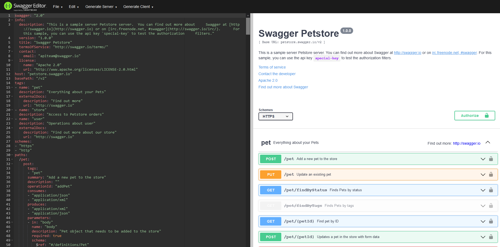
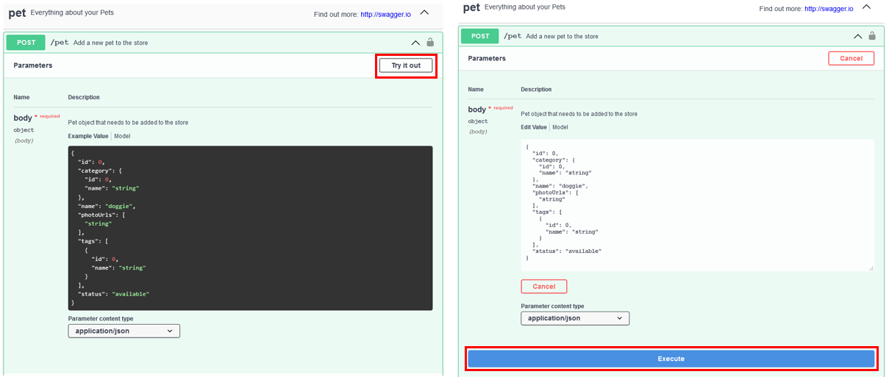

이번 포스트에서는 현재 프로젝트 팀에서 프론트엔드와 백엔드 간 협엄을 위해 사용하는 OpenAPI와 Swagger가 무엇인지 알아보겠습니다. 그리고 현재 제가 프로젝트 팀에서 사용하는 프레임워크인 node.js의 express에서 API 명세를 작성한 yaml 파일로부터 Swagger API 문서 자동화하는 방법까지 진행하겠습니다.

## OpenAPI

우리는 때때로 프로젝트에서 필요한 외부 데이터를 검색하면서 Open API라는 단어와 마주합니다. 여기서 Open API는 말 그대로 개방형 API입니다. API(Application Programming Interface)는 응용 프로그램을 개발할 때 사용하는 인터페이스이므로, Open API는 곧 프로그래밍에서 사용할 수 있는 개방 상태의 인터페이스를 말합니다. 우리가 흔히 사용하는 구글, 페이스북 등의 기업들을 포함해 통계청, 기상청 등에서도 수집한 자료를 응용 프로그램에 사용할 수 있도록 Oepn API를 제공합니다.

하지만 이는 저희가 API 문서화에 적용하는 OpenAPI와는 조금 다른 개념입니다..! (일단 띄어쓰기 없이 두 단어를 붙여 사용합니다.) 원래 각 기업별로 독자적인 규칙에 따라 API를 제공하는 명세가 있었는데, 2015년에 Microsoft, IBM 등의 기업들이 OpenAPI Initiative (OAI)리눅스 재단의 프로젝트에서 API 명세를 통합적으로 관리하기 시작했습니다. OpenAPI는 여기 OAI에서 API 기술을 발전시키기 위해 만든 기술로, OAI는 OpenAPI Specification (OAS)라는 API 명세를 배포합니다. 그렇다면 OAS는 또 뭘까요? OAS는 RESTful API와 웹 서비스에 대해 설명하고 시각화하는 명세(specification)입니다. 즉, json 또는 yaml 형식으로 OAS의 규칙에 따라 OpenAPI 문서를 작성하면 API의 스펙(spec)을 설명하고 보여줄 수 있습니다. OAI에서는 2017년에 OpenAPI 3.0.0 버전을 발표하였고, 2021년 2월에 3.1.0 버전을 릴리즈하였습니다. OpenAPI에 대한 자세한 설명과 작성 규칙은 아래 링크를 참고하세요!

<https://spec.openapis.org/oas/v3.1.0>

## Swagger

스웨거(Swagger)는 Open Api Specification(OAS)를 위한 오픈 소스 프레임워크로, API가 가지고 있는 명세(specification)를 관리할 수 있는 프로젝트입니다. API의 정의, 엔드포인트, 파라미터, 헤더 등의 정보들을 스펙으로 작성할 경우, 스웨거가 자동으로 구조를 파악해 보기 아름답고 인터랙티브한 API 문서로 만들어줍니다. 아래 이미지는 swagger.io에서 제공하는 온라인 swagger 에디터로, 왼쪽과 같이 yaml 형식으로 OAS에 따라 API 스펙을 작성하면, swagger가 자동으로 오른쪽과 같이 보기 쉽게 APi 문서를 만듭니다!



그렇다면 swagger는 왜 사용해야 할까요?

1. API 구조를 파악하기 쉽습니다
   위의 그림에서 왼쪽과 같이 코드 또는 글을 이용해서 API를 문서화 할 경우, API의 사용자에게 필요한 정보는 모두 있지만 그 구조를 파악하기 어렵습니다. 하지만 스웨거를 이용할 경우, API의 태그와 엔드포인트, HTTP method에 따라 사용해야할 APi를 쉽게 구별할 수 있습니다. 그리고 url에 입력해야할 paramter, http body 등을 보기 쉬운 UI로 한눈에 파악할 수 있고, response도 status code에 따라 구분 가능합니다.

2. 테스트할 수 있는 UI를 제공합니다
   프레임워크 내에서 별도의 테스트 코드를 작성하지 않고도. 스웨거 문서 내에서 API를 테스트할 수 있습니다. 또한 테스트 코드와 달리 테스트에 사용할 url과 http body 등을 쉽게 바꿀 수도 있고, 예제로 사용할 데이터도 직접 작성하여 넣을 수도 있습니다. 아래 그림에서 Try it out을 클릭하면 해당 API 엔드포인트에 POST로 요청할 http body를 수정할 수 있고, execute 를 클릭하면 실제로 해당 url에 요청해 API를 테스트할 수 있습니다.



위의 OpenAPi와 Swagger에 대한 설명은 아래 두 줄로 요약이 가능합니다.

- OpenAPI = Specifcation
- Swagger = Tools for implementing the specifcation

혹시 swagger 와 OpenAPi가 아직 헷갈리신다면 아래 링크를 참고하세요!

<https://swagger.io/blog/api-strategy/difference-between-swagger-and-openapi/>

## Swagger in Node.js

스웨거를 이용해 API 문서화를 하면 정말 좋아보이는데, OAS에 따라 json이나 yaml로 문서화를 하기 위한 파일을 작성하자니 막막해 보입니다. 다행히도 스웨거 자동 문서화를 위한 다양한 라이브러리들이 각 프레임워크마다 존재합니다! 하지만 제가 현재 프로젝트 팀에서 백엔드 프레임워크로 사용하고 있는 Node.js에서는 이와 같이 자동으로 API 문서화를 할 수 있는 라이브러리가 없었습니다.. 하지만 오히려 좋아! yaml 로 OAS에 따라 프로젝트에서 사용하는 모든 API 명세를 머리부터 발끝까지 작성해보기로 했습니다.

이렇게 직접 작성하기로 한 데에는 이유가 있었습니다. 먼저번에 django의 스웨거 API 자동화 라이브러리인 drf-yasg를 사용해 보았는데, 자동으로 API 문서를 생성할 때 사소한 오류와 이로 인한 커스터마이징 때문에 코드 내에서 API 명세를 직접 작성하다보니 코드가 상당히 길어지는 문제가 발생했기 때문입니다. 하지만 API 명세를 소스 코드 내에서가 아닌 yaml 파일로 별도로 작성해 관리할 수 있다면? 생각만해도 마음이 편안해지는 부분입니다.

node.js에서 스웨거로 API 문서화를 위해 미리 3개의 라이브러리를 설치해야 합니다.

- yamljs : yaml로 작성한 API 명세를 node.js에서 읽어오기 위해 사용

- swagger-ui-express : express 프레임워크에서 API 명세를 UI로 보여주기 위해 사용

- swagger-cli : 서로 다른 yaml 파일에 작성한 API 명세를 하나의 yaml 파일로 통합하기 위해 사용

swagger-ui-express를 사용해 yaml 파일로부터 APi 문서화할 때, 하나의 yaml 파일로 API 명세를 작성해야합니다. 하지만 명세가 길어질수록 작성하는 입장에서 수정하기 불편해지므로, API 엔드포인트 별로 yaml 파일을 나눠 작성하고 swagger-cli로 이를 한꺼번에 합치는 작업을 수행합니다.

### bash

```bash
npm install yamljs swagger-ui-express swagger-cli

```

app.js 에서는 아래와 같이 코드를 작성해 /swagger/build.yaml로 통합된 API 명세를 읽고, 스웨거 APi 문서를 http://localhost:3000/api/docs/로 라우팅합니다.

### app.js

```javascript
import express from "express";
import swaggerUi from "swagger-ui-express";
import yaml from "yamljs";

const app = express();
app.set("port", process.env.PORT || 3000);

app.use(express.json());
app.use(express.urlencoded({ extended: false }));

const swaggerSpecs = yaml.load(path.join(__dirname, "/swagger/build.yaml"));
app.use("/api/docs/", swaggerUi.serve, swaggerUi.setup(swaggerSpecs));

app.listen(app.get("port"), () => {
  console.log(app.get("port"), "is waiting.");
});
```

위의 app.js 에서 swagger 디렉토리 내의 build.yaml을 읽었는데, 이번에는 swagger 디렉토리 내의 계층구조와 yaml 파일이름을 나타내면 아래와 같습니다.

```bash
+-- app.js
...
+-- swagger
    +-- paths
        +-- index.js
        +-- district
            +-- district-list.yaml
            +-- district-retrieve-by-code.yaml
            +-- district-retrieve-by-name.yaml
            ...
        ...
    +-- openapi.yaml
    +-- build.yaml
```

swagger 디렉토리 내의 openapi.yaml에서는 API 기본 설정을 작성하고, swagger/paths 디렉토리 내의 index.yaml에서는 각 엔드포인트 별로 나눠 직성한 yaml 파일의 위치를 라우팅을 해줍니다. 그리고 swagger/paths/district 등의 디렉토리 내에는 실제 API 엔드포인트 별로 API 명세를 작성합니다.

## swagger/openapi.yaml

```yaml
openapi: "3.0.0"
info:
  version: 1.0.0
  title: Swagger API Document
  description: Swagger API Document with OAS 3.0.0
  license:
    name: Apache 2.0
    url: https://www.apache.org/licenses/LICENSE-2.0.html
servers:
  - description: localhost
    url: http://localhost:3000/api/
paths:
  $ref: "./paths/index.yaml"
```

## swagger/paths/index.yaml

```yaml
/districts:
  $ref: "district/district-list.yaml"
/districts/{district_code}:
  $ref: "district/district-retrieve-by-code.yaml"
/districts/{district_name}:
  $ref: "district/district-retrieve-by-name.yaml"
```

## swagger/paths/district/district-list.yaml

```yaml
get:
  tags:
    - district
  summary: get all districts
  description:
  responses:
    200:
      description: OK
      content:
        application/json:
          schema:
            type: array
            items:
              type: object
              properties:
                district_code:
                  type: string
                district_name:
                  type: string
                parent_code:
                  type: string
```

그리고 위와 같이 분리한 yaml 파일들을 하나의 build.yaml 파일로 통합하기 위해 swagger-cli 모듈을 이용합니다.

```bash
swagger-cli bundle swagger/_openapi.yaml --outfile swagger/build.yaml --type yaml
```

해당 명령어를 실행한 후, express 서버를 실행하고 http://localhost:3000/api/docs/ 에 접속하면 직접 작성한 스웨거 API 문서를 볼 수 있습니다!

## 정리하며

현재 프로젝트를 진행하면서 프론트엔드와 협업하는 도구로 swagger를 적극적으로 사용중이며, 모든 API 명세는 직접 작성하며 관리하고 있습니다. 직접 일일이 API 명세를 작성하면서, OpenAPI에 대한 이해도 함께 늘어남을 느낄 수 있습니다. API 명세 자동화 라이브러리가 잡아주지 못하는 사소한 오류로부터 자유롭고, 코드와 별도로 커스터마이징이 된다는 것도 모듈화에 있어서 장점이라고 생각합니다.

하지만 관리할 API의 개수가 늘어나고, 협업하는 과정에서 변수명이 바뀐다든지 이슈가 생길 때마다 일일이 API 명세를 고치는 과정이 힘들 때도 있습니다. (괜히 자동화 라이브러리를 오픈소스로 만든게 아니겠죠..) API 문서 자동화 라이브러리도 사용해보고, 직접 API 명세도 작성해보는 등 여러 방면으로 스웨거를 프로젝트에서 사용해 봅시다1
