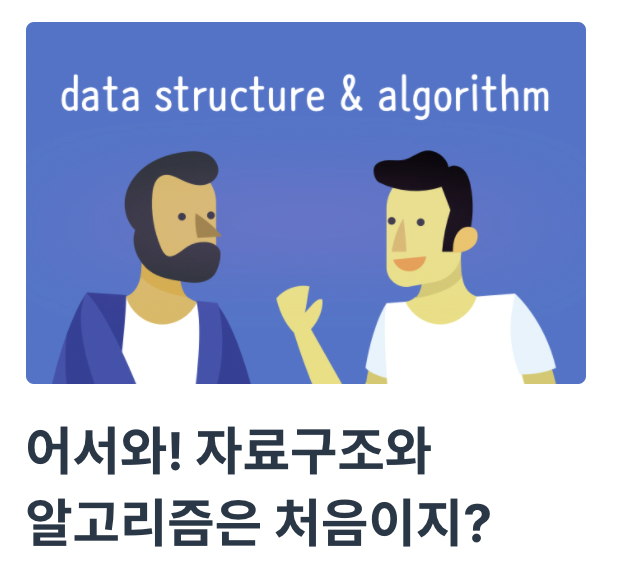
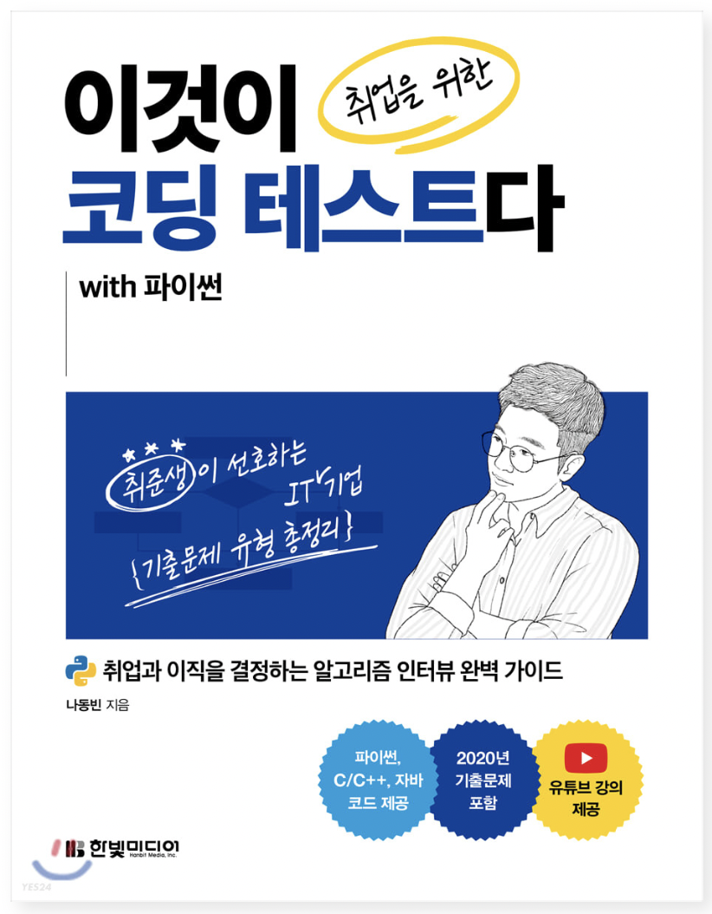
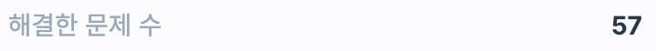
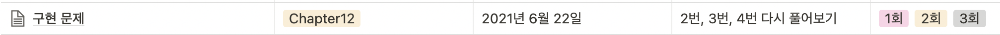

## 웹 부스트캠프 6기 합격

2021년 **웹 부스트캠프 6기에 합격**했고 현재 챌린지 과정 3주차가 끝났다.  

이 포스트는 알고리즘이 무엇인지 몰랐고 웹의 'ㅇ'도 몰랐던 내가 어떻게 합격할 수 있었는지에 대해 이야기하는 포스트이다. 

나처럼 **비전공자이면서 알고리즘 공부가 막막하신 분 또는 웹 부스트캠프 7기를 앞두고 계신 분**들께 도움이 되었으면 좋겠다.

## 웹 부스트캠프 신청

- 진로

    계속해서 공부하고 있던 데이터 분석과 딥러닝에서 방향을 찾지 못하고 있을 때였다. 

    실력을 키울 기회를 찾기 위해 고군분투 하는 중이였는데 아쉽게도 그 기회가 주어져도 기대했던 대로 흘러가지 않거나 주어지지 않았다. 

    그래서 고민 끝에 개발자의 길을 걷기로 했다.  

- 웹 개발자의 길로

    개발자 중에서도 웹을 선택하게 되었는데 거창한 이유는 없고 DSC UOS에서 많은 사람들이 웹 공부를 하고 있고, Team Blog에서 활동하면서 정말 잠깐 공부해 본 것도 있구. 평소 스마트폰 앱을 많이 쓰는 편도 아니어서... 

    내가 만든 딥러닝을 적용한 서비스를 많은 사람들에게 선보일 수 있는 게 웹인 것 같았다. 

    그래서 유명한 부스트캠프, 42Seoul, 소마, Saffy, 국비지원교육 등 찾아봤는데 부스트캠프가 시기 적절하게 모집하고 있어서 지원했다.

## 알고리즘 공부하기

### 알고리즘..? 그게 뭔가요..?
통계학과를 전공하고 데이터를 분석하면서 알고리즘은 사실 접할 일이 없다. 

또, 지금까지 백준이나 프로그래머스에서 알고리즘 문제를 풀어본 적도 없고 제대로 된 코딩테스트를 본 적도 없어서 준비가 되어 있지 않은 상태였다. 어느 정도 수준이었나면 스택과 큐를 몰랐다.(지금은 안다..ㅎㅎ)  

그렇지만 개발자의 길을 생각하고 웹 부스트캠프 1, 2차 코딩테스트를 합격하기 위해서 알고리즘과 코딩 테스트를 공부해야 했다! 그래서 본격적으로 공부를 시작하게 되었다.

### 알고리즘 공부 시작하기

알고리즘을 공부한 시간을 따지면 6/3~7/3 약 한 달이지만 실질적으로는 3주가 된다. 기말고사가 중간에 있었다.  

3주 정도 꾸준히 알고리즘을 공부한 시간을 합치면 일주일이고, 다른 2주는 코딩테스트 겸 알고리즘을 공부했다. 

우선 기본적인 알고리즘 및 자료구조를 알아야 한다 생각했고 부스트캠프 코딩테스트 통과를 목적으로하는 만큼 문제풀이를 많이 해야 한다 생각했다. 

공부 순서는 아래와 같다.

1. 프로그래머스 "어서와 자료구조와 알고리즘은 처음이지?"(유료)

    가격 : 40,000원  
    공부 기간 : 일주일  
    난이도 : 하  
    언어 : 파이썬  

2. 나동빈님의 "이것이 취업을 위한 코딩테스트다 with 파이썬" 책 정독(유료)

    가격 : 34,000원  
    공부 기간 : 일주일  
    난이도 : 보통~상  
    언어 : 파이썬  

3. 프로그래머스 코딩테스트 LV1, LV2 문제 모두 풀기

    공부 기간 : 약 2주  
    난이도 : 문제마다 상이  

4. 프로그래머스 고득점 kit 풀기

    공부 기간 : 이틀  
    난이도 : 보통~상  

### "어서와 자료구조와 알고리즘은 처음이지?"

많은 자료구조와 알고리즘 강의가 있지만 이 강의를 선택한 이유는 현재 나는 시간이 부족하고 핵심을 알아야 했기 때문이다. 일주일 안에 모두 볼 수 있었고 개인적으로 정말 추천한다.  

개념을 장황하게 설명해 주시지 않고 잘 짚어주시면서 스스로 구조를 짤 수 있도록 유도해서 훑는 수준이 아닌 체감하면서 익힐 수 있다. 

그리고 무엇보다 질문을 하면 대답을 정말 잘 해주신다. 강의가 열린 지 꽤 되었는데도 답을 달아주셔서 너무 깜짝 놀랐고 감사했다. 

그렇지만 나는 코드를 한 번도 써 본적이 없다거나 클래스를 써 본 적이 없다면 좀 어려울 수 있다. 클래스가 익숙하지 않았어서 힙, 그래프 자료구조는 좀 어려웠었다..ㅎㅎ

->자료구조의 핵심을 알고 싶고, 제대로 알고 싶고, 클래스 정도는 안다 하시는 분들께 강추한다!!

### 나동빈 님의 "이것이 취업을 위한 코딩테스트다 with 파이썬" 책

알고리즘 공부 또는 코딩테스트를 대비하면서 내가 가장 많이 추천받은 책은 나동빈 님의 "이것이 코딩테스트다"와 "파이썬 알고리즘 인터뷰"이다. 두 책 모두 훌륭한 책이고 두 권을 모두 정독하는 게 목표이기도 하다. 

하지만 당장은 코딩테스트를 목적으로 두었기 때문에 나동빈 님의 책을 선택했고 이후 장기적으로 "파이썬 알고리즘 인터뷰" 책을 읽는 게 더 나아 보였다. 실제로 다른 경험자에게 이렇게 추천을 받았다. 

책은 정말 최고다. 특히 "어서와 자료구조와 알고리즘은 처음이지?"를 통해 기본적인 개념을 알고 읽으니까 강의에서 배웠던 내용이 이렇게 쓰여지는 구나 하면서 더 잘 읽혔다. 코딩테스트 예제들도 너무 잘 되어 있고 설명도 친절하고 팁도 많다. 

아무래도 예제 하나하나 답을 보지 않고 풀려고 하다 보니 시간이 걸렸지만 1권을 모두 완독하는 데 한 주에서 두 주 정도면 충분하다.  

부스트캠프 코딩테스트 전에 그리디, 구현, DFS/BFS, 정렬, 이진탐색, 다이나믹 프로그래밍까지 볼 수 있었다. 어려운 문제들은 두 번, 세 번 풀면서 이해하려 노력했다.

### 프로그래머스 코딩테스트 문제

- 프로그래머스 기출문제

    이제 시간이 얼마 없다. 당장 코딩테스트가 코앞이므로 기출문제를 푸는 것이 중요하다 여겼다. 그래서 프로그래머스에서 2018년 이후 모든 문제모음에서 LV1 모든 문제와 LV2 정답률 30% 이상의 문제들을 풀었다. 

    

    30분~1시간 정도 붙잡다가 못 풀겠는 건 답을 보고 이후 2번, 3번 풀어보았다. 

    그리고 코딩테스트 전날은 꼭 풀어본 문제들 모두 다시 보고 어려운 문제는 다시 풀고 요약 정리했었다. 

    

    

- 프로그래머스 고득점 kit  

    프로그래머스 고득점 kit는 앞선 목표를 달성하고 무슨 문제를 풀지..?하다가 풀게 되었다. 결국 다 풀지 못하고 부스트캠프 코딩테스트를 보게 되었지만. 정말정말 추천드린다. 
    
    각 자료구조와 알고리즘 문제유형에 해당하는 문제들이 있는데 풀다 보니 각 문제 유형에 맞는 푸는 법과 문제를 익힐 수 있어서 정말 좋았다.  

    정말 신기한 건 이전에는 이 문제들이 무슨 유형인지, 어떻게 푸는지 하나도 몰랐었는데 자료구조 강의를 듣고 나동빈 님의 책을 읽고 난 이후에는 무슨 개념이 들어있고, 어떻게 푸는지 알게 되었다는 것이다. 

## 부스트캠프 1차

사실 기억이 잘 안 난다. 그렇지만 부스트캠프 신청 홈페이지에서 "만약 프로그래밍 언어에 자신이 없거나 배열, 함수에 대한 이해가 부족하다면 아래 강의를 들어보세요."라며 추천해 주신 "모두를 위한 컴퓨터 과학(CS50) 부스트코스"는 나 같이 비전공자이며 컴퓨터 지식이 없는 분들께 꼭 추천 드린다. 도움이 된다.  

그리고 1차 코딩테스트에서 코딩문제 2문제 중 1문제만 풀 수 있었다. 

그리고 느꼈던 건 실전과 공부는 확실히 체감이 다르다는 것이다. 내용 면에서 그런 게 아니라 시간의 촉박함과 긴장감 이런 것 때문에 뇌가 안 돌아간다는 걸 실시간으로 느끼게 되었다. 그래서 더 많은 공부를 통해 여유를 가지는 게 정말 중요하다는 것을 깨달았다.  

## 부스트캠프 2차

출제된 3문제 모두 풀 수 있었다. 

예외처리가 많았지만 이 때 크롤링을 해야 할 일이 있어서 예외처리에는 자신이 있었다. 최대한 함수 이름을 잘 짓고 하나의 뭉텅이 코드가 아닌 여러 함수들로 쪼개면서 가독성 있게 쓰려 노력했다.  

그리고 가슴 졸이며 합격이라는 결과를 받았다. 이 캠프를 위해 약 한 달 전부터 준비해 왔고 연구실 인턴 자리도 2개나 거절했었기 때문에... 정말 좋았다. 

## 마무리

- 자료구조와 알고리즘은 도움이 되었는가?

그러면 자료구조와 알고리즘을 공부하고 코딩테스트 기출문제를 푼 것이 도움이 되었는가? 

엄청 도움 되었다. 내용 면에서는 언급하기 조심스러워지지만 공부하면서 얻은 코드를 짜는 법이나 기술 등 너무 도움 되었다. 

특히 공부하면서 정리하고 요약한 [Notion_공부 과정 및 요약본](https://www.notion.so/9a6302a864204370a6e3f9478c0b9ceb)이 아주 도움이 되었다. 다음 링크를 들어가면 어떻게 공부해 왔는지 등을 더 자세히 볼 수 있다.  

- 웹 부스트캠프 챌린지 시작하기 전 할 일

아, 그리고 부스트캠프 챌린지 과정 중에 자료구조와 알고리즘 공부한 내용이 엄청엄청 도움되니 꼭 자료구조와 구현을 알고 연습해 보시고 오시면 좋을 것 같다. 

자바스크립트 꼭 공부하고 오시면 너무 좋다! [모던 자바스크립트 튜토리얼](https://ko.javascript.info/) 파트1 정독하고 오세요..ㅎㅎ 저는 지금 정독하고 있습니다...;;(당근당근..)

## 지원

공부를 하기 위해 유료 강의와 유료 책을 사야 했다. 공부하기 위해 아르바이트 할 시간도 부족해서 아르바이트도 그만두었기 때문에 부담이 되는 건 사실이다. 

이런 내게 서울시립대학교 융합전공학부에서 진행하는 "통섭전공역량강화 프로그램"은 큰 도움이 되었다. 장학금 제도로 학생이 공부를 목적으로 사용한 금액에 대해 약 50만원까지 지원해 준다. 블로그 게시글을 통해 감사의 말씀을 드린다.  

