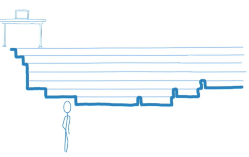
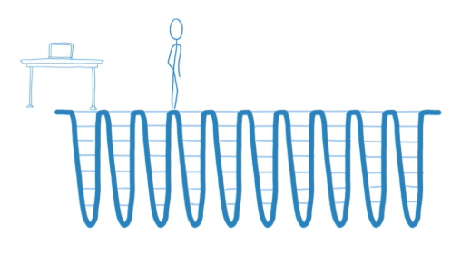
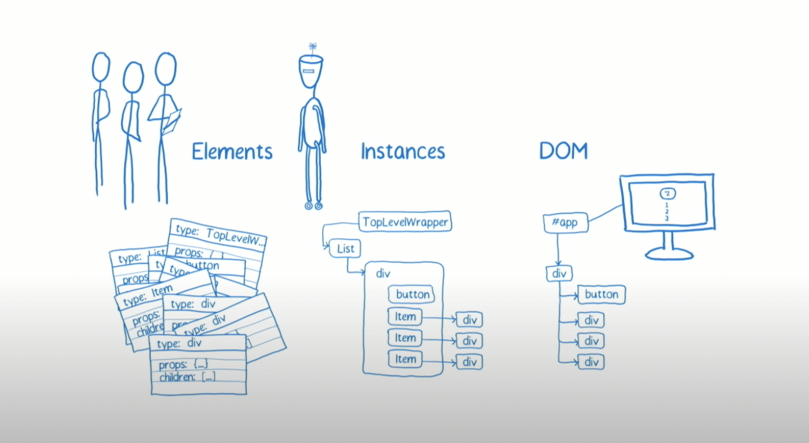
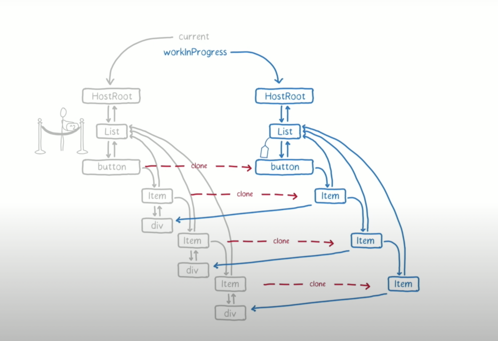

## React Fiber Architecture

[https://www.youtube.com/watch?v=ZCuYPiUIONs](https://www.youtube.com/watch?v=ZCuYPiUIONs)

위의 동영상은 React `Fiber Architecture`가 처음 나왔을 때 소개해주는 영상입니다.

## What is Fiber Architecture ?

영상 초반에서 프랙탈 구조의 삼각형이 좁아지고, 넓어지면서 각각의 숫자가 바뀌는 모습을 볼 수 있습니다.

삼각형이 좁아지고 넓어지는 과정은 최상단의 노드를 기점으로 바꾸면 됩니다.

하지만, 기존 알고리즘으로는 각각의 숫자가 바뀌는 과정이 페이지 내에서 부드럽게 보여지기 위해 필요한 16ms에 부적절합니다.

그렇기에 우리는 Virtual DOM을 최소화 하고, 일괄처리 하는 과정을 효율적으로 다루는 것이 필요합니다.

우리가 다룰 `Fiber Architecture`는 기본적으로 각각 프로젝트에서 위 과정을 관리하는 법에 대해 알려줍니다.

어떻게 작업을 분리하는지, 어떻게 우선순위가 있는 일을 다루는지, 보여지는 것에 대해 기술적으로 이끄는 방법을 알아봅시다.

## What is difference with exist Reconciler?

기존의 reconciliation는 elements를 만들고, instance를 생성하고 나서 DOM에 붙이거나 업데이트 합니다.

재귀적으로 mount를 호출하면서 tree의 leaf node까지 가면서 업데이트를 합니다.

이 과정을 타임라인을 시각적으로 보면 아래와 같습니다.



점점 깊어지는 재귀 호출의 과정을 볼 수 있습니다.

그렇다면 여기서의 문제는 어떤 것이 있을까요? 쉽게 생각해낼 수 있습니다.

위가 나타내는 과정은 메인 쓰레드가 맨 아래에 있다는 것을 의미하기 때문입니다.

그래서 우리는 쓰레드가 전체적인 작업을 다루는데에 어려움이 있을 것으로 생각할 수 있습니다.

이것을 제외하고 다른 작업이 어떻게 작동하는지 봐야 하지만,

다른 부분을 살펴보아도 기존의 reconciler에선 재귀적인 호출을 피할 수 없습니다.

이렇게 작업을 하기에 우리는 stack reconciler라고 부릅니다.

반면에 fiber를 이용하면 아래와 같아지게 됩니다.



트리의 작은 부분만 계산하고, 다시 위로 올라와서 다른 작업을 살핍니다.

이러한 모습을 그래프로 나타내면, 섬유 조직의 모습과 비슷하여 fiber라는 이름을 가져와서 사용하게 되었습니다.

그렇다면 fiber에 대해서 더 상세하게 알아봅시다.

### Fiber Tree

fiber는 단순한 instance를 어떻게 관리되는지에 대한 자바스크립트 오브젝트입니다.

fiber는 적어도 2개의 current fiber과 work-in-progress fiber로 구성이 되며, 각각을 하나의 작업 단위로 볼 수 있습니다.



fiber 트리에서 다루는 것은 elements와 DOM이 아니기 때문에 생략하고, instances를 살펴봅시다.

예시로 3개의 버튼이 작성이 되어있다고 생각해봅시다.

그렇다면 위와 같은 구조로 그릴 수 있을 것입니다.

그 중에서 font-size를 바꾸어서 button에 들어있는 두 번째 item과 세 번째 item이 바뀌는 과정을 생각해봅시다.

만약에 우리가 stack reconciler를 쓴다면 최 하단의 item까지 직접 갔다가 적절하게 바꾸고 돌아올 것입니다.

하지만 fiber는 다릅니다. current fiber work-in-progress fiber로 나눈 다음에

우리가 원하는 업데이트 과정을 효율적으로 진행합니다.


앞서 말한 2개의 fiber 트리입니다.

위에서 말한 과정을 실제로 업데이트를 해봅시다.

무언가 변경되었을 때 우리는 전체 노드가 즉시 업데이트 되는것을 원치 않습니다.

그래서 current fiber를 놔두고, work-in-progress fiber만 바꿉니다.

자세한 내용을 확인해봅시다.

fiber에서는 다음에 다룰 작업과, 현재 시간이 얼마나 남아있는지를 저장하고 있습니다.

위에서 보면 hostRoot가 다음에 다룰 작업이 되고, 시간은 12.3ms가 남았다고 가정을 해보겠습니다.

1. hostRoot(child를 가리키는 pointer를 포함)를 current에서 복사해서 가져옵니다.

2. list를 확인했을 때 바뀌는 부분이 없기에 복사해서 가져옵니다. ( 남은 시간이 11.6ms로 가정 )

3. list의 children인 button부터는 update 되어야 하고, 남은 시간을 확인했을 때 여유롭기 때문에 button 작업을 시작합니다.

   1. 이때, work-in-progress에서 다음에 다룰 작업은 button이 됩니다.

   2. item을 먼저 복사해서 가져옵니다.

   3. div는 item의 pointer로만 가리킵니다.

   4. list의 children인 button부터 작업이 되야 하니까 list에 mark만 해놓습니다.
      

4. fiber에서는 바로 다루지 않고, callback 함수를 작업하는 queue에 넣어둡니다. ( 남은시간 10.6ms )

5. 지금 상황에서는 button은 따로 children을 가지고 있지 않기 때문에 작업을 완료할 수 있다고 판단합니다. ( item은 sibling )

6. 두 번째 item에는 mark를 하고, div를 다음에 다룰 작업에 둡니다.

7. div는 children과 sibling을 둘 다 가지고 있지 않으므로, 완료할 수 있다고 판단합니다.

8. div로 다시 돌아가서 update 작업을 합니다. ( 남은 시간 1.6ms )

9. div가 끝났으므로 두 번째 item의 sibling인 세 번째 item으로 갑니다.

10. 이 때 남은 시간이 0ms라면 어떻게 될까요?

11. 작업을 완료하기 위해 callback을 남기고, javascript가 font-size를 키우게 하고 사용자에게 보이게 만듭니다.

12. font-size는 react에서 담당하는게 아니라 javascript가 다루는 것이라서 가능합니다.

13. javascript 작업이 끝났으면, 다시 시간을 가진 상태로 세 번째 item을 다루기 시작합니다.

14. 위와 같은 작업이 반복되서 fiber tree를 만듭니다.

fiber tree를 통해서 memory allocation과 garbage collection에서 시간을 아낄 수 있습니다.

그리고 위의 과정은 render phase에서 일어납니다.

commit phase 에서는 실제로 반영합니다.

그리고, effect list(update가 되는 부분)을 그려보면 아래와 같습니다.

아래 적혀있는 node들은 다 update를 실행한다는 mark가 되어있습니다.

```html
div(2)-item(2)-div(3)-item(3)-list
```

update를 부분적으로 실행함으로써, 변화되는 부분을 효율적으로 다룰 수 있습니다.

하지만, 단순 이러한 작업은 우선순위가 낮으면서 오래걸리는 update를 본질적으로 해결해주지 않습니다.

그래서 fiber는 우선순위를 갖으면서 작동이 됩니다.

예를 들어, data를 가져오는 것은 animation을 작동하는 것보다 우선순위가 낮아야 합니다.

우선순위를 정리하면 아래와 같습니다.

### Fiber Prioritizes work on 6 Levels

1. **Synchronous** : same as stack reconciler
2. **Task** : handle before next tick
3. **Animation** : handle before next frame
4. **High** : Pretty Soon
5. **Low** : minor delay ok
6. **Offscreen** : prep for display / scroll

우리는 이런 과정이 있기 때문에 애니메이션이 끊기지 않고 부드럽게 볼 수 있습니다.
