## About PLS

**※ 내용을 전하기에 앞서 해당 내용은 김성범 인공지능 연구소장님의 유튜브 채널에 있는 PLS 강의를 듣고 직접 작성한 것이고 사진은 강의 영상을 캡쳐하여 사용한 것임을 미리 밝힙니다.**

## 배경

 올 여름방학때 수료했던 데이터 청년 캠퍼스 교육과정에서는 교육 후 분석 프로젝트를 진행하여 우수작을 선정하고 장관상부터 여러 협회장상을 수상하는 기회를 제공했습니다. ~~장관상이 목표였던~~ 저는 프로젝트 전에 여러 ML 알고리즘과 분석 방법론을 고민했었는데 PLS는 그 중 하나였습니다. 따라서 이번 기회에 제가 공부했던 PLS에 대해 소개해드리고자 합니다(~~제가 사용했던 데이터와는 궁합이 좋지 않아 사용은 못했습니다..~~).

## PLS란?

차원 축소에는 Feature Selection, Feature Extraction 두 가지 방법이 존재합니다.
차원 축소를 할 때 고려해야하는 경우의 수는 다음과 같습니다.

- 지도학습 - Feature Selection
- 지도학습 - Feature Extraction → **PLS(Partial Least Squares)**
- 비지도학습 - Feature Selection
- 비지도학습 - Feature Extraction → **PCA(Principal Component Analysis)**

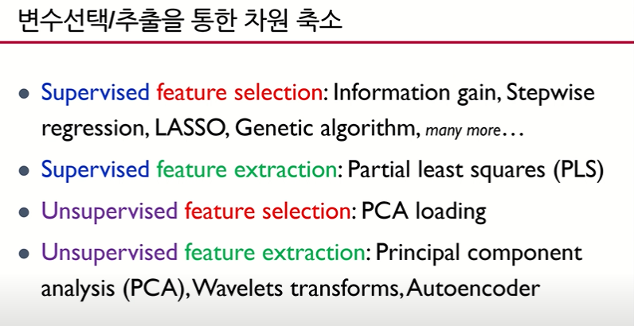

**PLS 같은 경우는 지도학습 - Feature Extraction입니다.**

**PLS(Partial Least Squares)**는 PCA와 다르게 Y와의 공분산이 높은 k 개의 선형 조합 변수를 추출하는 방식입니다.

**PLS 용어**는 선형 조합으로 추출된 변수(기존 PCA의 Eigen Vector를 의미)가 설명하지 못하는 부분에 지속적으로 LS Method(Least Square Method)를 사용하는 것에서 유래합니다.

**PLS의 주요 목적**은 PCA와 같이 데이터 차원의 축소입니다. $(n$ by $p → n$ by $k,$ where $k << p )$

그러나 Extract된 변수가 PCA에서는 반영하지 못했던 **Y와의 상관관계를 반영** 하는 특징이 있으며 적은 수의 Extract된 변수로 효율적인 모델 구축이 가능합니다.

**아래 슬라이드에서는 단변량 다중 회귀를 기준으로 설명하고 있습니다. 추후 다변량 다중 회귀에 대해 설명하고자 합니다.**

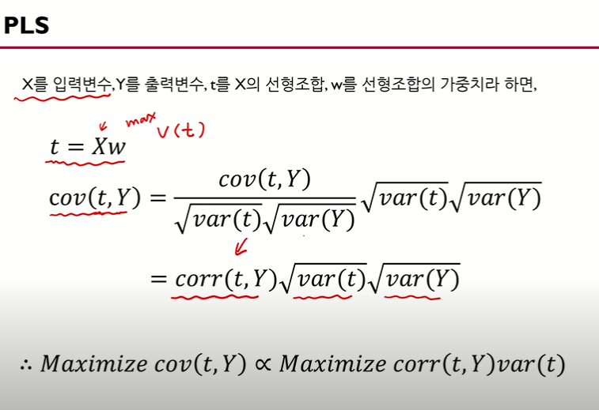

여기서 t를 Maximizing 시키면 PCA(t는 PCA component)가 되는 것이고, t와 y간의 공분산을 Maximizing 시키면 PLS(t는 PLS component)가 되는 것입니다.

즉, t와 Y의 상관 계수를 최대화하고, t의 분산을 최대화 하는 것입니다(이 부분은 PCA와 같지만 t와 Y의 상관 계수를 최대화한다는 점에서 차이가 있습니다.)

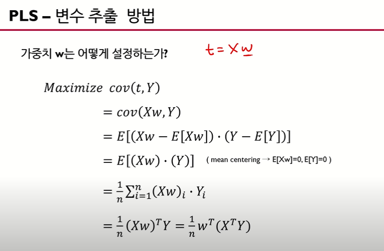

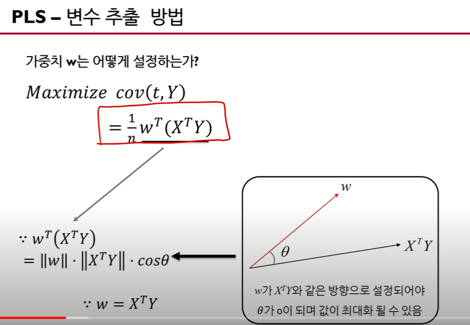

w를 구하면 t를 구할 수 있으므로, w를 구하는 것이 시작점.  위 슬라이드에서는 mean centering(표준화한)한 데이터를 가정으로 두고 있습니다.

**w와 ($ X^{T}Y$)의 내적으로 생각한다면 w와 $ X^{T}Y $ 벡터 간의 방향이 같아야 합니다(theta가 0). 따라서 w = $ X^{T}Y$(방향이 같은)가 됩니다.**

PLS에서 주성분 t를 Extract할 때 사용하는 알고리즘은 **NIPALS 알고리즘입니다.**

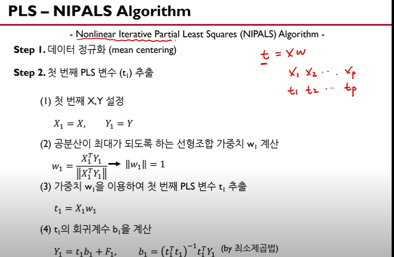
노름(norm)으로 바꿔준 것은 scaling을 하기 위합니다.

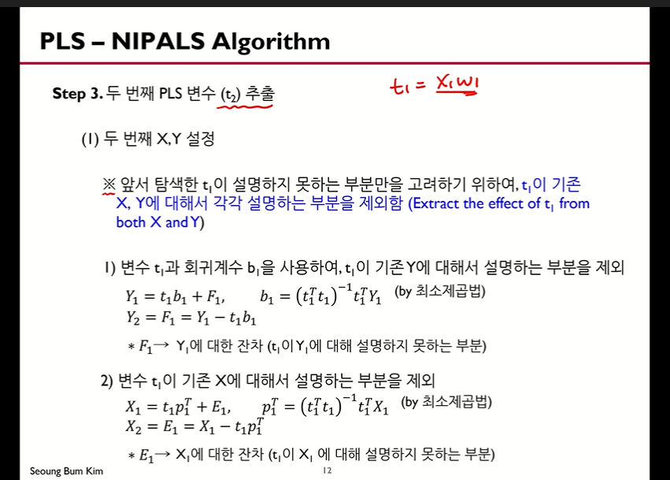
$t_1$이 $Y_1$를 어느정도로 설명 가능한지 파악하기 위해 OLS 회귀 분석을 사용합니다. 그리고 $Y_1$와 $\hat Y_{1}$의 차이(잔차)를 $Y_2$로 놓습니다.

$t_1$과 $X_1$ 또한 위와 같은 절차를 밟습니다.

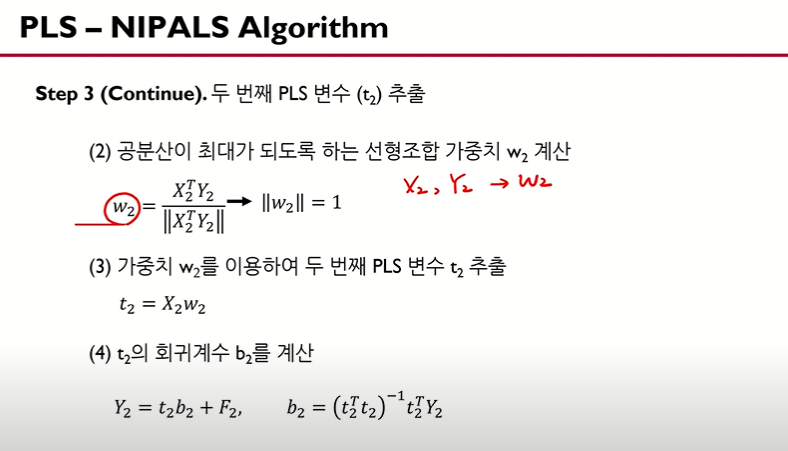
마찬가지로 이러한 방법으로 $t_2$를 구합니다.

아래 슬라이드는 일반화 공식입니다.

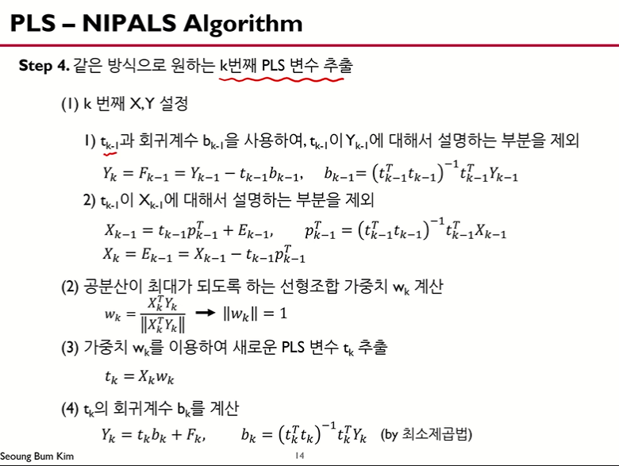
위와 같이 잔차에 대한 모델을 계속 적용하는 알고리즘은 왠지 Gradient Boosting과 비슷한 것 같습니다.

따라서 PLS에서 PL은 Partial(부분 = 잔차)를 계속 Least(최소가 되는)의 의미를 지닌 것입니다.

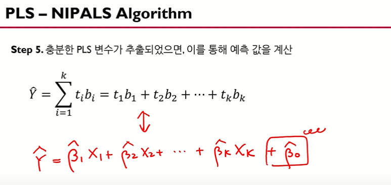
위 슬라이드에서 $\hat Y$은 t나 X로 표현할 수 있습니다. 언뜻 보기엔 두 식이 비슷해 보이지만, $t_1$은 X들의 선형 결합으로 추출된 변수이기 때문에 $t_1$만으로도 굉장히 많은 정보를 담고 있습니다. $b_1$은 최소제곱법으로 구하고, $b_2$은 $t_1$으로 설명하지 못하는 부분을 사용하여 최소제곱법을 적용합니다.

  물론 위 슬라이드에서 변수의 개수는 X와 같지만, t 식에서는 몇 개의 t만으로도 충분히 $\hat y$을 설명할 수 있게 됩니다.

아래 예제로 이해해봅시다.

## 예제

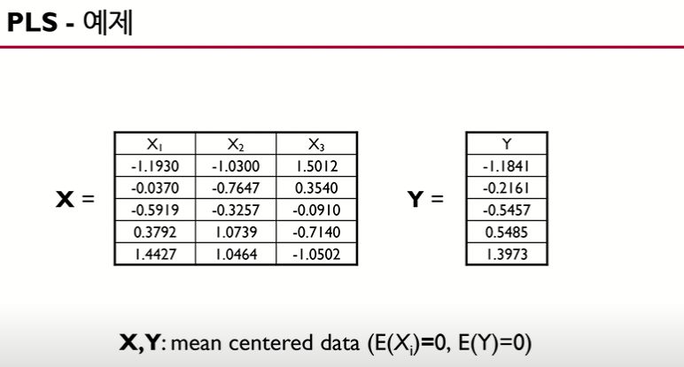
위 예제는 독립 변수의 개수가 3개, 종속 변수의 개수가 1개, 데이터의 개수가 5입니다.

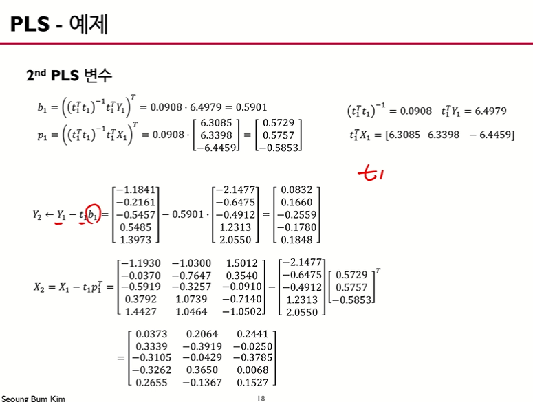

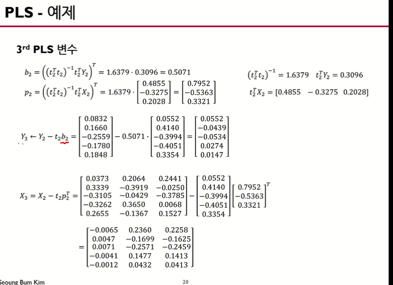

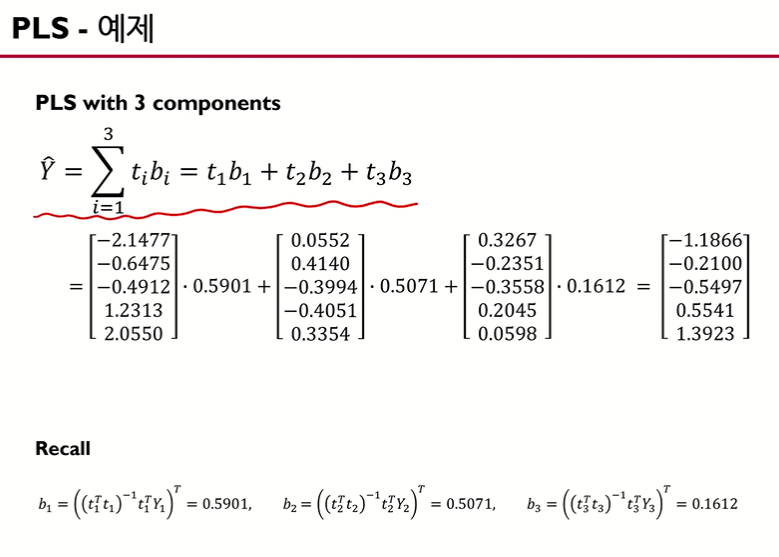

---

위 슬라이드에서 PLS 주성분 t를 추출하는 방법은 알게 되었습니다. 그렇다면 주성분 t를 몇개까지 사용해야 y를 적절히 추정할 수 있을까요?

방법은 trial and error 식으로 진행합니다. 주성분의 개수가 많아질 수록 train error은 감소하지만, overfitting에 의해 test error은 convex한 형태를 지니고 있음을 확인할 수 있습니다. 이때, **test error가 최소가 되는 극소점을 주성분 개수로 정하는 게 좋습니다.**

---

다음은 단변량이 아닌 다변량 다중 모델 그리고 종속 변수가 범주형인 모델을 고려해봅시다.

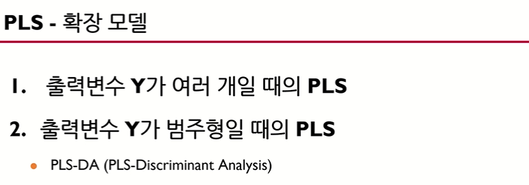

일반적으로는 종속 변수가 k개 있다고 할 때, 종속변수 당 하나씩 총 k개의 단변량 모델로 각각 구합니다. 그러나 PLS는 다변량 데이터를 **하나의 PLS 모델로 만들 수 있습니다.**

1. 종속 변수가 여러개일 때

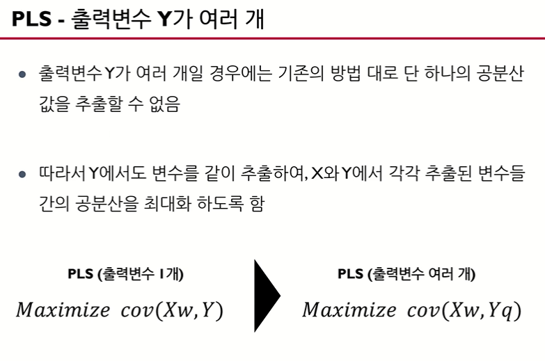

**앞에서의 단변량 데이터와 다르게, 다변량 데이터에서는 Y도 X처럼 선형결합을 해야한다는 의미입니다.**

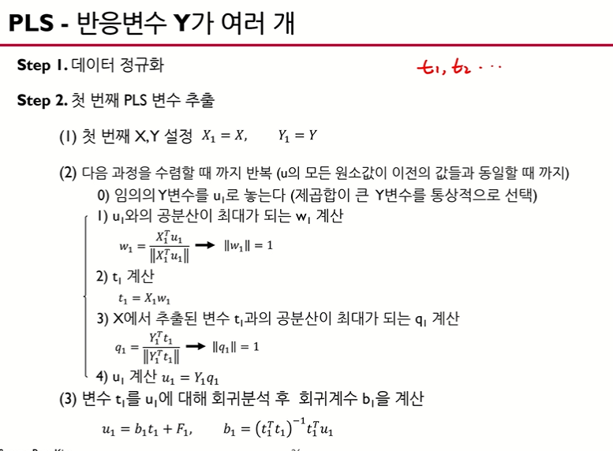

  패턴은 앞 설명과 동일합니다. 위 슬라이드에서 '임의의 Y 변수'라는 의미는 다변량 Y가 q개 있다고 했을 때 q개의 Y중 하나의 임의 변수 y입니다.  어떤 레퍼런스에서는 오른쪽의 부가설명처럼 '제곱합이 큰 Y변수를 통상적으로 선택'하기도 하고 첫 y 변수를 사용 혹은 랜덤하게 하나를 select하는게 좋다고 설명하기도 합니다.

  **위 슬라이드에서 2-1, 2-2번 순서까지는 단변량 PLS 모델과 동일하지만 2-3, 2-4부분이 추가됨을 확인할 수 있습니다.**

  위 과정을 통해 $u_1$, $w_1$, $t_1$, $q_1$을 구하게 됩니다.

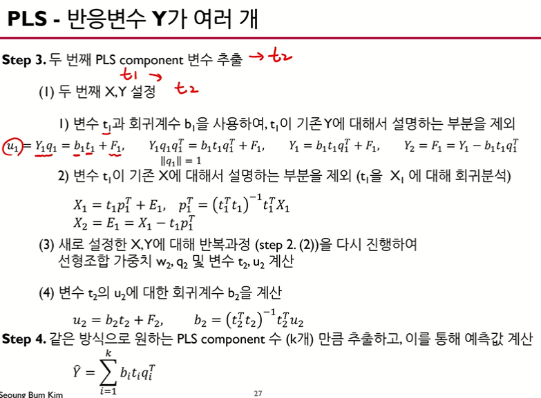

---

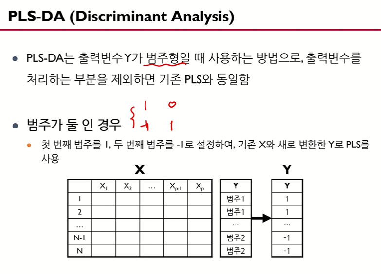

## 참고 영상

[인공지능연구소채널](https://www.youtube.com/watch?v=OCprdWfgBkc)