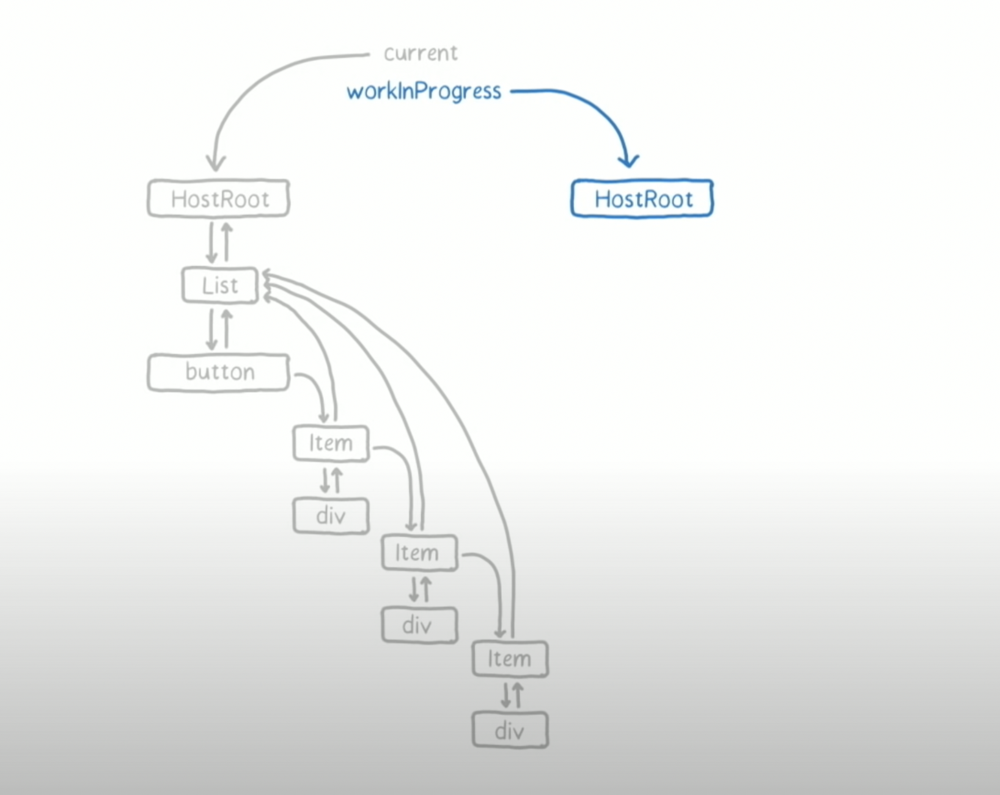

## React Fiber Architecture

[https://www.youtube.com/watch?v=ZCuYPiUIONs](https://www.youtube.com/watch?v=ZCuYPiUIONs)

위의 동영상은 React `Fiber Architecture`가 처음 나왔을 때 소개해 주는 영상입니다.

## What is Fiber Architecture ?

영상 초반에서 프랙탈 구조의 삼각형이 좁아지고, 넓어지면서 각각의 숫자가 바뀌는 모습을 볼 수 있습니다.

삼각형이 좁아지고 넓어지는 과정은 최상단의 노드를 기점으로 바꾸면 됩니다.

렌더링 과정에서 페이지 내부 애니메이션이 부드럽게 보이려면 16ms 내에 작업이 처리되어야 합니다 ❗️❗️

하지만, 기존 알고리즘으로는 각각의 숫자가 바뀌는 과정이 16ms에 맞추기가 어렵습니다 😭

그렇기에 Virtual DOM을 최소화하고, 업데이트 일괄처리 과정을 효율적으로 다루는 것이 필요합니다.

`Fiber Architecture`는 기본적으로 각각 프로젝트에서 해당 과정을 관리하는 법에 대해 알려줍니다.

어떻게 작업을 분리하는지, 어떻게 우선순위가 있는 일을 다루는지에 대한 마법을 확인하러 가봅시다 😎

## What is difference with exist Reconciler?

reconciliation는 elements를 만들고, instance를 생성하고 나서 DOM에 붙이거나 업데이트합니다.

기존 방식은 재귀적으로 mount를 호출하면서 tree의 leaf node까지 가면서 업데이트합니다.

타임라인을 시각적으로 보면 아래와 같습니다.


메인 쓰레드가 업데이트할 노드를 찾으러 아래로 아래로 아래로 내려갑니다...

여기서 우리는 문제를 쉽게 찾아낼 수 있습니다 🤔

쓰레드가 개개인의 업데이트를 실행하겠지만 전체적인 작업을 관리 감독하기 어려움이 있을 것으로 추측할 수 있습니다 😓

reconciler가 효율적으로 작동하지 못해서 렌더링 과정에서 시간이 많이 소요됩니다.

이 방식은 리액트 15버전까지 사용했던 재귀 호출 방식 stack reconciler으로 애니메이션이 끊겨 보일 수밖에 없습니다.

리액트 팀은 애니메이션 이슈를 해결하고자 16버전부터 stack reconciler를 벗어나서 fiber를 도입합니다.

fiber와 기존 stack reconciler를 비교해 봅시다.


fiber에서는 계속 아래로 내려가지 않습니다 👍

업데이트해야 할 노드가 있다면 단순하게 mark를 해주고 맨 위쪽으로 올라옵니다.

해당 과정을 그래프로 나타내면 섬유 조직의 모습과 비슷하여 fiber라는 이름을 가져와서 사용하고 있습니다.

다시 말하면 트리의 작은 부분만 계산하고, 다시 위로 올라와서 다음 작업을 살핍니다.

fiber는 어떻게 마법처럼 렌더링을 최적화하는지 살펴봅시다 🧙‍♀️

### Fiber Tree

fiber는 기본적으로 최소 2개의 fiber를 사용합니다.

각각의 이름은 current fiber과 work-in-progress fiber로 불리며 각각을 하나의 작업 단위로 볼 수 있습니다.

current fiber를 통해 work-in-progress fiber를 만들면서 업데이트합니다.


fiber는 단순한 instance를 어떻게 관리되는지에 대한 자바스크립트 오브젝트입니다.

fiber 트리에서 다루는 것은 elements와 DOM이 아니기 때문에 생략하고, instances를 살펴봅시다.



앞서 말한 2개의 fiber 트리입니다.

fiber에서는 업데이트가 되면 한 번에 업데이트를 완료하지 않습니다.

어떤 말이냐면 current fiber를 놔둔 상태로, work-in-progress fiber만 업데이트하고

fiber가 작동하다가 16ms내에 업데이트가 되지 않을 것 같다면 현재 상황에서 마무리 짓습니다 😎

current와 work-in-progress를 혼합하여 현재 상황을 업데이트하고 다음 상황으로 넘어갑니다.

### Fiber Architecture Work

fiber는 다음에 다루어야 하는 작업과, 렌더링을 위한 시간이 얼마나 남아있는지를 저장하고 있습니다.

fiber가 작동하는 과정을 예시와 함께 확인해 봅시다 😋

list 안에 button과 item들이 있다고 가정합시다.

font-size를 바꾸어서 button에 들어있는 두 번째 item과 세 번째 item이 바뀌게 만들려고 합니다.

fiber는 HostRoot(위 사진 참고)부터 하나씩 확인을 해 보면서 업데이트를 진행합니다.

> **먼저 HostRoot(child를 가리키는 pointer를 포함)를 확인해 봅시다.**

작업을 시작해야 하므로 current에서 HostRoot를 복사해서 가져옵니다.

> **list를 확인해 봅시다.**

list 자체는 업데이트가 없기에 단순 복사해서 가져옵니다. ( 남은 시간이 11.6ms )

> **button을 확인해 봅시다.**


item이 들어있는 button은 업데이트가 필요하므로 다음과 같은 과정이 필요합니다.

1. item을 복사해서 가져옵니다.

2. div는 item의 포인터로만 가리킵니다.

3. list의 children인 button부터 업데이트가 필요하므로 list에 mark 합니다.

기존 stack reconciler였다면, 즉시 업데이트를 실행합니다.

그러나 fiber에서는 바로 다루지 않고, callback 함수를 작업하는 queue에 넣어둡니다.

> **button을 다시 확인해 봅시다.**

button에는 자식 노드를 가지고 있지 않고, 남은 시간은 10.6ms가 남았다고 가정한다면

fiber는 작업을 완료할 수 있다고 판단하여 아래로 내려갑니다.

> **첫 번째 item을 확인해 봅시다.**

따로 업데이트가 필요하지 않으므로 넘어갑니다.

> **두 번째 item을 확인해 봅시다.**

두 번째 item을 업데이트해야 하므로 mark를 하고, div를 다음 작업으로 놔둡니다.

> **두 번째 div를 확인해 봅시다.**

div는 형제 노드와 자식 노드가 없기 때문에 완료할 수 있다고 판단하고 업데이트합니다.

> **세 번째 item을 확인해 봅시다.**

이때 남은 시간이 0이라고 생각해 봅시다 😱

현재 렌더링에서는 여기까지 멈추고, 이후 렌더링 시간에 작업을 완료하기 위해 callback을 남깁니다.

fiber는 javascript에게 일을 넘기고 javascript가 font-size를 키웁니다.

하나 짚고 넘어가자면 font-size는 react에서 담당하는 게 아니라 javascript가 다루는 작업입니다 😉😉

javascript 작업이 끝났으면, fiber는 다시 렌더링 시간을 부여받습니다.

> **해당 과정을 계속해서 반복합니다.**

fiber는 업데이트를 미루면서 렌더링을 효율적으로 이끌어냅니다 😄

fiber의 또 다른 장점으로는 fiber tree를 통해서 memory allocation과 garbage collection에서 시간을 아낄 수 있습니다.

리액트에서는 업데이트 시점을 render phase와 commit phase로 나눌 수 있습니다.

render phase에서는 같이 업데이트를 하는 부분을 명시하는 effect list를 그리면서 virtual DOM tree를 새로 생성합니다.

commit phase에서는 변경된 사항을 실제로 반영하여 유저들에게 보여줍니다.

fiber의 과정은 render phase에서 다룹니다.

위 예시에서 effect list을 그려보면 아래와 같습니다.

아래 적혀있는 node들은 전부 mark가 되어있어 commit phase에서 해당 노드들을 쉽게 찾아낼 수 있습니다.

```html
div(2)-item(2)-div(3)-item(3)-list
```

fiber는 기존의 방식보다 효율적으로 작동합니다.

그렇지만 앞에서 말한 작동 과정만으로는 부드러운 애니메이션을 처리하지 못합니다.

그래서 fiber는 우선순위를 가지면서 작동이 됩니다.

예를 들어, data를 가져오는 것은 animation을 작동하는 것보다 우선순위가 낮아야 합니다.

우선순위를 정리하면 아래와 같습니다.

### Fiber Prioritizes work on 6 Levels

1. **Synchronous** : same as stack reconciler
2. **Task** : handle before next tick
3. **Animation** : handle before next frame
4. **High** : Pretty Soon
5. **Low** : minor delay ok
6. **Offscreen** : prep for display / scroll

가장 우선순위가 높은 것은 전반적인 업데이트를 확인하며 Virtual DOM을 동기화해주는 과정입니다.

다음 렌더링전까지 반응이 반드시 필요한 작업이 두 번째로 우선순위가 높습니다.

예시로 버튼을 눌렀을 때 아무 일도 일어나지 않는 상황이 일어나지 않게 하기 위함입니다.

애니메이션은 그다음으로 자리 잡고 있습니다.

다른 일반적인 작업은 딜레이가 있어도 되는지를 판단하여 fiber가 우선순위를 배정합니다.

마지막으로 스크롤은 특정 시점에서 작업이 돼야 하므로, 특정 시점전까지 항상 우선순위가 제일 낮습니다.

fiber는 우선순위를 배분함으로써 렌더링 시간을 최적화해서 사용할 수 있습니다.

그렇게 리액트 fiber를 통해 마법같은 렌더링과 Virtual DOM이 어떻게 업데이트 되는지를 확인할 수 있었습니다 😁😁

