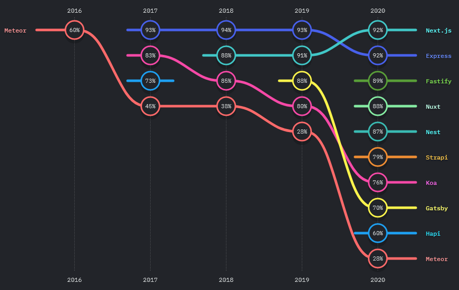
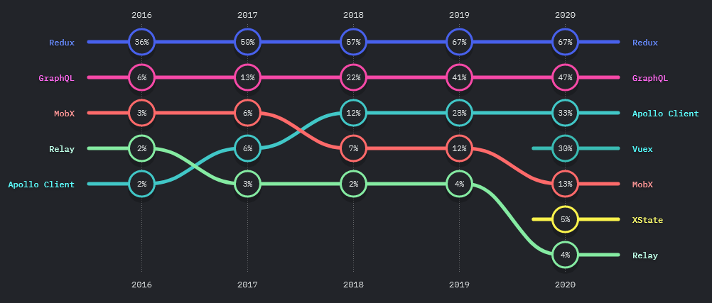

현재 진행하고 있는 프로젝트에서 웹 클라이언트를 React.js 와 상태 관리 라이브러리 Redux 및 Redux-saga 로 구현하고, 서버를 Node.js 의 서버사이드 프레임워크인 Nest.js 로 구현하며 Socket.IO API 을 이용한 소켓 통신 기반 서비스를 개발하고 있습니다. React.js 와 Nest.js 모두 이번 프로젝트를 통해 처음 사용하게 되었는데, 왜 이 기술들을 선택하게 되었고 어떤 장점을 느낄 수 있었는지 경험을 바탕으로 이야기해보고자 합니다.

### 왜 Nest.js 를 선택했어?

이전까지 프로젝트를 진행할 때 주로 서버 개발에 참여하면서 Python Django/Flask, Node.js Express, Java Spring 등 여러 언어의 서버사이드 프레임워크를 사용하였습니다. 현재는 가급적이면 현업에서 많이 사용하는 Spring 프레임워크를 기반으로 개발하고자 하지만, 프로젝트를 진행할 때마다 팀 내 상황에 맞춰 언어와 프레임워크를 선택하고 있습니다. 이번 프로젝트를 진행하는데 있어서도 함께 참여하는 팀원들이 Spring 에 대한 경험은 없었지만 JS 와 Express.js 에 대한 경험들이 있었고, 소켓 통신을 구현하는데 사용할 Socket.IO API 의 경우 기본적으로 Node.js 서버를 지원하며 documentation 도 모두 JS 기반으로 작성되어있어, Socket.IO 라이브러리를 안정적이고 효율적으로 사용할 수 있을 것이라고 생각했기 때문에 최종적으로 서버 개발 환경으로 Node.js 를 선택하게 되었습니다.

이전에 사용했던 Express.js 는 웹 어플리케이션 서버(WAS)를 빠르게 구현하는 데 최적화 되어있습니다. 구조가 간단하고, 개발 시에 자유도가 높기 때문에 프레임워크 혹은 서드파티 라이브러리가 제공하는 다양한 툴이나 미들웨어를 바탕으로 개발자가 선호하는 구조로 개발을 진행할 수 있습니다. 하지만 개발자가 개발 경험이나 구조에 대한 지식이 부족할 경우 이러한 자유도가 오히려 발목을 잡을 수 있습니다. 저 또한 지난 프로젝트에서 Express.js 를 기반으로 개발하면서, 이런 부분들에 있어 아쉬움을 느꼈습니다. 예를 들면 API 서버 개발 과정 초기에는 Express.js 의 Router 미들웨어에 요청과 응답 사이에 처리를 하나의 함수 내에 전부 작성하는 등, layered architecture 에 대한 이해 없이 코드를 작성하면서 애플리케이션의 규모가 커졌을 때 대응하기 힘든 구조를 만들었습니다.



(아직 express 에 비해 점유율은 낮지만 만족도는 못지않게 높은 편이다.)  
출처: <https://2020.stateofjs.com/en-US/technologies/back-end-frameworks/>

하지만 Nest.js 는 다릅니다. controller, service, module 각 클래스들와, Nest.js 에서 제공하는 filter, pipe, guard 등의 클래스들은 모두 다 역할을 가지고 있습니다. 클래스들를 사용하는 데 있어 Spring 과 같이 IoC (Inversion of Control), DI (Depdency Injection) 등의 디자인 패턴을 도입하였기 때문에, 각 클래스의 역할에 맞춰 개발해야 역할에 따른 기능을 온전히 사용할 수 있습니다. 하지만 이런 제한은 개발의 통일성을 가져오고, 저와 같이 높은 자유도에서 방황히기 쉬운 개발자에게는 훌륭한 가이드가 될 수 있습니다. 예를 들면 Express.js 에서 Socket.IO 를 사용하고자 한다면, 애플리케이션을 실행할 index.js 로부터 Socket.IO API 를 호출하는 모듈을 분리하기 위해 디렉터리와 파일을 직접 생성하고, index.js 와 해당 파일에서 모듈의 import/export 에 대한 코드를 직접 작성해주어야 합니다. 하지만 Nest.js 의 경우에는 `@nestjs/cli` 패키지에서 제공하는 모듈 생성 기능을 통해, Socket.IO 의 통신이 이루어지는 gateway 클래스를 어떤 모듈 아래에 생성할지 지정하면 Nest.js 에서 DI를 위한 코드도 작성해줍니다. 이를 통해 구조에 대한 고민을 덜고 서비스 기능 구현에 집중할 수 있다는 점이 Nest.js 의 큰 장점이라고 생각합니다.

TypeScript 기반 프레임워크라는 점 또한 큰 장점으로 꼽을 수 있습니다. 런타임에 타입이 결정되는 JavaScript 와 달리 TypeScript 는 변수마다 타입을 명시해야하므로 적응하는데 어려움이 있지만, 컴파일 이전에 VSCode 내장 기능으로 제공하는 TSlint 와 함께 타입 에러나 신택스 에러 등을 미리 확인하고 수정할 수 있어 개발 효율성이 훨씬 늘어날 수 있었습니다. 그리고 Express.js 의 경우 TypeScript 컴파일과 실행을 위한 tsconfig.json 파일이나 package.json 파일을 직접 작성해야하지만, Nest.js 의 경우 프로젝트 생성만으로 컴파일과 빌드, 실행을 위한 모든 파일과 npm script 를 제공해 TypeScript 를 처음 사용하는 개발자에게는 오히려 편한 부분이 많았습니다. 개인적으로는 Spring 을 공부하는 입장에서 SpringBoot 덕분에 개발 환경을 편하게 구성할 수 있었다고 생각했지만, Nest.js 는 Spring 과 매우 유사한 디자인 패턴을 가지면서도 npm 환경에서 TypeScript 빌드와 함께 훨씬 직관적이고 편리한 패키지 관리 및 빌드/배포 스크립트를 제공해 더욱 매력적인 프레임워크라고 느꼈습니다.

그리고 무엇보다도, Socket.IO 기반 서비스를 구현하는 입장에서 Nest.js 는 소켓 통신을 위한 gateway 를 제공하는 점이 좋았습니다. gateway 는 `@WebSocketGateway()` 데코레이터로 주석이 달린 클래스로, 모든 WebSocket 라이브러리와 호환이 가능합니다. 기본적으로 Socket.IO 와 ws 플랫폼을 지원하며, `@nest/cli` 라이브러리를 이용해 gateway 를 생성하면 아래와 같은 boilerplate 가 작성됩니다.

```TypeScript
@WebSocketGateway()
export class GameGateway {
  @WebSocketServer()
  private server: Server;

  @SubscribeMessage('events')
  handleEvent(@MessageBody() data: string): string {
    return data;
  }
}
```

위와 같이 `@WebSocketServer()` 데코레이터를 이용해 Socket.IO 의 서버 클래스 인스턴스를 생성하고, handleEvent 함수 내에선 파라미터로 Socket.IO 의 클라이언트 클래스 인스턴스를 받아 server, client 로 쉽게 event 를 emit 할 수 있습니다. gateway 로 controller 클래스와 같이 메서드를 선언하고 내부 로직만 다르게 작성하여 통일성있게 코드를 작성할 수 있었습니다.

### 왜 Redux-saga 를 선택했어?

React.js 에서 어플리케이션이 복잡해질수록 컴포넌트에 데이터를 props 로만 넘겨주기 힘들기 때문에, redux 와 같은 SPA (Single Page Application) 전역 상태 관리 라이브러리를 사용합니다. redux 를 사용하는 경우, 상태를 업데이트할 때 비동기 처리를 위한 복잡한 로직을 쉽게 핸들링하기 위해 redux 의 미들웨어를 사용하는데, 대표적으로는 redux-thunk 나 redux-saga 등이 있습니다. 현재 프로젝트에서는 클라이언트에서 서버와 통신할 때 Socket.IO 뿐만 아니라 REST API 를 사용하는데, REST API 를 이용한 데이터 fetch 시 Promise 를 활용한 비동기 처리를 활용하고, Socket.IO 의 client API 사용 시 callback 함수를 활용하여 상태 업데이트 로직을 구성하기 위해 redux 의 미들웨어에 대한 필요성을 느꼈습니다. 특히 redux-saga 의 경우 어플리케이션 내부에서 사용하는 action 과 Socket.IO 등에서 사용하는 외부 event 를 channel 이라는 개념을 도입해, action 의 dispatch 와 event 의 trigger 를 동일한 로직으로 처리할 수 있어 redux-saga 를 프로젝트에 도입하게 되었습니다.



(recoil 등의 대체제가 등장했지만 redux 의 점유율은 여전히 높다.)  
(출처 : <https://2020.stateofjs.com/en-US/technologies/datalayer/>)

channel 은 redux-saga 에서 사용하는 take, put 과 같은 effect 를 미들웨어에 등록된 saga 함수 사이, 그리고 클라이언트와 외부 event source 사이의 통신으로 일반화시킨 개념이라고 docs 에서 설명하는데... 무슨 뜻인지 쉽게 와닿지는 않습니다. 좀 더 직관적으로 채널을 FIFO 의 큐(Queue)라고 생각해보겠습니다. 컴포넌트에서 특정 action 이 dispatch 되었을 때, 해당 action 의 이름과 dispatch 시 의 payload 만이 추가되는 큐라고 말이죠. 그리고 redux 미들웨어에 등록된 어떤 saga 함수에서는 해당 channel 을 redux-saga 의 take effect 를 이용해 받을 준비를 하고 있다가, 컴포넌트에서 dispatch 함에 따라 channel 에 action 의 정보가 추가 되었을 때, 해당 action 의 payload 를 받아 비동기 함수 호출과 같이 개발자가 원하는 로직을 처리합니다. 이를 코드로 보면 아래와 같습니다.

```JavaScript
import { take, actionChannel, call, ... } from 'redux-saga/effects'

function* watchRequests() {
  const requestChan = yield actionChannel('REQUEST')
  while (true) {
    const {payload} = yield take(requestChan)
    yield call(handleRequest, payload)
  }
}

function* handleRequest(payload) { ... }
```

(출처: <https://redux-saga.js.org/docs/advanced/Channels>)

watchRequest 함수에서는 `actionChannel("REQUEST")` 로 REQUEST 라는 이름의 action 이 dispatch 될 때 action 정보가 추가될 채널을 생성합니다. 그리고 while 문 내에서 `take(requestChan)` 을 이용해 해당 채널에 action 정보가 추가되기를 대기하고, 추가될 경우 payload 를 받아 `call(handleRequest, payload)` 에서 `handleRequest` 라는 비동기 함수를 호출합니다. 근데, 이와 같은 로직은 redux-saga 의 `takeEvery` Effect 를 이용해 간단하게 작성할 수 있을 텐데 굳이 while 문을 이용해 작성해야할 필요가 있었을까요? 현재 프로젝트 한정으로 이야기하면, Socket.IO 의 callback 함수로 redux-saga 미들웨어를 등록하기 위한 generator 함수를 작성할 수 없기 때문에, callback 함수 내에서는 위의 channel 에 action 정보를 추가하고, 미들웨어로 등록할 수 있는 saga 함수를 작성해 해당 함수 내에서 redux 상태를 업데이트 하기 위한 로직을 작성할 수 있기 때문에 위 패턴을 사용하게 됩니다.

위에서는 컴포넌트 내부에서 발생하는 action 을 처리하기 위한 saga 함수를 정의하였는데, 외부 소스(서버)에서 발생하는 event 는 어떻게 처리해야 할까요? 위와 마찬가지로 channel 의 개념을 도입해 socket event channel 을 작성합니다.

```JavaScript
import { take, put, call, apply, delay } from 'redux-saga/effects'
import { eventChannel } from 'redux-saga'
import { createWebSocketConnection } from './socketConnection'

function createSocketChannel(socket) {
  return eventChannel(emit => {

    socket.on('ping', (event) => {
      emit(event.payload)
    })

    return () => {
      socket.off('ping', pingHandler)
    }
  })
}

export function* watchOnPings() {
  const socket = yield call(createWebSocketConnection)
  const socketChannel = yield call(createSocketChannel, socket)

  while (true) {
    try {
      const payload = yield take(socketChannel)
      yield put({ type: INCOMING_PONG_PAYLOAD, payload })
    } catch(err) {
      console.error('socket error:', err)
    }
  }
}
```

(출처: <https://redux-saga.js.org/docs/advanced/Channels>)

위의 코드에서 `watchOnPings` 함수를 미들웨어로 등록하는데, watchOnPings 함수 내부에서는 `call(createWebSocketConnection)` 로 socket 객체를 생성하고 `call(createSocketChannel, socket)` 로 소켓 통신에서 발생한 event 정보를 받을 channel 을 생성합니다. `createSocketChannel` 함수는 `socketChannel` 함수를 받을 channel 을 생성하는데, 이 channel 은 위에서 다뤘던 channel 과 동일하지만 외부 event 정보를 받는다는 점이 다릅니다. while 문 내에서는 channel 에 이벤트 정보가 추가되면 `take(socketChannel)` 에서 payload 를 받아 `put` effect 로 state 를 업데이트합니다. `socketChannel` 을 생성하는 함수를 작성한다는 점을 제외하면, 클라이언트 내부에서 action 이 dispatch 될 때 실행할 로직을 작성하는 부분은 모두 동일합니다.

### Nest.js 와 Redux-Saga 로 어떻게 구현했어?

현재 프로젝트 내에는 각 클라이언트 간의 커뮤니케이션을 위한 채팅 기능이 있습니다. 이 채팅 기능을 예시로 서버와 클라이언트를 어떻게 구현했는지 예시로 보여드리고자 합니다.
먼저 클라이언트와 서버에서 이벤트를 효율적으로 관리하기 위해, `event.ts` 파일에 다음과 같이 별도로 이벤트를 변수로 구성하였습니다. `CHATTING_CLIENT_MESSAGE` 는 클라이언트에서 서버로 message 를 전송하기 위한 event, `CHATTING_SERVER_MESSAGE` 는 서버에서 클라이언트로 message 를 전송하기 위한 event 입니다.

### Nest.js (TypeScript)

`src/gateways/events.ts`

```TypeScript
export const CHATTING_JOIN = 'chatting/join';
export const CHATTING_SERVER_MESSAGE = 'chatting/server_message';
export const CHATTING_CLIENT_MESSAGE = 'chatting/client_message';
```

`src/gateways/chatting.gateway.ts`

```TypeScript
@WebSocketGateway()
export class ChattingGateway {
  @WebSocketServer()
  server: Server;

  constructor(private userService: UserService) {}

  @SubscribeMessage(CHATTING_JOIN)
  async receiveJoinConnected(
    client: Socket,
    payload: { name: string; room: string },
  ): Promise<{ userId: string }> {
    const { userId } = await this.userService.create({
      ...payload,
      clientId: client.id,
    });

    client.join(payload.room);

    return { userId };
  }

  @SubscribeMessage(CHATTING_CLIENT_MESSAGE)
  async handleMessage(
    client: Socket,
    payload: { userId: string, message: string },
  ): Promise<void> {
    const { userId, message } = payload;
    const { name, room } = await this.userService.findByUserId(userId);

    this.server.to(room).emit(CHATTING_SERVER_MESSAGE, {
      user: name,
      text: message,
    });
  }
}
```

서버는 CHATTING_JOIN, CHATTING_CLIENT_MESSAGE 에 대한 이벤트를 처리합니다. gateway 는 controller 클래스와 유사하게 내부에서 Service 클래스를 주입받아 사용할 수 있으며, 위에서는 UserService 클래스의 create 와 findByUserId 메서드를 사용합니다.

### React (TypeScript)

`src/modules/sockets/events.ts`

```TypeScript
export const CHATTING_JOIN = 'chatting/join';
export const CHATTING_SERVER_MESSAGE = 'chatting/server_message';
export const CHATTING_CLIENT_MESSAGE = 'chatting/client_message';
```

`src/modules/sockets/chatting.ts`

```TypeScript
 type MessageState = {
  user: string;
  text: string;
};

export const sendJoin = createAction(
  CHATTING_JOIN,
  (payload: { name: string; room: string; }) => ({ payload })
);

const receiveJoinChannel = channel<string>();

export function* receiveJoinSaga() {
  while (true) {
    const payload: string = yield take(receiveJoinChannel);
    yield put(updateUserId(payload));
  }
}

export function* sendJoinSaga(socket: Socket) {
  while (true) {
    const { payload } = yield take(CHATTING_JOIN);
    yield apply(socket, socket.emit, [
      CHATTING_JOIN,
      payload,
      ({ userId }) => {
        receiveJoinChannel.put(userId);
      },
    ]);
  }
}

export const sendChatting = createAction(
  CHATTING_CLIENT_MESSAGE,
  (payload: { userId: string; message: string }) => ({ payload })
);

export function* sendChattingSaga(socket: Socket) {
  while (true) {
    const { payload } = yield take(CHATTING_CLIENT_MESSAGE);
    yield apply(socket, socket.emit, [CHATTING_CLIENT_MESSAGE, payload]);
  }
}

const receiveChattingChannel = (socket: Socket) => {
  return eventChannel<MessageState>((emit) => {
    socket.on(CHATTING_SERVER_MESSAGE, (message: MessageState) => {
      emit(message);
    });

    return () => {};
  });
};

export function* receiveChattingSaga(socket: Socket) {
  const channel: ReturnType<typeof receiveChattingChannel> = yield call(
    receiveChattingChannel,
    socket
  );
  while (true) {
    const payload: MessageState = yield take(channel);
    yield put(updateMessage(payload));
  }
}
```

`src/modules/sockets/index.ts`

```TypeScript
export function* handleIO() {
  const socket: Socket = yield call(connectSocket);

  yield all([
    receiveJoinSaga(),
    sendJoinSaga(socket),
    sendChattingSaga(socket),
    receiveChattingSaga(socket),
  ]);
}
```

`src/modules/index.ts`

```TypeScript
export function* rootSaga() {
  yield all([handleIO()]);
}
```

react.js 의 redux state 를 관리하는 modules 디렉터리 내의 chatting.ts 에서는 총 3개의 action 과 4개의 saga 함수가 있습니다. saga 함수 내에서 처리하는 로직은 3가지 패턴으로 구분할 수 있습니다.

1. 내부에서 action 을 dispatch 하고 서버로 event 를 emit
2. 외부 event channel 에서 event 를 받아와 클라이언트에서 action 을 dispatch
3. 내부에서 action 을 dispatch 하고 서버로 event 를 emit 한 후, callback 함수 내부에서 payload 를 받아 channel 에 추가

메시지를 전송하는 `sendChatttingSaga` 는 1번, 메시지를 수신하는 `receiveChattingSaga` 는 2번, 채팅에 참여하는 `sendJoinSaga` 는 3번에 속합니다. 여기서 3번의 경우 `CHATTING_JOIN` 이벤트를 받아 서버에서 user 를 생성한 후 userId 를 리턴하므로, socket.emit 함수의 callback 함수로 `receiveJoinChannel` 에 payload 를 추가하는 함수를 파라미터로 입력합니다. 여기서 Socket.IO API 의 emit 함수에 saga 함수로 generator 를 등록할 수 없기 때문에, 별도의 channel 을 만들어 redux-saga 의 put effect 를 이용해 channel 에 payload 를 추가하고, channel 을 추가되는 요소를 대기하는 별도의 saga 함수인 `receiveJoinSaga` 를 등록해 해당 함수 내에서 `updateUserId` action 이 실행될 수 있도록 구성하였습니다. 앞서 말한대로 callback 함수에 generator 패턴을 사용할 수 없기 때문에 우회하는 방법입니다.

현재 프로젝트에서 클라이언트와 서버 모두 소켓 통신 부분만 담당하고 있기 때문에, Socket.IO API 를 사용하는 모듈만 독립적으로 관리하는 것이 필수적이었다고 생각합니다. 이제 위와 같이 Nest.js 의 gateway 와 React.js 에서 redux-saga 를 통해 Socket.IO 와 관련된 코드를 별도의 모듈에서 종속성 문제 없이 깔끔하게 관리할 수 있게 되었습니다. Nest.js 에서는 Service 클래스에 비즈니스 로직을 구성하고 gateway 에서 Service 클래스를 주입받아 메서드를 호출하며, React.js 에서는 소켓 통신을 처리하는 saga 함수가 선언된 모듈과 분리된 비동기 처리 saga 함수 모듈을 관리하고 있습니다.
