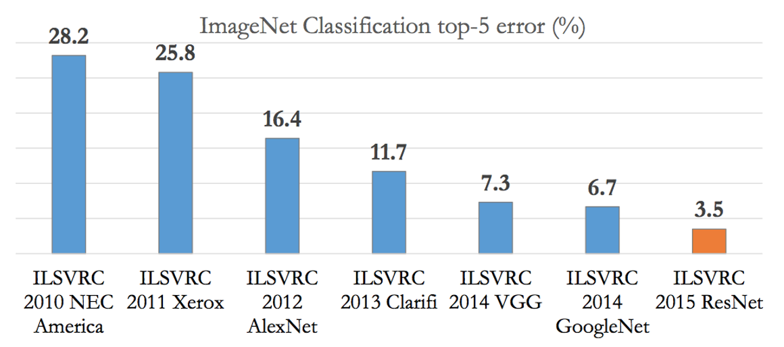
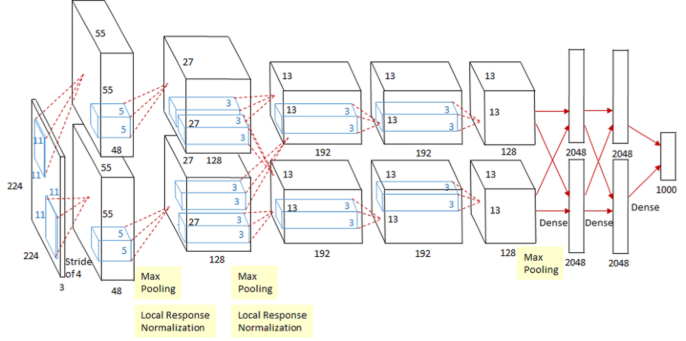
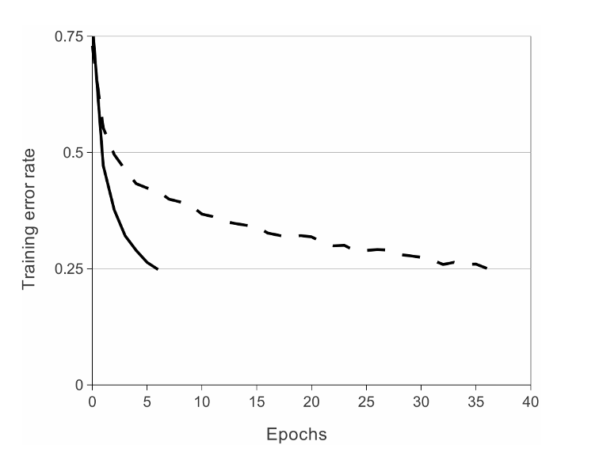
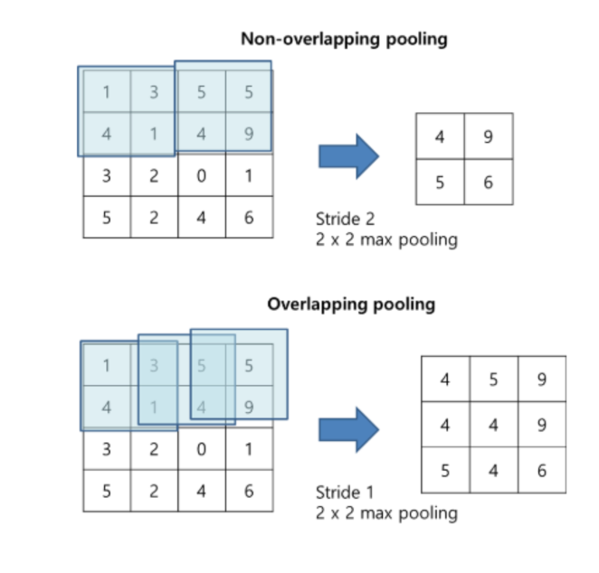
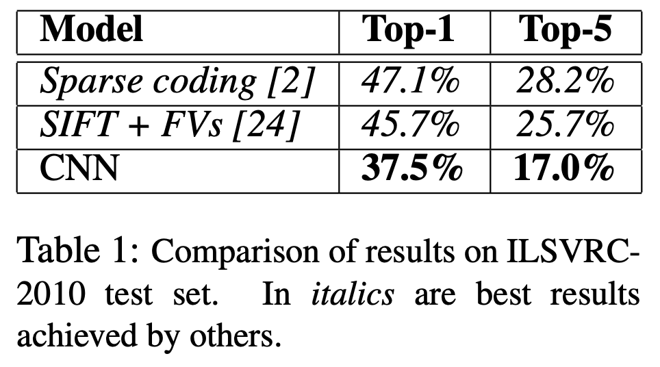
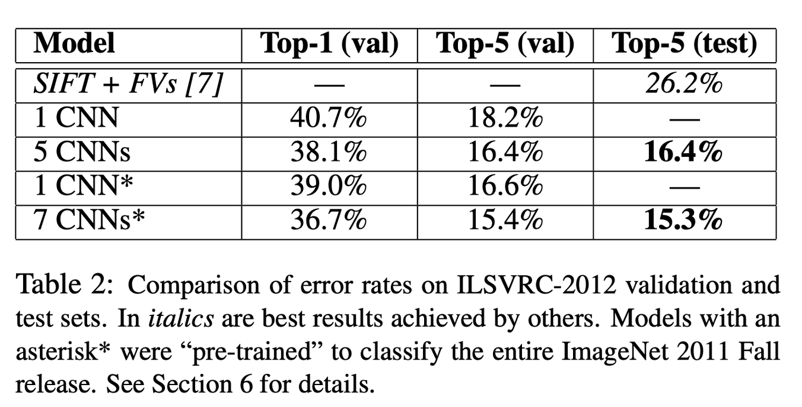
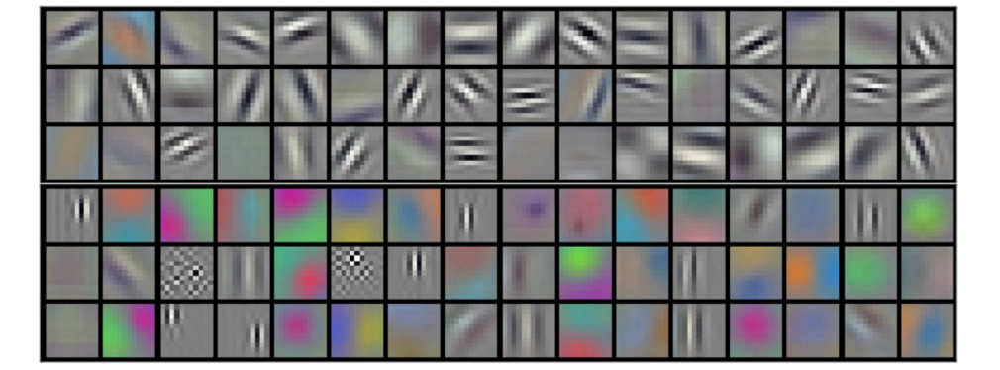
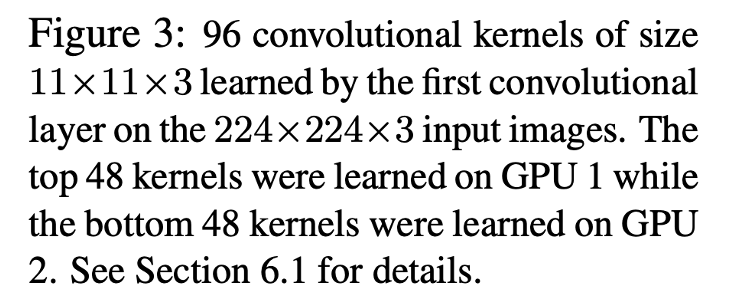
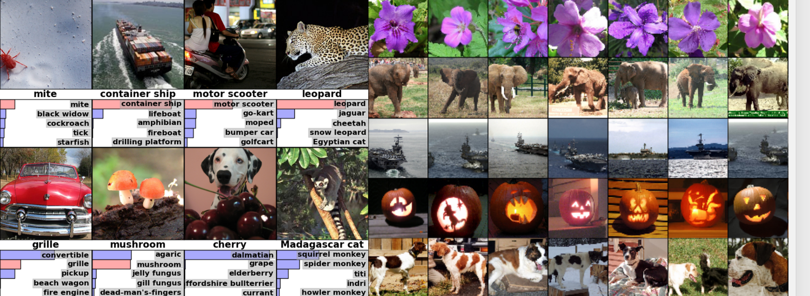

# ImageNet Classification with Convolutional Neural Networks (AlexNet)

## Paper Introduction

논문 저자 : Alex Krizhevsky, Ilya Sutskever, Geoffrey E. Hinton

## 1. Introduction

ILSVRC는 **ImageNet Large Scale Visual Recognition Challenge**의 약자로 대용량의 이미지셋을 주고 이미지 분류 알고리즘의 성능을 평가하는 2010년에 시작한 대회이다.

이 논문에서 소개하는 모델인 AlexNet은 ILSVRC - 2012에서 우승을 차지한 모델이다.

## 2. Dataset

이 논문에서 사용하는 데이터셋은 ILSVRC에서 제공한 ILSVRC-2010 데이터셋이다. 1000개의 카테고리로 구성되어 있으며, 각 카테고리마다 약 1000개의 사진으로 이루어져 있는 데이터셋이다. 총 약 120만개의 데이터로 구성되어 있다고 한다. 이 중 5만개의 이미지는 validation set로, 그리고 15만개의 이미지는 test set로 활용을 했다.

이미지의 인풋 과정에서 일정한 크기의 이미지가 필요한데, ILSVRC-2010 데이터셋의 이미지들은 크기가 일정하지 않기 때문에 256픽셀X 256픽셀의 고정된 크기로 이미지들을 다운 샘플링했다. 다운 샘플링은 사진의 짧은 쪽을 256 픽셀으로 먼저 만들고, 그 후에 이미지의 중앙을 중심으로 256X256으로 잘라내는 방식으로 진행했다.

## 3. The Architecture

AlexNet은 총 8개의 layer으로 구성되어 있는데, 처음에는 5개의 convolutional layer으로, 그 후에는 3개의 fully connected layer으로 구성되어 있다.

### 3-1. ReLU Non-Linear Function

당시 주요 CNN 모델이었던 LeNet-5이 sigmoid함수와 tanh 함수를 사용했던 것과는 달리 ReLU 함수를 사용했다.

위의 이미지를 보면,

CIFAR-10 데이터셋에서 ReLU 비선형 활성화함수를 사용했을 때 5번의 이터레이선으로 트레이닝 에러 레이트 25%를 달성할 수 있었던 반면, tanh 비선형 활성화함수를 사용했을 때는35번이 넘는 이터레이션 횟수로 트레이닝 에러 레이트 25%를 달성할 수 있었던 것을 알 수 있습니다.

CIFAR-10 데이터셋에서 ReLU 비선형 활성화함수를 사용한 것처럼, AlexNet에서도 ReLU 비선형 활성화함수를 사용해서 학습의 속도를 높였다. 학습의 속도는 큰 데이터셋을 학습시킬 때 모델의 성능에도 영향을 미치기 때문에 ReLU를 사용했을 때 모델 성능의 향상도 기대할 수 있었다. 또한, ReLU함수를 사용해서 더 깊은 NN을 형성할 수 있었다.

### 3-2. Training on Multiple GPUs

AlexNet에서는 2개의 GPU를 병렬적으로 연결시켜 학습을 진행했다.

이 연구를 진행하기 위해 GTX 580 GPU라는 GPU를 사용했는데, 3GB의 메모리밖에 없었기 때문에 훈련 가능한 네트워크의 크기가 한정되어있었고, 이것은 120만개라는 엄청나게 큰 데이터를 학습시키기에는 부족했다. 이 문제를 해결하기 위해 2개의 GPU를 병렬적으로 연결시켜 특정 레이어(3번째 레이어)에서만 서로 연결되게 하였다. 이러한 구조가 cross-validation에서는 문제가 될 수 있지만, amount of computation에서는 더 효율적이었다.

이렇게 함으로써 1개의 GPU를 사용한 모델들보다 top-1 error rate과 top-5 error rate를 1.7% 그리고 1.2% 줄였다. 또한, 2개의 GPU를 사용한 모델이 한개의 GPU를 사용했을 때보다 학습시간이 조금 더 짧았다.

### 3-3. Local Response Normalization

ReLU를 사용하면 input normalization이 필요없지만(정규화란 입력값들을 0부터 1사이에 위치하게 하는 것이니까- ReLU는 굳이 0부터 1사이에 둘 필요가 없음) Local Response Normalization을 통해 generalization을 높일 수 있다.

Local Response normalization을 사용하는 이유는 ReLU는 입력받은 양수 값을 그대로 사용하기 때문이다. 양수 값을 그대로 사용하게 되면 conv나 pooling 과정에서 하나의 높은 값을 가진 픽셀이 주위의 픽셀에 영향을 미치게 된다. 이를 방지하기 위해 인접한 채널에서 같은 위치에 있는 픽셀 n개를 통해 정규화한다.

Local Response Normalization을 사용하여 top1 error rate에서는 1.4%, top5 error rate에서는 1.2%를 줄였다. 또한, CIFAR-10 데이터셋에서 4개의 레이어로 이루어진 CNN에서 정규화 없이 13%의 error rate이 발생했지만, 정규화를 했을 때 error rate는 11%였습니다.

### 3-4. Overlapping Pooling

Pooling Layer에서 진행되는 pooling이란, CNN의 학습 속도를 높이기 위해 Feature의 차원 수, 즉 feature size를 줄이는 것이다. 사각형 안의 픽셀 중 최대값을 추출하는 것을 Max Pooling, 사각형 안의 픽셀 값의 평균을 계산하여 추출하는 것을 Average Pooling이라고 한다.

AlexNet에서는 Max Pooling을 사용했다.

커널의 크기를 z * z라고 하고, stride를 s라고 할 때, s와 z가 같을 때 non-overlapping pooling layer가 된다. Z > s일 때는 overlapping pooling layer가 된다.

Overlapping pooling을 했을 때 top1 error rate가 0.4% 줄었고, top5 error rate를 0.3% 줄였다. Overlapping pooling은 오버피팅의 가능성을 조금 감소시키기도 했다.

### 3-5. Summary of the Architecture

AlexNet의 아키텍쳐를 정리해보자면,

세 번째의 convolutional layer만이 두 번째 레이어의 모든 커널에 연결되어있으며, fully-connected layer들은 모두 전 레이어의 뉴런과 모두 연결되어 있습니다. Local Response normalization layer은 첫번째와 두번째 convolutional layer 다음에 있으며, max-pooling layer은 Local Response normalization layer 다음과 5번째 convolutional layer 다음에 있습니다. ReLU 함수는 모든 convolutional layer와 fully-connected layer의 결과에 적용이 되었습니다.

## 4. Reducing Overfitting

AlexNet은 네트워크의 사이즈로 인해 overfitting이 발생할 수 있음을 인지했고 이를 방지하기 위한 조치들을 취했다.

### 4-1. Data Augmentation(horizontal reflection, PCA color augmentation)

먼저, Data augmentation을 적용했다. horizontal reflection을 진행했고, 256 x 256 이미지로부터 224 x 224 이미지 패치를 랜덤하게 crop하고 이를 학습에 사용했다. 또한, test를 할 때 이미지의 각 코너에서 1개씩, 즉 4개의 224x224 이미지 패치와 중간에서 하나의 224x224이미지 패치를 뽑아내어 이들을 horizontal reflection하여 10개로 만들었다. 모델은 10개의 이미지 패치에 대해 prediction한 결괏값을 평균내어 최종 prediction으로 사용했다.

Data augmentation의 두번째 방법으로 PCA color augmentation을 진행했다.

AlexNet에서는 각 이미지의 RGB pixel 값에 대해 PCA를 수행하여 평균 = 0, 표준편차 = 0.1 크기를 갖는 랜덤변수 곱한 후 원래의 pixel 값에 더해주었다.

Data augmentation 기법은 top1 error rate를 1% 이상 줄여주었다.

### 4-2. Dropout

다음으로는, Dropout 기법을 활용했다.

Dropout은 학습을 진행할 때 랜덤으로 일정 양의 뉴런을 사용하지 않는 것이다. 

## 5. Details of Training

SGD, batch size 128, momentum 0.9로 학습을 진행했다. 아마 Adam이 나오기 전이어서 optimizer을 momentum으로 지정한 것 같다.

Weight decay는 원래 학습 과정에서 가중치들이 너무 커지는 것을 방지하는 역할을 하는데, 여기서는 weight decay로 트레이닝 에러도 줄였다.

연구에서는 Validation error가 개선되지 않을 때 learning rate을 10으로 나누었다. 초기 learning rate은 0.01이었지만, 3번 변경하여 0.00001이 최적이었음.

5-6일동안 90 사이클을 돌렸다고 한다.

## 6. Results

ILSVRC-2010 데이터셋에서 top-1과 top-5 최고의 성적은 top-1에서 47.1%, top-5에서 28.2%였다. 

이후에 SIFT+FVs 모델이 top-1에서 45.7%, top-5에서 25.7%를 달성했다. 

그러나 AlexNet은 top1에서 37.5%, top5에서 17.0%를 달성하면서 가장 낮은 error rate을 기록했다.

ILSVRC 2012에서는 top1에서 40.7을, 그리고 top5에서는 18.2를 달성하였다.

5CNNS와 7 CNNS는 여러 유사 모델들을 훈련시킨 후에 결과를 평균낸 것이다.

AlexNet은 GPU 2개를 병렬적으로 놓고 학습을 진행했는데, 각 GPU마다 다른 특성을 학습한 결과를 보였다. 색상과 완전 무관한 특성들을 검출하는 경우와 이미지의 색상과 관련한 특성들을 검출하는 경우이다.

또한, 아래의 왼쪽 사진에서 알 수 있듯이, 대체적으로 top5 prediction에 정답이 포함되어 있었다. 또한 사물이 중앙에 있지 않아도 인식이 잘 되었다. 오른쪽 사진에서 가장 왼쪽 칼럼은 test image, 그 후로부터는 test 이미지와 가장 비슷한 training image를 뽑은 것이다.

같은 object여도 포즈가 다르면 같다고 인식하기 어려운데, 이를 잘 수행해낸 것을 알 수 있었다. 따라서 VISUAL KNOWLEDGE가 잘 학습된 것을 확인할 수 있었다.

