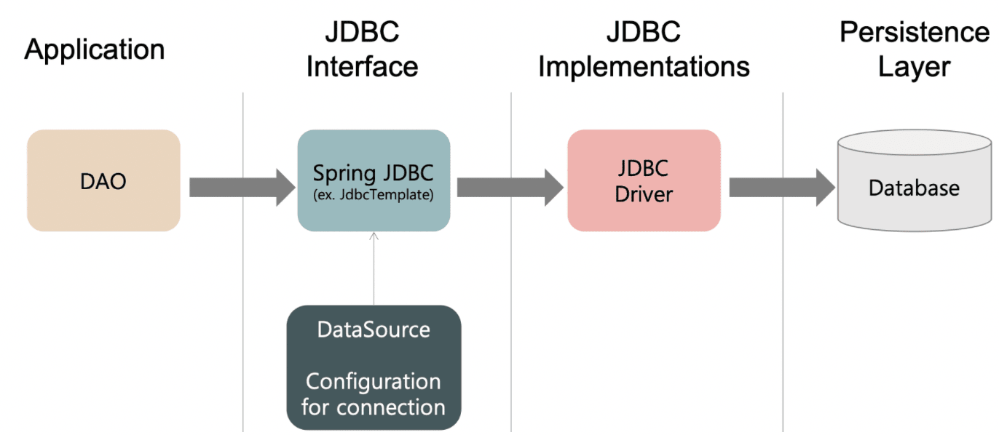
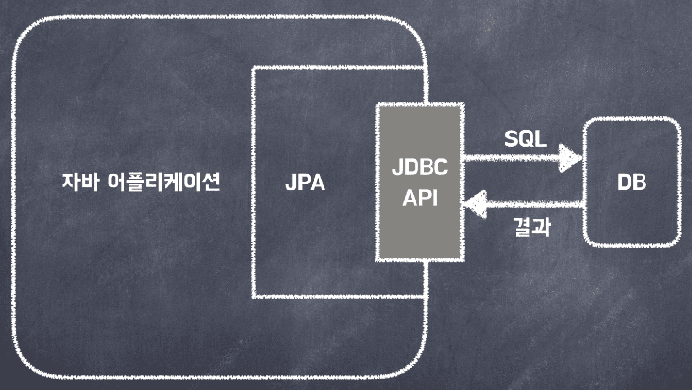

진행했던 프로젝트에서 JDBC를 사용했다. 이번에 JDBC를 어떻게 활용했는지에 대한 내용과 추가로 JPA는 무엇이고 JDBC와 비교해 장단점을 알아보자

## JDBC 란?

JDBC(Java DataBase Connectivity)는 데이터베이스에 연결 및 작업을 하기 위한 자바 표준 인터페이스 이다. 자바는 DBMS(Oracle, MySQL, MongoDB 등)의 종류에 상관 없이 하나의 JDBC API를 이용해서 데이터베이스 작업을 처리한다. 이 JDBC는 DB에 접근해서 CRUD를 쉽고 효율적이게 할 수 있게 하고, 고성능에서의 세련된 메소드를 제공하며 쉽게 프로그래밍 할 수 있게 도와준다.

  


### JDBC 를 사용하는 이유  

- 쿼리문을 통해 데이터베이스를 다룰 수 있는 일반 개발자들은 Oracle 또는 MY SQL의 여러가지 프로그램을 통해 DB에 직접 명령을 내려 데이터를 처리한다.
- 하지만 데이터베이스에 직접 접속할 수 없는 사용자들은 개발자들이 만들어놓은 UI(회원가입 화면, 회원 목록, 게시글 작성 등)를 통해 데이터베이스와 작업한다.
- 사용자들이 데이터베이스와 간편히 작업할 수 있도록 만들어진 UI는 코드로 작성된다. 이때 코드 레벨에서 데이터베이스를 사용하기 위한 라이브러리 즉, 쿼리 실행도구 API가 필요한데 이중 Java에서 사용하는 것이 JDBC이다.
- DB와 사용자를 연결시키는 코드를 작성할 때, 데이터베이스의 종류마다 함수명이나 명령문이 다른 경우가 있다.  
그런 내용들을 단일화 해주고 작업을 편리하게 해주기 위해 JDBC를 사용한다.


### JDBC 사용 예시
간단하게 회원가입 및 회원정보 수정을 JDBC 로 구현해보자  

#### 회원가입
우선 회원가입을 위해서는 사용자가 자신의 정보를 Request 에 담아 보내주어야 한다.
이때 우리가 받아야 하는 Request 를 필자는 PostUserReq 라는 클라스로 저장해두었다.

```java
import lombok.AllArgsConstructor;
import lombok.Getter;
import lombok.NoArgsConstructor;
import lombok.Setter;

@Getter
@Setter
@AllArgsConstructor
@NoArgsConstructor
public class PostUserReq {
    private String userEmail;
    private String userName;
    private String userPassword;
    private String userPhoneNumber;
}
```
이를 Dao 의 createUser 메소드가 파라미터로 받게 된다.
여기서 Dao 란 Data Access Object)의 줄임말로 실제로 DB에 접근하는 객체이다.

```java
import com.example.demo.src.user.model.*;
import com.example.demo.src.user.model.req.PostUserReq;
import org.springframework.jdbc.core.JdbcTemplate;
import javax.sql.DataSource;

@Repository
public class UserDao {

    private JdbcTemplate jdbcTemplate;

    @Autowired
    public void setDataSource(DataSource dataSource) {
        this.jdbcTemplate = new JdbcTemplate(dataSource);
    }

    public Long createUser(PostUserReq postUserReq) {
        String createUserQuery = "insert into User (user_email, user_name, user_password, user_phone_number) VALUES (?,?,?,?)";
        Object[] createUserParams = new Object[]{postUserReq.getUserEmail(), postUserReq.getUserName(), postUserReq.getUserPassword(), postUserReq.getUserPhoneNumber()};
        this.jdbcTemplate.update(createUserQuery, createUserParams);

        String lastInsertIdQuery = "select last_insert_id()";
        return this.jdbcTemplate.queryForObject(lastInsertIdQuery, Long.class);
    }
}
```
위 코드를 보면 createUserQuery 에 우리가 작업할 SQL문 즉 회원가입이므로 insert 문이 들어간 것을 확인할 수 있고
createUserParams 에는 우리가 Requset 로 받아온 즉 위에 PostUserReq 클라스의 필드값들을 get 메소드를 통해 가져와 넣어준다.
마지막으로 이를 jdbcTemplate 의 update 메소드에 각각을 매개변수로 넣어주면 (이때 Query와 Params 넣는 순서를 지켜야 한다.) 된다.


마지막에 있는 lastInsertIdQuery 는 정상적으로 DB에 유저정보가 들어갔다면 클라이언트에게 Response 로 내려줄 유저의 고유 idx 값을 반환 받는것이다.

#### 회원정보 수정
회원정보 수정을 위해서는 사용자가 자신이 수정할 정보를 Request 에 담아 보내주어야 한다.
아까와 마찬가지로 우리가 받아야 하는 Request 를 필자는 이번에는 PatchUserReq 라는 클라스로 저장해두었다.
```java
import lombok.AllArgsConstructor;
import lombok.Getter;
import lombok.Setter;

@Getter
@Setter
@AllArgsConstructor
public class PatchUserReq {
    private String userName;
    private String userEmail;
    private String userPhoneNumber;
}
```

이를 Dao의 modifyUserInfo 메소드가 받게 된다.  
이때 아무나 회원정보를 수정하면 안되므로 userIdx값 역시 파라미터로 받아야 하는데 
필자는 jwt 에서 userIdx 값을 추출하여 사용하는 방식으로 구현하였다. 하지만 이번 포스팅에서는 다루는 내용이 아니므로 이정도까지만 설명하겠다.


```java
import com.example.demo.src.user.model.*;
import com.example.demo.src.user.model.req.PatchUserReq;
import org.springframework.jdbc.core.JdbcTemplate;
import javax.sql.DataSource;

@Repository
public class UserDao {

    private JdbcTemplate jdbcTemplate;

    @Autowired
    public void setDataSource(DataSource dataSource) {
        this.jdbcTemplate = new JdbcTemplate(dataSource);
    }

    public int modifyUserInfo(PatchUserReq patchUserReq, Long userIdxByJwt) {
        String modifyUserInfoQuery = "update User set user_name = ?, user_email = ?, user_phone_number = ?  where user_idx = ? ";
        Object[] modifyUserInfoParams = new Object[]{patchUserReq.getUserName(), patchUserReq.getUserEmail(), patchUserReq.getUserPhoneNumber(), userIdxByJwt};

        return this.jdbcTemplate.update(modifyUserInfoQuery, modifyUserInfoParams);
    }
}
```
회원가입때와 jdbcTemplate 의 update 메소드를 통해 회원정보를 수정해준다.

### JDBC의 장단점
##### 장점
- 각 DB 회사들은 자신들의 DB에 맞는 드라이버를 제공한다. 이러한 JDBC 드라이버를 사용하면 JDBC 를 지원하기만 한다면 모든 DB에 접근하는 것이 가능하다.
- SQL 을 지원함으로써 모든 JDBC 데이터소스에 SQL을 통하여 접속할 수 있도록 해준다.
- 대부분의 개발자들이 잘 아는 친숙한 Access 기술로 별도의 학습 없이 적용해 개발이 가능하다.

##### 단점
- 안정적이고 유연하지만 로우 레벨 기술로 인식되기도 한다.
- 간단한 SQL 문을 실행하는 데도 코드 중복이 반복적으로 일어나게 된다.
- Connection 과 같은 공유 리소르를 제대로 릴리즈 해주지 않으면 시스템 자원이 바닥나는 버그가 발생할 수도 있다.

## JPA 란? 
JPA(Java Persistence API)는 현재 ORM(Object Relational Mapping)의 기술 표준으로, 인터페이스 모음이다. 즉, ORM을 사용하기 위한 인터페이스를 모아둔 것이라 볼 수 있다. ORM에 대한 자바 API 규격이며 Hibernate, OpenJPA 등이 JPA를 구현한 구현체이다

### ORM ?
Object-Relational Mapping

객체와 관계형 데이터베이스를 매핑한다는 뜻이다.  
ORM 프레임워크는 객체와 테이블을 매핑해 패러다임의 불일치를 개발자 대신 해결해준다. 객체는 객체대로 생성하고, 데이터베이스는 데이터베이스에 맞도록 설계를 가능하게 해준다. 개발자는 이를 매핑하는 방법만 전달해주면 된다.

### 동작과정


JPA는 애플리케이션과 JDBC 사이에서 동작한다. JPA 내부에서 JDBC API를 사용하여 SQL을 호출하여 DB와 통신한다.

개발자가 ORM 프레임워크에 저장하면 적절한 INSERT SQL을 생성해 데이터베이스에 저장해주고, 검색을 하면 적절한 SELECT SQL을 생성해 결과를 객체에 매핑하고 전달해 준다.

### JPA를 사용하는 이유
#### 1. 생산성
JPA를 사용하면 자바 컬렉션에 저장하듯이 JPA 에게 저장할 객체를 전달하면 된다.  
반복적인 코드를 개발자가 직접 작성하지 않아도 되며, 데이터베이스 설계 중심을 객체 설계 중심으로 변경할 수 있다.
#### 2. 유지보수
필드를 하나만 추가해도 관련된 SQL과 JDBC 코드를 전부 수행해야 했지만 JPA는 이를 대신 처리해주기 때문에 개발자가 유지보수해야하는 코드가 줄어든다.
#### 3. 성능
애플리케이션과 데이터베이스 사이에서 성능 최적화 기회를 제공한다.  
같은 트랜잭션안에서는 같은 엔티티를 반환하기 때문에 데이터 베이스와의 통신 횟수를 줄일 수 있다. 또한, 트랜잭션을 commit하기 전까지 메모리에 쌓고 한번에 SQL을 전송한다.

### JPA 에 비해 JDBC 의 문제점
#### 1. 반복적인 코드의 작성
테이블이 100개 존재한다면 100개의 CRUD 를 모두 작성해야 한다.  
- SQL 작성 -> JDBC API로 SQL 실행 -> 결과를 객체로 매핑 등
#### 2. SQL 의존적 개발
이것은 프로젝트 하면서 정말 몸소 체감했던 부분인데
만약 테이블에 하나의 Column 을 추가해야 한다면?   
- 모든 SQL 의 변경이 필요하다.  
- INSERT, UPDATE, SELECT 등 관련된 모든 쿼리와 메소드가 변경되어야 한다.  
- 만약 제대로 동작하지 않다면 직접 Dao 를 열어 SQL 을 확인해야 한다.

### JPA 의 단점 
- JPA 를 학습할 때 진입장벽이 높다는 이야기들을 많이 한다. 즉 처음에 사용하기 위해 배워야 할 것들이 많다.
- JPA 는 복잡한 쿼리보다는 실시간 처리용 쿼리에 더 최적화 되어 있다. 따라서 복잡한 통계 쿼리는 SQL 을 직접 작성하는 것이 더 쉬운 경우가 존재한다.

Reference:  
<https://velog.io/@bread_dd/Spring-Data-JDBC-vs-Spring-Data-JPA>  
<https://ultrakain.gitbooks.io/jpa/content/chapter1/chapter1.3.html>  
<https://gmlwjd9405.github.io/2019/08/04/what-is-jpa.html>  
<https://dbjh.tistory.com/77>  
<https://girawhale.tistory.com/119>  
<https://honinbo-world.tistory.com/80>  
<https://dahye-jeong.gitbook.io/spring/spring/2020-04-11-jpa-basic>  


