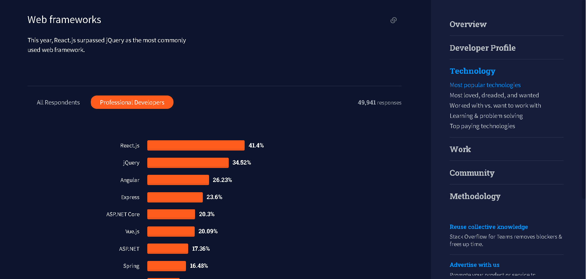
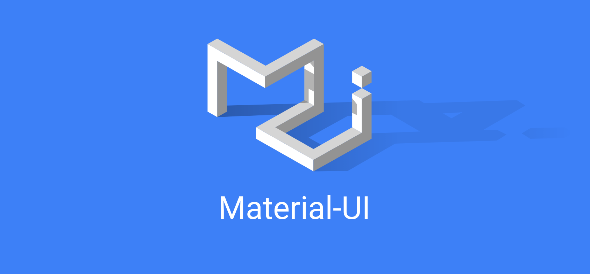
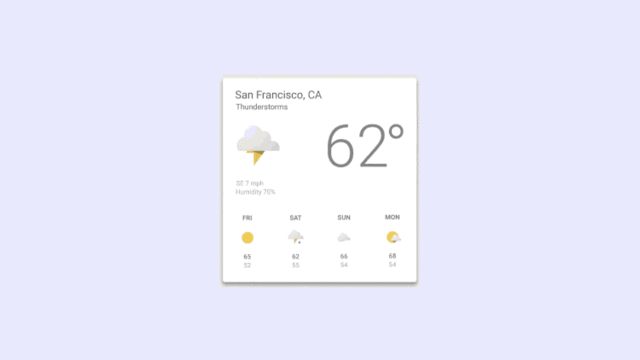
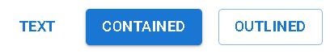
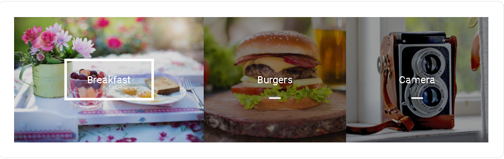
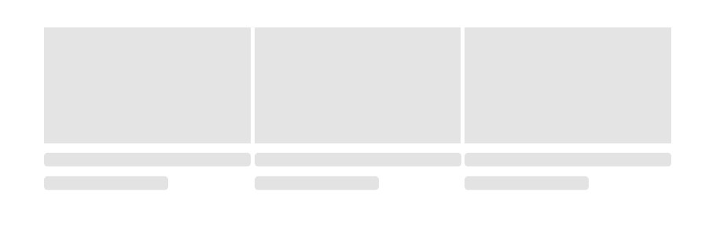
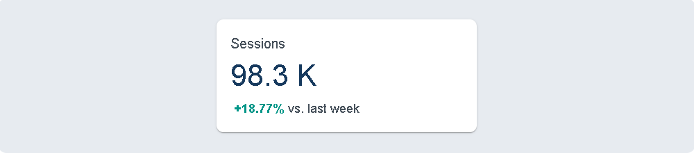

## Intro

---

요즘 FE에서 자주 사용하는 언어가 무엇일까요?
아마 대중적으로 2개 정도를 들을 수 있을 것 같습니다. TS(Typescript)와 JS(Javascript)일 것입니다. 그 중 TS는 JS의 Superset 프로그래밍 언어입니다. Superset이란 상위 집합이라는 뜻으로 이 부분에서 TS가 JS의 Superset이라는 것은 타입스크립트가 JS의 특성을 반하지 않고 이에 추가적으로 기능을 지원하는 형태의 언어임을 의미합니다. 이름에서 추측할 수 있듯이 TS는 JS에서 추가로 정적 타입을 명시할 수 있는 기능을 추가적으로 가집니다. 하지만 브라우저는 TS를 그대로 해석할 수 없기에 JS로 변환을 거쳐서 출력하게 되고 결국 FE에서 가장 많이 쓰이는 언어는 JS라고 볼 수 있겠습니다. 그렇다고 해서 사람들이 이러한 날 것 그대로의 JS를 이용해서 개발이 이루어진다면 그것은 참으로 쉽지 않은 일일 것입니다.

오늘날의 많은 FE 프로젝트들은 JS 프레임워크들을 이용해 구성되며 이 중 주요한 것으로 React, Angular, Vue가 있습니다.


_2021 StackOverflow developer survey_

개발자의 입장에서 위처럼 어떠한 기술을 사용하여 원하고자 하는 바를 구현할지를 결정하는 것은 중요한 일입니다. 어떠한 기술을 사용하느냐에 따라서 개발의 방향은 완전히 달라질 수 있기 때문입니다. 하지만 사용자의 입장에서 중요한 것은 겉으로 보이는 UI와 원하는 기능의 여부일 것입니다. 사용자는 그 내부가 어떠한 기술로 쌓아 올려져 있는지는 중요하지 않을 것입니다.

특히나 요즈음과 같은 디자인 상향 평준화 시대에서 앱, 웹을 관통하는 하나의 통일서 있는 디자인, UI는 코드 뒤에 있는 개발자라고 해도 괄시할 수 없는 중요한 부분이 되었습니다. 그렇다면 디자인 감각이 부족한 우리 개발자들은 어떻게 할 수 있을까요? 또한 디자인 감각이 있다 하더라도 하나의 웹, 앱을 관통하는 통일성 있는 디자인을 구성하는 일은 쉽지 않은 일일 것입니다. 그리하여 React를 사용하여 개발하는 이들을 위한 가장 많이 사용되는 UI Framework, Material UI를 소개해드리려 합니다.

## 1. Material UI (MUI)

---



아마 React를 사용하는 FE 개발자 분들이라면 무조건 한 번쯤은 접했거나 접하게 될 것이라고 생각합니다. React를 지원하는 UI Framework 중에서 가장 인기 있으며 구글의 Material Design을 기반으로 제작되었습니다. Material Design이라는 용어가 대부분의 사람들에게 익숙치는 않을 것입니다. 그래서 MUI의 기술적인 이야기를 하기 전에 MUI의 디자인 Material Design에 대해 간단하게 짚고 넘어가도록 하겠습니다.

### 1-1. Material Design

Material이란 구글이 밀고 있는 디자인 시스템으로써 플랫 디자인의 장점을 살리면서 빛에 따른 종이의 그림자 효과를 이용하여 입체감을 살리는 디자인입니다. 이를 통해 웹, 앱 전반에 통일성과 시인성을 충분히 살린 디자인을 가진 Component를 배치하여 사용자 친화적인 UI를 구성할 수 있습니다.



이러한 장점을 가지고 있는 Material UI는 어떠한 방식으로 구성되어 있으며 사용할 수 있을까요?

일단 기본적으로 Material UI에서는 자주 사용하는 디자인/기능 등을 Component/API로 제공을 하고 있으며 이러한 Component를 개인이 원하는 대로 커스터마이징 할 수 있습니다.

일단은 설치부터 시작해보도록 하겠습니다!

```Javascript
//with npm
npm install @mui/material @emotion/react @emotion/styled

//with yarn
yarn add @mui/material @emotion/react @emotion/styled
```

- (w. styled-components for styling engine)

```Javascript
// with npm
npm install @mui/material @mui/styled-engine-sc styled-components

// with yarn
yarn add @mui/material @mui/styled-engine-sc styled-components
```

MUI는 기본적으로 Roboto Font를 사용하고 있기에 아래와 같이 Google Web font를 통해 Roboto Fonts를 불러와야 합니다.

```html
<link
  rel="stylesheet"
  href="https://fonts.googleapis.com/css?family=Roboto:300,400,500,700&display=swap"
/>
```

- 설치하지 않고 사용하기!(CDN)

prototyping을 위해서 최대한 소형으로 간단하게 적용을 해보고 싶을 수 있습니다. 이를 CDN을 활용하여 달성할 수있습니다.

- one for development : <https://unpkg.com/@mui/material@latest/umd/material-ui.development.js>

- one for production : <https://unpkg.com/@mui/material@latest/umd/material-ui.production.min.js>

> production link를 사용하는 경우 사용자가 어떠한 요소를 사용하는 지에 상관없이 전체 library를 다운받게 되기에 성능과 속도 면에서 문제를 야기할 수 있습니다.

### 1-2. Material UI Components

MUI에는 상당히 많은 Component가 존재하고 이들을 적절히 조합하는 것만으로도 UI면에서 개발의 편리성과 통일성을 가져갈 수 있는 이점이 있습니다. 이러한 Component들은 MUI Docs에서 확인해볼 수 있습니다. 모든 Component를 나열하기에는 너무 많기에 그 중 자주 쓰이는 것들을 몇 가지를 가져와봤습니다.

#### a. Button

웹에서 매우 자주 사용되는 요소 중 하나입니다. 아마 백엔드, 프론트엔드를 통틀어서 HTML에서 이 버튼을 만들지 못하는 사람은 단 하나도 없을 것입니다. 그렇다면 HTML로 만들면 되지 뭣하러 npm으로 MUI Docs를 읽고 이 방법을 따라서 귀찮게 만들어야 하는 가에 대한 의문이 생길 수도 있습니다.



```Javascript
<Button variant="text">Text</Button>
<Button variant="contained">Contained</Button>
<Button variant="outlined">Outlined</Button>
```

위의 코드는 차례대로 왼쪽부터의 코드입니다.MUI의 Button Component는 기본적으로 text, contained, outlined 세 개의 variant를 가지며 이를 통해 기본적인 button 세 개를 구현할 수 있습니다. 추가적으로 onClick으로 함수를 인자로 넘겨주어서 기본적으로 사용하는 JSX의 문법처럼 click을 handling을 할 수 있습니다. 이와 함께 startIcon, endIcon등을 통해서 버튼 내에서 문구 앞 또는 뒤에 아이콘을 추가하거나 size, color를 인자로 주어 customization하는 것도 가능합니다.
이러한 customization을 하는 방법에는 여러 가지가 있는데 이 중에서 기본적으로 MUI의 공식 문서에서 기술하는 방법은 '@mui/material/styles'을 사용하는 방법입니다. 이를 이용하면 MUI에서 제공하는 Component를 통해 더 복잡한 버튼을 만들 수 있습니다.



```Javascript
const ImageSrc = styled('span')({
  position: 'absolute',
  left: 0,
  right: 0,
  top: 0,
  bottom: 0,
  backgroundSize: 'cover',
  backgroundPosition: 'center 40%',
});
```

상단의 코드는 바로 위에서 그림으로 보인 복잡한 버튼을 만드는 데에 사용된 요소 중에서 '@mui/material/styles'을 통해서 customization을 한 부분을 가져온 것입니다. 보시다시피 기존의 CSS를 이용하여 custom이 가능합니다. '@mui/material/styles'가 아닌 styled-component를 사용하여도 같은 효과를 낼 수 있습니다만 styled-component를 통해 다루는 것에 대해서는 조금 있다가 다루도록 하겠습니다.

_Button에 SVG를 사용하는 것도 가능합니다 다양한 custom의 길이 열려 있습니다!_

#### b. Skleton Component

Skeleton Component는 조금 생소하신 분들도 있으시리라고 생각합니다. Skeleton Component는 데이터를 가져오는 등의 로딩 시간 간에 콘텐츠를 가져오는 동안 표시되는 Component입니다. 이러한 Component가 필요한 이유는 간단합니다. 데이터를 로딩하는 동안 심심할 사용자를 위한 것이죠. 사용자는 인내심이 넘치지 않기에 조금이라도 긴 시간 동안 로딩을 하며 흰 화면만 보여준다면 이 웹에 더 오래 머무르려 하지 않을 것입니다. 그러한 사용자의 지루함을 해결해주는 것이 바로 이 Skeleton Component인 것입니다,
그렇다면 이제 MUI에서 Skeleton Component를 어떠한 방식으로 지원하는 지 살펴보겠습니다. 기본적인 것은 위에서 이미 Button을 통해 접근하셨듯이 React의 Component와 크게 다를 것 없는 모습입니다. 다음은 실제 MUI에서 제공하는 Skeleton Component와 이를 구성하는 코드입니다.


```Javascript
<Skeleton variant="text" />
<Skeleton variant="circular" width={40} height={40} />
<Skeleton variant="rectangular" width={210} height={118} />
```

위에서부터 text형, circular형, rectangular형 Skeleton Component임을 쉽게 알 수 있습니다. 이전과 비슷하게 variant를 기본으로 가져가고 이에 추가적인 인자를 Component를 전달함으로써 Component를 수정할 수 있습니다. 기본적으로 위의 variant, Skeleton Component의 amimation을 수정하는 "animation" 등을 통해 수정이 가능합니다. 하지만 이러한 수정은 구체적인 부분까지 변경하기에는 다소 부족할 수 있습니다. 일전의 예만 생각하더라도 size를 xsmall, small, medium, large, xlarge 5개로 표현하는 것이 모두에게 충분할 리가 없으니까요. 그리하여 어떤 방식으로 customization을 진행하여 원하는 바를 얻을 것인가!를 아래에서 다루도록 하겠습니다.

### 1-3. Customization

a. 기본 제공에 충실!

MUI에서는 굉장히 많은 형태의 Component를 제공합니다. Docs에 들어가면 이제 굉장히 많은 Component를 제공하고 있음을 알 수 있습니다.(ex. Radio, Drawer, Slider) 단순히 이런 것들을 제공할 뿐만 아니라 variant를 통해 다양한 기본형을 제공하고 다른 MUI Component와의 조합을 통해서 충분히 만들어낼 수 있습니다. 기본적으로 Component와 함께 Variant 등 Props를 넘겨 custom을 하는 것만으로도 간단한 프로젝트에 맞는 적당한 퀄리티를 만들어낼 수 있을 것이라 생각합니다.

b. sx

아래의 c 항목에서 설명하는 Customization에서는 '@mui/material/styles' module import를 필요로 하는 반면에 sx를 통한 Customization에서는 추가적인 module import 없이 MUI Component가 가진 props 중 하나인 sx를 통해 기존에 사용하는 CSS 표현을 추가하여 원하는 대로 수정할 수 있습니다. 실제 예시를 한 번 살펴보시죠.





```Javascript
import * as React from 'react';
import { Box, ThemeProvider, createTheme } from '@mui/system';

const theme = createTheme({
  palette: {
    background: {
      paper: '#fff',
    },
    text: {
      primary: '#173A5E',
      secondary: '#46505A',
    },
    action: {
      active: '#001E3C',
    },
    success: {
      dark: '#009688',
    },
  },
});

export default function Example() {
  return (
    <ThemeProvider theme={theme}>
      <Box
        sx={{
          bgcolor: 'background.paper',
          boxShadow: 1,
          borderRadius: 2,
          p: 2,
          minWidth: 300,
        }}
      >
        <Box sx={{ color: 'text.secondary' %}%}>Sessions</Box>
        <Box sx={{ color: 'text.primary', fontSize: 34, fontWeight: 'medium' }}>
          98.3 K
        </Box>
        <Box
          sx={{
            color: 'success.dark',
            display: 'inline',
            fontWeight: 'bold',
            mx: 0.5,
            fontSize: 14,
          }}
        >
          +18.77%
        </Box>
        <Box sx={{ color: 'text.secondary', display: 'inline', fontSize: 14 }}>
          vs. last week
        </Box>
      </Box>
    </ThemeProvider>
  );
}
```



위의 예시에 대한 전체 코드입니다. 사실 지금 설명드린 sx뿐만 아니라 Theme provider에 대해서도 내용이 있습니다. 사실 이부분은 분량 문제상 생략을 하려고 했지만... 간단하게 설명을 하고 넘어가도록 하겠습니다.

c. @mui/material/styles

자주 사용하는 CSS를 이용하여 그대로 custom이 가능합니다.
위의 Button custom 부분을 참고해주시면 될 것 같습니다.

d. styled-component

MUI + styled-component를 통해서도 custom이 가능하며 자주 사용되는 조합으로 알고 있습니다. 사실 이는 MUI의 styled와도 거의 비슷한 CSS in JS 방식입니다. 간단한 예시입니다.

```Javascript
import styled from "styled-components";
import { Button } from "@material-ui/core";

const NotStyledButton = styled(Button)`
  color: red;
  border: 2px solid red;
`;

const StyledButton = styled(Button)`
  && {
    color: red;
    border: 2px solid red;
  }
`;

export default function App() {
  return (
    <div className="App">
      <NotStyledButton variant="outlined">Not Styled</NotStyledButton>
      <StyledButton variant="outlined">Styled</StyledButton>
    </div>
  );
}
```

사실상 위의 MUI의 styled-component와 비슷한 양상임을 볼 수 있습니다. 이 중에서 특이한 부분은 && 부분입니다. 이 것은 styled-component의 작동 방식과 관련이 있습니다. styled-component로 추가된 style tag는 runtime중에 생성이 되고 기본적으로 MUI의 style은 styled-component로 추가된 style보다 아래에 선언이 되기에 정상적으로 작동이 되지 않습니다. 이 부분은 [MUI Advance](https://mui.com/styles/advanced/#injectfirst)에 있는 방법과 &&을 사용하는 위의 방법으로 해결이 가능합니다. MUI Advance에 언급된 내용에 따르면 StylesProvider에 InjectFirst를 추가하여 Material-UI → styled-component 의 순서로 바꾸어 상기의 문제를 해결할 수 있습니다. 또한 &&을 추가함은 앞서 언급한 내용과 비슷하게 우선순위를 높여서 의도한 대로 적용이 되도록 하는 것입니다.

## 3. 마치며

---

제가 그리 많은 데이터를 가지고 있어서 확신을 드릴 수는 없습니다만 사실상 이제 어느 정도 이상의 크기를 가진 프로젝트를 진행함에 있어서 UI framework는 필수적이라고 생각합니다. 프로젝트가 커질 수록, 웹의 규모가 커질 수록 이러한 UI의 중요성이 대두되고 또한 일관성을 가진 높은 퀄리티의 UI를 통해 충분히 사용자 경험을 향상시킬 수 있습니다. 그리고 그러한 것을 최소한의 효울로 얻고 싶어하는 개발자의 니즈를 만족시킬 ! UI 프레임워크들을 오늘 여러 개 살펴보았습니다. 사실 저도 아직은 어떤 것이 어떤 상황에 좋은지 등의 경험에 의거한 구체적인 추천을 해드릴 수 없어서 조금 아쉽습니다만 다음에는 더욱 많은 Framework와 제 경험을 기반으로 한 생활밀착형 추천으로 돌아오도록 하겠습니다!

### 참고자료

1. [Material Design](https://material.io/design)
2. [Material UI](https://mui.com/)
3. [MUI Advance](https://mui.com/styles/advanced/#injectfirst)
4. [MUI Docs](https://mui.com/getting-started/installation/)
