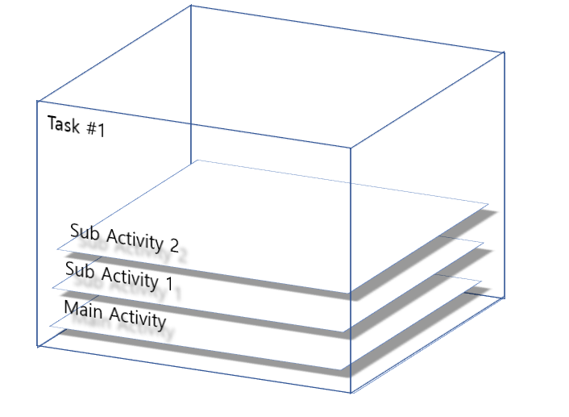

Object Detection 논문의 발전 과정에 대해 알아보겠습니다.

# Object Dection

먼저 Object dection은 Classification과 Regression(물체의 위치를 찾는 문제) 2개의 문제로 이루어져 있습니다.
즉 이미지 내에서 각 사물의 위치와 클래스를 찾는 작업을 의미합니다.

Object Detection은 1-stage와 2-stage 2가지 방향으로 발전되어 왔습니다.
먼저 1-stage는 분류와 위치 문제를 한번에 해결하는 방식으로 대표적인 알고리즘으로 yolo가 있습니다. 
2-stage는 각 위치에 대한 특징을 추출한 다음, 이를 통해 분류 문제를 해결하는 것입니다. 2-stage는 R-CNN을 기반으로 발전되어 왔는데 자세한 내용은 뒤에서 다뤄보겠습니다.

# 1-stage

## YOLO
## (You Only Look Once)

### 원리

Yolo는

Non-max suppression: 한 물체에 대해 하나의 bounding box를 가져야 하므로 가장 높은 것을 선택하고 나머지 낮은 확률을 가지는 bounding box들을 제거한다.

1)	확률(0<= x<=1), bounding box의 위치와 크기에 대한 prediction output이 나온다
2)	Class에 대한 확률 p가 0.6보다 작거나 같은 모든 bounding box들을 버린다
3)	남은 box 중 가장 큰 p를 갖는 박스를 고른다 => output
4)	3)에서 나온 박스들 중 IoU가 0.5이상인 어떤 박스가 있다면 모두 버린다

# 2-stage

### R-CNN: Regions with CNN features (CVPR 2014)

R-CNN은 CNN을 이용하여 각 Region의 class를 분류하는 가장 기본이 되는 아키텍처 입니다.

아래와 같은 방식으로 동작합니다.

1) Selective search를 이용하여 2000개의 ROI(Region of Interest) 추출합니다. (ROI는 Region of Interest의 약자로 물체가 있을 법한 흥미가 있는 부분을 의미합니다)
2) 각 ROI에 대하여 warping을 수행하여 동일한 크기의 입력 이미지로 변경합니다.
3) Warping된 image를 forward 방향의 CNN에 넣어서 이미지 feature 추출합니다. 이때, feature는 각각의 클래스에 대해 독립적으로 추출됩니다.
4) 추출된 feature를 클래스의 개수만큼 존재하는 이진 SVM에 넣어 클래스(class) 분류 결과를 얻습니다.
5) 해당 feature를 regressor에 넣어 위치(bounding box)를 예측합니다.

R-CNN은 2014년 기준 좋은 성능을 보여주었지만 몇 가지 한계점이 존재합니다.

입력 이미지에 대해서 cpu기반의 selective search를 진행해야 하고, 모든 ROI를 CNN에 넣어야 하기 때문에 2000번의 CNN연산이 필요합니다.
그래서 training과 testing과정에 많은 시간이 소요됩니다.
또 SVM, Regressor 모듈이 분리되어 있어서 SVM과 바운딩 박스 regression으로 CNN을 업데이트하는 것이 불가능 합니다. 즉 end-to-end 방식으로 학습할 수 없습니다.

### Fast R-CNN (ICCV 2015)

Fast R-CNN은 R-CNN과 달리 이미지를 CNN에 한번만 넣어서 Feature map을 생성합니다.
이렇게 나온 feature map은 원본 이미지에서의 위치에 대한 정보를 포함하고 있기 때문에 Feature map에 ROI Projection을 시켜 feature map 상에서 물체가 존재할 법한 위치를 찾습니다.
다음은 ROI pooling을 거쳐서 얻은 위치 정보에 대해 물체의 특징 ROI feature vector 추출합니다.
이 벡터로 softmax와 bounding box regression을 진행하여 분류와 regression 문제를 해결합니다.
분류를 위해 fully-conntected layer를 이용할 것이기 때문에 max pooling을 이용해서 고정된 크기의 벡터를 생성합니다.

예를 들어 2by2 feature를 추출한다면 ROI feature map이 2by2로 적절히 나누어지도록 하기 위해 왼쪽 그림처럼 나누고 각 부분마다 가장 큰 값을 고릅니다.
Roi feature vector에 대해 softmax와 regressor을 통과하여 문제를 해결합니다.
RCNN과 달리 svm 대신 softmax 사용합니다.

Fast r-cnn에서 가장 핵심이 되는 부분은 roi pooling layer라고 할 수 있습니다.

### Faster R-CNN (NIPS 2015)

Fast R-CNN + RPN

Faster R-CNN은 RPN을 이용하여 Resion Proposal을 GPU에서 수행하여 처리 시간을 줄였습니다.
모든 과정을 초당 5장의 이미지 처리 가능하고, 2015년도 당시 실시간으로 활용하였습니다.
각 이미지당 300개의 dataset으로 학습하였습니다.

Faster RCNN은 CPU로 1초당 2초 걸립니다.
Region proposal을 GPU로 올려서 한 이미지당 10ms안에 수행하도록 하였습니다.
Image에서 convolution layer를 거쳐 feature maps을 만들었는데 이 부분은 region proposal과 Detection network에도 사용되기 때문에 cost-free 합니다.
이 둘을 합치기 위해 RPN과 Fast R-CNN과정을 번갈아 fine-tuning하며 학습 진행하여서 빠르게 network 수렴하고 convolutional feature 적절히 공유할 수 있었습니다.

한장의 image를 convolution layer에 넣어서 feature map을 만들고
anchor boxes를 sliding window 방식으로 이동하면서 mapping해서 intermediate layer 만듭니다.
intermediate layer가 classification layer와 regression layer를 거쳐서
 물체가 존재하는지 존재하지 않는지
4k 물체가 어디에 존재하는지 그 중심의 가로와 세로 너비 높이 예측합니다. 
예를 들어서 k=9 이면, 
1by1 1by2 2by1 3가지 비율을 3가지 scale로 총 9개의 anchor boxes를 이용합니다.
물체 위치 상당히 정확하게 예측하는 결과를 보여주었습니다.

Translation-invariant 이동 불변성 좋은 특성 
왼쪽 가운데 오른쪽과 같이, 입력의 위치가 바뀌어도 결과는 같은 동상이라고 인식하는 것을 의미합니다.

기존의 방식은 다양한 크기의 이미지에 각각의 feature map을 적용해서 시간이 오래 걸렸지만 
Pyramid of image는 한 크기의 이미지에 여러 비율과 크기의 anchor box를 사용했습니다.
즉 pyramid 형식의 anchor라고 볼 수 있습니다.

