## 여정의 시작

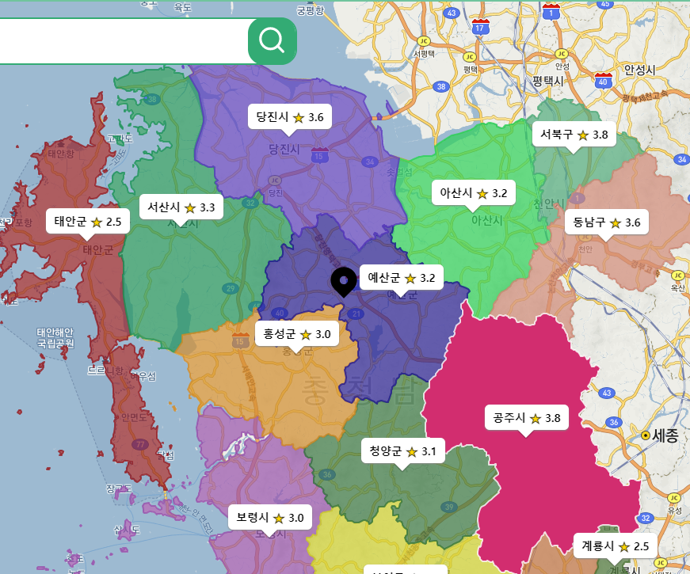

- 지도를 예쁘게 꾸며보고 싶었다. "폴리곤"
- 지도 위에 폴리곤을 그리는 API는 [Kakao Map API](https://apis.map.kakao.com/web/sample/drawShape/)에서 제공한다.
- 폴리곤을 이루는 점들의 좌표를 하나하나 넣어주면, 그걸 이어서 그려주는 방식이다.
- 행정구역 경계 좌표는 [통계지리정보서비스에서 API](https://sgis.kostat.go.kr/developer/html/openApi/api/data.html#54)를 제공한다. (제공하는 좌표가 위도/경도가 아니라서 삽질한 것은 또다른 얘기...)
- 데이터는 얻었고, 방법도 알아서 구현을 했는데.. 느리다!

## MySQL vs MongoDB

### MySQL을 선택한 이유

- 가장 익숙하다
- 지도 정보인 위도와 경도를 지원하는 Type이 있다

### MongoDB로 변경한 이유

- 지도 경계좌표가 단일화된 구조를 가지고 있지 않아서 유연성 있는 스키마가 필요하다
- MongoDB의 샤딩을 통해서 추후에 서비스의 규모가 커졌을 때 수평적 확장을 할 수 있다
- MongoDB는 객체 기반으로 NodeJS에서 테이블 기반의 MySQL보다 더 적합하다

## 데이터 구조

### 1. 임베딩구조

MongoDB를 선택하고 **Atlas**로 클러스터를 하나 만들어서 구현을 시작했다. (복선)

행정 구역은 계층적인 구조를 가지고 있다.

- e.g. 서울특별시 → 서울특별시 강남구 → 서울특별시 강남구 청담동
- 이러한 구조를 반영하기 위해 처음에는 다음과 같은 구조로 DB에 좌표 정보들을 저장했다.

```jsx
    [
        {
            address: '서울특별시',
            code: 11, // 행정구역코드
            center: [37.56669009036455,126.97834782835902], // 중심 좌표
            type: 'Polygon',
            path: [[37.XXX, 126.XXX], ...], // 수십 개의 경계 좌표
            children: [
                {
                    address: '서울특별시 금천구',
                    code: 11180,
                    center: [37.46054859031183,126.90085018751672],
                    type: 'Polygon',
                    path: [[37.XXX, 126.XXX], ...],
                    children: [
                        ... // 서울특별시 금천구 하위 동들
                    ]
                },
                ...
            ],
        },
    ...
    ]
```

- 그 결과 컬렉션에는 17개의 도큐먼트(특별시, 광역시, 도)만 남게 되었고, 쿼리는 결국 최상위Document를 찾기 때문에 "서울특별시 금천구" 하위 동들의 경계좌표만 불러오려 해도 "서울특별시" Document 전체를 불러와야 했다. 간단히 말해 저런 구조로는 우리가 원하는 쿼리를 잘 짤 수가 없다.
- 저렇게 가져온 후에, {code: 11, children.code: 11010, ...}와 같이 선택할 수는 있으나, 이는 우리가 원하는 형태가 아니었다.
        > 결국 document를 17개만 가지고 있고, 안에 정보가 3천개쯤 있으니 전혀 효율적이지 못하다...

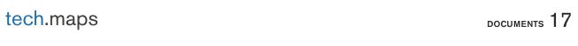

- document의 갯수가 17개만 있는걸 볼 수 있다.

### 2. 1차원 구조

데이터를 자세히 살펴보다가 아래와 같이 **code**가 각 지명에 주어졌고 지역의 포함관계를 나타내 준다는 것을 알게 되었습니다.

- 서울특별시 : **11**
- 서울특별시 종로구 : **11**010
- 서울특별시 종로구 종로1동 : **11010**53

```jsx
    [
        {
            address: '서울특별시',
            code: 11, // 행정구역코드
            center: [37.56669009036455,126.97834782835902], // 중심 좌표
            type: 'Polygon',
            path: [[37.XXX, 126.XXX], ...], // 수십 개의 경계 좌표
        },
        {
            address: '서울특별시 금천구',
                    code: 11180,
                    center: [37.46054859031183,126.90085018751672],
                    type: 'Polygon',
                    path: [[37.XXX, 126.XXX], ...],
        },
        ...
    ]
```

이를 이용해 계층적으로 데이터 구조를 표현하지 않아도 지역들의 포함관계를 사용할 수 있게 되었고, document 하나당 지역 하나를 넣어 수평으로 만들기로 하였습니다.

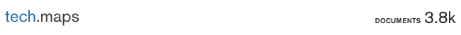

- document의 갯수가 3800개로 늘어났다.
- 이제 쿼리를 날려서 원하는 document를 얻을 수 있게 되었다.

## MongoDB Indexing

그런데, 문제는 **속도**였다. API로 원하는 정보를 가져올 때 걸리는 속도가 아주 달팽이🐌


### 인덱싱 공부

mongodb는 인덱스의 종류를 크게 2가지로 볼 수 있다.

1. 일반적인 오름차순 / 내림차순 정렬
    - 순서대로 정렬하여 값을 비교하는 로직
2. text 인덱스
    - 역 인덱싱같은 과정을 거쳐서 전문 검색을 할수 있도록 하는 방식

### 인덱스 적용

1. 일반적인 인덱스

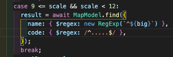

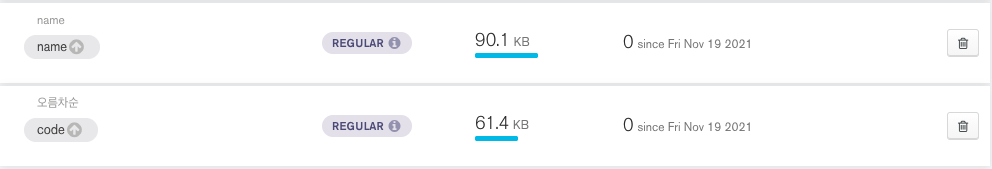

우리는 code, name에 regex쿼리를 날리므로, code와 name에 오름차순 인덱스를 걸었다.

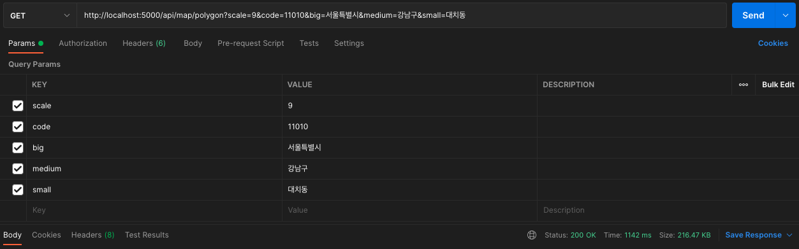

정말 놀랍게도 단 1도빨라지지 않았다. 그래서, 인덱스가 사용된건지 확인을 해보았다.

분명히 사용되었는데, 속도는 안빨라졌다...?

1. text 인덱스 with 일반적인 인덱스

> code: name + name: string을 함께 사용

regex쿼리는 인덱스를 타도 속도가 별로 안빨라진다고 생각하고 text인덱스를 사용, text query를 날려보았다.

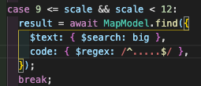

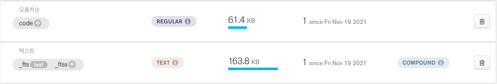

인덱스는 잘 타는것 같다.

> 로직상 code 길이와 함께 비교해야해서 code도 인덱스를 그대로 사용하였다.

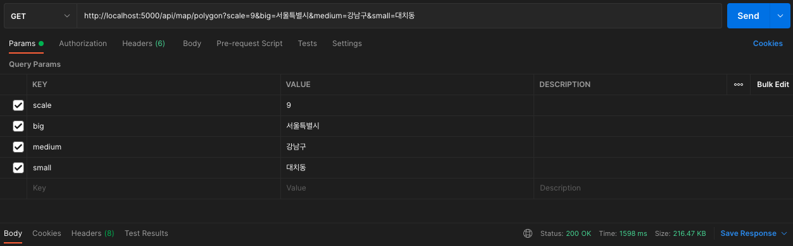

그래도 달팽이...🐌

1. 복합 인덱스

복합 인덱스도 사용을 해보았다. 똑같이 느렸다...

> 사진은 찍어놓은게 없어서... pass

## 최적화 과정

### 요약

> 💡 디바운싱(시도) → Drag & Drop
>
> 💡 상태 관리 / LFU 캐싱 기반 API 요청 줄이기
>
> 💡 Atlas region 문제(America -> Japan -> NCloud)
>
> 💡 simplify.js

### 디바운싱(시도) → Drag & Drop

중심좌표에 맞추어 지도를 그리려 하였고 지도맵을 드래그 해서 이동할 때 카카오 맵에서 계속해서 변화된 중심좌표에 대해 요청을 보낸다는 것을 알았다.

그래서 처음 생각한 것은 디바운싱으로 일정 시간이 지날 때마다 폴리곤을 그려주었다.

하지만 카카오 맵에서 드래그가 끝난 시점에 이벤트를 달아주는 api를 제공한다는 것을 알고 이를 적용해 드랍 시점에서 폴리곤을 재생성하는 로직으로 수정하였다.

- 중심좌표를 감지

```java
kakao.maps.event.addListener(kakaoMap, 'center_changed', changeCenter);
```


- Drag & Drop

```java
kakao.maps.event.addListener(kakaoMap, 'dragend', changeCenter);
```


### 상태 관리 / LFU 캐싱 기반 API 요청 줄이기

"폴리곤을 불러오는 속도를 줄이는 최적화"와는 직접적으로 관련이 없는 이야기.

요약: 상태관리를 잘해서 서버에 `fetch` 요청을 줄여 서버와 클라이언트 부하를 줄였다. (돌이켜보니 당연히 해야했던 작업..)

1. **폴리곤이 안정적으로 그려지기는 하기 시작할 때에 한가지 거슬리는 문제점을 발견하였다.**

- 예를 들어 같은 "경기도" 내에서 움직이고 있는데, 폴리곤이 깜빡깜빡거리며 다시 그려지는 것.


깜빡이며 그려지는 폴리곤

- Drag 가 발생할 때마다...  
    > 지도의 중심 좌표가 변하고
    > 중심 좌표가 변할때마다 새로운 `fetch`요청을 보내도록 해 놓았기 때문에 발생한 문제였다.
- 다음 `useEffect` 훅의 dependency list를 주목!

```tsx
useEffect(() => {
    if (!map) return;

    const managePolygon = async () => {
        // 중심 좌표의 주소 가져오기
        const region = (await coordToRegionCode(latitude, longitude)) as {
            result: Array<string>;
            status: string;
        };

        if (region.status !== 'OK') return;
        // 백엔드 요청
        const regions = await requestCoord(scale, region.result);
        // 폴리곤 그리기
        polygonInstances.current = drawPolygon(
        map,
        regions,
        polygonInstances.current,
        );
    };

    managePolygon();

    return () => {
        if (polygonInstances.current !== null) {
        deletePolygon(polygonInstances.current);
        }
    };
    }, [map, **scale, latitude, longitude**]);
```

- `scale`(축척)에서 확인할 수 있듯 줌인/줌아웃 할때도 같은 폴리곤을 재차 요청할 수 있는 코드다.
- **"경기도 내에서 움직이고 있으면 폴리곤은 그대로 있어야 하는 것 아닌가?"**
- 더 나아간 솔루션 중 한 가지가 **캐싱**이며, 다음에서 시도
- 또다른 방법으로 **"상태관리"**를 통한 솔루션을 시도해볼 수 있었다.

1. **"어느 지역의 어느 단위의 폴리곤들을 그려야 하는가"를 결정하는 데에는 지도의 중심의 주소와 축척 `scale` 이 함께 사용된다.**

- 백엔드에서 폴리곤에 대한 쿼리를 할 때 지도 중심의 (동단위까지의) 주소를 모두 사용하지는 않는다.
- 축척 `scale` 에 따라 "경기도"까지만 끊든가 "경기도 의정부시"까지 끊어서 처리를 하는 부분이 있다.

```tsx
const queryPolygon = async (
    scale: number,
    big: string,
    medium: string,
    small: string,
) => {
    let result: Map[] = [];

    switch (true) {
    case scale < 9:
        result = await MapModel.find({
        name: { $regex: new RegExp(**`^${big} ${medium}`**) },
        code: { $regex: /^.......$/ },
        });
        break;
    case 9 <= scale && scale < 12:
        result = await MapModel.find({
        name: { $regex: new RegExp(**`^${big}`**) },
        code: { $regex: /^.....$/ },
        });
        break;
    case 12 <= scale:
        result = await MapModel.find({
        code: { $regex: /^..$/ },
        });
        break;
    }
    return result;
};
```

- 이러한 로직을 차용한 `range`라는 새로운 상태를 도입하였으며, 이 `range`가 달라질 때에만 `fetch` 요청을 보내도록 수정하였다.

```tsx
useEffect(() => {
    const updateRange = async () => {
        const { latitude, longitude, scale } = position;
            // 지도 중심점의 주소를 요청
        const region = (await coordToRegionCode(latitude, longitude)) as {
        result: Array<string>;
        status: string;
        };
        if (region.status !== kakao.maps.services.Status.OK) return;

            // 축척과 주소를 가지고 새로운 range 생성
        **const newRange = {
        region: region.result,
        scale: scale,
        };**

            // 이전 range 상태와 비교 후 달라졌을 때만 업데이트
            // isRangeEqual()은 위 로직을 차용한 비교 함수
        **setRange((oldRange) => {
        if (isRangeEqual(oldRange, newRange)) return oldRange;
        return newRange;
        });**
    };
    updateRange();
    }, [position]);

useEffect(() => {
    const { scale, region } = range;
    const updatePolygons = async () => {
        const regions = await requestCoord(scale, region);
        const polygons = createPolygons(regions);
        setPolygons(polygons);
    };
    updatePolygons();
    }, [**range**]);
```


1. **깨끗해진 네트워크 탭을 보니 마음이 편안해졌다.**

- 불필요한 요청을 줄임으로써 서버와 클라이언트의 부하를 꽤 줄일 수 있었다.

### LFU 캐싱

우리 서비스는 지도가 움직일 때마다 요청을 받아와야해서 **1.5초(개별 지역 단위)는 정말 느린 속도**여서 큰 문제였다...

그래서, 캐싱을 통해서 아예 요청을 보내지 않도록 해야겠다고 생각했다.

챌린지때 공부하였던 LRU, LFU를 떠올렸다.

- LRU: Last Recently Used
- LFU: Last Fequently Used

 사용 빈도에 따른 LFU캐싱 정책을 사용하기로 했다.

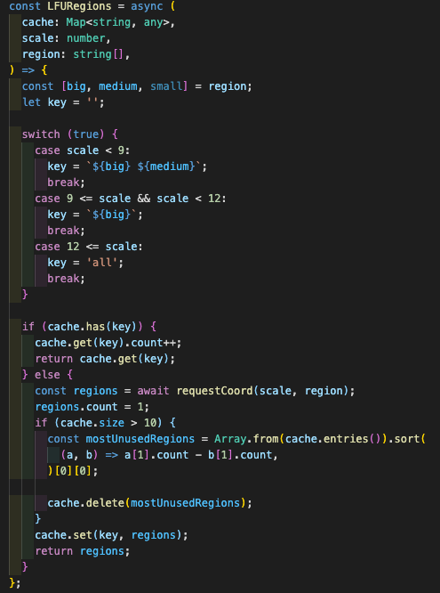

이러한 코드를 사용해서 최대 10개까지 최근 사용한 내용을 캐싱하도록 하였다.

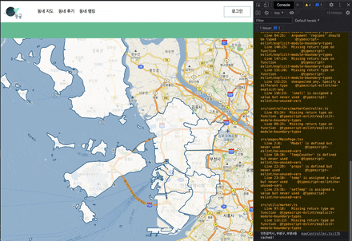

### Simplify.js로 데이터 용량 감축

하지만 전국단위 초기 렌더링 시 여전히 10초 단위의 오랜 시간이 걸려서 전체 폴리곤이 그려질 정도로 느렸다. 따라서 추가적으로 성능을 높일 수 있는 방법에 대해 Survey를 진행했고 그 결과 simplify 라는 Library를 알아볼 수 있었다.

대한민국의 GeoJSON 데이터 파일은 약 50MB 인데, 이를 simplify를 통해 훨씬 작은 사이즈로 만들 방법이 있다는 것을 확인할 수 있었다.

아래의 웹 페이지에서 확인할 수 있듯이, simplify는 기존의 모양을 유지하면서 선을 이루는 좌표의 수를 매우 줄일 수 있는 라이브러리로 이를 통해 고성능의 processing이 가능해졌다.

[https://mourner.github.io/simplify-js/](https://mourner.github.io/simplify-js/)

해당 라이브러리를 적용해 좌표를 줄이니 약 20MB 수준이 되었고, 해당 수준으로 약간의 성능 차이를 더 볼 수 있었으나 큰 차이는 없었다.

관련 코드는 다음과 같다.

```jsx
const transPolygon = (path: CoordType[]) => {
  const simplifiedPath: Point[] = simplify(
    path.map((coord) => ({ x: coord[0], y: coord[1] } as Point)),
    5,
    true,
  );
  return simplifiedPath.map((coord) =>
    transCoord(Object.values(coord) as CoordType),
  );
};
```

- simplify 전

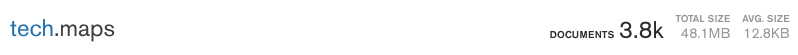

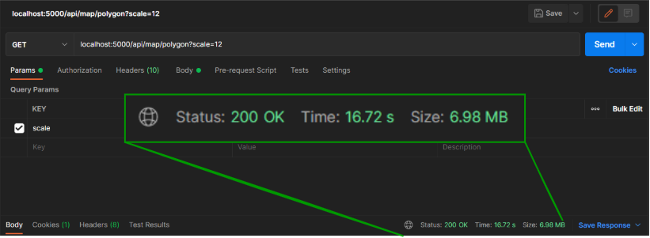

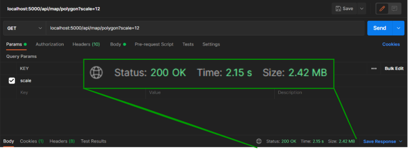

- simplify 후

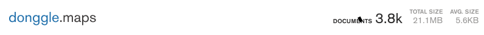


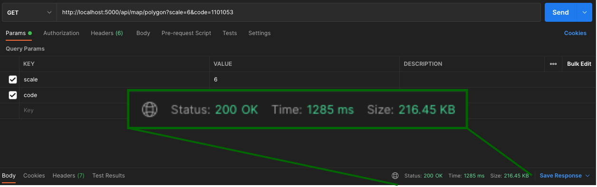

### MongoDB Region에 따른 쿼리 속도

캐싱과 Map Shape를 진행했음에도 초기 로딩 속도가 여전히 느리고 **(전체 맵 기준 약 3~10초)** 맵의 크기가 커질 수록 로딩 속도가 현저히 차이나는 것을 확인하였다.

아래와 같이, Map Scale 크기에 따라 로딩 속도가 크게 차이나는 것을 확인할 수 있었고 매 렌더링 시마다 편차가 크게 나타나는 것을 확인하고 혹시 네트워크 문제는 아닐까라는 의심을 하게 되었다.

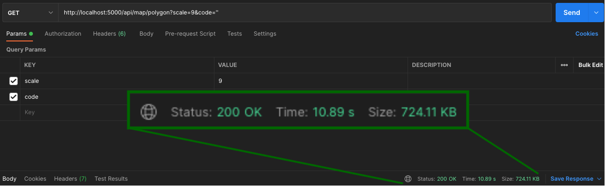


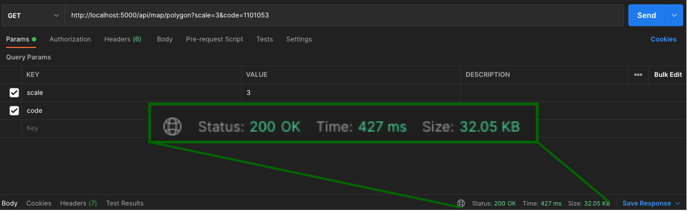

우리 팀에서 사용하는 Atlas MongoDB가 미국 Region에 생성되어 있다는 것을 알았고 이후 일본 Region이 지원되는 것을 확인하여 하나의 Cluster를 추가 생성하여 속도 차이를 알아보았다.

그리고, 쿼리의 속도는 빠른건지 테스트를 해보았는데...

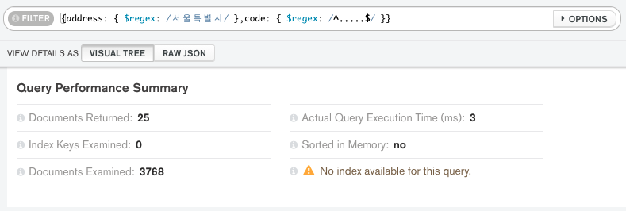

쿼리의 속도는 **0.003초?** 였다...

> 몽고디비는 20 ~ 50메가바이트 정도는 거의 0초만에 쿼리를 할 수 있었다...

확인해보니, 전체 맵 로딩 속도가 현격히 빨리진 것을 확인할 수 있었다. 아래의 GIF를 통해 그 차이를 확인하였다.

위의 GIF는 미국 Region에서의 최초 페이지 렌더링 테스트 결과이며, 아래는 일본 Region에서의 최초 페이지 렌더링 테스트 결과이다.


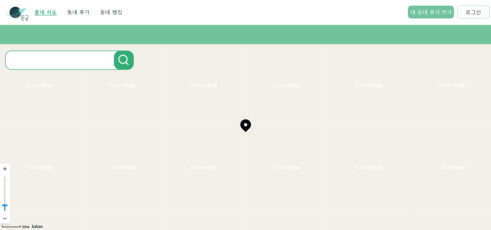
