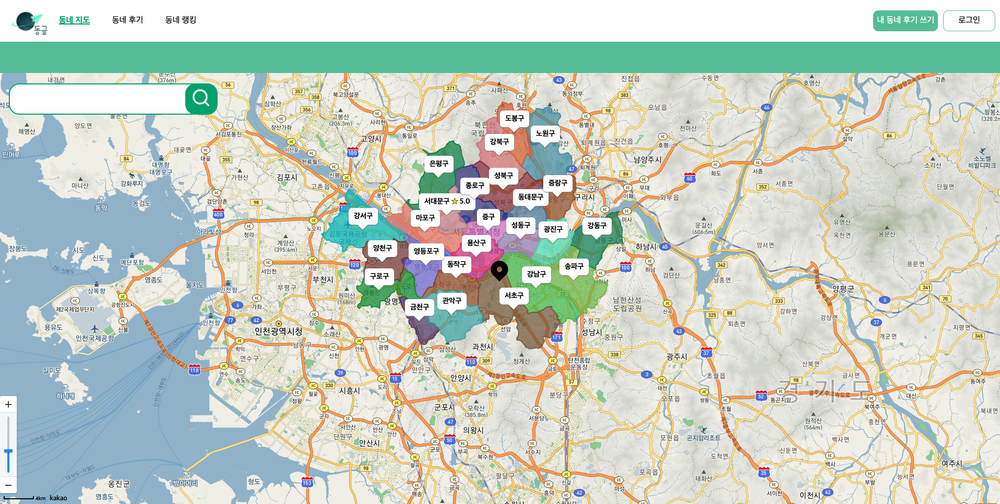
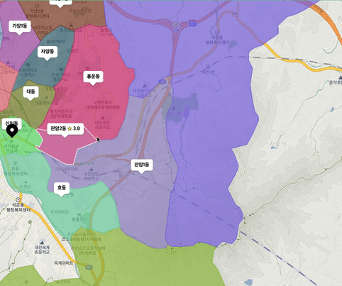
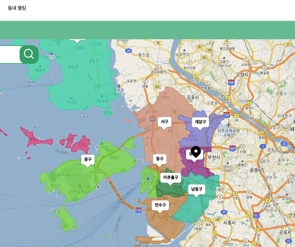
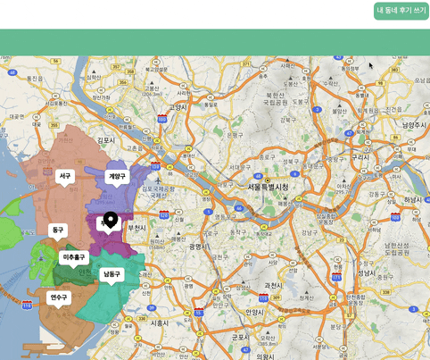
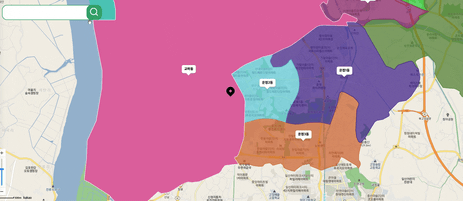
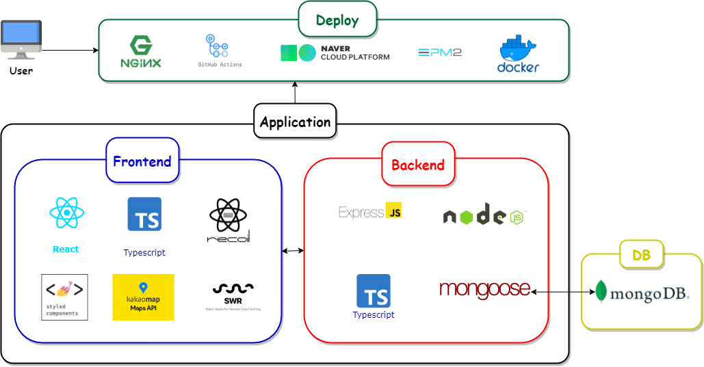

## 동글 프로젝트에 대해 소개합니다

네이버 부스트캠프 6기 마지막 6주 동안 진행한 프로젝트 '동글'에 대해 소개합니다. '동글'은 😄동네 거주 후기(글) 공유 서비스😊입니다.

- Github: [https://github.com/boostcampwm-2021/Web11-Donggle](https://github.com/boostcampwm-2021/Web11-Donggle)
- Member: [문혜현](https://github.com/hyehyeonmoon), [송명회](https://github.com/mhsong95), [홍정우](https://github.com/hongjw1938), [홍승용](https://github.com/isanghaessi)
- 데모영상: [https://youtu.be/GMe61zuP8po](https://youtu.be/GMe61zuP8po)
- 배포 URL: [https://boost.boost-donggle.kro.kr/](https://boost.boost-donggle.kro.kr/)
- Notion 원본: [동글 프로젝트 소개](https://cooperative-decision-4e6.notion.site/d2eb2062764c4e45a229af84bae35515)

## 프로젝트 개요 🎻

💡 **내 동네를 평가하고 지도에서 한눈에 다른 동네의 평점과 후기를 볼 수 있는 서비스 입니다.**  
🔢 **우리 동네의 다양한 기준에 대하여 평점🌟을 남기고, 다른 동네의 분위기를 엿볼 수 있습니다. 어느 동네가 살기 좋은지 재미로 동네의 랭킹🎖도 볼수 있게 하였습니다.**  
🏡 **지도 API와 MongoDB를 활용한 빠른 성능에 주목하여 개발하였습니다!**

## 🧩기능

### 🏡 축척에 맞춘 행정지역 폴리곤 생성

- 지도에서 화면을 이동하거나 줌인/줌아웃 할때마다 지역과 축척에 맞는 폴리곤이 그려집니다.
- 지역마다 평점을 확인할 수 있는 마커가 표시됩니다.

### 🏡 **지도에서 동네별 평점과 후기 확인하기**

- 마커에 마우스를 올리면 치안, 교통, 음식, 놀거리 항목별 평점이 표시됩니다.
- 마커 또는 폴리곤을 클릭하면 그 동네의 평점과 후기들을 볼 수 있는 사이드바가 열립니다.

### 🏡 **동네별 랭킹 보기**

- 화면 상단 "동네 랭킹" 메뉴를 클릭하면 동네별 랭킹을 확인할 수 있는 창이 표시됩니다.
- `광역시 · 도`, `시 · 군 · 구` 메뉴로 지역을 선택해 원하는 지역의 평점 순위를 확인할 수 있습니다.

### 🏡 **내가 사는 동네 평점과 후기 남기기**

- 로그인 후 화면 상단 `내 동네 후기 쓰기` 버튼을 클릭하여 내가 살고있는 동네에 별점을 남기고 후기를 작성할 수 있습니다.

### 🏡 **지역 검색**

- 지도 왼쪽 위 검색바에서 우리나라 행정구역들을 검색할 수 있습니다.
- 드롭다운 목록에 나타난 지역명을 클릭하면 해당 지역으로 이동합니다.
- 지역의 단위에 따라 적절한 축척으로 변화합니다.

## 🛠기술 스택과 이유

### 💙 **React 기반 렌더링**

- React Hook 기반의 SPA 구축 및 손쉬운 상태 관리 시스템 활용
- 상태 기반 컴포넌트 분리 및 useCallback등의 hook을 통한 성능 향상
- 가상 DOM 기반의 Reconciliation 알고리즘으로 DOM 조작 최소화를 통한 성능 향상

### 📬 **Github Action 기반의 자동 배포**

- 스크립트 기반의 자동화된 빌드 및 배포 환경 구축
- docker를 사용한 자동화 배포 구축

### 🏡 **Kakao MAP API 기반의 지도 조작**

- 잘 정리된 Documentation 기반 빠른 개발
- 빠른 렌더링, 저렴한 요금

### 📀 **MongoDB(NoSQL) 활용**

- 단일 구조가 아닌 데이터 저장에 유연한 스키마 활용
- 샤딩을 이용한 효율적 서비스 확장 고려

### 🅰  **TypeScript 기반 타입 명시**

- 명확한 데이터 타입 설정을 통한 Compile 간 버그 확인
- 타입 명시를 통한 유지보수 및 협업 용이

## 우리의 노오력 🔥

## [1] 폴리곤 렌더링 최적화를 위한 여행: 백엔드부터 프론트까지

처음으로 지도에 폴리곤을 그리는 기능을 구현했을 때, 성능이 매우 만족스럽지는 않았습니다.  
"어떻게 하면 더 빨리 그리도록할 수 있을까?" 하는 문제를 해결하기 위해 백엔드와 프론트엔드 각각에서 다양한 노력을 시도했습니다.

- [스토리를 곁들인 전체 과정](https://www.notion.so/a17551116705446c985dbe398159adff)

> ### [1-1] 백엔드의 최적화 과정

- Document 구조에 대한 고민 [★ [더 보기](https://www.notion.so/a17551116705446c985dbe398159adff)]
- 다양한 인덱스를 활용한 쿼리 최적화 시도 [★ [더 보기](https://www.notion.so/a17551116705446c985dbe398159adff)]
- [simplify.js](https://mourner.github.io/simplify-js/)의 폴리곤 단순화를 통한 용량 감소 [★ [더 보기](https://www.notion.so/a17551116705446c985dbe398159adff)]

> ### [1-2] 프론트엔드의 최적화 과정

- 디바운싱(시도) → Drag & Drop   [★ [더 보기](https://www.notion.so/a17551116705446c985dbe398159adff)]
- 상태 관리 / LFU 캐싱 기반 API 요청 줄이기 [★ [더 보기](https://www.notion.so/a17551116705446c985dbe398159adff)]
- SWR을 활용한 캐싱 일반화 [★ [더 보기](https://www.notion.so/SWR-c4f6b862fe9d4aefa52a4cbb78eef052)]

## [2] 기술적인 고민과 도전

> ### [2-1] [Lazy Loading](https://ko.reactjs.org/docs/code-splitting.html)을 통한 첫 렌더링 최적화

- Code 분할, Bundle 사이즈 최소화
- TTI(Time To Interaction) 시간 최소화
- **[★ [더 보기](https://www.notion.so/Lazy-Loading-329d88595d66464691d78cf802783113)]**

> ### [2-2] React.memo와 React Router 고려한 웹 최적화

- Modal을 라우트로 관리하며 발생한 배경 재렌더링 문제
- `React.memo`를 활용하여 불필요한 재렌더링 최소화
- [★ [더 보기](https://www.notion.so/React-memo-ff50e899f2db4489bd3a31a50658c0dd)]

> ### [2-3] [Intersection Observer API](https://developer.mozilla.org/ko/docs/Web/API/Intersection_Observer_API)를 활용한 무한 스크롤

- 사용자 페이지 이동 없는 무한 스크롤 구현
- 페이지 스크롤 시 데이터의 지연 로딩(Lazy loading)
- [★ [더 보기](https://www.notion.so/Intersection-Observer-API-520bfc7bbbbf4a78a41e225491bd2bea)]

> ### [2-4]JWT HTTPS Cookie 사용해 보안을 고려한 로그인

- 쿠키, 세션, JWT 중 JWT를 선택
- XSS, CSRF 등 보안의 위험성을 고려
- HTTPS와 Secure, Http Only Cookie를 적용
- [★ [더 보기](https://www.notion.so/JWT-HTTPS-Cookie-e7c695703d2e489dad08a85baf4ac68a)]

> ### [2-5] Nginx 설정 및 부하 테스트 수행

- Nginx를 사용해 Reverse Proxy와 HTTPS를 적용 [★ [더 보기](https://www.notion.so/Nginx-PM2-reload-7b1f8acefaae40e68f8584bead217411)]
- Gzip 압축 [★ [더 보기](https://www.notion.so/Gzip-3670ef9707344cbf88bb279194406634)]  
- PM2 부하 테스트 [★ [더 보기](https://www.notion.so/PM2-51771f7d30114fb2ad6e822c2acee2b3)]

> ### [2-6] Docker와 Docker Compose를 이용한 인프라 구성

- Docker 기반 빠른 배포 환경 구축
- Docker Compose 기반 복수 Container 환경 관리
- Github Action을 통한 CD
- [★ [더 보기](https://www.notion.so/Docker-Docker-Compose-github-actions-CD-209bb4cd88374fe4ae44080f47e35819)]

## 협업 과정 🤲

> 기능별 담당을 정하여 프론트와 백엔드를 넘나들며 풀스택으로 개발
>
> 새로운 기능에 대한 도전을 지향!! 함께 성장하는 과정을 장려!!

### 👐[**Github 120% 활용! Issue,Project,Wiki 사용**](https://github.com/boostcampwm-2021/Web11-Donggle/issues)

- Issue와 Project를 통해 일을 분배하고 프로젝트 진행 상황을 공유
- Wiki에서 모든 문서를 공유하며 협업

### 🙌**[같이 알자! 기술 공유 세미나](https://www.notion.so/7ccfcd454cd247ebbe1b4b4ed54fa245)**

- 매주 기술 공유 세미나를 가짐
- 외에도 짧은 글을 남겨 기술들을 공유하려 노력

### 🙋[**적극적인 PR리뷰와 피드백**](https://github.com/boostcampwm-2021/Web11-Donggle/pulls)

- 1개의 PR에 세 명의 리뷰가 달린 후 Merge
- 과정 공유와 활발한 피드백

### 👨 **팀원의 고민은 팀의 고민! 쿼드 프로그래밍**

- 한 사람이 어려움을 요청하면 함께 ZOOM에 모여 해결해 나감
- 개발하고 싶은 기능이 같다면 한 명에게 몰아주지 않고 페어 프로그래밍을 지향함
