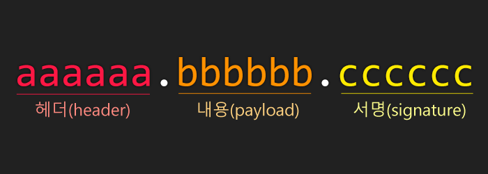
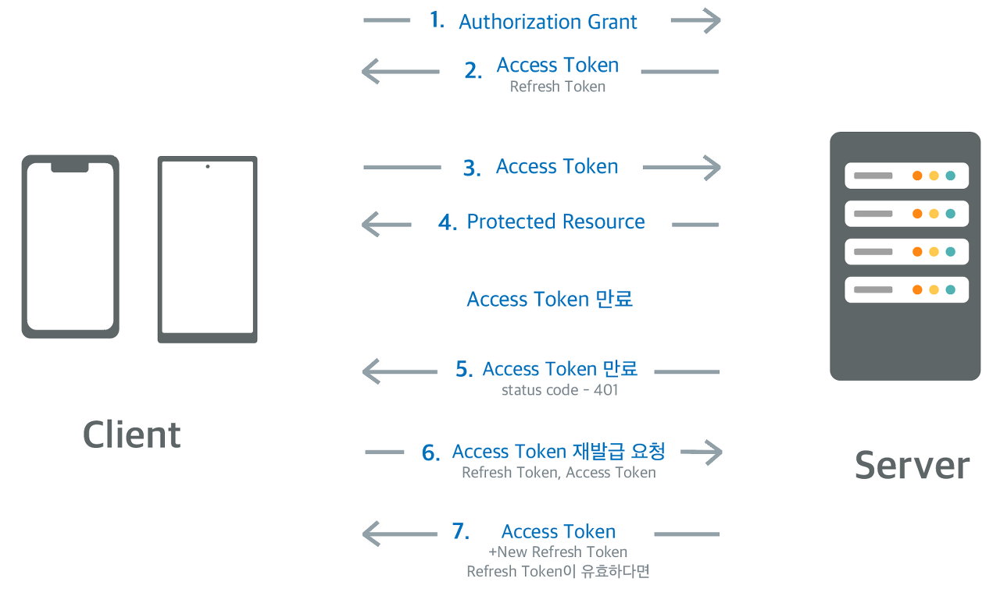

> Frontend팀의 12월 테크톡을 바탕으로 작성한 포스팅입니다.

웹사이트를 제작할 때 어떤 기능이 필수적이라고 생각하시나요?
웹사이트를 제작할 때 사용자에게 맞춤형 서비스를 제공하기 위해서는 **로그인** 기능을 필수적으로 고려해야 합니다.
로그인 기능을 구현할 때 사용하는 인증방식인 쿠키와 세션에 대해 알아보고 이 둘을 보완할 수 있는 방법인 JWT에 대해 살펴보고자 합니다.

## 쿠키와 세션을 사용하는 이유

웹 브라우저와 웹 서버가 데이터를 주고 받을 때 HTTP(HyperText Transfer Protocol) 통신을 이용합니다.
HTTP는 서버의 부담을 줄이기 위해 비연결성(Connectionless)과 비상태성(Stateless) 특징을 가집니다.
서버가 클라이언트 요청에 대한 응답을 하면 연결이 끊어지고 클라이언트가 다시 요청하면 서버는 이전 요청에 대한 정보를 지니고 있지 않습니다.
이로 인해 같은 사용자가 여러 번 요청하더라도 매번 새로운 사용자로 인식하게 됩니다.
하지만 로그인이나 장바구니처럼 클라이언트의 상태가 유지되어야 하는 상황이 생깁니다.
이때 쿠키와 세션을 사용하여 클라이언트의 상태 정보를 기억할 수 있습니다.

## 1. 쿠키

쿠키는 클라이언트에 저장되는 key와 value가 들어있는 작은 데이터 파일입니다.
쿠키는 정보들을 웹 브라우저에 저장하고 사용자가 요청하면 해당 정보를 함께 보내서 서버가 사용자를 식별할 수 있게 해줍니다.

쿠키를 사용하여 로그인하는 과정을 살펴봅시다.

1. 클라이언트가 아이디와 비밀번호를 입력하여 로그인에 성공합니다.
2. 서버는 쿠키를 생성하여 클라이언트에 전달합니다.
3. 클라이언트는 해당 쿠키를 웹 브라우저에 저장합니다.
4. 해당 사이트에 접속할 때마다 클라이언트는 서버에 쿠키를 함께 전송합니다.
5. 서버에서는 쿠키를 이용하여 로그인을 한 사용자인지 확인하는 인증을 진행하게 됩니다.

그러나 이때 쿠키는 웹 브라우저에 저장되어 사용자가 확인하고 변경할 수 있으므로 쿠키에 개인정보와 같이 중요한 정보를 담는 것은 위험합니다.
이러한 경우 **세션**을 통해 쿠키의 보안 문제를 해결할 수 있습니다.

## 2. 세션

쿠키가 클라이언트에 저장되는 정보라면 세션은 서버에 저장되는 정보입니다.
세션은 비밀번호와 같은 인증 정보를 쿠키에 저장하지 않고 서버에 저장하며 대신 쿠키에는 사용자 식별자인 `session-id`를 저장합니다.
이처럼 세션도 쿠키를 이용하지만 추정 불가능한 `session-id`를 주고받기 때문에 보안상 안전합니다.
따라서 노출되면 안 되는 중요한 정보는 세션을 이용하여 저장합니다.

세션을 이용한 로그인 과정을 살펴봅시다.

1. 클라이언트가 아이디와 비밀번호를 입력하여 로그인에 성공합니다.
2. 서버는 해당 클라이언트 고유의 `session-id`를 생성하고 상태 정보를 서버에 저장합니다.
3. 서버는 클라이언트에게 요청에 대한 응답과 `session-id`가 담긴 쿠키 파일을 함께 전송합니다.
4. 클라이언트는 쿠키를 사용하여 `session-id`를 저장합니다.
5. 클라이언트가 해당 사이트에 접속할 때, 서버로 `session-id`가 담긴 쿠키 파일을 함께 전달합니다.
6. 서버는 해당 요청의 쿠키 파일 내에 있는 `session-id`를 이용해 사용자를 식별합니다.
7. 클라이언트 종료 시 (브라우저 종료 시) `session-id`를 제거하고 서버에서도 세션을 제거합니다.

세션은 정보들이 서버에 저장되므로 사용자가 많아질수록 서버 메모리를 차지하여 서버에 부담이 된다는 단점이 있습니다.
또한 서버 메모리에 문제가 생기면 로그인한 사용자들이 모두 사라지는 상황이 발생하게 됩니다.
서버 메모리에 정보를 따로 저장해야 한다는 점을 보완하여 토큰 방식인 **JWT**가 등장하게 됩니다.

## 3. JWT

JWT란 JSON Web Token의 약자로 인증에 필요한 정보들을 암호화시킨 토큰을 의미합니다.
JWT 기반 인증은 쿠키/세션 방식과 유사하게 JWT를 HTTP 헤더에 실어 서버가 클라이언트를 식별합니다.
JWT는 사용자 인증에 필요한 모든 정보를 토큰 자체에 담고 있어서 쿠키/세션 방식과 달리 서버에 별도 저장소가 필요하지 않습니다.
따라서 JWT를 사용하면 정보들을 서버에 담아둠으로써 발생하는 문제점들을 해결할 수 있습니다.

### JWT의 구조



```JWT
eyJhbGciOiJIUzI1NiIsInR5cCI6IkpXVCJ9.
eyJzdWIiOiIxMjM0NTY3ODkwIiwibmFtZSI6IkpvaG4gRG9lIiwiaWF0IjoxNTE2MjM5MDIyfQ.
SflKxwRJSMeKKF2QT4fwpMeJf36POk6yJV_adQssw5c
```

JWT의 구조입니다. JWT는 위의 사진과 코드처럼 마침표(.)를 구분자로 `Header`, `Payload`, `Signature`로 이루어져 있습니다.
JWT를 구성하는 세 가지 부분에 대해 살펴보겠습니다.

[](https://jwt.io/#debugger-io)
_JWT 토큰을 검증하고 생성하는 디버거 웹 사이트 jwt.io_

#### 1. Header

첫 번째 부분인 `Header`는 두 가지의 정보를 가지고 있습니다.
`alg` 부분은 'HMAC SHA256'이나 'RSA'와 같은 해시 암호화 알고리즘을 지정합니다.
이 알고리즘은 `Signature` 부분에서 사용됩니다.
`typ` 부분은 토큰의 타입을 지정합니다.

```JSON
{
  "alg": "HS256",
  "typ": "JWT"
}
```

이 JSON은 base64로 인코딩되어 `Header`에 들어가게 됩니다.

#### 2. Payload

두 번째 부분인 `Payload`는 사용자 인증 관련 정보를 포함합니다.
클라이언트의 고유 ID 값 및 유효 기간 등이 포함되는 영역입니다.

`Payload`에 담는 key-value로 이루어진 정보의 한 조각을 클레임(claim)이라고 하는데 토큰에는 여러 개의 클레임들을 넣을 수 있습니다.

```JSON
{
  "sub": "1234567890",
  "name": "John Doe",
  "iat": 1516239022
}
```

이 JSON 역시 base64로 인코딩되어 `Payload`에 들어가게 됩니다.
이 부분은 수정이 가능해서 더 많은 정보를 추가할 수 있지만, 노출되는 영역이므로 인증에 필요한 최소한의 정보만 담아야 합니다.

#### 3. Signature

JWT의 마지막 부분인 `Signature`은 토큰의 유효성 검증을 할 때 사용하는 고유한 암호화 코드입니다.

`Signature`은 `Header`와 `Payload`를 base64로 각각 인코딩하고 서버의 '비밀 키(secret key)'를 이용하여 `Header`에서 정의한 `alg`으로 해싱한 뒤 이 값을 다시 base64로 인코딩하여 생성합니다.

```text
HMACSHA256(
  base64UrlEncode(header) + "." +
  base64UrlEncode(payload),
  your-256-bit-secret
)
```

`Header`와 `Payload`는 암호화되지 않으므로 누구나 디코딩하여 내용을 확인할 수 있습니다.
하지만 `Signature`은 비밀 키를 모르면 복호화할 수 없습니다.

### JWT의 인증과정

JWT를 이용한 로그인 과정을 살펴봅시다.

1. 클라이언트가 아이디와 비밀번호를 입력하여 로그인에 성공합니다.
2. 서버에서 사용자의 고유한 ID와 다른 인증 정보들을 `Payload`에 담습니다. 이때 토큰의 유효기간을 설정합니다.
3. 서버의 비밀 키를 이용하여 (Access) 토큰을 발급합니다.
4. 사용자는 서버로부터 받은 토큰을 받아 저장하고 이후 서버에 요청할 때마다 해당 토큰을 함께 전송합니다.
5. 서버는 받은 토큰의 `Signature`를 비밀 키를 이용하여 유효한 토큰인지 확인합니다.
6. 유효한 토큰인 경우 클라이언트의 요청에 따라 데이터를 전송합니다.

위 과정에서 알 수 있듯이 JWT를 이용하여 사용자가 로그인했는지 확인하는 방법은 토큰의 `Signature`을 확인하는 것입니다.
사용자가 토큰을 조작하여 서버로 전송했다고 가정해봅시다.
서버는 토큰의 `Header`와 `Payload`를 비밀 키를 사용하여 생성한 `Signature`과 토큰의 `Signature`가 일치하는지 확인합니다.
조작됐으므로 일치하지 않기 때문에 해당 토큰이 유효하지 않다는 것을 알아냅니다.

### JWT의 장단점

JWT를 사용하면 `Signature`로 데이터의 위변조 여부를 확인할 수 있다는 장점이 있습니다.
또한 쿠키/세션 방식은 별도의 저장소를 관리해야 하지만, JWT는 토큰 자체가 인증 정보를 지니고 있으므로 별도의 저장소가 필요하지 않아 효율적이고 확장성이 우수합니다.

그러나 JWT의 토큰 자체가 정보를 담고 있다는 점은 단점으로 작용하기도 합니다.
`Signature`만 일치하면 유효한 토큰으로 간주하므로 잘못 발행했거나 토큰을 탈취당한 경우 삭제하고 싶어도 한번 발급한 토큰은 서버에서 변경이 더 이상 불가능합니다.
반면 쿠키/세션 방식은 서버 쪽에서 세션을 삭제하기만 하면 됩니다.
뿐만 아니라 JWT의 단점으로 토큰의 길이가 길어서 네트워크 부하가 있다는 점과 암호화 되지 않는 `Payload`의 데이터는 누구나 볼 수 있다는 점이 있습니다.

#### 두 가지의 토큰

위에서 언급한 JWT의 문제점을 해결한 방법을 간단히 알아보겠습니다.



기존 `Access token`은 제 3자에게 탈취당하면 보안에 취약하다는 문제를 가지고 있습니다.
이를 해결하기 위해 클라이언트가 로그인 요청을 보내면 서버는 기존의 `Access token`과 `Refresh token`을 발급합니다.
`Refresh token`은 `Access token`과 동일하지만 보다 긴 유효기간을 가지고 있어서 `Access token`이 만료되었을 때 재발급을 요청할 수 있습니다.
또한 `Refresh token`은 서버에 따로 저장해두어 이후 검증에 사용합니다.
`Refresh token`까지 만료되었다면 사용자는 새로 로그인해야 합니다.

이 전략을 사용하면 `Refresh token`이 만료되기 전까지는 사용자가 재로그인을 할 필요가 없고, 서버가 강제로 `Refresh token`을 삭제할 수 있다는 장점이 있습니다.
그러나 `Refresh token`은 탈취될 가능성이 상당히 낮긴 하지만 그럼에도 두 개의 token이 모두 탈취될 수 있고, `Access token`이 아직 유효할 때 탈취된다면 보안상 위험하기 때문에 이 방법 역시 완벽하게 안전하다고는 할 수 없습니다.

## 결론

로그인 기능을 구현하기 위해 필요한 쿠키와 세션, 토큰 기반 인증방식인 JWT에 대해 알아보았습니다.
정리하자면 브라우저에 저장하는 쿠키보다 서버에 저장하는 세션이 더 안전하므로 모든 정보를 세션을 사용하여 저장하면 좋겠지만, 세션은 서버를 사용하기 때문에 서버의 자원을 고려해야 합니다.
따라서 쿠키와 세션을 병행해서 사용하며 어떤 정보를 쿠키에 저장하고 서버에 저장할지 결정해야 할 것입니다.
더 나아가 저장소를 사용하지 않는 토큰 방식의 JWT도 알아보았습니다.
간편하고 효율적이지만 편의를 위해 보안이 취약해지는 상황이 발생할 가능성이 존재했습니다.

각 방식마다 장단점이 존재하므로 결국 완벽한 인증방식은 없다는 생각이 들었습니다.
따라서 개발자는 자신이 제공하려는 서비스와 상황을 고려하여 가장 적합한 인증방식을 선택해야 할 것입니다.

## 마치며

이번 주제를 찾으면서 하루에도 얼마나 많이 '로그인'을 하는지 깨닫게 되었습니다.
우리는 일상적으로 어떤 웹사이트에 로그인하지만 그만큼 굉장히 중요한 일이기도 합니다.
또한 로그인 기능 구현이 생각보다 쉽지 않은 일이라는 것을 배웠습니다. 개념을 찾아보며 이해하는 것부터 쉽지 않았고 말로 표현하는 것은 더더욱 어려운 일이었습니다. 그렇지만 이렇게 이해한 것이 나중에 로그인 기능을 직접 구현할 때 굉장히 좋은 기반으로 작용할 것이라고 확신합니다!

---

## References

- <https://jwt.io/introduction>
- <https://youtu.be/1QiOXWEbqYQ>
- <https://velog.io/@mygomi/TIL-50-JWT%EC%97%90-%EB%8C%80%ED%95%B4-%EB%B0%9C%ED%91%9C%ED%95%B4%EB%B3%B4%EA%B2%A0%EC%8A%B5%EB%8B%88%EB%8B%A4>
- <https://blog.ull.im/engineering/2019/02/07/jwt-strategy.html>
