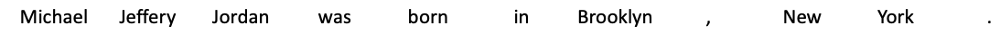
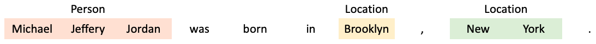
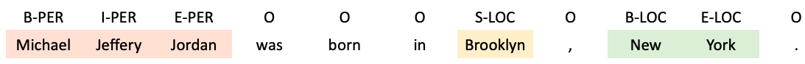
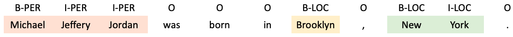
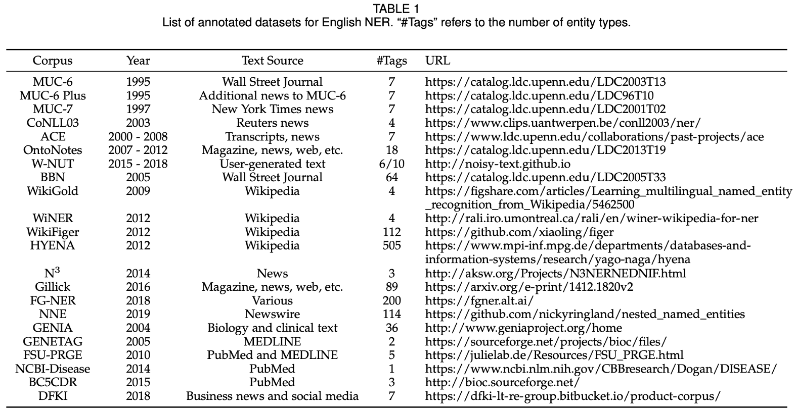
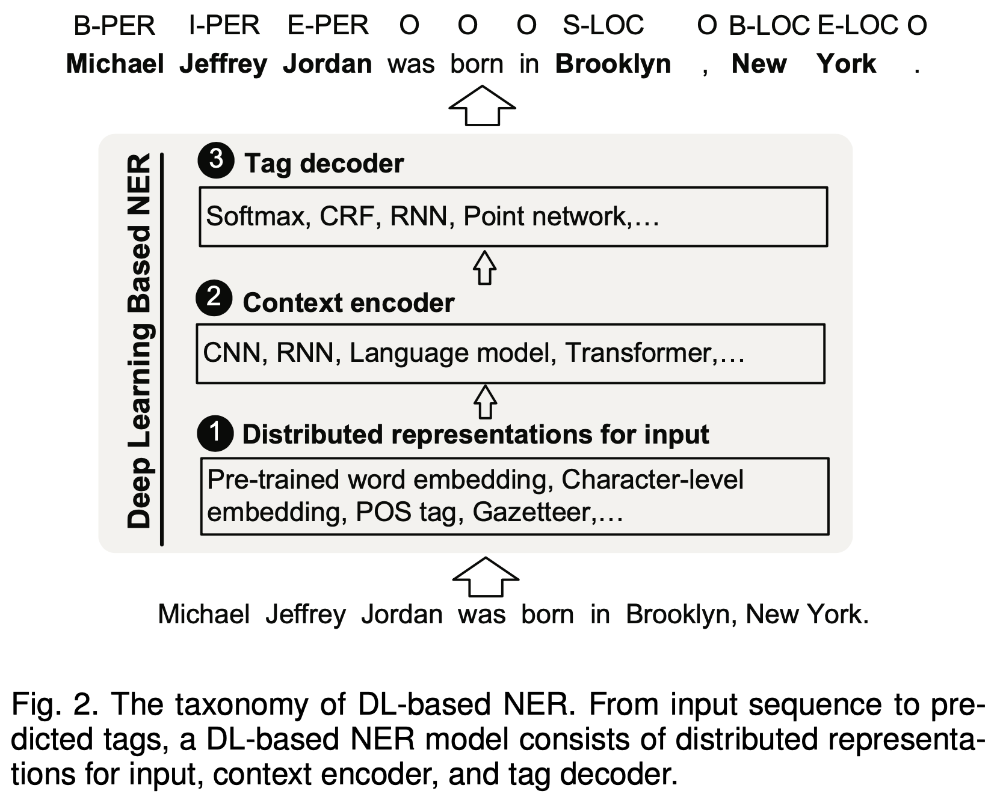
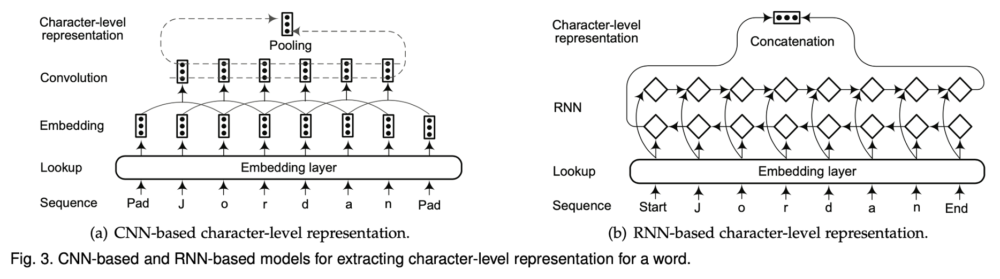
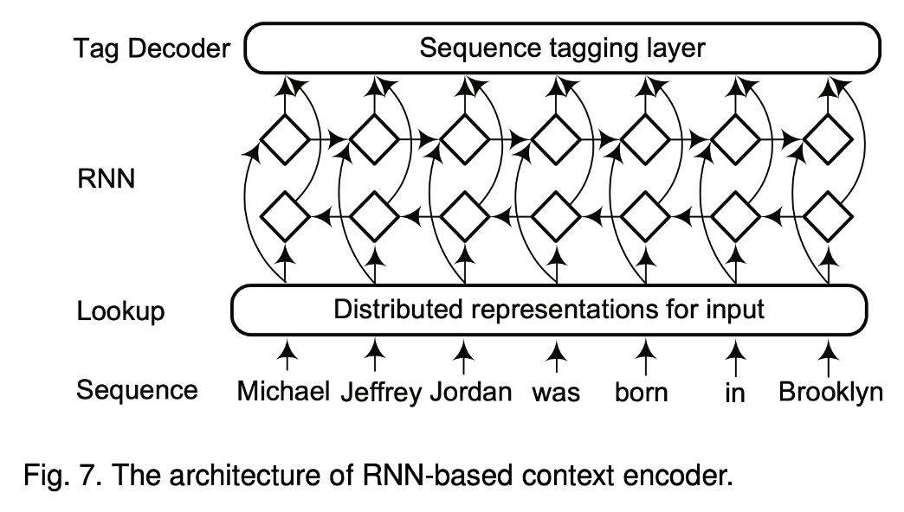
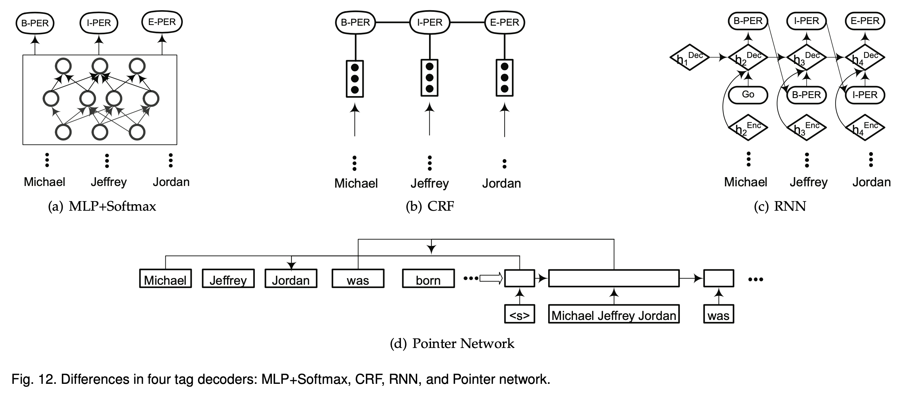
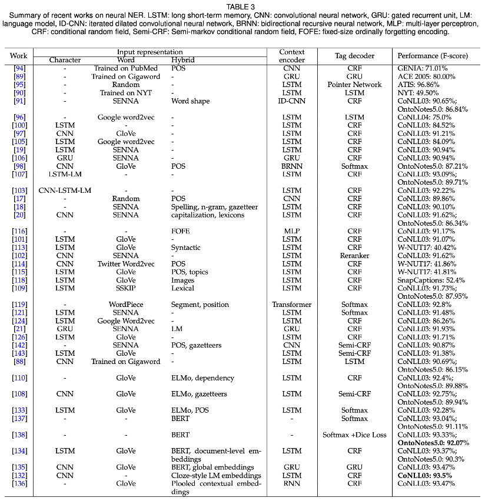

## 개체명 인식(NER)이란?
---

**개체명 인식(Named Entity Recognition)**은 말 그대로 문장에서 '이름을 가진 개체(named entity)'를 '인식(recognition)'하는 것을 의미합니다.

개체명 인식의 정의는 한국정보통신기술협회가 제공하는 정보통신용어사전에 따르면 다음과 같습니다.

*미리 정의해 둔 사람, 회사, 장소, 시간, 단위 등에 해당하는 단어(개체명)를 문서에서 인식하여 추출 분류하는 기법. 추출된 개체명은 인명(person), 지명(location), 기관명(organization), 시간(time) 등으로 분류된다. 개체명 인식(NER)은 정보 추출을 목적으로 시작되어 자연어 처리, 정보 검색 등에 사용된다.*

*※ 예 : 철수[인명]는 서울역[지명]에서 영희[인명]와 10시[시간]에 만나기로 약속하였다.*

일반적으로 **개체명(Named Entity, NE)**은 2가지로 분류됩니다.

1) **일반적인 개체명(Generic NEs)**으로 인물이나 장소 등의 명칭이 이에 해당합니다.    
2) **특정 분야 개체명(Domain-specific NEs)**으로 전문 분야의 용어가 이에 해당합니다.

이 글에서는 **일반적인 개체명(Generic NEs)**에 대해서만 다룹니다.

## 개체명 인식(NER)의 태깅 시스템
---

데이터셋마다 적용하는 태깅 시스템이 각각 다르지만, 보편적으로 사용되는 태깅 시스템에 대해 소개하고자 합니다.

예를 들어 다음과 같은 문장이 있다고 하겠습니다.

이 문장에서 우리는 다음과 같은 3가지 개체명을 찾을 수 있습니다.

하지만 분석을 위해서 개체명을 단어 별로 토큰화하여 각각 태그를 붙여줘야 합니다.

**BIESO 시스템**에서는 여러 개의 토큰으로 이루어진 개체명이 시작할 때 'B(begin)', 토큰이 개체명 중간에 있을 때 'I(inside)', 개체명의 마지막에 위치할 때는 'E(end)'를 붙여줍니다. 개체명이 하나의 토큰으로 이루어져 있을 때는 'S(singleton)'을 붙여줍니다. 토큰이 개체명이 아닐 경우에는 'O(outside)'를 붙여줍니다.

BIESO 시스템을 위의 예시에 적용해보면 다음과 같습니다.

**BIO 시스템**은 BIESO 시스템에서 E는 I로, S는 B로 단순화하여 표현한 것입니다. 일반적으로 사용되는 태깅 시스템입니다. 

BIO 시스템을 위의 예시에 적용해보면 다음과 같습니다.

## 개체명 인식(NER) 대표 데이터셋
---

*논문[1] 'A Survey on Deep Learning for Named Entity Recognition'에 제시된 'List of annotated datasets for English NER'*

개체명 인식을 위한 대표적인 데이터셋을 소개하고자 합니다. 데이터셋에 따라 NE type의 수가 다릅니다.

영어에는 다음과 같은 데이터셋이 있습니다.

1. **CoNLL-03**(3개) : PER, ORG, LOC    

2. **OntoNotes5**(18개) : PERSON, NORP, FACILITY, ORGANIZATION, GPE, LOCATION, PRODUCT, EVENT, WORK OF ART, LAW, LANGUAGE, DATE, TIME, PERCENT, MONEY, QUANTITY, ORDINAL, CARDINAL

한국의 경우, 한국정보기술협회(TTA)에서 내놓은 15개의 카테고리를 한국어 NER 카테고리의 표준으로 제시합니다.    
: 인물(PS), 학문분야(FD), 이론(TR), 인공물(AF), 기관(OR), 지역(LC), 문명(CV), 날짜(DT), 시간(TI), 수량(QT), 이벤트(EV), 동물(AM), 식물(PT), 물질(MT), 용어(TM)

하지만 실무에서는 데이터셋에 따라 이것을 조금씩 변형하여 사용합니다.

1. **국립국어원**(5개) : 장소(LC), 날짜(DT), 기관(OG), 시간(TI), 인물(PS) 

2. **부산해양대학교 자연어처리 연구소**(10개) : 인물(PER), 기관(ORG), 지명(LOC), 기타(POH), 날짜(DAT), 시간(TIM), 기간(DUR), 통화(MNY), 비율(PNT), 기타 수량표현(NOH)   

3. **Naver NER Challenge**(14개) : 인물(PER), 학문분야(FLD), 인공물(AFW), 기관 및 단체(ORG), 지역명(LOC), 문명 및 문화(CVL), 날짜(DAT), 시간(TIM), 숫자(NUM), 사건 사고 및 행사(EVT), 동물(ANM), 식물(PLT), 금속/암석/화학물질(MAT), 의학용어/IT관련 용어(TRM)

## 딥러닝을 활용하여 개체명 인식(NER)을 해야하는 이유
---

1. **자동으로 feature들을 추출하기 때문에 비용이 감소합니다.**

2. **비선형 transform으로 복잡한 feature들을 학습할 수 있습니다.**    
    : HMM, CRF와 같은 선형 모델과 비교하여 딥러닝 모델은 더 복잡하고 정교한 특성을 학습할 수 있습니다.
    

3. **end-to-end 학습이 가능하다.**    
    : gradient descent를 통해 일련의 과정을 거치지 않고 오로지 신경망에 학습을 맡길 수 있습니다.    
    : 즉, 데이터를 넣어서 바로 결과를 확인할 수 있습니다.

## 딥러닝 기반 개체명 인식(NER) 모델의 구조
---

논문[1]에서 딥러닝 기반 개체명 인식(NER) 모델의 구조를 다음과 같이 세 단계로 나누어 설명합니다.

1. **Distributed Representations for Input**    
    : 입력 단어를 저차원의 벡터로 함축시키는 과정    
    : Pre-trained word embedding, Character-level embedding, POS tag, Gazetteer

2. **Context Encoder** (for capturing contextual dependencies for tag decoder)    
    : 문맥 정보를 추출하여 담아내는 과정    
    : CNN, RNN, Language model, Transformer

3. **Tag Decoder** (for predicting labels of words in the given sequence)    
    : context-dependent representation을 입력으로 하고, 입력 시퀀스에 대한 태그를 붙이는 과정    
    : Softmax, CRF, RNN, Point network    

## 각 모델 간의 성능 비교
---

논문[1]에 정리된 성능 비교표를 마지막으로 글을 마치도록 하겠습니다!

*Summary of recent works on neural NER*

## 참고자료
---

1. [https://arxiv.org/abs/1812.09449](https://arxiv.org/abs/1812.09449)