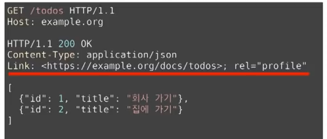
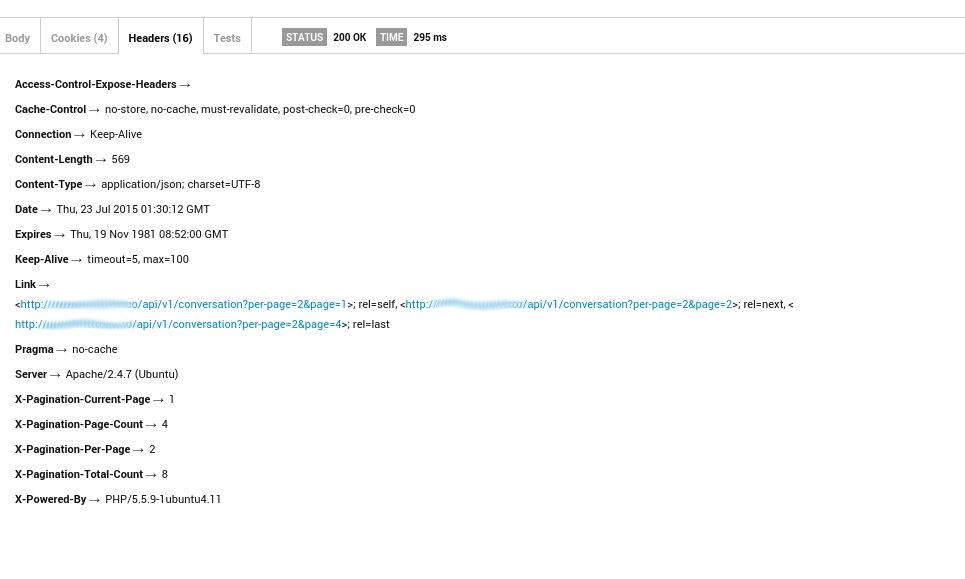

## REST API를 주제로 다룬 이유
REST API를 주제로 글을 쓰게 된 이유는 다양합니다.  
저에겐 다양한 기억이 있습니다.
   
면접을 보며 REST API란 어떤 특징을 갖나요라는 물음에 제대로 답하지 못해 아쉬웠던 기억이...  
udemy의 강의를 들으며 REST API를 작성하는 데, 클론코딩하는 API가 왜 REST한 건지 모르고 무작정 따라했던 기억이...  
팀프로젝트를 마치고 팀원이 작성한 API에 대한 발표를 듣고 정확히 이해하지 못했던 기억이...

이러한 기억들이 떠오를 때마다 REST API에 대해 더욱 자세히 알고 싶어했고, 유튜브의 여러 강의들을 보며 이해하고자 노력했습니다.  
 
웹 서핑을 하던 도중, REST API에 대해 설명을 잘해놓은 영상이 있다는 소개글을 보게 되었고, 이 소개글에서 언급한 영상은 네이버 Engineering TV에서 제공하는 "그런 REST API로 괜찮은가" 라는 영상이었습니다.  
 
해당 영상을 보고 정리하며 엄밀한 의미의 'REST API'가 무엇인지 감 잡을 수 있었습니다.  
또한, 앱의 REST API 에서 REST의 제약조건을 완벽히 맞추는 것은 개발자의 환상에 불과하다것을 깨달을 수 있었습니다.  
 
여러분들도 비슷한 생각을 갖고 계시는 지, 아래의 정리된 내용을 읽어가시며 나름대로의 답을 내려보시길 바랍니다.

 

# REST
- 분산 하이퍼미디어 시스템을 위한 아키텍쳐 스타일을 의미합니다.
- 분산 하이퍼미디어 시스템의 예로는 웹이 있고, 스타일은 제약조건들의 집합을 나타냅니다.
 

## REST를 구성하는 스타일
  
_볼드체로 처리한 REST의 스타일은 만족하기 어렵다고 합니다. 왜 그런 지는 더 읽어봐주세요 :)_
- client-server
- stateless
- cache
- **uniform interface**
    - identification of resources
    - manipulation of resources through representations
    - **self-descriptive messages**
        - 메시지로 온전히 이해가 다 되어야 합니다.
    - **hypermedia as the engine of application state(HATEOAS)**
        - 애플리케이션 전이 상태 즉, 플로우 과정을 알 수 있어야 합니다.
- layered system
- code-on-demand(optional)
    - server에서 코드를 client에게 보내 실행할 수 있어야 합니다.
 

## Uniform Interface는 왜 필요한 가
- 서버와 클라이언트는 독립적으로 진화합니다.
    - 서버의 기능이 변경되어도 클라이언트를 업데이트할 필요가 없습니다.
    - REST를 만들게 된 계기 : "How do I improve HTTP without breaking the Web."
        - ex. 웹 페이지를 변경했다고 웹 브라우저를 업데이트할 필요가 없습니다.
        - ex. 웹 브라우저를 업데이트했다고 웹 페이지를 변경할 필요가 없습니다.
        - ex. HTTP 명세가 변경되어도 웹은 잘 동작합니다.
        - ex. HTML 명세가 변경되어도 웹은 잘 동작합니다.
- 앱 업데이트 자주하라고 불평하는 것은 사실 REST API를 따르지 않음을 간접적으로 증명하고 있는 것입니다!
 

## REST가 웹의 독립적 진화에 도움을 주었나
- HTTP에 지속적으로 영향을 줍니다.
- Host 헤더 추가가 이루어질 수 있습니다.
- 길이 제한을 다루는 방법이 명시되었습니다.
    - 414 URI Too Long
- URI에서 리소스의 정의가 추상적으로 변경되었습니다.
    - "문서의 위치" → "식별하고자 하는 무언가"
 

## 그럼 REST는 성공했는가
- REST는 웹의 독립적 진화를 위해 만들어졌습니다.
- 웹은 독립적으로 진화하고 있습니다.

**→ 성공!**

 

## 그럼 REST API는..?
- REST API는 REST 아키텍쳐 스타일을 따라야합니다.
- 오늘날 스스로 REST API라고 하는 API들이 대부분 REST 아키텍쳐 스타일을 따르지 않고 있습니다.
 

## 꼭 모든 제약조건을 따라야 REST API인건가..?

- **그렇습니다._(엄근 진지)_**
- REST API : 하이퍼텍스트를 포함한 self-descriptive한 메시지의 uniform interface를 통해 리소스에 접근하는 API   
    - by. Roy T.Fielding
        - HTTP와 URI 명세의 저자 중 한명입니다

→ 시스템 전체를 통제할 수 있거나 진화에 관심이 없다면 REST 설계를 따를 필요가 없습니다.  
즉, client를 마음대로 조종할 수 있거나, 일일이 업데이트해야 한다고 불평하는 사람이 매우 적거나 무시할 정도라면 REST 설계를 따를 필요는 없는 것입니다.  
 
그러나, 이러한 상황이 아니라면 REST를 따르는 것은 매우 유용할 것입니다.

 

## 그럼 이제 어떻게 해야할까?
- **REST API를 구현하고 REST API라고 부를 수 있습니다. (도전)**
    - 어려운 이유
        - 모든 요소에 대한 해석이 불가능합니다.
            - id, title이 뭘 의미하는지 client는 알 수 없습니다. →  **self-descriptive 실패!**
        - 다음 상태로 전이할 링크가 없습니다.
            - json으로는 하이퍼링크가 불가능합니다. → **HATEOAS 실패!**
- REST API 구현을 포기하고 HTTP API라고 부를 수 있습니다.
- **REST API가 아니지만 REST API라고 부를 수 있습니다. (현재 상황)**
 

## 그런데 Self-descriptive와 HATEOAS가 독립적 진화에 어떻게 도움이 될까?
- Self-descriptive  
  
    - **확장 가능한 커뮤니케이션을 가능케 합니다**
    - 서버나 클라이언트가 변경되어도 오고가는 메시지는 언제나 self-descriptive하므로 해석이 가능합니다.
- HATEOAS  

    - **애플리케이션 상태 전이의 late binding이 가능해집니다.**  
    - 어디서 어디로 전이가 가능한 지 미리 결정되지 않습니다. 어떤 상태로 전이가 완료되고 나서야 그 다음 전이될 수 있는 상태가 결정됩니다.
    - 쉽게 말해서, 링크는 동적으로 변경될 수 있다는 것입니다.
 

## 그럼 REST API로 고쳐보자..!!
### <Self-descriptive 측면>

- Media type 변경
    1. 미디어 타입을 하나 정의합니다.
    2. 미디어 타입 문서를 작성합니다. 이 문서에 id가 뭐고 title이 뭔지 의미를 정의합니다.
    3. IANA(모든 미디어 타입이 정의되어 있는 사이트)에 미디어 타입을 등록하고 만든 문서를 미디어 타입의 명세로 등록합니다.
    4. 이제 이 메시지를 보는 사람은 명세를 찾아갈 수 있으므로 이 메시지의 의미를 온전히 해석할 수 있습니다.

→ **성공!! 그러나 일일이 등록하는 것은 매우 번거로울 것입니다.**

- Profile
    - Link에다 profile을 relation하는 방법입니다.
        1. id가 뭐고 title이 뭔지 의미를 정의한 명세를 작성합니다.
        2. Link 헤더에 profile relation으로 해당 명세를 링크합니다.
        3. 이제 메시지를 보는 사람은 명세를 찾아갈 수 있으므로 이 문서의 의미를 온전히 해석할 수 있습니다.

→ **성공!! 그러나 여기에도 2가지의 번거로움이 존재합니다.**  
    1. 클라이언트가 Link 헤더(RFC 5988)와 profile(RFC 6906)을 이해해야 합니다.  
    2. Content negotiation을 할 수 없습니다. 즉, 서버가 client가 문서를 지원하지 못하거나 그런 상황의 경우 알아챌 수가 없습니다. 미디어 type으로 구별하는 것이 아닌, 문서로 링크만 제공하기 때문입니다.

 

### <HATEOAS 측면>

- data 활용
    - data 부분에 다양한 방법으로 하이퍼링크를 표현할 수 있습니다.

→ **성공! 그러나 기존 API를 많이 고쳐야합니다.**  
    - JSON으로 하이퍼링크를 표현하는 방법을 정의한 명세 참고해야하는 불편함 또한 존재합니다.

- HTTP 헤더 활용
    - Link, Location 등의 헤더로 링크를 표현할 수 있습니다.

→ **성공! 그러나 정의된 relation만 활용한다면 표현에 한계가 있습니다.**

 

## 앱의 REST API 에서 REST의 제약조건을 완벽히 맞추는 것이 개발자의 환상이라고 생각한 이유..?
REST의 덕목 중에 하나인 self-descriptive이 웹에서 가능한 이유가 html때문이라고 생각합니다.  
스스로 설명이 가능하냐고 했을때 웹은 명세를 조금만 찾아보면 해당 페이지를 그려내는것도 가능하게 됩니다.  
html 명세에는 각 태그들의 의미까지 정확하게 표현하고 있기 때문입니다.  
 
문제는 수 많은 앱에서 사용하는 REST API인데 이때 API은 앱마다 모두 다르게 구현됩니다.  
따라서 웹에서처럼 self-descriptive하려면 html 정도 수준의 상세한 문서를 올려야 가능하다고 생각했습니다.  
REST API가 self-descriptive하려면 custom media type 이나 profile link relation으로 만족시킬 수 있다고 했지만 이것 만으로 html 수준으로 그려내는 것은 불가능하다고 생각합니다. 게다가 REST의 목적은 "독립적인 진화"인데 과연 이렇게 REST API에다가 억지로 self-descriptive나 HATEOAS를 넣는다고 해서 "독립적인 진화"가 가능한 지는 의문이 들었습니다.  
 
현실적으로 클라이언트의 업데이트는 디자인의 변화가 중점적으로 이루어지지 API가 변경되는 경우는 드물 것이기 때문입니다.  
디자인의 변화를 앱의 업데이트 없이 한다는게 html과 같이 상세한 스펙 정의 없이 과연 각각의 앱에서 가능한 것인지도 의문이 들었습니다.
 

그래서 결국 self-descriptive할 수 없는 게 앱의 REST API라고 생각했습니다.  
모든 앱을 요세 유행하는 FLUTTER로 개발한다면 좀 더 self-descriptive할 수는 있어 보이지만, 그렇지 않은 경우엔 앱의 REST API에서 REST의 제약조건을 완벽히 맞추는 것은 개발자의 환상에 불과하다고 생각합니다.

 

## 블로그를 마치며..
47분 정도의 영상을 보며 정리한 글이고 어려운 용어들이 많이 나와 이해하기 어려울 수 있다고 생각합니다.  
그러나 REST API에 대해 학습해보고, 한 번이라도 고민해본 적이 있는 학우라면 꽤 흥미진진한 글이 될 것이라 생각됩니다.  
여러분들도 글을 읽어 보며 REST API에 가졌던 의문들을 스스로 정리해보고 결론을 지어보는 시간을 갖길 바랍니다.  
이러한 글의 경우, REST API를 직접 다루는 백엔드 개발자가 되기 전과 후에 또 색다르게 받아들여질 것 같습니다.  
따라서 저도 여러번 영상을 보며 REST 아키텍쳐의 이해를 더욱 단단히 하고자 합니다.
