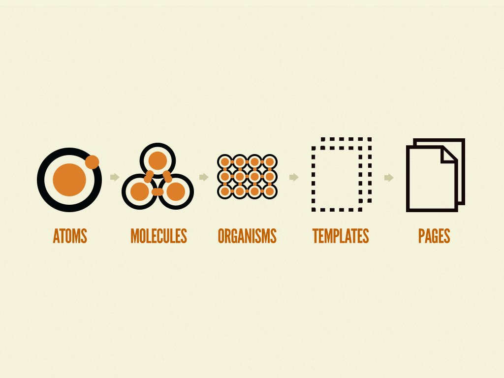
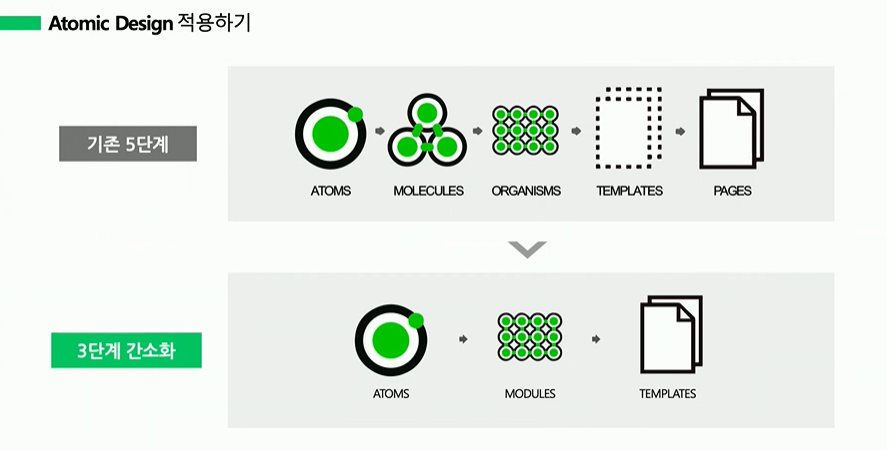

# 어떻게 하면 똑똑하게 컴포넌트를 짤 수 있을까

## ❓ 왜 디자인패턴을 사용할까

- 규모가 커짐에 따라, 코드 관리 및 유지보수가 어려워지고 있다.
- 설계된 컴포넌트들을 재사용 및 수정할 경우가 많아지면서, 편리한 방법을 찾아나가고 있다.
- 보다 명확하고  깔끔하며, 이해가 쉬운 코드를 구성하기 위해서 디자인패턴을 사용할 수 있다.

</n>

## Presenter&Container vs Atomic Design Pattern

> We’re not designing pages. **We’re designing systems of components.**
>
> by 'Stephen Hay'

웹 디자인이 점차 발전함에 따라, 우리는 페이지를 디자인하는 것이 아니라 컴포넌트의 구조를 디자인해야합니다.

</n>

### Presenter&Container Component Design Pattern

- 2015년 Dan Abramov가 제안한 디자인패턴
- functional 컴포넌트가 `stateless`로 사용될 때 주로 사용하는 패턴
- **간단히 말해서, 데이터처리와 데이터출력 컴포넌트를 분리하는 것이다**
  - 로직을 수행하는 컴포넌트(Container)와 마크업을 통해 ui를 보여주는 컴포넌트(Presenter)가 분리됨
  - 앱의 기능과 UI에 대한 구분이 명확해짐
- 같은 `state`를 다른 container에게 `props`를 내려줌으로써 상태 공유가 가능
- 동일한 마크업, container 레이아웃(header, footer)는 반복 작성하지 않고, `this.props.children`로 구현 할 수 있습니다.

</n>

#### 🔸 Presentational Component

- **데이터 출력**
- Markup에 관한 내용을 다루는 컴포넌트
  - 따라서 상태를 거의 가지지 않으며, 상태를 가진다면 데이터에 관한것이 아닌 UI 상태에 관한 것

  - 사용자가 직접 보고, 조작하는 컴포넌트 (ui와 관련 있습니다)
- `state`를 직접 조작하지 않고, Container Component가 내려준 `props`의 함수에 의해 `state`를 변경
  - 그에 따라 useState, useCallback, dispatch등 state관련된 훅이 하나도 없음
- 종종, `this.props.children`을 통해 컴포넌트가 렌더됩니다.

#### 🔸 Container Component

- **데이터 처리**
- 어떻게 동작하는지, 어떤 로직을 수행하는지와 같은 실제 논리적인 연산을 담당하는 컴포넌트
- markup을 사용하지 않음
  - 즉, 스타일을 사용하지 않음
- 데이터와 데이터 조작에 관한 함수를 만들어서 present component에 제공

</n>

### 🔸 정리

1. **코드의 가독성을 높여준다.**

   View와 State가 분리되어 있다보니, 디자인 패턴을 사용하지 않았을 때 지저분하다는 느낌을 없애주고 가독성을 높여 이해가 쉬워집니다.

2. **재사용성을 높일 수 있다.**

   데이터 출력을 하는 Presenter는 다른 상태 값을 갖는 Container 컴포넌트에도 적용시킬 수 있기때문에, 같은 Layout markup을 여러 컴포넌트에 재작성하는 것을 피할 수 있습니다.

   따라서, 재사용성을 높여 개발 효율을 높일 수 있습니다.

3. **역할에 따라서 코드를 작성하기에 편하다.**

   역할 분담이 정확히 되어있는 프로젝트의 경우,  깔끔하게 작성할 수 있습니다.

4. **유지보수가 쉽다.**

   로직수행과 markup을 각각 다른 컴포넌트에서 담당하기 때문에 유지보수가 쉽습니다.

   특히, markup 변경에 매우 유연합니다.

</n>

※ 참고자료 : [Dan Abramov의 글](https://medium.com/@dan_abramov/smart-and-dumb-components-7ca2f9a7c7d0) _ Present&Container를 처음 가져왔을 때 작성

---

### Atomic Design Pattern

- 2016년, 웹 디자이너 Brad Frost가 제안한 디자인패턴

> 원자 > 분자 > 유기체 > 템플릿 > 페이지

</n>

말 그래도 작은 단위의 컴포넌트를 재사용성이 강하고, 단단하게 잘 설계함으로서 점진적으로 지속적으로 개발하기 용이하게 하는 방식이다.

웹 프론트 개발에 가장 많이 쓰이는 프레임워크인 Vue, React 모두 컴포넌트 단위로 개발을 진행하기 때문에 이러한 컴포넌트 중심 설계 패턴이 더욱 주목 받게 되었다.(Flutter 또한 마찬가지이다!)

</n>

#### 🔹 Atom(원자)

- 가장 작은 단위요소로 더 이상 작게 나뉘어 질 수 없는 것을 의미(마치 레고블럭🧩)
  - 라벨, input 요소, 버튼과 같은 HTML의 태그 등
- 컴포넌트의 `props`에 따라 다른 UI에 적용될 수 있도록 재사용이 가능하게 작성되어야 한다
- 따라서, `state`를 다양하게 가지고 있어야하며 추상적이지만 최대한 포용성있게 설계되어야 한다
  - e.g., button: disabled, hover, different sizes, etc
- **마진이나 위치값을 가지지 않음**

#### 🔹 Molecule(분자)

- 원자를 결합한 그룹으로 화합물의 가장 작은 기본 단위
- 분자만의 property를 가지고 있을 수 있고 이를 활용해 원자에 기능을 만들어 줄 수도 있다
- **원자의 위치값을 지정하거나, props를 내려 원자의 UI를 결정하기도 함**

#### 🔹 Organism(유기체)

- 분자의 집합체 / 분자가 되지 않은 원자 + 분자
- 컴포넌트의 최종 모습
- **분자와 원자의 위치값을 조정**

#### 🔹 Template(템플릿)

- **컴포넌트(유기체)들의 위치 조정 / 즉, 페이지의 그리드를 정해주는 역할**
- 단, 템플릿에는 Styling이나 Color는 들어가지 않음

#### 🔹 Page(페이지)

- 사용자에게 보이는 최종 모습
- 템플릿에서 완성된 레이아웃에 실제 데이터 혹은 더미데이터를 넣어 만들어짐

</n>

#### 간소화된 Atomic Design

*[Line Entry의 Atomic Design 적응기](https://www.youtube.com/watch?v=33yj-Q5v8mQ)*

</n>

#### Atomic Design 효율 높이는 방법

1. 재사용성을 높이기 위한 **Styled-Component(함수형 컴포넌트)**의 사용
2. 리액트 사용 시, 컴포넌트 단위의 개발 효율을 높여주는 **Storybook**을 사용

</n>

### 🔹 정리

1. **재사용성이 많은 UI 컴포넌트들을 잘 만들어두면**, 추후에 사용하기에 편리하기 때문에 **좋은 Legacy Code**가 생겨나게 됨
   - 원자 단위의 컴포넌트들은 여러 코드에서 **재사용하기 쉬움**

2. **초기 개발 시간이 비교적 길 수 있지만**, 작은 단위의 Component들을 잘 설계해둔다면 **중장기적인 측면으로 보았을 때에 개발 기간을 단축**할 수 있음
   - 따라서, 사전 학습이 충분히 필요할 수 있음
3. props를 이용하여 다양한 UI 스토리를 제공 할 수 있음

4. 직관적인 네이밍 컴포넌트로 짜여진 구조라 이해하기 편리

5. **방대한 양의 컴포넌트를 제작할 경우에는 데이터가 복잡**해져 어려움을 겪을 수 있음
   - 사용하고 싶은 컴포넌트를 찾을 경우
   - 컴포넌트 네이밍 시

6. 부모로부터 하위 컴포넌트에게 스타일을 지정하는 방법이 제한적
7. **실무에서 주로 쓰는** 컴포넌트 디자인패턴

</n>

※ 참고자료 : [Atomic 디자인 패턴 책 서술자 Brad Frost의 글](https://bradfrost.com/blog/post/atomic-web-design/)

---

### 결론

실무에서는 Atomic Design Pattern을 통용적으로 사용한다지만, 사실 어느 한 쪽을 사용한다고 단정짓기 어렵습니다. 자세히 들여다보면, Atomic이자 Presenter&Container 패턴을 둘다 사용한다고 합니다.

어떤 디자인 패턴이 더 옳다고 할 수는 없으며, 각자의 취향과 중요도에 따라 더 적합하다고 판단되는 디자인패턴을 결정하여 사용하면 될 것 같습니다 :)
