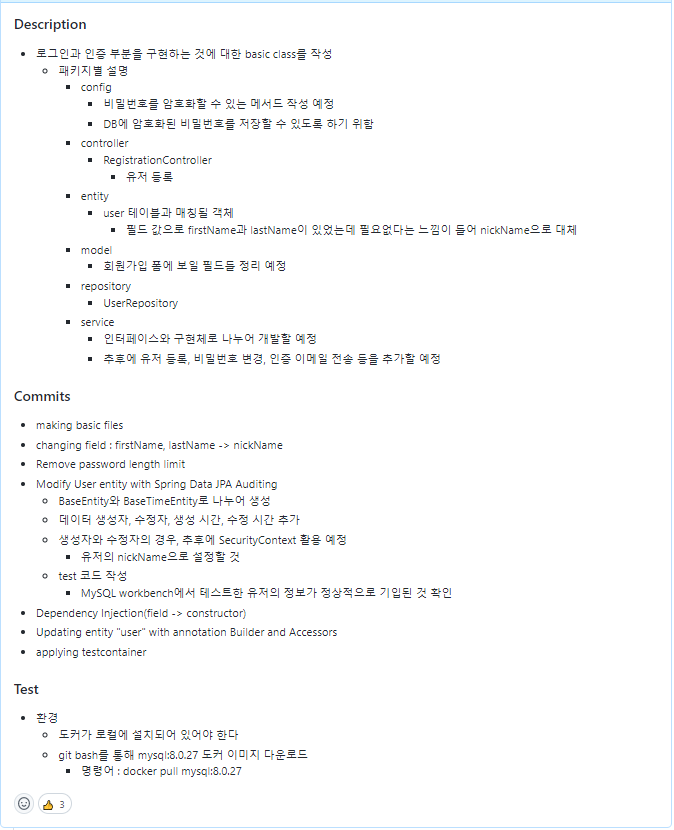

```
layout: post
title: "코드 리뷰 어떻게 하시나요?"
authors: [iju1633]
tags: ["REST", "아키텍쳐"]
image: ../assets/images/post-Code-Review/thumbnail.png
featured: true
```

## 코드 리뷰를 주제로 다룬 이유

협업을 하다 보면 팀원의 코드를 리뷰해야 하는 일이 반드시 발생합니다. 상대방이 읽어야 할 코드이기에 어떠한 형식을 갖춘 PR 메시지를 적어야 할지 고민이 되고 리뷰는 어떻게 하면 상대방이 기분 나빠하지 않고 같은 팀원으로서 든든함을 느낄지 고민이 됩니다.

그러던 와중, 올해 4월에 코드리뷰를 주제로 한 우아한 테크톡이 열려, 여기서 위에 언급한 고민에 대한 해답을 구하고자 하였고 테크톡 내용을 정리하다 보니 GDSC 멤버분들도 알고 계시면 좋을 것 같아 이렇게 블로그로 작성하게 되었습니다.

글을 읽어보시면서 자신은 여태 어떠한 PR을 날리고 있었는지, 리뷰를 받는 상대방에게 자신의 리뷰가 어떻게 다가왔을지 되새겨 보시길 바랍니다.

## 코드 리뷰는 왜 해야 할까?

- 변동성이 많아진 세상
    - 변화의 속도가 빠르고 다양하게 변하면서 자신이 알고 있는 방법으로 문제를 해결하는 경우는 점점 줄어들고 있습니다.
- 우리가 살고 있는 시대
    - 시장이 계속 변하면서 비즈니스적으로 더 빨리 혁신해야 경쟁력을 갖출 수 있습니다. 그리고 그러기 위해서는 개발의 생산성이 더욱 중요해지고 있습니다.
    - 제품 출시가 진행될 때마다 개발자 수요는 점점 더 커지고 생산성은 어느 시점에서 한계가 생기고, 이에 따라 출시 회차가 늘어날수록 개발 속도는 줄고 비용은 늘어나는 현상이 발생합니다.
- SW 공학의 특성
    - 설계하는 것이 매우 중요하며 이는 완전한 소스코드로 구현될 수 있습니다.
    - 즉, 좋은 설계는 클린 코드를 의미합니다.
        - 여기서 클린 코드가 왜 중요할까?
            - 한 번 작성한 코드는 10번 이상 읽습니다. 또한, 작성보다 이해에 10배의 노력이 소요됩니다.
            - 개발의 90% 이상의 시간을 어떤 코드를 이해하는 데 사용한다고도 합니다.
        - 시간이 지나도 생산성 저하, 비용 증가를 막을 수 있는 유일한 방법이 설계에 힘을 쓰는 것입니다. 그리고 설계에 큰 도움을 줄 수 있는 활동이 바로 코드 리뷰입니다.
- 배움을 주고받으며 지속 가능한 SW 개발자가 될 수 있는 실천법이기도 합니다.

## 왜 코드리뷰가 어려운 가?

  

- 코드에 대한 비판을 자신에 대한 비판으로 이해할 수 있기 때문입니다.
- 생각을 글로 전달하는 것이 어렵습니다.
    - 오해의 위험이 큽니다
        - 음성 톤, 표정의 부재

## 효율적인 PR 방법

  

- 지루한 작업은 컴퓨터로 정리합니다.
    - 기계가 더 잘할 수 있는 일에 노력을 낭비하면 안 됩니다.
        - e.g. merge, build, merge conflict discover
    - Formatting Tool
        - 공백, 들여쓰기
        - 별도의 커밋/PR로 분리
            - “리뷰 불필요”를 기술해서 리뷰를 생략할 수 있도록 합니다.
- 스타일 가이드를 통해 스타일 논쟁을 해소합니다.
- PR을 올릴 때 주석을 달아볼 수 있습니다.
    - 작성한 PR을 저자가 먼저 읽어보고, 리뷰어들을 위한 설명을 의견으로 남겨서 리뷰어들의 시간을 절약할 수 있게 합니다.
    - 자신이 작성한 코드의 의도도 알려줄 수 있으며, 리뷰어에게 더욱 세세하게 평가받을 수 있습니다.
- 리뷰어 설정 시, 모두를 포함해봅시다.
    - 많은 사람이 볼수록 버그를 더 잘 찾아낼 수 있습니다.
    - 많은 사람이 본다는 것을 알면 사람들은 대개 더 잘하려는 경향이 있습니다.
- 저자가 고생해서 리뷰어의 시간을 아껴줘야 합니다.
    - PR 내용에 Description, How to Test, Commits에 대한 요약을 제공하는 것이 리뷰어에게 큰 도움이 될 것입니다.
- 의미 있는 커밋으로 분리해봅니다.
    - 커밋을 작게 작게 하는 것도 좋은 방법입니다.
        - 2주 후면 자신이 작성한 코드도 못 알아볼 수 있습니다.
    

## 효율적인 리뷰 방법

- 리뷰를 즉시 시작해봅시다.
    - 저자는 리뷰가 오기까지 기다려야 하기 때문입니다.
        - 리뷰를 기다리는 시간은 최대 하루로 설정해봅시다.
    - 리뷰는 고수준으로 시작해서 저수준으로 내려가 봅시다.
        - 초기 리뷰에서는 고수준의 피드백을 해봅시다.
            - e.g. 버그, 장애, 성능, 보안
        - 이후에는 저수준의 피드백을 제공해봅시다.
            - 선택적인 설계 개선 제시
            - e.g. 변수명 변경, 주석을 명확하게 하는 것에 대한 피드백 제공
    - 예제 코드 제공에 관대해집시다.
        - 하지만 너무 과하면 오히려 부담 느낄 수도 있습니다.
    - 태그를 활용해볼 수 있습니다.
        - [Nit]
            - 고치면 좋지만 아니어도 그만을 의미합니다.
        - 리뷰어는 항상 더 개선할 수 있는 의견을 자유롭게 남길 수 있어야 합니다.
        - e.g. nit: null 대신 Optional을 쓰면 어떨까요?
    - 1~2등급만 코드 레벨을 올리는 것을 목표로 해봅시다.
        - 완전하지는 않아도 충분히 좋은 코드가 되도록 리뷰를 작성하는 것입니다.
        - D 등급의 PR을 받으면 저자가 C나 B 등급을 받도록 도와봅시다.

## 피드백 방법

  

- 절대 “너”라고 하면 안 됩니다.
    - e.g. 너는 왜 맨날 ...
- 비판의 대상은 저자가 아니라 코드임을 명시합시다
- ~하는 게 어떨까요? 와 같은 표현 추천합니다.
    - 명령이 아니라 요청으로 표현하는 것이 핵심입니다.
- 경쟁 유발을 하고자 코드리뷰를 하는 것이 아니므로 학습의 과정으로 코드 리뷰를 인지할 수 있도록 작성해야 합니다.
- 대부분의 리뷰어가 잘못된 부분에만 집중하는데, 진정한 칭찬을 해봅시다.
    - 리뷰어가 잔인한 감시자가 아니라 도와주려는 팀 동료라는 것을 보여서 긴장감을 낮추도록 해야 합니다.
- 제안하는 변경과 변경의 이유를 모두 설명해봅시다.
    - 힘들다면, 무엇을 할 수 있을지 객관적으로 설명해볼 수 있습니다.
- 저자의 실수가 같은 패턴임을 식별했다면 2~3개만 언급하고 이러한 패턴에 대해서 수정을 요구해 봅시다.
- 교착 상태에 오는 경우(커맨트를 반영하지 않으니 승인 거부 & 저자는 커멘트 반영을 거부)
    - 만나서 얘기해봅시다.
    - 텍스트 기반 의사소통은 상대가 인간이라는 것을 잊게 합니다.
- Pair Programming을 하며 어떻게 고치는 게 좋은지 보여주고 Revert 하여 스스로 개선할 기회를 주는 것도 좋은 방법입니다.

## 기대해볼 수 있는 코드리뷰 효과

- 시간이 지나니 선플이 달리기 시작합니다.
- 많은 사람이 자신의 코드를 본다는 생각에 PR 전에 한 번 더 코드를 다듬게 됩니다.
- 좋은 설계, 아키텍처, 클린코드, TDD 등에 대한 공감대/열정 형성이 가능해집니다.
    - 잘하는 동료를 보면 잘하려는 열정이 생깁니다.

## 블로그를 마치며

저는 우아한테크톡을 보기 전까지 코드 리뷰를 왜 해야 할까에 대한 명확한 해답을 내릴 수 없었습니다. 그런데 이번에 블로그를 작성하며 스스로 해답을 잘 내려볼 수 있었던 것 같고 앞으로의 PR은 나름의 규칙을 정해 일관성이 있게 PR 내용을 채워볼까 합니다.

여러분들도 PR 내용을 체계적으로 작성해서 건강한 코드 리뷰 문화를 만드는/만들 수 있는 개발자가 되기 바랍니다 :)