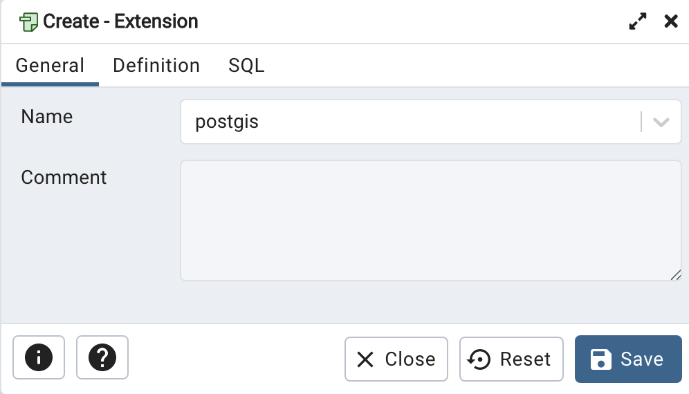
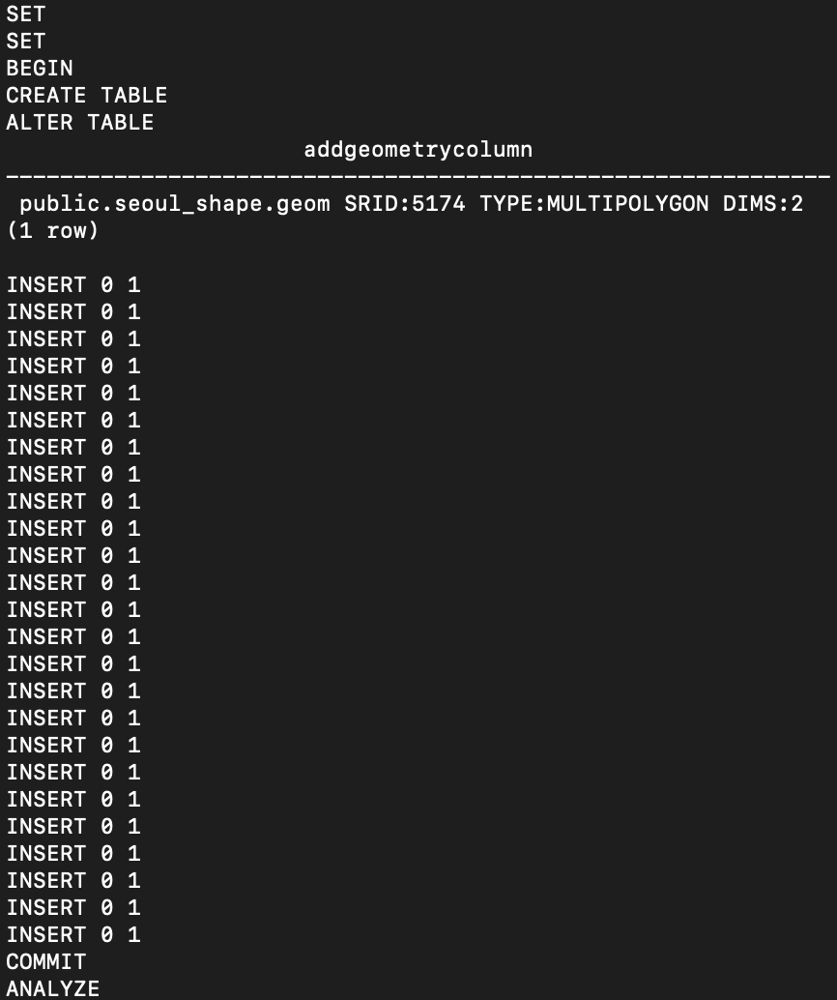
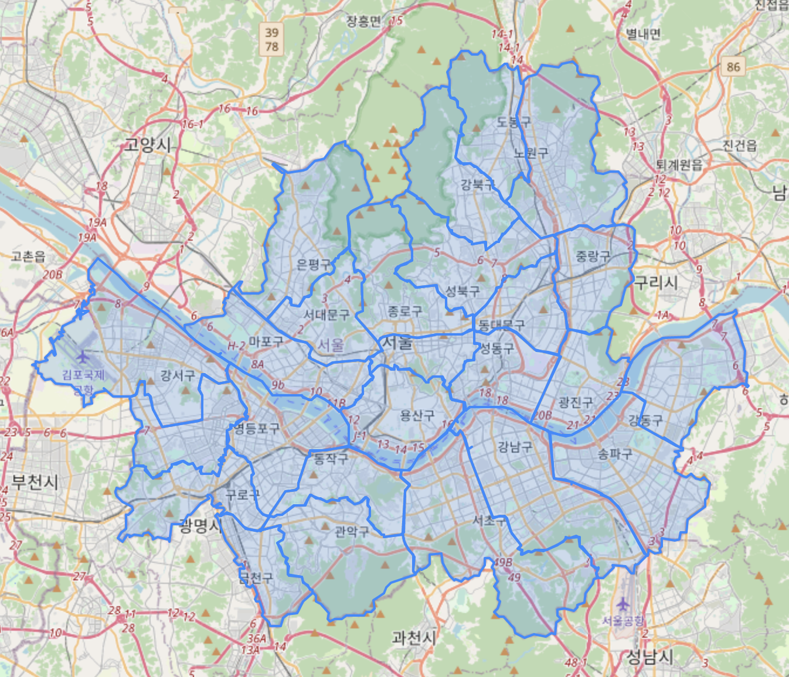
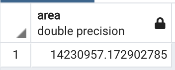

## INTRO

> `Coordinate System`, 즉 '좌표계'는 절대로 무시할 수 없는 중요한 특성을 몇 가지 가지고 있습니다.

데이터를 사용하기 전에 가장 중요한 건 '그 데이터의 특성을 파악'하는 것입니다. 내가 사용하는 데이터가 무엇인지를 알아야 올바르게 활용하겠죠.

서비스를 만들 때나 데이터를 분석할 때 여러분은 지도를 자주 접하셨을 겁니다. 그러나 아마 대부분은 API Docs에 있는 내용만 보고 사용하고, 좌표계에 대한 이해는 없으셨을 거라 생각됩니다.

그래서, Data/ML 팀에 소속돼 있으면서 공간정보공학과 출신이기도 하니, 오늘은 여러분께 **좌표 데이터**에 대한 이야기를 조금 해드리려고 합니다. 개발자들도 알면 좋은 내용만 간추려서 적어볼게요!

### 이걸 왜 알아야 하는데?

'지도'를 사용한 분석 혹은 서비스를 할 때, 행정 경계 등 정부에서 제공하는 SHP 파일 (Shape File)을 사용해야 하는 경우가 있을 텐데, 얘네들이 사용하는 좌표계가 생각보다 골치 아픈 문제가 됩니다.

{:style="display:block; margin:auto; width:70%"}
[서울의 구 경계를 나타낸 데이터](http://data.nsdi.go.kr/dataset/15144)의 정보입니다. 잘 보시면 `데이터 좌표계`라는 생소한 개념이 있습니다. 아무 생각 없이 이런 SHP File들을 사용하시면 서울이 아주 엉뚱한 곳에 가 있을 확률이 높습니다.

---

## 공간 참조 시스템

지구상의 위치를 좌표로 변환하는 방법은 크게 `GCS(Geographic Coordinate System)`와 `PCS(Projected Coordinate System)`로 나뉩니다.

### GCS

GCS는 3차원의 지구 모델에서 위도와 경도를 이용해 좌표를 나타냅니다. 여기서 좌표는 '경위도 좌표계로 표현한다'고 하고, 3차원의 지구 모델은 '회전타원체' 혹은 '지구타원체'라고 불립니다.

#### 회전타원체?

지구의 모양은 울퉁불퉁하죠. 지구상의 위치를 좌표로 변환하려면 이 지구의 모양을 정확히 알 수 있다면 베스트겠지만 그건 매우 어려운 일일 겁니다.

따라서 우리는 회전타원체를 그려놓고 그걸 지구라고 간주합니다. 타원체의 원점을 지구의 중심으로 할지, 혹은 전 지구적으로는 오차가 좀 있더라도 일부 지역에는 잘 맞도록 타원체의 원점을 조금 움직일지, 타원체의 편평도와 장반경, 단반경 길이는 어떻게 할 지 등에 따라 종류가 다양합니다.

#### 알아둬야 하는 GCS

가장 많이 쓰이는 GCS는 **WGS84**입니다. 1984년에 만들어진 것으로, 회전타원체의 명칭이기도 하면서 좌표계 자체의 명칭이기도 하죠. Earth-Centered Datum 중에서 가장 많이 쓰이는 데이텀이므로 개발자라면 언젠가는 한 번쯤 마주칠 녀석입니다. 쉽게 말해 '전 세계용 회전타원체'입니다.

과거에 우리나라는 **Bessel 1841**이라는 Local Datum을 이용했지만, 최근에는 WGS84 혹은 WGS84와 거의 유사한 회전타원체인 GRS80을 사용한 ITRF2000을 사용하는 추세입니다. (참고로 GRS80과 WGS84는 거의 차이가 없어서 일반적으로 사용할 때는 혼용하기도 합니다.)

### PCS

이제 위도와 경도로 나타낸 좌표를 평면상에 투영해야 하겠죠?

PCS의 P는 Projected의 약자로, '투영' 좌표계를 말합니다. 우리가 데스크탑 혹은 모바일 환경에서 보는 지도 서비스들(그리고 당연히 종이 지도도)이 바로 이 PCS를 사용합니다.

PCS는 간단하게 **GCS에 투영 방법이 추가된 좌표 시스템** 이라고 보시면 됩니다.

> 과거 국내에서 가장 많이 사용하던 좌표계는 TM 중부원점 좌표계로, 말 그대로 한국의 중부지방을 기준원점으로 사용하는 Local 좌표계입니다. 앞서 말씀 드렸던 대로 옛날에 사용하던 것이기에 Bessel 1841 회전타원체를 사용하는 좌표계죠.  
> 이름으로부터 알 수 있듯 서부, 동부 원점 좌표계도 따로 있습니다. 지구 곡률로 인한 왜곡을 줄이기 위해 Local 좌표계임에도 세 가지로 더 분리한 건데, 한반도는 위아래로 길기 때문에 남북방향으로 나눈다고 합니다.

즉, '회전타원체를 무엇으로 사용하고, 투영 방법은 어떻게 할 것인지'가 정해진 좌표계인데, 여기서 우리가 주목할 점은 '회전타원체' 부분입니다.

구글 등 해외에서 제공하는 좌표 데이터는 대부분 전 지구 GCS인 WGS84를 기반으로 만들어져 있으므로, 우리가 사용해야 하는 좌표계가 Bessel 같은 다른 회전타원체를 사용하지는 않는지 항상 신경 써줘야 합니다.

#### 한국의 좌표계

한국의 개발자들은 이 부분을 잘 알아둬야 합니다.

[2004년 서울시립대의 최윤수 교수님을 필두로 동부, 중부, 서부가 아닌 한반도 전역을 커버하는 **단일평면좌표계**가 **UTM-K**라는 이름으로 정의되었습니다.](https://www.kci.go.kr/kciportal/ci/sereArticleSearch/ciSereArtiView.kci?sereArticleSearchBean.artiId=ART001143852) 이를 사용한 좌표계들을 KATEC 계열 좌표계라고 부릅니다.

대부분의 (한국에서 생성된) 데이터들이 UTM-K 계열로 돼 있습니다. 회전타원체로 Bessel을 사용했는지(도로명 지도에서 사용), GRS80을 사용했는지(네이버지도에서 사용)로 나뉩니다.

머리가 조금 더 복잡해지지만, 현재 국토지리정보원에서 공표한 표준 좌표계는 사실 따로 있습니다. 서부원점, 중부원점(카카오맵에서 사용), 동부원점, 동해(울릉)원점 좌표계의 네 가지로, 모두 GRS80 타원체를 사용하고 있습니다.

### EPSG(SRID)

공간참조 시스템(=좌표계라고 이해해도 무방)은 종류가 매우 다양합니다. 그래서 **각 좌표계마다 고유한 SRID(Spatial Reference IDentifier)** 라는 번호를 붙였습니다. 이를 공표한 기관의 약자를 따 EPSG 코드 혹은 SRID라고 부릅니다. 아마 대부분의 경우 SRID라고 지칭하고 있을 겁니다.

각 SRID마다 그 좌표계를 정의하는 코드인 `proj4` 코드가 있습니다. 자세한 내용은 [epsg.io](https://epsg.io/)에서 SRID 혹은 좌표계 이름으로 검색해 확인할 수 있습니다.

#### 알아두면 좋은 SRID

##### 전 지구 좌표계

- **WGS84 경위도 좌표계** : 4326
- **Bessel 1841 경위도 좌표계** : 4004
- **GRS8 경위도 좌표계** : 4019
- **Google Mercator** : 3857 (=900913)
  - 이름에서 알 수 있듯 구글 지도는 물론, 빙, 야후, Open Street Map 등 전 세계 상대로 서비스하는 지도들은 다 이 좌표계를 사용합니다. **투영 좌표계로, 회전타원체는 WGS84를 사용합니다**

##### KATEC 계열

> **좌표가 값이 뭔가 엄청 크다 싶으면 십중팔구 이 좌표계**를 사용하고 있는 겁니다. 좌표계 원점을 (1000000, 2000000)로 옮기거든요.

- **UTM-K (Bessel)** : 5178
  - 도로명 지도(새 주소 지도)에서 사용
- **UTM-K (GRS80)** : 5179
  - 네이버지도에서 사용

##### 국토지리정보원 표준

- **중부원점 (GRS80)** : 5187

* **중부원점 (Bessel)** : 5174
  - '구' 지리원 표준임에도 아직도 잦은 빈도로 사용하는 좌표계입니다.

---

## 동대문구 면적 구해보기

본 예시에서는 PostgreSQL로 공간 데이터베이스를 구축하고, Shape File을 DB에 올린 후, 동대문구의 면적을 직접 구해보도록 하겠습니다.

> PostreSQL 및 PostGIS Extension이 설치돼있다는 가정하에 진행합니다.

### 1. 데이터 다운받기

[서울의 구 경계 데이터](http://data.nsdi.go.kr/dataset/15144)를 다운받습니다.

{:style="display:block; margin:auto; width:70%"}

이렇게 네 가지 파일(`.dpf` `.prj` `.shp` `.shx`)이 있다면 잘 다운받으신 겁니다.

### 2. DB 생성하고 데이터 DB에 올리기

먼저 데이터를 올릴 DB를 생성하겠습니다. pgAdmin등을 이용해 `seoul`이라는 DB를 생성하고, `postgis` Extension을 추가해주세요.

{:style="display:block; margin:auto;"}

`shp2pgsql`을 이용해 데이터를 SQL로 변환해보겠습니다. Terminal 등을 실행하고 아래의 명령어를 입력해주세요.

```
shp2pgsql -s 5179 -W EUCKR SHP파일_경로/LARD_ADM_SECT_SGG_11.shp seoul_shape > 출력파일_경로/seoul_shape.sql
```

> `-s 5179` : SRID를 5179로 지정합니다. 저희가 사용하는 데이터는 UTM-K (GRS80) 을 사용하므로 SRID는 5179입니다. (참고로 데이터를 제공하는 국가공간정보포털의 정보에는 Bessel 중부원점 좌표계를 사용한다고 잘못 나와 있습니다. ~~정부에서 제공하는 데이터의 품질은 항상 의심하는 습관을...~~)  
> `-W EUCKR` : 입력할 데이터의 인코딩을 지정합니다.  
> `seoul_shape` : DB에 생성할 테이블의 이름입니다.  
> `seoul_shape.sql` : 출력으로 내보낼 sql 파일의 이름입니다.

이제 생성된 SQL 파일을 어떤 식으로든 실행해 DB에 테이블을 생성하고, 데이터를 넣습니다. 저는 아래의 명령어로 집어넣었습니다.

```
psql -f 생성된_sql_파일_경로/seoul_shape.sql -d DB_이름 -h localhost -p 포트번호 -U Username
```

{:style="display:block; margin:auto; width:70%"}
_잘 들어갔네요!_

### 3. 지도에 Geom 가시화해보기

PostgreSQL의 pgAdmin상에서 쿼리를 날려 서울을 지도상에 띄워보겠습니다.

> pgAdmin에서는 `Geometry Viewer` 기능을 제공합니다. Base Map으로 Open Street Map을 지원하는데, PCS인 Google Mercator 좌표계를 사용하지만 GCS인 WGS84로 변환해주면 알아서 PCS로 변환해 가시화해줍니다.

> 정리하면 실제로 좌표계 변환은 아래와 같은 단계로 이뤄집니다.  
> SRID 5179 (PCS) >> SRID 4326 (GCS) >> SRID 3857 (PCS)

저희가 저장한 데이터는 SRID가 5179이므로 이를 SRID 4326(WGS84)으로 Transform 해보겠습니다.

```SQL
SELECT ST_Transform(geom, 4326)
FROM seoul_shape
```

눈 모양 아이콘을 눌러 Geometry Viewer를 열면 아래와 같이 서울이 지도 위에 잘 표현됩니다!

{:style="display:block; margin:auto; width:70%"}

### 4. 동대문구의 면적 구하기

마지막으로 `ST_Area`라는 함수를 이용해 동대문구의 면적을 구해보겠습니다.

```SQL
SELECT ST_Area(geom) as area
FROM seoul_shape
WHERE sgg_nm = '동대문구'
```

{:style="display:block; margin:auto; width:70%"}

동대문구의 면적이 `double precision`으로 구해진 것을 확인할 수 있습니다.

> 각 좌표계에는 모두 길이 단위가 미리 정의돼 있으며, UTM-K (GRS80)에 정의된 길이 단위는 미터이므로 위의 숫자는 제곱미터 단위입니다.

[구글에 의하면](https://www.google.co.kr/search?q=%EB%8F%99%EB%8C%80%EB%AC%B8%EA%B5%AC+%EB%A9%B4%EC%A0%81) 동대문구 면적이 14.22km²라고 하니, 잘 구해진 것을 알 수 있습니다.

---

## 정리

사실 공간 데이터를 다루는 것은 꽤 많은 개념에 대한 이해를 요구합니다. 하지만 본 글에서 소개해드린 개념과 예제를 잘 이해하신다면 대부분의 문제는 얼마든지 해결하실 수 있을 겁니다.

이제 지도를 이용해서 여러분의 멋진 데이터를 분석하고 표현해보세요!

> 공간 데이터를 더 다양하게 (intersect 여부를 확인하거나 Buffer를 만든다거나 하는 등) 다뤄보고 싶으시다면 [PostGIS의 docs](https://postgis.net/docs/)를 참고해보세요!
