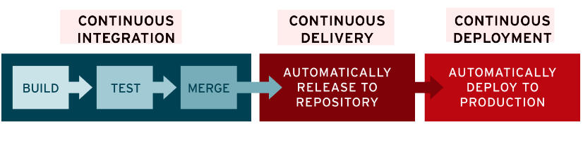

## CI와 CD란

CI와 CD에 대해 들어본 적이 있으신가요? 현업에서 사용하고 있는 효율적인 개발 프로세스인 CI/CD에 대해 알아봅시다.

모든 것이 빠르게 변하는 흐름 속에서 시장과 고객의 요구에 빠르게 반응하여 제품을 출시하는 것은 매우 중요합니다. 개발을 여러명이서 진행하다 보면 각자의 코드를 합쳐야 하는 상황이 오는데 매끄럽게 합쳐지는 일은 드물고 충돌이 발생하게 됩니다. 이때 문제를 찾고 코드를 수정하다 보면 최종적으로 통합하기까지 짧으면 몇 시간에서 며칠이 걸리기도 합니다. 이와 같은 반복되는 과정에서 소요되는 시간을 줄이고 효율적으로 개발하기 위해서 CI와 CD가 등장합니다.

CI/CD란 애플리케이션 개발부터 배포까지의 모든 단계를 자동화를 통해 효율적이고 빠르게 고객에게 제품과 서비스를 제공하는 방법을 의미합니다. CI/CD 각각에 대해 더 자세히 알아보며 어떻게 개발 과정을 효율적으로 만들 수 있는지 살펴보겠습니다.

### CI란

CI는 Continuous Integration의 약자로 '지속적 통합'이라는 의미를 가집니다. 즉 CI를 통해 개발자들의 코드를 하루에도 여러 번 주기적으로 통합하게 됩니다. 이렇게 빈번하게 통합하는 이유는 오류가 생겼을 때 작은 단위로 바로바로 수정할 수 있기 때문입니다.

예를 들어 여러 명의 개발자가 존재하는 어떤 조직에서 빈번하게 병합하는 대신 따로 '병합하는 날(merge day)'이 있다고 가정해봅시다. 이 조직은 merge day에 며칠 동안 작업한 많은 양의 코드들을 한번에 통합해야 합니다. 이러한 경우 분명 충돌하는 많은 코드가 생길 것이고 새로운 기능을 개발하는 시간보다 충돌한 코드들을 수정하는 데에 더 오랜 시간이 걸릴 가능성이 있습니다. 따라서 최대한 작은 단위로 나누어서 개발하고 주기적으로 빈번히 통합해 나가는 것이 중요하다는 것을 알 수 있습니다.

CI가 없는 상황을 살펴보면, 작성한 코드를 컴파일하고 빌드 및 배포까지 해야만 코드의 품질을 관리할 수 있습니다. 하지만 CI를 적용하게 되면 개발자는 기능을 구현하고 즉시 코드가 잘 빌드되는지, 올바르게 동작하는지 테스트해서 배포 이전에도 문제점을 빠르게 발견할 수 있게 됩니다.

개발자가 직접 빌드하고 테스트하는 과정은 오랜 시간이 소요되고 반복되는 과정이므로 자동화 과정을 거치게 됩니다. 그래서 개발자가 코드를 기존 코드와 병합할 때마다 빌드와 테스트가 트리거(trigger)되어 실행되고 개발자는 자동화된 과정을 통해 새로운 기능을 배포하는 데에 걸리는 시간을 단축할 수 있습니다.

CI의 순서를 요약하자면 다음과 같습니다.

1. 개발자가 구현한 코드를 기존 코드와 병합한다.
2. 병합된 코드가 올바르게 동작하고 빌드되는지 검증한다.
3. 테스트 결과 문제가 있다면 수정하고 다시 1로 돌아간다. 문제가 없다면 배포를 진행한다.

정리하자면 CI는 주기적으로 통합하므로 충돌을 피할 수 있어서 개발의 생산성을 향상할 수 있습니다. 또한 자동으로 빌드되고 테스트 되기 때문에 문제점을 빠르게 발견할 수 있고 이때 발견되는 문제점들은 빠르게 수정 가능하다는 장점이 있습니다. 이와 같은 장점으로 인하여 전체적인 코드의 질이 향상합니다.

### CD란

CD는 CI의 한 단계 더 나아간 개념이자 CI의 연장선상의 개념이므로 CD가 되려면 CI가 선행되어야 합니다.

CD는 두 가지 의미로 사용될 수 있는데 하나는 Continuous Delivery '지속적 제공'이고 다른 하나는 Continuous Deployment '지속적 배포'라는 의미입니다.

CI를 통해 주기적으로 통합된 코드의 빌드 및 테스트 과정이 성공적으로 진행되었다면 배포할 준비를 하고 배포를 진행하게 됩니다. 이때 배포할 준비 과정까지 거쳤다면 멈추고 릴리즈해도 되는지 직접 검증한 다음에 배포해도 문제가 없겠다고 판단하면 수동적으로 배포하는 것을 Continuous Delivery라고 합니다. 반면 배포할 준비가 되자마자 자동으로 사용자에게 배포할 수 있도록 만든다면 Continuous Deployment라고 합니다. 둘은 배포 단계에서 자동화가 얼마나 이루어지고 있는지에만 차이가 있을 뿐 다른 부분은 동일합니다.

정리하자면 CI를 통해서 저장소에 작성한 코드를 병합하여 빌드하고 테스트 과정을 거쳐 릴리즈 준비를 하면, CD를 통해 사용자가 사용할 수 있도록 수동 혹은 자동으로 배포를 진행합니다.

## 마무리하며

지금까지 CI와 CD에 대해 전반적으로 알아봤습니다. CI와 CD, 그리고 CD 안에서도 배포냐 제공이냐에 따라 나뉘었는데 이 세 가지 개념은 자동화가 어느 정도까지 되어있는지에 따라 차이가 조금 있을 뿐이지 코드 개발의 효율성을 동일한 목표로 가지고 있습니다. 그래서 이렇게 CI/CD 방법을 통해 개발자는 코드에서 충돌이 발생했을 때 문제를 고치는 데에 시간을 들이기보다 자동화된 과정을 통해 확보한 시간을 더 좋은 품질의 기능을 구현하는 데에 사용할 수 있습니다.

추가로 CI/CD 자동화를 구현해놓은 솔루션들이 있는데 Jenkins, Buildkite, GitHub Actions, Circle CI 등 다양한 툴을 통해 CI/CD를 사용해본다면 좋을 것 같습니다.

---

## References

- <https://youtu.be/0Emq5FypiMM>
