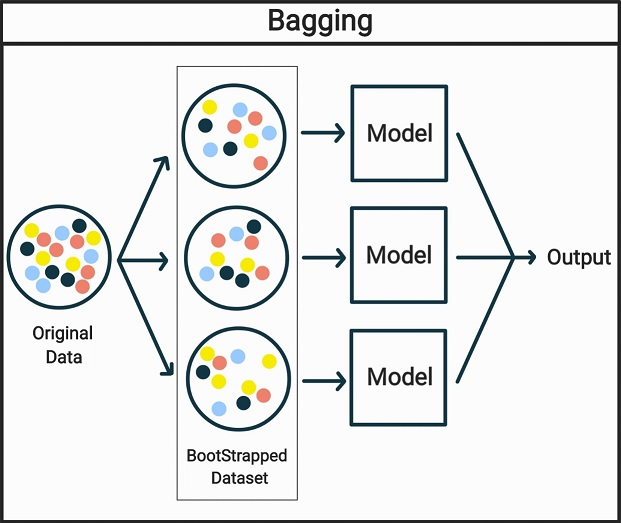
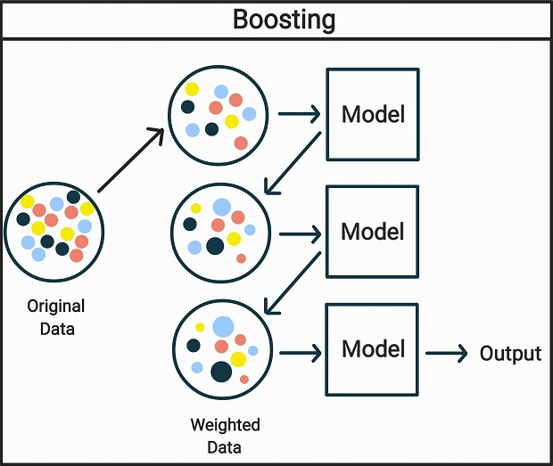
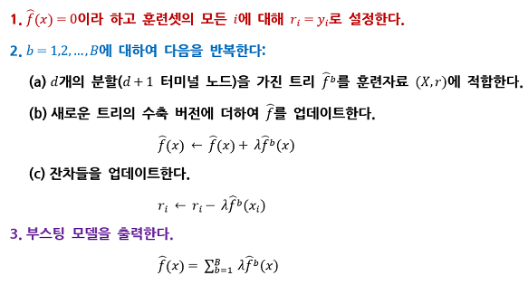

**앙상블 학습**은 학습 알고리즘들을 따로 쓰는 경우에 비해 더 좋은 예측 성능을 얻기 위해 다수의 학습 알고리즘을 사용하여 결합시키는 학습 방법입니다.

앙상블 학습 기법은 그 좋은 성능으로 인하여 현재에도 매우 인기 있는 학습 기법인데, 이러한 앙상블 학습 기법을 이용하는 데 있어서 **의사결정 트리 모델**은 가장 자주 사용되는 기본 모델 중 하나이고, 특히 학습 기법 중 XGB, LGBM 등의 **부스팅 기법**은 데이터 분석 경진 플랫폼으로 유명한 캐글(Kaggle)이나 데이콘(Dacon) 등에서도 널리 인기를 끌고 있습니다.

이러한 앙상블 학습 기법을 제대로 이해하고 활용하기 위해서는 **배깅, 랜덤 포레스트, 부스팅 등의 기본적인 원리**에 대해 잘 알고 있어야 하는데, 본 포스트에서는 의사결정트리 모델을 기반으로 이러한 기법들에 대하여 간단하게 설명하고자 합니다.

(단, 본 포스트에 대해 제대로 이해하기 위해서는 의사결정 트리(Decision Tree)와 붓스트랩(BootStrap) 기법, 편향(Bias)과 분산(Variation)의 Trade-Off 관계, 훈련오차와 검정오차 차이, 가법모델(Additive Model) 등에 대한 기본적인 배경 지식이 필요합니다.)

- - -

## 1. 배깅(Bagging)

### 배깅(Bagging)

배깅은 트리의 높은 분산 문제(다른 데이터 셋에 적용하면 그 결과가 상당히 다를 수 있음)를 줄이기 위한 방법으로 사용할 수 있는 기법이며, 트리 이외의 다른 경우에도 적용이 가능합니다.

> 가장 먼저 자연스럽게 분산을 줄이는 방법으로는, 분산의 정의를 이용하면, 관측치들의 집합을 평균하는 방법을 떠올릴 수 있을 것입니다.
>  
> 즉, 모집단으로부터 많은 수의 훈련 셋을 취하고 각 훈련 셋을 사용하여 별도의 예측 모델을 만들어 예측 결과들을 평균하는 것입니다.
>  
> 그러나, 일반적으로 다수의 훈련 셋을 가질 수는 없기 때문에, 이와 같은 방법은 실용적이지 않을 것입니다.

그 대신에, **(단일) 훈련 자료로부터 반복하여 표본들을 샘플링함으로써 붓스트랩하고, 생성된 훈련 셋을 사용하여 여러 개의 회귀 트리를 만든 후, 그 예측 결과들을 평균시켜 값을 얻어낼 수 있습니다.**

이를 배깅이라고 합니다.

> **+ 그렇다면 반응 변수 Y가 질적 변수인 분류 문제로 확장할 수 있을까요?**
>  
> 주어진 검정 관측치에 대해 트리 각각에 의해 예측된 클래스를 기록하고 다수결, 즉 여러 개의 예측 사이에서 가장 자주 발생하는 클래스를 취함으로써 분류 문제로도 적용이 가능합니다.

### Out-of-Bag 오차 추정

우리는 결국 이러한 배깅 기법을 활용해서 검정 오차를 추정하고 싶어 할 것입니다.
이때, 배깅된 모델의 검정 오차를 추정하는 아주 쉬운 방법이 있습니다.

각각의 배깅된 트리는 평균적으로 관측치의 약 2/3을 이용합니다.
이때 주어진 배깅된 트리를 적합하는 데 사용되지 않은 나머지 1/3의 관측치들은 *out-of-bag(OOB) 관측치*라고 합니다.

각 관측치에 대한 반응 변수 값은 그 관측치가 OOB였던 각각의 트리를 사용하여 예측할 수 있을 것입니다.

물론, 이때 단일 예측치를 얻기 위해서는 다음과 같은 방법을 고려해 볼 수 있을 것입니다.

> 1. **회귀가 목적인 경우** - 예측된 반응 변수 값들의 평균 구하기
> 2. **분류가 목적인 경우** - 다수결 취하기

이러한 OOB 기법은 계산상 교차 검증을 수행하기 힘든 큰 규모의 데이터 셋에 대해 배깅을 수행할 때 특히 편리합니다.

### 변수의 중요도 측정

배깅 기법은 보다 향상된 정확도를 제공하나, 결과 모델을 해석하기 어려워질 수 있다는 단점이 존재합니다.

많은 수의 트리를 배깅할 경우, 결과로 얻은 통계 학습 절차를 더 이상 단일 트리를 사용하여 나타낼 수 없고, 그 결과 어느 변수가 해당 절차에서 가장 중요한지 더 이상 명확하지 않게 되기 때문입니다.

이러한 단점을 고려하여 **RSS** 또는 **지니 계수**를 사용하면, **각 설명변수의 중요도**에 대한 전반적인 개요를 얻을 수 있습니다.

> 1. **회귀 트리** - 주어진 설명변수에 대한 분할 때문에 **RSS**가 감소되는 총량을 모든 B 개 트리에 대해 평균한 값을 기록 가능
> 2. **분류 트리** - 주어진 설명변수에 대한 분할 때문에 **지니 계수**가 감소되는 총량을 모든 B 개 트리에 대해 평균한 값을 기록 가능

- - -

## 2. 랜덤 포레스트(Random Forest)

랜덤 포레스트는 트리들의 상관성을 제거하는 방법으로 배깅된 트리들보다 더 나은 성능을 제공합니다.

배깅과 마찬가지로 붓스트랩된 훈련 표본들에 대해 다수의 의사결정 트리를 만드나,

**차이점은 트리 내에서 분할이 고려될 때마다 p 개 설명변수들의 전체 집합에서 m 개 설명변수들로 구성된 랜덤 표본이 분할 후보로 선택된다는 것입니다.**

이때, 분할은 이들 m 개 설명변수들 중 하나만을 사용하도록 허용되고, 각 분할에서 m 개 설명변수들의 새로운 표본이 선택되며 보통 $m=\sqrt{p}$를 사용합니다.

> **+ 배깅에 비해 더 나은 성능을 제공하는 이유는 무엇일까요?**
>  
> 만약 하나의 매우 강한 설명변수와 다수의 적당히 강한 설명변수가 있다고 하면,
>  
> 배깅된 트리들의 컬렉션 대부분에서 이 강한 설명변수를 맨 위의 분할에서 사용할 것이고, 그 결과 배깅된 트리들이 유사해져 각각의 배깅된 트리들에서 얻은 예측치들은 서로 높게 상관될 것입니다.
>  
> 안타깝게도, 높은 상관성이 있는 값들을 평균하는 것은 상관되지 않은 값들을 평균하는 것만큼 크게 분산을 줄이지는 않습니다.
>  
> 즉, 배깅은 단일 트리에 비해 분산을 크게 줄이지 못합니다.

랜덤 포레스트는 매번 분할을 수행할 때마다 설명변수들의 일부분만을 고려하게 함으로써 이러한 문제를 해결하고, 이는 상관성을 제거하는 것으로 간주할 수 있습니다.
그 결과, 트리들의 평균은 변동성이 적어지고 더 안정적이게 됩니다.

이러한 배깅과 랜덤 포레스트 사이의 주된 차이는, **설명변수의 부분집합 크기 m의 선택**으로 설명할 수 있을 것입니다.

> 1. **m=p일 경우** - 배깅과 같습니다.
> 2. **$m=\sqrt{p}$일 경우** - 검정 오차와 OOB 오차 둘 다 배깅에 비해 줄어들게 합니다.

만약 큰 수의 상관된 설명변수들이 있을 경우, 작은 m을 사용하는 것이 유용할 것입니다.

- - -

## 3. 부스팅(Boosting)

부스팅은 배깅과 같이 일반적인 기법으로, 회귀 또는 분류에 대한 많은 학습방법들에 적용될 수 있습니다.

부스팅은 배깅과 유사한 방식으로 동작하지만, 다른 점은 **트리들이 순차적으로 만들어진다는 것입니다.**

즉, 각 트리는 이전에 만들어진 트리들로부터의 정보를 사용하여 만들어지는데, **부스팅은 붓스트랩 샘플링을 하지 않고, 대신에 각 트리는 수정된 버전의 원래 데이터 셋에 적합됩니다.**

부스팅은 다음과 같은 알고리즘으로 설명할 수 있습니다.
(단, 여기서는 부스팅 회귀 트리를 가정하며, 분류 트리는 유사하지만 과정이 약간 더 복잡합니다.)

> 
>
> 부스팅에서는 결과 Y가 아니라 현재의 잔차들을 반응 변수로 사용하여 트리를 적합합니다.
>
> 그다음에 이 새로운 의사결정 트리를 적합된 함수에 더하여 잔차들을 업데이트합니다. (이 트리들 각각은 알고리즘에서 d에 의해 결정되는 단지 몇 개의 터미널 노드를 가진 다소 작은 트리일 수 있습니다.)
>
> 이후 작은 트리들을 이 잔차들에 적합함으로써 성능을 천천히 개선합니다.

데이터를 너무 과적합하여 과적합에 이를 수 있는 하나의 커다란 의사결정 트리를 적합하는 것과는 달리, 이러한 **부스팅 기법은 천천히 학습합니다.**
일반적으로, 천천히 학습하는 통계 학습 기법들이 좋은 성능을 내는 경향이 있습니다.

배깅과는 달리 부스팅에서는 각 트리를 만드는 것이 이미 만들어진 트리들에 강하게 의존하게 됩니다.

부스팅은 **3개의 조율 파라미터**를 가지게 됩니다.

> ### 1. 트리의 수 B
>  
> 배깅과 랜덤 포레스트와는 달리 부스팅은 **B가 너무 크면 과적합**이 생길 수 있습니다.
>  
> 따라서 이러한 B를 선택하는 데는 교차 검증(Cross-Validation)을 이용할 수 있습니다.

> ### 2. 수축 파라미터 λ(작은 양수)
>  
> λ는 부스팅이 **학습하는 속도**를 제어합니다.
>  
> 보통 이 값은 0.01 또는 0.001이며, 적당한 값은 문제에 따라 다릅니다. 만약 λ가 매우 작은 값이면 좋은 성능을 달성하기 위해 아주 큰 값의 B를 사용해야 합니다.

> ### 3. 각 트리에서 분할의 수 d
>  
> d는 부스팅 구성(boosted ensemble)의 **복잡도**를 제어합니다.
>  
> 보통은 d=1이면 잘 동작하며, 이 경우 각 트리는 분할이 하나뿐인 그루터기(Stump)입니다. 이러한 경우, 부스팅 구성은 각 항이 하나의 변수만을 포함하므로 가법 모델(Additive Model)을 적합하는 것입니다.
>  
> 좀 더 일반적으로는, d 개의 분할은 많아야 d 개의 변수가 관련될 수 있기 때문에, d는 상호작용 깊이(interaction depth)이고 부스트 된 모델의 상호작용 순서를 제어합니다.

부스팅과 랜덤 포레스트 사이의 한 가지 중요한 차이는,
부스팅에서는 특정 트리의 성장이 이미 성장된 다른 트리들을 고려하기 때문에 보통 더 작은 트리들로 충분하다는 것입니다.

이러한 작은 트리들을 사용하는 것은 해석력(interpretabillity)에 도움을 줄 수 있고, 예를 들어, 그루터기(Stump)를 사용하면 가법 모델이 됩니다.

- - -

**출처**: An Introduction to Statistical Learning