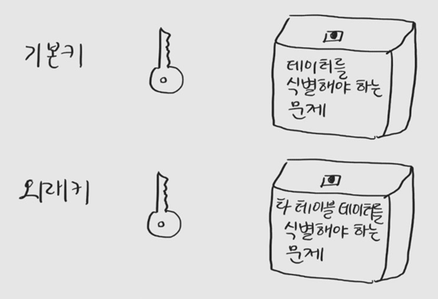
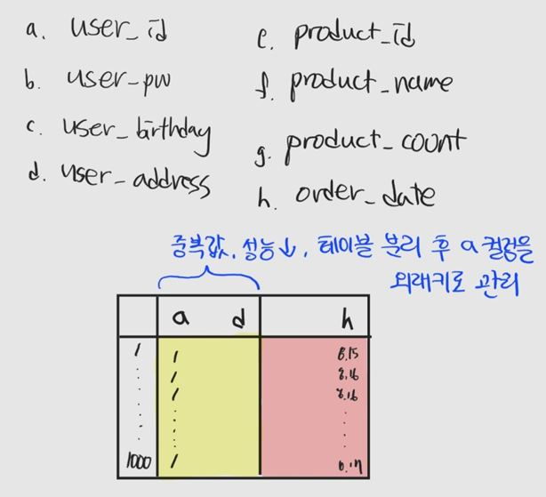

## 외래키? 그거 없어도 되지 않나요?

## 1. 외래키는 왜 쓰는가?

외래키를 생각해보기 전에, 키는 무엇인가? 키는 테이블에서 데이터를 구분할 수 있도록 하는 속성으로 슈퍼 키, 복합 키, 기본 키 등이 있다. 그중에서도 외래키는 어떤 테이블 간 기본 키를 참조하는 속성이다. 테이블 간 관계를 나타내기 위해서 사용된다. 여러 레퍼런스를 찾아봤는데, 외래키를 사용하는 이유는 두 가지로 대표할 수 있을 것 같다.

### 중복 데이터 관리

[기본키와 외래키가 하는 역할]
키는 테이블에 있는 레코드들을 식별할 수 있도록 한다. 따라서 우리는 키만 있다면 유일한 레코드를 뽑아낼 수 있다. 이를 외래키에 대입해서 생각해보면 다음과 같은 결론이 난다.

기본키는 **데이터를 식별**해야 하는 문제를 해결한다.
외래키는 **다른 테이블 데이터를 식별**해야 하는 문제를 해결한다.

자기 테이블 데이터를 식별해야 하는 이유는 알겠는데, 왜 다른 테이블 데이터를 식별해야 할까?

다른 테이블에는 그 테이블의 기본키가 있지 않을까?

[외래키가 필요한 이유]

위와 같은 컬림을 가진 테이블을 이용해 사용자가 웹사이트에서 물건을 주문하는 상황을 생각해보자.

이 사이트의 유일한 단골인 한 사용자가 두 달동안 물건을 1000개 샀다. 컬럼 a, b, c, d는 같은 사용자에 대한 정보가 들어갈 것이고 기껏해야 e, f, g, h 컬럼 내용만 달라질 것이다. **같은 정보를 반복해서 저장하는 것은 메모리 낭비다.**

이런 경우에는 노란색 영역을 사용자 테이블, 빨간색 영역을 주문 테이블로 나누고 user_id인 컬럼 a를 외래키로 둬야 한다.

이렇게 외래키로 테이블 간 관계를 정의함으로써 중복 데이터를 같은 메모리로 관리할 수 있다.

### 참조 무결성 원칙

외래키를 사용하는 두번째 이유는 **참조 무결성 원칙을 지키기 위해서이다.**

**참조 무결성 원칙은 기본키가 지정된 테이블과 외래키가 지정된 테이블 사이에서, 외래키로 지정된 컬럼 데이터가 기본키로 지정된 테이블 컬럼값 외 값을 가질 수 없다는 제약 조건이다.**

만약 위 예시에서 사이트 단골 사용자가 회원 탈퇴를 한다고 생각해보자.

외래키가 걸려있지 않다면 사용자는 탈퇴했으나 주문 테이블에서 주문자 정보는 남아있을 것이고 수동으로 탈퇴한 회원에 대해 적합한 처리("탈퇴한 회원입니다" 메세지를 띄우는 등)를 하는 데에 관련 유지 비용이 지속적으로 들 것이다.

반면 외래키를 건다면 회원 삭제 연산이 이뤄질 때, 연관된 주문 테이블에서 삭제된 회원이 주문한 정보를 어떻게 처리할 것인지 규칙을 걸어 처리할 수 있다.

**외래키는 여러 테이블 간 데이터가 무결하다는 것을 보장해준다.**

## 2. 외래키 없이 Join할 수 있는가?

Join 연산은 나누어진 앞서 살펴본 사용자, 주문 테이블처럼 **데이터 중복 방지를 위해 나누어진 두 테이블을 연결해 원하는 데이터를 찾기 위해 필요하다.**

Join 연산에는 보통 기본키와 외래키를 사용하도록 언급해서 Join으로 두 테이블을 연결해서 데이터를 뽑아내기 위해 기본키, 외래키를 사용하는 줄 잘못 알고 있었는데, Join 연산에 키는 필수가 아니다. 일반 컬럼으로도 Join할 수 있다.

다만 무결성 원칙을 지키기 위해서는 외래키를 거는 것이 권장된다.

## 3. 기존 테이블에 외래키를 도입할 수 있는가?

외래키 없이 Join이 가능하다. 따라서 외래키를 설정하지 않은 데이터베이스도 있을 것이다. [해당 링크](https://enginassets/images/post-foreign-key/1.pngeering-skcc.github.io/oracle%20tuning/foreign_key_%EC%97%86%EC%9D%B4_%EA%B5%AC%EC%B6%95%ED%95%98%EB%8A%94_DB/)를 참고하면 이유는 그 이유는 다양한데, 이 이유들을 상쇄할 수 있는 대안을 소개하고자 한다.

1. 성능이 느리다.
   → 성능 오버헤드 이슈가 있긴 하지만 현재는 무시할만한 수준이다.
   → 외래키가 속도에 영향을 미치기 때문에 도입하지 않는다는 말에는 모순이 있다. 물론 외래키를 걸고 무결성을 확인하면 추가 연산이 필요하므로 느려지겠지만 외래키를 걸지 않는다고 생각해보자. 프로그램 수준에서 데이터 무결성을 확인하기 위해 사전에 select 연산을 할텐데 이 연산이 외래키를 거는 것보다 빠르다고 할 수 있을까?
   →  단, 성능이 매우아주많이 중요한 증권거래시스템 같은 경우에는 외래키를 도입하지 않을 수도 있다.

2. 기존 데이터가 이미 무결성에 맞지 않아서 외래키를 걸 수 없다.
   → enable novalidate옵션으로 기존 데이터 무결성을 검증하지 않도록 설정하면 된다.

3. 테스트 데이터를 생성할 때 참조 무결성 때문에 불편하다.
   → 개발기간 중에 외래키를 Disable 시키면 된다.

4. 트랜잭션 내에서 부모 테이블과 자식 테이블 관계에 따라 연산 순서가 달라져야 할 수 있다.
   → 외래키를 deferred 옵션으로 만들어 매 문장마다가 아닌, 커밋 시점마다 정합성 검사를 한다.

요약하자면, **속도에 민감한 서비스가 아니라면 데이터 품질을 보장받기 위해 외래키를 사용하는 것이 좋다.**

다만 데이터 무결성을 지키려면 개발 과정이 귀찮아지는데 제일 나아 보이는 해결 방법은 외래키를 deferred로 만들고 disable 시킨 후 개발하는 것이다.
