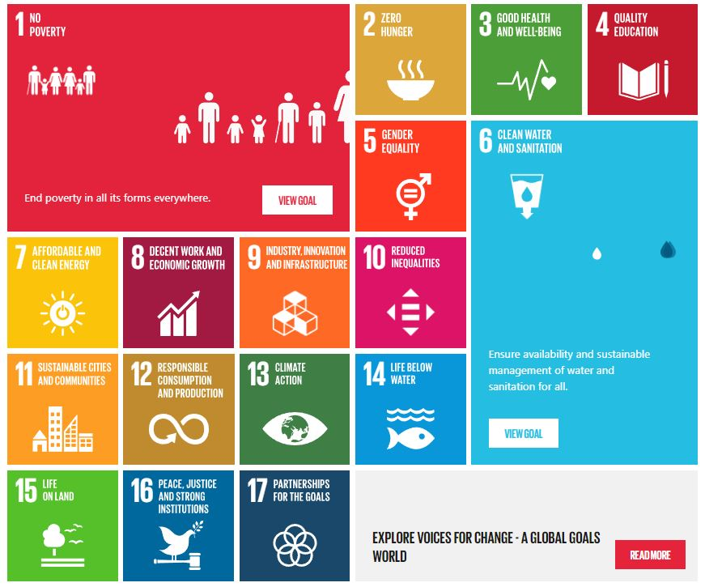
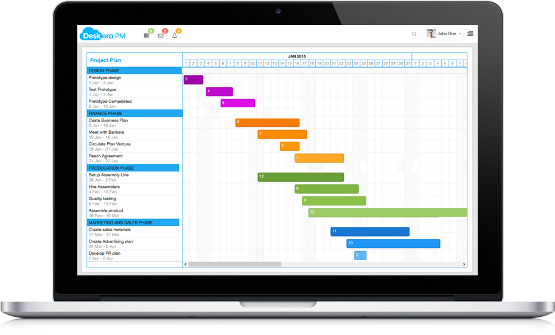
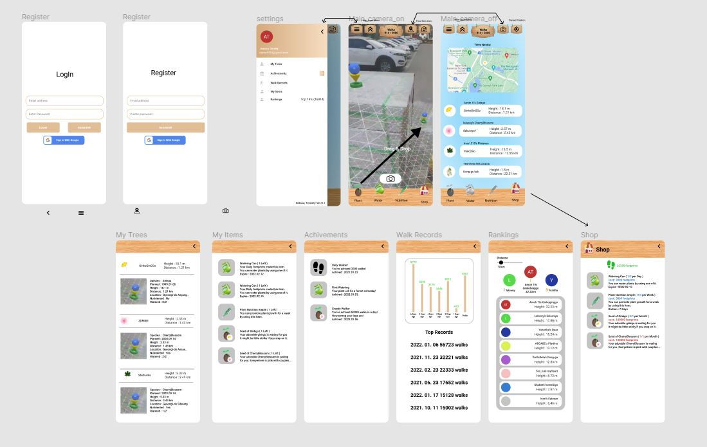

 아직 팀 프로젝트를 참여한 경험이 없는 개발자분들이 팀 프로젝트에 참여해 봤으면 좋겠다는 생각에서
GDSC 멤버라면 한 번쯤 들어보거나, 참여해 봤을 **Google Solution Challenge 2022**에 참여한 경험에 대해 게시글을 남겨보고자 한다.

***

## 간단한 소개

 Treenity 프로젝트는 GDSC 백엔드 팀 소속 멤버 2명과 모바일 팀 소속 멤버 2명이 SETANA 팀을 결성해 진행한 프로젝트이다.

<!--이렇게 뱃지 첨부하는게 이쁘네요 inline html 봐주세요.. ⭐-->

 캐치프레이즈는 **'Let's Plant your steps!' 발걸음을 심어 보자!** 로서
 탄소 저감을 위한 자연 보호와 현대인의 건강 증진, 마지막으로 소셜 네트워킹을 위해
 **가상현실 세계에 나무를 심어 키우기** 라는 동기를 부여해주는 애플리케이션이다.
 프로젝트에 관해 관심이 있는 사람을 위해서 대회에 제출하였던 데모 동영상 링크를 첨부한다.

***

## 마주친 벽과 얻은 것

 프로젝트를 진행하면서 이제껏 경험한 적 없는 새로운 난관들과 수없이 마주쳤다. 경험의 부족에서 온 문제들이 여럿이다.
 개발을 배우는 가장 좋은 방법은 실제로 프로그램을 만들어 보고 운영하는 것이라는 점을 다시 한번 느낄 수 있었다.
 그 내용들에 대해서 적어 보겠다.

 ***

### 정의되지 않은 문제

 임베디드 로봇 제작부터 휴머노이드 컴퓨터 비전 프로그래밍까지 여러 프로젝트를 경험해봤지만, 이번 프로젝트처럼 **시작과 끝이 정해지지 않은 소프트웨어**를 팀으로 개발해 본 것은 처음이다.

 주어진 문제를 푸는 것은 한국 사람들이 가장 잘하는 일 중에 하나라고 한다. 어릴 때부터 문제집 해치우는 것을 기본으로 커 온 탓이다. 그러나 창의력을 발휘하는 분야에선 항상 머리를 쥐어뜯는 고통에 시달리고는 한다.

 GSC는 UN이 제시한 [17가지 목표](https://www.globalgoals.org/take-action/?gclid=Cj0KCQjwhLKUBhDiARIsAMaTLnEcTQuG9ibbn-3QL4_HGJpUEHSwGrH-NQch6m5BgoGB-OTmDxb59CoaAvTOEALw_wcB)에 대하여 적당한 해결책을 제시하는 프로젝트를 목적으로 한다.

 예컨대 기아 문제를 해결하는 소프트웨어를 제작하라고 한다면 **"1+2는? " 따위의 시작과 끝이 정해져 있는 문제들만 접한 나로서는 백지상태의 머리를 마주하게 될 뿐이다.**

 프로젝트를 시작하고 거의 한 달간 주제 선정과 프로젝트 아이디어를 내는 데에 시간을 썼다.

 개발자로서의 마주칠 문제들은 수학 문제나 알고리즘과 같은 문제 풀이와 거리가 먼 것들도 수없이 많을 것이다.

 단순한 이슈 해결을 넘어 새로운 소프트웨어를 직접 개발한다면 꼭 겪게 될 일이다.

 ***

### 프로젝트 계획

 

 지금껏 해 본 프로젝트 계획이라고는 계획서에 그저 기능과 시나리오 몇 개와 예상되는 일정을 작성하는 것이 전부였다. 그저 **Code and Fix 식으로 무작정 부딪혀 보았었다.**

 그러나 이번 프로젝트에서는 프로젝트에서 발생할 수 있는 문제를 예측하고 더 완성도 높은 소프트웨어를 개발하기 위해서 **와이어 프레임에 대한 논의**를 사전에 진행해 보았고, ``Figma``(그래픽 프로토타이핑 툴)을 이용해서 작성까지 진행해 보았다.

 미리 소프트웨어의 방향성에 대해서 논의하는 과정은 확장 기능을 미리 고려할 수 있게 도왔고, 추가로 학습해야 하는 부분이 어떤 부분인지 구체화하는 데에 도움을 주었다.

 이번에 새로운 프로젝트를 진행하고 있는데, 사용자가 프로그래밍에 대한 지식이 전무한 소프트웨어를 개발하는 과정에서 그래픽 프로토타입을 통해서 요구사항의 구체화를 진행할 예정이다.

 ***

### 3rd 라이브러리의 사용

 AR(augmented reality, 증강 현실)은 수학적으로 매우 복잡한 계산이 수반되는 기능이다.

 

 이번 프로젝트의 한 기능인 AR 액티비티의 한 장면이다.
 공간 내의 평면을 찾아 점을 찍고, 가상의 3D 물체를 생성하여 그림자까지 생성한다.

 아마 이 기능을 하나부터 열까지 구현하려 한다면 프로젝트 규모는 상상도 못 할 정도로 커질 것이다.

 대부분의 개발자들은 라이브러리를 사용한 경험이 있을 것이다. 필자도 그래프를 구현하기 위해 저번 프로젝트에서 ``MPAndroidChart`` 라는 라이브러리를 사용한 경험이 있다.

 애플리케이션이 알 수 없는 이유로 종료되는 오류를 고치는 데에 3일을 쏟아 부었는데, 디버깅에서 얻을 수 있는 정보라고는 애플리케이션이 컴파일러가 생성한 코드 속에서 불법적인 메모리 참조를 진행했다는 에러 로그와 그 가변적인 메모리의 주소뿐이었다. (심지어 구글 검색으로도 아무것도 얻을 수 없었다)

 코드에 중단점을 한 줄 한 줄 찍어가며 찾아낸 오류의 결론은 **3rd 라이브러리가 특정 기능을 사용하면 비정상 종료됨** 이었다. 하필이면 그 특정 기능은 **AR 객체의 서버를 통한 공유**로, 우리 프로젝트의 핵심과도 같은 기능이었다.
 결국 해당 오류는 해결할 수 없었고, 라이브러리 측에 issue를 제보하고 애플리케이션이 비정상 종료되면 다시 실행되도록 설정하는 것으로 마무리했다.

 이렇게 3rd 라이브러리는 개발에 디버깅의 어려움과 대처하기 어려운 문제들을 던지고는 한다.
그럼에도 불구하고 3rd 라이브러리를 사용하는 이점은 매우 크기 때문에 **3rd 라이브러리를 사용하는 경험, 타인의 코드를 읽고 이해하는 경험**을 가지는 것은 그 자체로도 **개발에 대한 인사이트를 높이는 데에 큰 도움이 될 것**이라고 생각한다.

 ***

### 팀 멤버와의 협업

 **1인 프로젝트는 편하다.** 어디가 문제인지도, 어떤 일을 해야 하는지도, 어떤 방식으로 해결할지도 스스로 결정할 수 있다.
 그러나 대규모의 소프트웨어 제작을 위해서는 팀 개발이 필수적이고, **대다수의 개발자들은 팀을 이뤄 개발할 것이다.**
 백엔드 팀과의 협업은 서버 통신에 대한 배경지식이 없었던 나에게 어떤 부분을 채워나가면 좋을지 알려주는 계기가 되었다.

 ``postman``,``swagger`` 처음 써 봤다. 서버에 요청을 날리고 협의한 디자인 패턴(``MVVM 패턴``을 이용했다)을 통해서 일관성 있는 ``Http`` 통신 의존성 주입을 사용한  ``coroutine``을 통해 비동기적으로 처리하는 방법?
들어만 봤지 어떻게 시도할지 갈피조차 잡지 못하고 있었다.
**내가 해 본 경험과 멤버가 해 본 경험은 팀 프로젝트를 통해 공유된다.**

 내가 만든 액티비티와 다른 멤버가 만든 액티비티 간의 데이터 교환과 액티비티 스택에 대한 처리 방식 고려, UI 통일성, 다른 분야 개발자와의 소통. 팀 프로젝트를 진행하지 않고는 얻기 어려운 경험이다.
**다른 이와 협업하기 위해 필요한 실질적인 내용을 습득하게 된다**

개인적으로 개발은 체계적인 학습 방식이 아직 정립되지 않은 분야라고 생각하기에 실질적인 개발을 위한 학습의 방향성 또한 실질적인 경험으로부터 온다고 생각한다.

***

### 마치며

 얘기가 길어졌다. 요약해보면
 특정 목적을 위한 소프트웨어를 팀을 구성하여, 3rd 라이브러리를 사용하여 프로젝트 생성부터 배포까지 단번에 경험할 수 있었던 경험이다.
 혼자 하는 개발과는 결이 아주 다르다.

 프로젝트에서 받았던 많은 교훈을 전하기에는 필력이 너무 부족한 것 같지만 모쪼록 **팀 프로젝트에 두려워하지 말고 참여했으면 하는 바람이다.**

 팀에 피해가 가지 않을 때까지 혼자 공부 하는 것보다는
**부족한 실력을 팀 프로젝트를 통해 채울 수 있는 것**이라고 생각한다.

*** 

#### 여담 + 조금의 불평

 GSC 프로젝트를 제출하고 그 결과를 받아보기까지 2달에 가까운 시간이 걸렸다. 원래의 일정보다 2주가량 지연되었다. 올라가는 구글 클라우드 플랫폼 청구 비용이 빈 지갑에 오버랩되는 모습이 꽤 무서웠다.
물론 많은 점을 배웠다는 사실에는 변함이 없지만 말이다.

 지나고 보니 프로젝트를 계획하고 만들어 나가는 방법론에 대해서 이번 학기에 배우고 있다.
이번 프로젝트를 진행하면서는 보다 체계적으로 개발을 진행하고 이번 프로젝트를 통해 얻은 지식은 다져나갈 예정이다.

 추가로 조금 더 확장적인 경험이 필요하다고 생각한다.
애플리케이션 개발은 서명된 APK Bundle로 끝나는 것이 아니라, Google Play Store에 애플리케이션을 게시하고, 홍보하고, 서비스를 유지/보수하는 과정이 필수적이다.
이 부분에 대해서는 아직 경험이 부족한 것이 사실이고, 조금 더 보편적으로 사용될 수 있는 애플리케이션 개발을 통하여 이른 시일 내에 시도해 보고 싶다.
