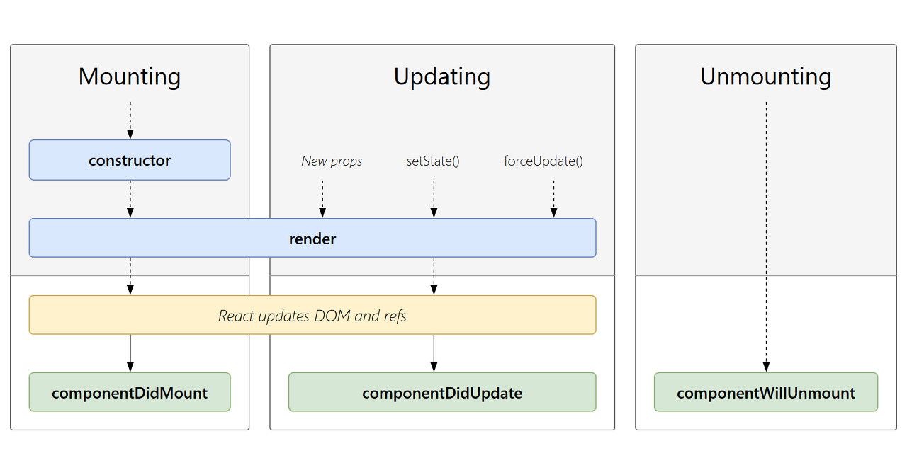
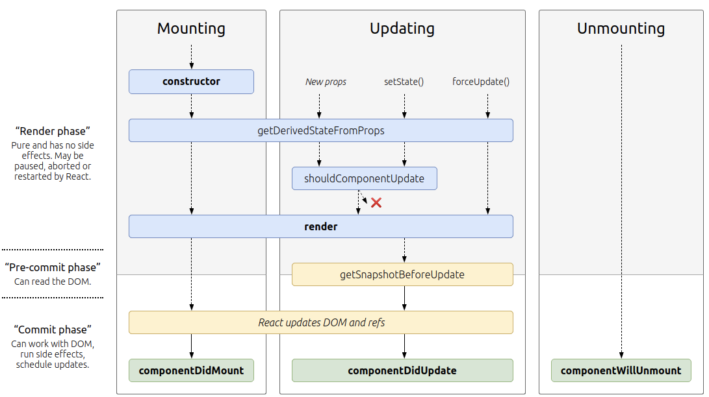
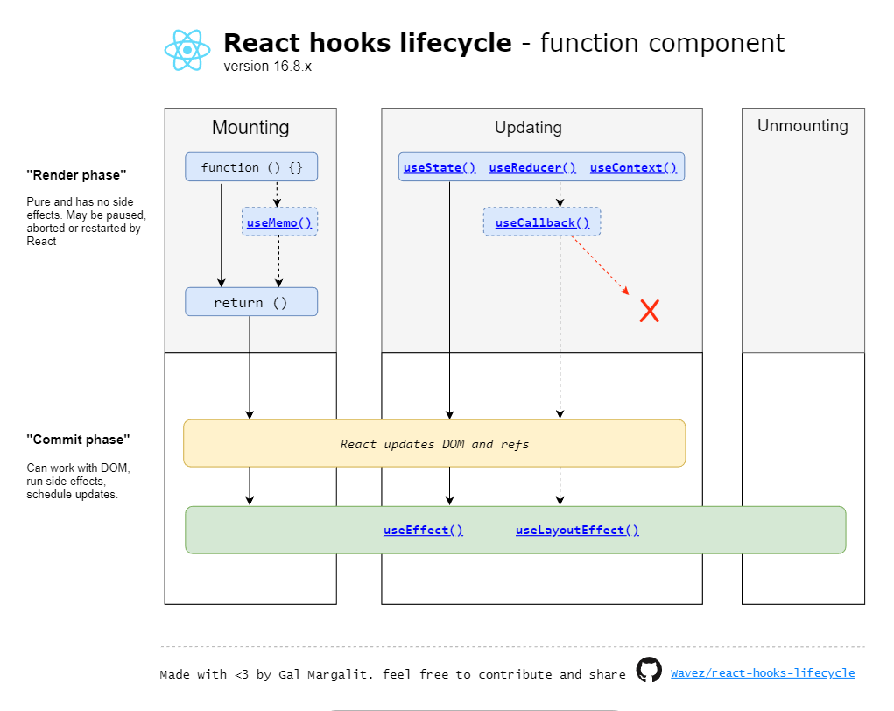

# 리액트의 생명주기

## When do we use React LifeCycle?

먼저, 리액트의 생명주기가 어떤 점에서 필요하고, 무엇인지에 대해 알아봅시다 😁

사용자와 함께하는 동적인 페이지를 만들기 위해 state와 props는 사용자에 어떤 특정 행동에 의해 값이 변합니다. 사용자가 사이트에 들어오기 전에는 특정한 API를 호출해서 데이터를 가져와야 하는 경우가 필요할 수도 있습니다.

리액트에서는 DOM(Document Object Model)에서 특정한 시간에 특정한 행동을 일어나게 할 수 있도록 생명주기를 만들었다고 생각합니다. 즉, 리액트에서 말하는 생명주기는 내가 원하는 것과 화면에 렌더링하는 구성 요소들을 일치시킬 수 있도록 DOM을 관리하는 일종의 수단이 됩니다👍

## What is React Life Cycle?

리액트에서 생명주기는 크게 3단계로 나눌 수 있습니다. 각 과정의 순서는 `Mounting` → `Updating` → `Unmounting` 과정으로 진행됩니다. 각각의 과정에서 어떤 것을 할 수 있는지에 대해 알아봅시다🧐



## Mounting

`Mounting` 은 DOM에 Node를 추가하는 작업입니다. Node를 만들고, 사이트에 불러오는 역할을 해줍니다. `Mounting` 은 constructor, render, componentDidMount 으로 순차적으로 진행됩니다.

### Constructor

리액트에서 생성자는 DOM에 추가되기 전에 실행이 되며 가장 먼저 실행됩니다. 개인 환경에서 초기값을 설정해줄 때 사용합니다.

this.state에 객체를 할당하여 지역 state를 초기화할 수 있습니다.
인스턴스에 이벤트 처리 메서드를 바인딩할 수 있습니다.

### Render

리액트에서 정말 정말 중요한 친구입니다. 리액트에서 대부분의 작업을 수행하고 있고, 주로 컴포넌트를 JSX로 반환하는 역할을 합니다.
Render는 항상 순수해야 합니다. 기존에 사용하던 state가 변하지 않아야 컴포넌트의 동작이 이해하기 편하게 작동이 될 것입니다.

### ComponentDidMount

여러 컴포넌트가 Render된 후에 호출이 됩니다. 주로 데이터를 상호작용하기 위해서 데이터를 로드할 때 사용합니다.

### GetDerivedStateFromProps

여기서 생각해볼 할 문제가 있습니다. props에 의존하여 state를 변경하여 쓰고 싶다면 어디에 넣어줘야 할까요?

Constructor에 넣는 것은 새로운 state를 만드는 행위입니다. ComponentDidMount 에 넣는 것은 이 때 값이 변경되는 상황이 필요하다면 이미 늦은 상태입니다. 그래서 Render가 되기 전에 실행이 되는 생명주기가 있습니다.

리액트 16.3 버전에서는 이를 위해서 componentWillReciveProps를 사용했었는데, 17 버전부터는 getDerivedStateFromProps로 바꿔서 사용합니다.

두 개의 주요 차이는 함수 내에서 setState를 할 수 있냐 없냐에 차이가 있다고 보면 됩니다. 전자는 가능하고, 후자는 가능하지 않습니다. 전자는 이제 거의 사용하지 않으니 후자에 대해 조금 알아봅시다.

getDerivedStateFromProps는 static 메서드로 this로 접근 할 수 없으며, 다른 클래스 메서드에도 접근할 수 없습니다. 상태를 바꾸는 유일한 방법은 객체를 반환하는 것이고, 바꾸기 싫다면 Null을 반환하면 됩니다.

사용시 주의할 사항이 있는데, getDerivedStateFromProps는 Render가 될 때마다 매 번 실행이 되고, 필요없는 상황에서 사용할 경우도 있습니다. 그래서 정말 드문 경우에만 사용하는걸 추천하며 아래에 해당되는 내용이 있으면 리액트에서 제시하는 대안을 사용하면 좋습니다.

props 변화에 대응한 부수 효과를 발생시켜야 한다면 (예를 들어, 데이터 가져오기 또는 애니메이션), [componentDidUpdate](https://ko.reactjs.org/docs/react-component.html#componentdidupdate) 생명주기를 대신해서 사용하세요.

props가 변화했을 때에만 일부 데이터를 다시 계산 하고 싶다면, Memoization Helper를 대신해서 사용하세요.

props가 변화할 때에 일부 state를 재설정 하고 싶다면, 완전 제어 컴포넌트 또는 [key를 사용하는 완전 비제어 컴포넌트](https://ko.reactjs.org/blog/2018/06/07/you-probably-dont-need-derived-state.html#recommendation-fully-uncontrolled-component-with-a-key)로 만들어서 사용하세요.

## Updating

`Updating` 말 그대로 무언가 바뀌었을 때 호출이 됩니다.

### GetDerivedStateFromProps-Update

위와 동일합니다. 하지만 업데이트가 되지 않았는데도 실행이 되는 친구니까 항상 조심해야 합니다. 최대한 사용을 자제합시다.

### Render-Update

위와 동일합니다. 업데이트가 되고 나서 다시 보이게 할려면 Render가 다시 되어야 보입니다.

### ComponentDidUpdate

Re-rendering이 완료되고 직후에 호출되는 친구입니다. 즉, 사용자의 환경에는 이미 바뀐 상태가 적용되어있을 때 실행되는 메서드라고 생각하면 됩니다. 여기서는 이전 상태에 접근할 수 있습니다. 주로 자동 저장 기능과 같은 업데이트를 통해 DOM에 커밋 된 변경된 사항과 관련된 작업을 수행하려는 경우에 사용됩니다.

여기서 이전 상태에 접근 하기 위해서 getSnapshotBeforeUpdate 를 이용해서 같이 사용합니다. 컴포넌트의 값이 변하기 직전의 DOM의 상태를 가져와서 특정 값을 반환한다면 ComponentDidMount를 실행 시키면 됩니다.

실제 사용하는 코드

```javascript
getSnapshotBeforeUpdate(prevProps, prevState) {
  // DOM 업데이트가 일어나기 직전의 시점입니다.
  // 새 데이터가 상단에 추가되어도 스크롤바를 유지해보겠습니다.
  // scrollHeight 는 전 후를 비교해서 스크롤 위치를 설정하기 위함이고,
  // scrollTop 은, 이 기능이 크롬에 이미 구현이 되어있는데,
  // 이미 구현이 되어있다면 처리하지 않도록 하기 위함입니다.
  if (prevState.array !== this.state.array) {
    const { scrollTop, scrollHeight } = this.list;
    // 여기서 반환 하는 값은 componentDidMount 에서 snapshot 값으로 받아올 수 있습니다.
    return {
      scrollTop,
      scrollHeight
    };
  }
}

componentDidUpdate(prevProps, prevState, snapshot) {
  if (snapshot) {
    const { scrollTop } = this.list;
    if (scrollTop !== snapshot.scrollTop) return; // 기능이 이미 구현되어있다면 처리하지 않습니다.
      const diff = this.list.scrollHeight - snapshot.scrollHeight;
      this.list.scrollTop += diff;
  }
}
```

### ShouldComponentUpdate

여기서도 생각해볼 부분이 당연히 있습니다. 그렇다면 상태가 바뀔 때마다 Re-Rendering 되는게 맞을까요? 당연히 코스트가 너무 커지기 때문에 아니라고 얘기할 수 있습니다. 그래서 ShouldComponentUpdate가 존재 합니다.

오직 최적화만을 위한 생명주기입니다.

이 메서드는 props 또는 state가 새로운 값으로 갱신되어서 Rendering이 발생하기 직전에 호출됩니다. 기본값은 true며 이 메서드는 초기 렌더링 또는 forceUpdate가 사용될 때에는 호출되지 않습니다. 사용 할려면 이전값과 현재 값을 비교해서 false를 반환하게 만들어 줘야 합니다.

shouldComponentUpdate 내에서는 깊은 동일성 검사를 수행하거나 JSON.stringify를 사용하는 것을 권하지 않습니다. 아주 비효율적이며 성능을 떨어트릴 수 있습니다.

하지만, 렌더링을 방지하는 목적으로 사용할 경우 버그로 이어질 수 있다고 합니다.

리액트에서 대신에 PureComponent를 사용하는 것이 좋다고 말합니다. PureComponent는 props와 state에 대하여 얕은 비교를 수행하고, 해야 할 갱신 작업을 건너뛸 확률을 낮춥니다.

## UnMounting

컴포넌트가 DOM에서 제거될 때 사용됩니다.

### ComponentWillUnMounting

Clean하는 과정입니다. 일반적으로, 네트워크의 요청이나 이벤트 리스너, 더이상 필요하지 않는 요소들을 제거할 때 사용합니다.

전체적으로 이를 나타내보면 아래와 같이 됩니다.



## Error Handling in React

위에서 다룬 생명주기가 아니라 추가로 Error발생시 실행되는 메서드가 있습니다.

### getDerivedStateFromError

이 메서드는 하위의 자손 컴포넌트에서 오류가 발생했을 때 호출됩니다. 이 메서드는 매개변수로 오류를 전달받고, 갱신된 state 값을 반드시 반환해야 합니다.

해당 메서드는 render단계에서 실행됩니다. 그러므로 오류 로그 기록을 한다는 등 부수적인 효과를 넣지 말아야 합니다.

사용예시

```javascript
class ErrorBoundary extends React.Component {
  constructor(props) {
    super(props);
    this.state = { hasError: false };
  }

  static getDerivedStateFromError(error) {
    return { hasError: true };
  }

  render() {
    if (this.state.hasError) {
      return <h1>Something went wrong.</h1>;
    }
    return this.props.children;
  }
}​
```

### componentDidCatch

이 메서드는 자손 컴포넌트에서 오류가 발생되었을 때 호출되며, 2개의 매개변수를 사용합니다.

`error` - 발생한 오류
`info` - 어떤 컴포넌트가 오류를 발생시켰는지에 대한 정보를 포함한 componentStack 키를 갖고 있는 객체
해당 메서드는 커밋단계에서 실행됩니다. 따라서 부수적인 효과를 넣어도 됩니다.

사용예시

```javascript
componentDidCatch(error, info){
  logComponentStackToMyService(info.componentStack);
}
```

## React LifeCycle in Functional Component

그렇다면 리액트에서 최근에 대다수가 주력으로 사용하게 된 함수형 컴포넌트에서는 생명주기가 어떻게 될까요?
결론부터 말하자면 앞서 알아봤던 3개의 상태에서 각각 마지막으로 호출되는 `componentDidMount` 와 `componentDidUpdate`, `componentWillUnmount` 를 useEffect 하나에 다 담아놓았습니다.

사용 코드를 살펴보면 다음과 같습니다.

```javascript
useEffect(() => {
  function handleStatusChange(status) {
    setIsOnline(status.isOnline);
  }

  ChatAPI.subscribeToFriendStatus(props.friend.id, handleStatusChange);
  return () => {
    ChatAPI.unsubscribeFromFriendStatus(props.friend.id, handleStatusChange);
  };
}, [props.friend.id]); // props.friend.id가 바뀔 때만 재구독합니다.
```

`useEffect` 가 실행되는 시점은 다음과 같습니다.

페이지에 들어오면 `componentDidMount` 의 역할로 실행이 됩니다.
props.friend.id가 변할 때마다 `componentDidUpdate` 의 역할이 됩니다.
페이지에 나가게 되면 `componentWillUnmount` 의 역할이 됩니다.

더 가시적으로 본다면 다음과 같습니다.

```javascript
// { friend: { id: 100 } } state을 사용하여 마운트합니다.
ChatAPI.subscribeToFriendStatus(100, handleStatusChange); // 첫번째 effect가 작동합니다.

// { friend: { id: 200 } } state로 업데이트합니다.
ChatAPI.unsubscribeFromFriendStatus(100, handleStatusChange); // 이전의 effect를 정리(clean-up)합니다.
ChatAPI.subscribeToFriendStatus(200, handleStatusChange); // 다음 effect가 작동합니다.

// { friend: { id: 300 } } state로 업데이트합니다.
ChatAPI.unsubscribeFromFriendStatus(200, handleStatusChange); // 이전의 effect를 정리(clean-up)합니다.
ChatAPI.subscribeToFriendStatus(300, handleStatusChange); // 다음 effect가 작동합니다.

// 마운트를 해제합니다.
ChatAPI.unsubscribeFromFriendStatus(300, handleStatusChange); // 마지막 effect를 정리(clean-up)합니다.
```

그런데 사실 class형태에서 생명주기와 다른 부분이 있습니다. `useEffect` 는 render가 된 후에 실행이 됩니다.

대부분의 작업이 브라우저에서 화면을 업데이트하는 것을 차단해서는 안되기 때문입니다. 실제로 이러한 동작 방식은 웬만한 경우에 더 효율적으로 작용할 것입니다.

하지만 사용자에게 전달해야 하는 값 중에 변경해서 사용해야 하는 값이 있다면 이를 방지해야 합니다.
그래서 useLayoutEffect를 사용합니다. 이는 스크롤 위치를 얻어오거나 다른 DOM 엘리먼트의 스타일을 조작할 때 사용할 때 효율적입니다.

전체적인 생명주기



### Others LifeCycle in React Functional Component

그렇다면 함수형 컴포넌트에서는 다른 생명주기가 필요하다면 사용할 수 없는것일까요?

getDerivedStateFromProps를 확인해 봅시다. 이것은 기존의 상태를 저장하는 변수를 하나 만들어서, 비교를 해주면 됩니다.

사용 예시

```javascript
function ScrollView({ row }) {
  const [isScrollingDown, setIsScrollingDown] = useState(false);
  const [prevRow, setPrevRow] = useState(null);

  if (row !== prevRow) {
    // 마지막 렌더링 이후 행이 변경되었습니다. isScrollingDown을 업데이트합니다.
    setIsScrollingDown(prevRow !== null && row > prevRow);
    setPrevRow(row);
  }

  return `Scrolling down: ${isScrollingDown}`;
}
```

`shouldComponentUpdate` 를 확인해 봅시다. 이것은 React.Memo로 래핑해서 prop를 얇게 비교할 수 있습니다. 혹은 useMemo를 이용해서 개별 자식들을 최적화 시켜줄 수 있습니다.

사용 예시

```javascript
const Button = React.memo((props) => {
  // 당신의 컴포넌트
});

function Parent({ a, b }) {
  // 'a'가 변경된 경우에만 다시 렌더링 됩니다:
  const child1 = useMemo(() => <Child1 a={a} />, [a]);
  // 'b'가 변경된 경우에만 다시 렌더링 됩니다:
  const child2 = useMemo(() => <Child2 b={b} />, [b]);
  return (
    <>
      {child1}
      {child2}
    </>
  );
}
```

다른 부분은 리액트측에서 얘기해주는 것은 따로 없습니다. 하지만, 스택오버플로우나 이런데 다른 곳에서 사람들이 다뤄논 코드가 있으니 찾아봐도 좋습니다.

찾아보면서 알게된 점인데, 리액트 훅에서도 모든 생명주기를 지원할 수 있게끔 업데이트 하는게 목표라고 합니다.

관련링크 : 리액트 홈페이지

Reference

<https://medium.com/@drewisatlas/react-lifecycle-methods-what-are-they-when-do-we-use-them-edccb5ec860a>
<https://ko.reactjs.org/docs/react-component.html>
<https://react.vlpt.us/basic/25-lifecycle.html>
<https://ko.reactjs.org/docs/hooks-faq.html>
