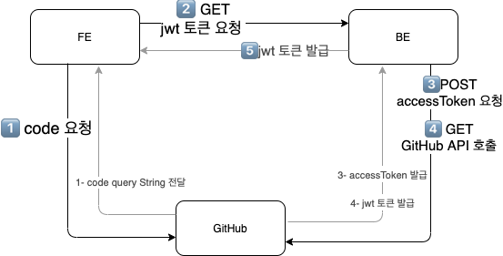
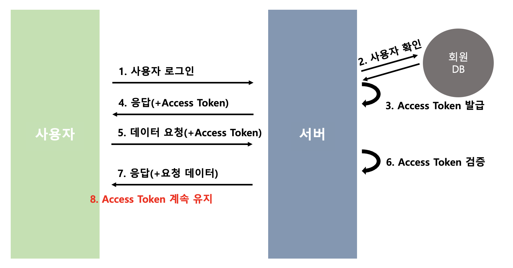
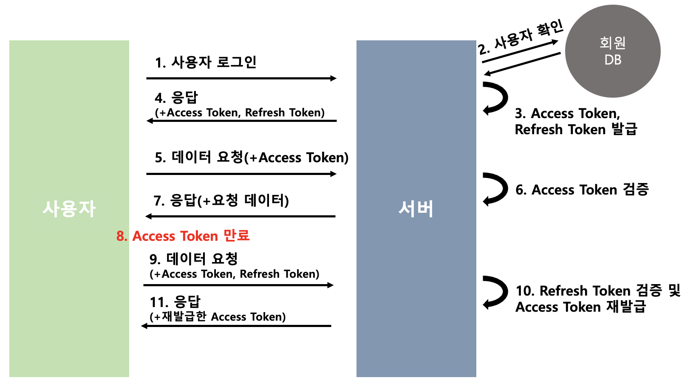
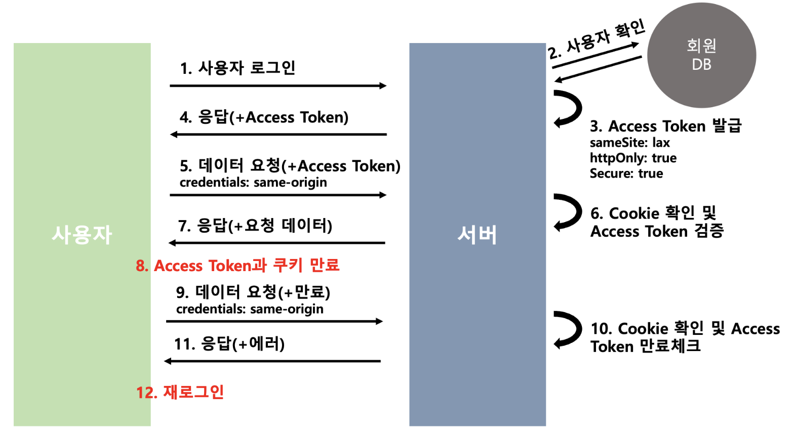

## JWT를 선택한 이유

### 서버 기반의 인증 시스템 vs 토큰 기반의 인증 시스템

서버 기반의 인증 시스템과 토큰 기반의 인증 시스템의 장단점을 고려했고 확장하기 쉬운 토큰 기반의 인증 시스템을 선택했습니다.  
**서버 기반의 인증 시스템 단점**

- **세션**

세션은 메모리 또는 DB에 저장하는데, 로그인 중인 사용자가 늘어날 경우에는 부하가 걸리게 된다.

- **확장성**

사용자가 늘어나게 되면 서버를 확장해야 하는데 세션을 분산시키는 시스템을 설계가 어렵다.  
**토큰 기반의 인증 시스템 장점**

- **무상태성(Stateless) & 확장성(Scalability)**

토큰은 클라이언트 측에 저장되기 때문에 서버는 완전히 Stateless하며, 확장하기에 매우 적합하다.

- **확장성(Extensibility)**

 토큰에 선택적인 권한만 부여하여 발급할 수 있으며 OAuth의 경우 Facebook, Google 등과 같은 소셜 계정을 이용하여 다른 웹서비스에서도 로그인을 할 수 있다.

## JWT 구현

### Oauth 인증과 JWT 토큰을 발급

[Oauth 인증과 JWT 토큰을 발급 구현 PR](https://github.com/boostcampwm-2021/Web11-Donggle/pull/86)



- 발급 과정

1. Frontend에서 Github에 authorization code를 요청
2. Github에 지정한 callback url로 redirect된 뒤 받은 authorization code를 BE에 요청
3. BE에서 autorization code를 이용해 Github에 access Token을 요청
4. Github에서 받은 Acess Token을 이용해 또다시 Github에 사용자 정보 요청
5. Github에서 받은 사용자 정보를 이용해 JWT 토큰을 발급
6. Frontend에서 JWT토큰을 Session Storage에 저장

- JWT



 이후 요청에 Access Token을 넣고 검증을 통해 응답을 받습니다.

JWT는 만료기간을 주지 않고, SecretKey와 algorithm을 적용하여 생성했습니다.

그리고 만든 JWT는 Frontend에서 새로고침을 해도 로그인이 유지되도록 하기 위해 Session Storage에 저장하였습니다.

```jsx
const jwtConfig: Config = {
  secretKey: config.jwt_secret,
  options: {
    algorithm: config.jwt_algorithm as jwt.Algorithm,
  },
};
```

- 보안 이슈 발생

JWT는 Stateless이기 때문에 한 번 만들어지면 제어가 불가능합니다 .임의로 토큰을 삭제할 수 없기 때문에 만료기간을 설정하지 않으면 탈취될 가능성이 높습니다.

### Refresh Token을 사용해보자

- Refresh Token을 사용함으로서 가질 수 있는 보안성

앞서 발생한 보안 이슈를 회피하기 위해 Refresh Token을 사용하기로 했습니다. Refresh Token을 사용함으로서 아래와 같은 보안성을 높였습니다.

1. 만료기간을 주기 때문에 액세스토큰에 대한 공격의 범위를 줄여준다.
2. Refresh Token의 경우 Access Token이 만료한 경우만 서버에 보내기 때문에 탈취 위험이 적다.

- ⁉️Refresh Token을 탈취해서 똑같이 Access Token을 발급해서 악용하면 Access Token 유효기간을 길게 잡는 것과 뭐가 다른가요?  

JWT토큰의 탈취는 보통 공유기 등의 네트워크 쪽에서 탈취되기 때문에 리프레시토큰이 의의가 있으며 클라이언트의 PC가 해킹되었다면 서버에서는 더 이상 할 수 있는 일은 없습니다.

- Refresh Token 구현과정

[Refresh Token 구현과정 PR](https://github.com/boostcampwm-2021/Web11-Donggle/pull/134)



1. 사용자가 로그인을 합니다.
2. DB에서 사용자를 확인합니다.
3. Access Token과 Refresh Token을 발급합니다.
4. 발급받은 Token 두 개를 session storage에 저장합니다.
5. .
6. .
7. 5, 6, 7번 이후 요청에 Access Token을 넣고 검증을 통해 응답을 받습니다.
8. Access Token이 만료된 것을 FrontEnd에서 확인합니다.
9. 만료되었을 때 Acces Token, Refresh Token을 Header에 담아서 보냅니다.
10. 서버에서는 Token의 만료를 확인한 뒤 Refresh Token이 유효한지 확인하고 새로운 Access Token을 발급합니다.
11. 재발급된 Access Token을 session storage에 저장합니다.

- Refresh Token

Access Token과 Refresh Token 모두 만료시간을 줍니다.

Access Token은 만료시간을 짧게, Refresh Token은 만료시간을 길게 줍니다.

```jsx
const jwtConfig: Config = {
  secretKey: config.jwt_secret,
  options: {
    algorithm: config.jwt_algorithm as jwt.Algorithm,
    expiresIn: config.jwt_expire,
  },
};

const jwtRefreshConfig: Config = {
  secretKey: config.jwt_refresh_secret,
  options: {
    algorithm: config.jwt_refresh_algorithm as jwt.Algorithm,
    expiresIn: config.jwt_refresh_expire,
  },
};
```

- 보안 이슈 발생

발급받은 Access Token과 Refresh Token을 Session Storage에 저장하고 있었습니다. Session Storage는 안전한 저장소일까요? 아닙니다.

### Refresh Token이 탈취된다면?

- 문제 상황

Session Storage와 같은 Storage에 대한 접근 및 제어는 자바스크립트를 통해 이루어지기 때문에 XSS 등 스크립트 기반 공격이 가능합니다. JWT는 특히 탈취되면 서버에서 감지하고 선별할 수 없기 때문에 매우 위험합니다. 그리고 XSS에 취약하다면 CSRF 공격에도 취약해질 수 밖에 없습니다.

> XSS 공격 : 공격자(해커)가 클라이언트 브라우저에 Javascript를 삽입해 실행하는 공격
> CSRF 공격 : 공격자가 다른 사이트에서 우리 사이트의 API 콜을 요청해 실행하는 공격

- 해결 방법

HTTPS에서 Secure Cookie와 HTTP Only 쿠키를 사용해 자바스크립트 기반 공격을 방어할 수 있습니다.

> Secure Cookie : 웹브라우저와 웹서버가 HTTPS로 통신하는 경우에만 웹브라우저가 쿠키를 서버로 전송하는 옵션
> HTTP Only : 자바스크립트로 쿠키를 조회하는 것을 막는 옵션

### HTTPS Cookie를 사용하자

- HTTPS Cookie 구현 과정

[HTTPS Cookie 구현 과정 PR 1](https://github.com/boostcampwm-2021/Web11-Donggle/pull/220)

[HTTPS Cookie 구현 과정 PR 2](https://github.com/boostcampwm-2021/Web11-Donggle/pull/173)



1. 사용자가 로그인을 합니다.
2. DB에서 사용자를 확인합니다.
3. Access Token을 sameSite, httpOnly, Secure 옵션을 준 Cookie에 담습니다.
4. 새롭게 발급받은 cookie를 응답으로 받습니다.
5. .
6. .
7. 이후 요청에 Cookie를 credentials: same-origin으로 보내어 Access Token 검증을 통해 응답을 받습니다.
8. Access Token과 Cookie는 일정 시간이 지나면 만료되고 사라집니다.
9. Cookie가 담기지 않은 상태로 요청이 보내집니다.
10. Cookie가 있는지 Access Token이 만료되었는지 확인하고 에러를 보냅니다.
11. 응답으로 에러를 받고 로그인 페이지로 이동시킵니다.
12. 재로그인을 해야 합니다.

**⁉️ 왜 위와 같은 구조를 생각하게 되었는가?**

- Refresh Token은 Access Token의 만료시간을 짧게 주어 스니핑 시 피해를 줄이기 위해 도입되었습니다. 따라서 Access Token이 담긴 요청이 평소에 사용되다 만료되어 에러가 났을 때만 Refresh Token이 담긴 요청이 다시 가는 형태였습니다. 하지만 HTTPS에서 (xss 공격에 대비해 웹스토리지에 저장하지 않음) http only를 적용해 Access Token과 Refresh Token 모두 쿠키에 담아야 하고 스니핑 시 계속해서 Refresh Token에 의해 Access Token을 연장시키는 것밖에 되지 않습니다. 그래서 Refresh Token을 제거했고 대신 쿠키 만료시간을 설정하고 Access Token 만료시간을 남겨두었습니다.
- Access Token에 만료시간을 준 이유는 Cookie가 만료되기 전에 패킷이 가로채지고 암호화가 풀려도 해당 토큰을 이용한 공격의 범위를 줄일 수 있다 생각했습니다.
- 쿠키를 이용한 자동로그인을 고려했고 Session/Local storage에 아무것도 저장하지 않는 대신에 백엔드로 요청을 보내 로그인 여부를 확인하는 로직을 도입했습니다.

- HTTPS Cookie

아래와 같이 Client와 Server에서 HTTPS와 CORS를 고려해 Cookie 설정을 하였습니다.

- Client
    Client에서는 일부 API에만 credentials 옵션을 'same-origin'으로 주었고 그 외에는 'omit'으로 두었습니다.

    ```tsx
    const userInfoResponse = await fetch(
          `${process.env.REACT_APP_API_URL as string}/api/auth/info`,
          getOptions('GET', undefined, 'same-origin'),
        );
    ```

    ```tsx
    const getOptions = <T>(
      fetchMethod: 'GET' | 'POST' | 'PATCH' | 'DELETE' | 'UPDATE',
      data: T,
      credential: 'omit' | 'same-origin' | 'include' = 'omit',
      isStringify = true,
      contentType: string | null | undefined = 'application/json',
      signal?: AbortSignal,
    ): RequestInit => {
      const options: RequestInit = {
        method: fetchMethod,
        mode: 'cors',
        credentials: credential,
        body: (isStringify ? JSON.stringify(data) : data) as BodyInit,
        signal: signal,
      };
      if (contentType) {
        options.headers = { 'Content-Type': contentType };
      }
      return options;
    };
    
    ```

- Server

    Server에서는 Cookie에 httpOnly와 secure 옵션을 주었고 sameSite는 'lax'로 주었습니다.

    ```tsx
    res.cookie(
          'token',
          jwtToken.token,
          getCookieOption(Number(config.jwt_cookie_expire)),
        );
    ```

    ```tsx
    const getCookieOption = (
      maxAge: number,
      sameSite: 'lax' | 'none' | 'strict' = 'lax',
    ): CookieOptions => {
      return {
        httpOnly: true,
        secure: true,
        sameSite: sameSite,
        maxAge: maxAge,
      };
    };
    ```

### ⁉️ CORS를 만나 행복했다

개발 환경은 Nginx 없이 "https://127.0.0.1:3000" 과 "http://127.0.0.1:3001" 을 사용했고 배포 환경은 Nginx를 사용했습니다. 그래서 개발 환경에서 CORS 오류가 났었고 이를 해결하기 위해 고군분투하며 아래와 같이 설정했습니다.

```jsx
// client request(fetch) option
{
    method: fetchMethod,
    mode: 'cors',
    credentials: 'include',
    headers: {
      'Content-Type': 'application/json',
    }
}
```

```jsx
// server response option
if (morganFormat == 'dev') {
    const allowedOrigins = [`${config.react_url}`];
    const options: cors.CorsOptions = {
      origin: allowedOrigins,
      credentials: true,
    };
    app.use(cors(options));
  }

// res.cookie option
{
    httpOnly: true,
    secure: true,
    sameSite: 'none',
    maxAge: maxAge,
};
```

하지만 배포 때는 다른 설정이 필요했기에 같은 배포와 개발환경을 맞출 필요가 있었고 Docker를 적용하게 되었습니다.

## 결론

### 공격에 대비했어요

- 👌 Refresh Token

Access Token의 공격 범위를 줄여주고 Access Token에 비해 적게 노출되어 탈취될 위험이 적습니다. 하지만 HTTPS로 적용하면서 필요성이 줄어들어 최종적으로 적용하지 않았습니다.

- 👌🏻 HTTPS Secure

HTTPS를 사용하여 패킷을 암호화함으로서 Sniffing에서 정보를 지킬 수 있습니다.

- 👌🏽 HTTPS Http Only

Client에서 Javascript로 접근할 수 없어 XSS 공격을 방지할 수 있습니다.

- 👌🏿 CORS

CSRF 공격을 방지하기 위해 sameSite를 lax로 credentials를 same-origin으로 설정하였고 CORS를 허용하지 않았습니다. 그리고 일부 API에만 인증 정보 Cookie를 담을 수 있는 credentials 옵션을 주었습니다.

### 아직 대비하지 못한 공격들

- 👉 CSRF Token

CSRF 공격에 완전히 방어하기 위해 CSRF Token을 도입해 보안을 높일 수 있습니다.

- 👉🏻 HTTPS가 만능은 아니다

취약한 암호 알고리즘과 공격 당하기 쉬운 SSL/TLS 낮은 버전을 사용하는 것에 주의해야 합니다. 예를 들어, 낮은 버전에서는 중간자 공격(Man-in-the-middle attack)으로 Handshake 단계에서 공격자가 개입해 보안을 취약한 것으로 변경할 수 있습니다.

## 참고

[[React] OAuth Github 로그인 구현하기](https://rrecoder.tistory.com/148)

[🍪 프론트에서 안전하게 로그인 처리하기 (ft. React)](https://velog.io/@yaytomato/%ED%94%84%EB%A1%A0%ED%8A%B8%EC%97%90%EC%84%9C-%EC%95%88%EC%A0%84%ED%95%98%EA%B2%8C-%EB%A1%9C%EA%B7%B8%EC%9D%B8-%EC%B2%98%EB%A6%AC%ED%95%98%EA%B8%B0#-%EB%A1%9C%EC%BB%AC%EC%97%90%EC%84%9C-%ED%85%8C%EC%8A%A4%ED%8C%85%ED%95%98%EB%A0%A4%EB%A9%B4)

[[Server] JWT(Json Web Token)란?](https://mangkyu.tistory.com/56)

[JWT의 단점과 주의사항](https://yceffort.kr/2021/05/drawback-of-jwt)