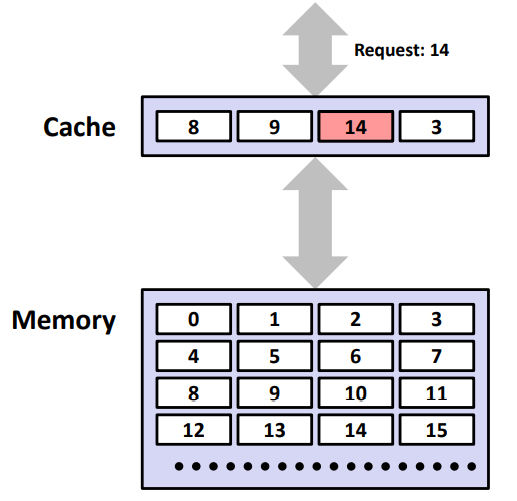
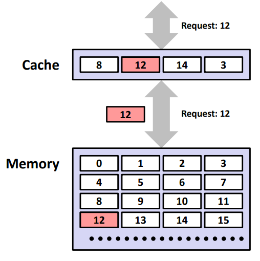
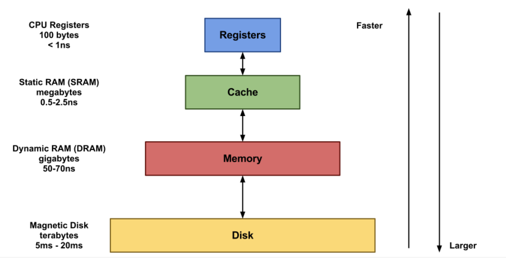
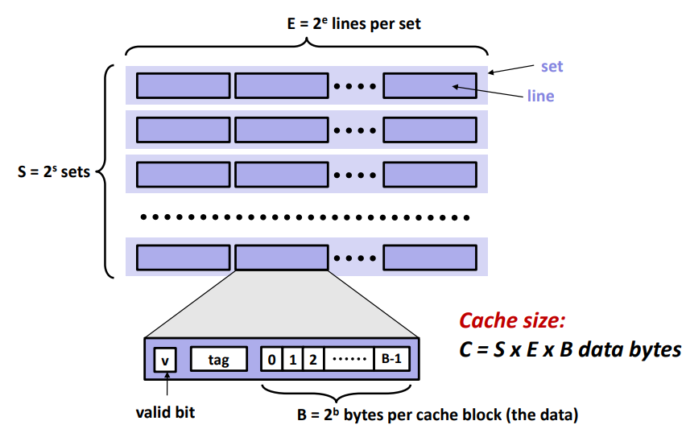
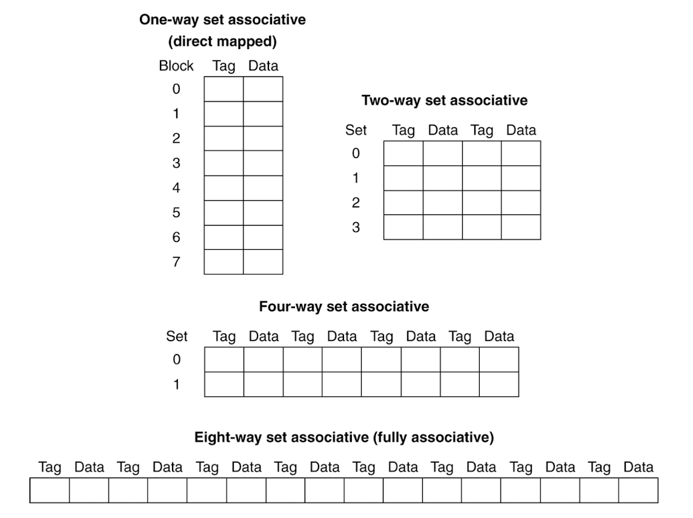
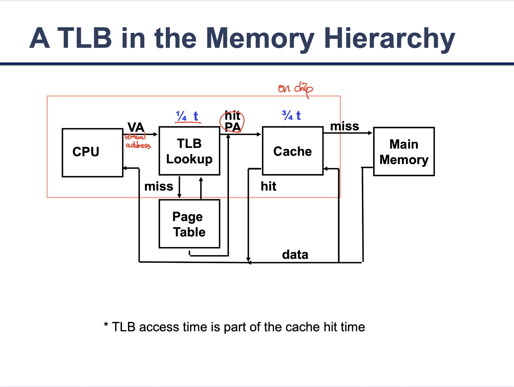
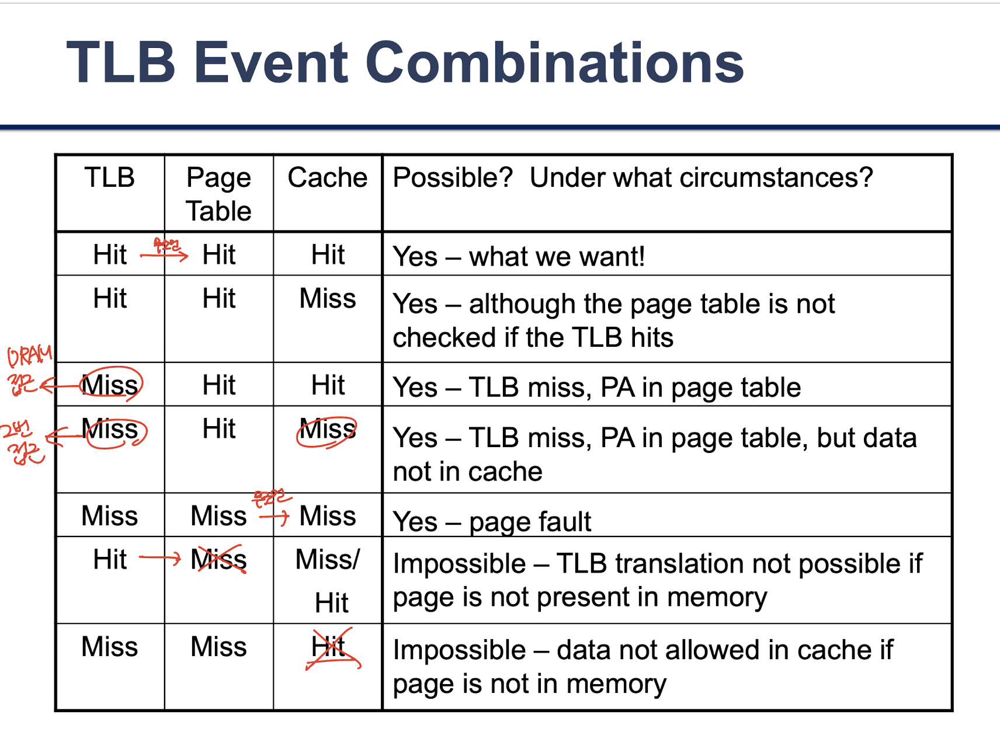

[https://youtu.be/cKEwnhc8ItY](https://youtu.be/cKEwnhc8ItY)

제가 좋아하는 퍼렐, 21, 타일러의 Cash In Cash Out을 가져와봤습니다.

네. Cash와 Cache는 관련이 없습니다.

# 캐시(Cache)

## 캐시(Cache)란?

- 컴퓨터가 데이터 접근을 빠르게 할 수 있도록 미래의 요청에 대비해 데이터를 저장해 두는 임시 장소
- 캐시에 저장된 데이터는 이전 연산의 결과이거나 다른 곳에 저장된 데이터의 복제본
- 캐시된 데이터를 이용해 데이터 접근 시간이나 동일한 값을 재계산하는 데 시간을 절약 → 성능 향상을 도모

### **캐시 히트(Cache Hit)**

: 요청된 데이터가 캐시 내에서 발견되는 경우 ⇒ 캐시 히트율을 높여야함

ex) CPU requested 14 → 캐시 히트 → CPU 정상 진행

### **캐시 미스(Cache Miss)**

: 요청 데이터가 캐시 내에서 발견되지 않는 경우

ex) CPU requested 12 → 캐시 미스 → stall CPU pipeline

- 캐시 미스 종류
    - **Compulsory misses (aka cold start misses)**
        - First access to a block
    - **Capacity misses**
        - Due to finite cache size
        - A replaced block is later accessed again
    - **Conflict misses (aka collision misses)**
        - In a non-fully associative cache
        - Due to competition for entries in a set
        - Would not occur in a fully associative cache of the same total size

### 메모리 계층(Memory Hierarchy)

- CPU 내부에 레지스터, L1, L2, L3 캐시(SRAM)가 존재
- 흔히 말하는 램(RAM)이 메인 메모리(DRAM)
- 위와 같이 위계 구조를 나누는 이유?
    
    : 속도가 빠를 수록 비싸고 작기 때문, 즉 비용(경제성) 고려
    

### 데이터 지역성(Locality) : 어떤 데이터를 캐싱할지 기준!

1. **시간적 지역성(temporal locality)**
    
    최근에 액세스된 데이터가 가까운 미래에 다시 엑세스될 가능성이 높아지는 특성
    
    ex) 루프 내에서 엑세스되는 데이터, 공통 변수
    
2. **공간적 지역성(spatial locality)**
    
    기억장치 내 서로 인접하여 저장되어 있는 데이터들이 연속적으로 액세스 될 가능성이 높아지는 특성
    
    ex) 표나 배열 데이터
    

## 캐시 설계의 목표 및 고려 사항

### 목표

- 캐시 히트율(= 캐시 히트 카운트 / 전체 액세스) 극대화
- 캐시 액세스 시간 최소화
- 캐시 미스 시 지연시간 최소화
- 메모리-캐시 간 데이터 일관성 유지

### 고려 사항

- 캐시 용량
    
    용량이 커지면 캐시 히트율 향상 but 비용이 상승, 액세스 시간 증가(물리적 회로 복잡도 증가하기 때문)
    
- 메모리 인출 방식
    - **요구 인출(demand fetch)** : 필요한 정보만 인출
    - **선 인출(prefetch)** : 필요할 것으로 예측되는 정보도 미리 인출하는 방식
        
        spatial locality 고려 → 함께 인출되는 데이터 단위 = 블록(block)
        

### Trade-Offs

|  | 장점 | 단점 |
| --- | --- | --- |
| 캐시 사이즈 증가 | capacity miss 감소 | access time 증가 |
| Associativity 증가 | conflict miss 감소 | access time 증가 |
| 블록 사이즈 증가 | compulsory miss 감소 | miss penalty 증가 |

## 캐시의 일반적인 구조 및 작동 방식

- **line** : cache block (E = 2^e)
- **set** : line이 여러 개 모여서 하나의 set (S = 2^s)

### 캐싱 예시

1. 기존 cache 구조
    
    
    | Index | V | Tag | Data |
    | --- | --- | --- | --- |
    | 000 | Y | 10 | Mem[10000] |
    | 001 | N |  |  |
    | 010 | Y | 11 | Mem[11010] |
    | 011 | Y | 00 | Mem[00011] |
    | 100 | N |  |  |
    | 101 | N |  |  |
    | 110 | Y | 10 | Mem[10110] |
    | 111 | N |  |  |
2. 캐싱할 데이터
    
    
    | Word Addr | Binary Addr | Hit/Miss | Cache Block |
    | --- | --- | --- | --- |
    | 18 | 10010 | Miss | 010 |
    - 18 = 10010(2)
    - Index는 같으나 Tag가 다르므로 **cache miss**
3. 이후 cache 구조
    
    
    | Index | V | Tag | Data |
    | --- | --- | --- | --- |
    | 000 | Y | 10 | Mem[10000] |
    | 001 | N |  |  |
    | 010 | Y | 10 | Mem[10010] |
    | 011 | Y | 00 | Mem[00011] |
    | 100 | N |  |  |
    | 101 | N |  |  |
    | 110 | Y | 10 | Mem[10110] |
    | 111 | N |  |  |

### Associative Cache

- 종류
    
    
    
- 4 Block Cache 예시 : Block access sequence 0 → 8 → 0 → 6 → 8
    - **One-way set associative (Direct mapped)**
        
        0과 8이 cache index가 같아서 다른 캐시 공간이 있는데도 다툼 → **conflict miss**
        
        | 순서 | Block Addr | Cache Index (하위 2bit) | Hit/Miss | Cache 0 | Cache 1 | Cache 2 | Cache 3 |
        | --- | --- | --- | --- | --- | --- | --- | --- |
        | 1 | 0 (0000) | 0 (00) | Miss | Mem[0] |  |  |  |
        | 2 | 8 (1000) | 0 (00) | Miss | Mem[8] |  |  |  |
        | 3 | 0 (0000) | 0 (00) | Miss | Mem[0] |  |  |  |
        | 4 | 6 (0110) | 2 (10) | Miss | Mem[0] |  | Mem[6] |  |
        | 5 | 8 (1000) | 0 (00) | Miss | Mem[8] |  | Mem[6] |  |
    - **Two-way set associative**
        
        Set Index가 같으면 다음와 같이 Set 1 공간을 낭비
        
        | 순서 | Block Addr | Set Index (하위 1bit) | Hit/Miss | Set 0 | Set 0 | Set 1 | Set 1 |
        | --- | --- | --- | --- | --- | --- | --- | --- |
        | 1 | 0 (0000) | 0 (0) | Miss | Mem[0] |  |  |  |
        | 2 | 8 (1000) | 0 (0) | Miss | Mem[0] | Mem[8] |  |  |
        | 3 | 0 (0000) | 0 (0) | Hit | Mem[0] | Mem[8] |  |  |
        | 4 | 6 (0110) | 0 (0) | Miss (LRU) | Mem[0] | Mem[6] |  |  |
        | 5 | 8 (1000) | 0 (0) | Miss (LRU) | Mem[8] | Mem[6] |  |  |
    - **Eight-way set associative (Fully associative)**
        
        처음엔 무조건 **cold miss (ccompulsory miss)**
        
        나중에 cache 꽉 차면 miss 발생 → **capacity miss**
        
        | 순서 | Block Addr |  | Hit/Miss |  |  |  |  |
        | --- | --- | --- | --- | --- | --- | --- | --- |
        | 1 | 0 |  | Miss | Mem[0] |  |  |  |
        | 2 | 8 |  | Miss | Mem[0] | Mem[8] |  |  |
        | 3 | 0 |  | Hit | Mem[0] | Mem[8] |  |  |
        | 4 | 6 |  | Miss | Mem[0] | Mem[8] | Mem[6] |  |
        | 5 | 8 |  | Hit | Mem[0] | Mem[8] | Mem[6] |  |

## Cache Write Policy

- **Write-Through**
    - always update memory when updating cache
    - cache 뿐 아니라 메모리(DRAM)까지 가서 원본 갱신
- **Write-Back**
    - just update the block in cache, write a dirty block back to memory when it is replaced
    - 캐시에만 데이터 업데이트 하고 메모리에는 업데이트 하지 않음
    - (dirty block 활용) 캐시 데이터가 다른 데이터로 교체될 때 메모리에 업데이트

## TLB (Translation Look-aside Buffur) for fast translation

## 참고

UOS 21-1학기 컴퓨터 구조 강의

[https://luv-n-interest.tistory.com/433](https://luv-n-interest.tistory.com/433)

[https://hyeo-noo.tistory.com/search/cache](https://hyeo-noo.tistory.com/search/cache)