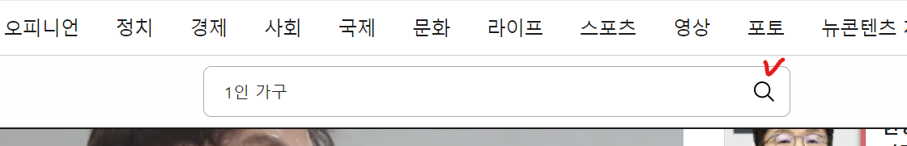
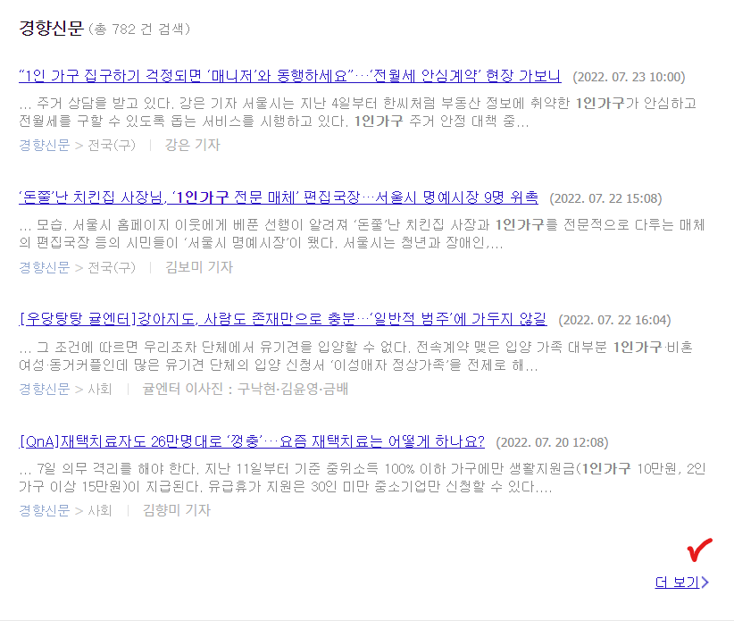
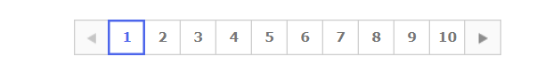
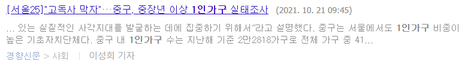
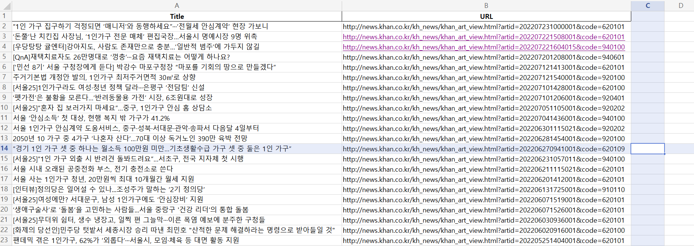
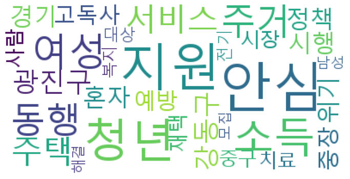

# 들어가며
이번 방학 때 데이터 청년 캠퍼스 상명대 과정을 수강하게 되면서 팀프로젝트를 진행하게 되었습니다. '1인가구'를 주제로 개인화 서비스를 제안하는 것이 목표인 만큼 '1인가구'에 대한 정보를 더 많이 얻고자 뉴스 기사를 분석해보기로 했습니다. 이번 포스팅에서는 '1인가구'를 키워드로 하여 뉴스를 검색했을 때 관련 단어가 어떤 것들이 나오는지를 분석해보고자 합니다.

## 뉴스 기사 추출
1인 가구에 대한 키워드를 알아보기 위해 뉴스의 제목을 추출하고자 하였습니다. 하지만, 각 언론사별로 웹 구조가 달라서 한 번에 크롤링하기 어려웠습니다. 

```python
# 매일경제의 text Xpath
//*[@id="article_body"]/div

# 경향신문의 text Xpath
//*[@id="articleBody"]/p
```

따라서, 각 언론사별로 추출 코드를 작성하기로 하였습니다. (*여기서는 경향신문의 경우만 소개하도록 하겠습니다.*)

일단 간단하게 키워드(= 1인가구)와 관련된 최근 100개의 기사 제목을 추출하고자 했습니다. 

크롤링은 selenium을 사용하여 진행하였습니다!
 
```python
from selenium import webdriver
from selenium.webdriver.chrome.options import Options
from selenium.webdriver.chrome.service import Service
from selenium.webdriver.common.by import By

from selenium.webdriver.support.ui import WebDriverWait
from selenium.webdriver.support import expected_conditions as EC
from selenium.webdriver.chrome.options import Options
from selenium.webdriver.chrome.service import Service

import time

import pandas as pd

main_url = 'https://www.khan.co.kr/'
keyword = '1인가구'

print('Main URL:', main_url)

# 드라이버 로드
chromedriver = '크롬 드라이버 위치'
driver = webdriver.Chrome(chromedriver)

# 사이트 접속
driver.get(main_url)
```

<p align = "center"></p>

먼저, 크롬 드라이버를 불러온 뒤 get()을 이용하여 사이트에 접속했습니다. 

<p align = "center"></p>

```python
time.sleep(5)

driver.find_element(By.XPATH, '//*[@id="main_top_search_open"]').click()
driver.find_element(By.XPATH, '//*[@id="main_top_search_input"]').send_keys(keyword)
driver.find_element(By.XPATH, '//*[@id="searchSubmit"]').click()
```

그런 다음 검색창에서 키워드인 '1인가구'를 검색하였습니다. 화면 우측 상단에 있는 검색창의 Xpath인 '//*[@id="main_top_search_open"]'를 클릭한 뒤 send_keys(keword)를 통해 키워드(= '1인가구)를 입력해주고 검색 버튼을 클릭하였습니다.

> 셀레니움이 최근에 바뀌어서 find_element_by_ID 처럼 일일이 입력하는 것이 아니라 'from selenium.webdriver.common.by import By'를 통해 불러온 뒤 'By'를 통해 접근하는 식으로 바뀌었습니다! 더 편리해진 것 같아요 :)

<p align = "center"></p>

```python
try:
    element = WebDriverWait(driver, 10).until(
        EC.presence_of_element_located((By.XPATH, '//*[@id="container"]/div[2]/div[2]/div/a'))
    )
except Exception as e:
    print('더보기 오류\n', e)

# 더보기 클릭
driver.find_element(By.XPATH, '//*[@id="container"]/div[2]/div[2]/div/a').click()
```

위 과정을 실행하면 위와 같은 화면이 됩니다. 저는 더 많은 기사를 추출해야하기에 '더보기'를 클릭해야했습니다. 이때, 검색 결과가 없을 수도 있으니까 try ~ except 구문을 사용하여 더보기 버튼이 있는지 확인할 때까지 최대 10초간 기다리도록 하였습니다.

<p align = "center"></p>

```python
driver.implicitly_wait(5) # 5초간 암묵적 대기
title = list() # 뉴스 기사 제목을 담을 리스트
link = list() # 뉴스 기사 링크를 담을 리스트
for page in range(1, 11): # 1페이지부터 10페이지까지 순회
    try: # 없는 페이지 방지
        driver.find_element(By.XPATH, '//*[@id="container"]/div[2]/div[3]/span/span[%s]'%(page+1)).click()
        time.sleep(2)
        print("%s 페이지 이동"%page)
```

경향신문은 한 페이지에 10개의 기사를 보여주며 이 페이지들이 10개 단위로 나뉘어져 있었습니다. 저는 총 100개의 기사를 추출해야 했기에 10개의 페이지를 순회하면서 추출할 필요가 있었습니다. 이 또한 제가 원하는 수만큼 페이지가 없을 가능성이 있으므로 try ~ except 구문을 사용하였습니다.

<p align = "center"></p>

```python
        boxItems = driver.find_elements(By.XPATH, '//*[@id="container"]/div[2]/div[2]/dl[*]')
        for dt in boxItems:
            title.append(dt.find_element(By.XPATH, 'dt/a').text) # 기사 제목 추출
            link.append(dt.find_element(By.XPATH, 'dt/a').get_attribute('href')) # 기사 url 추출
            time.sleep(2)
```

저는 뉴스 박스에서 기사 제목과 기사 url을 추출하고 싶었습니다. 이는 각각 .text와 get_attribute('href')를 통해 해결할 수 있었습니다.

이렇게 하면 기본적인 뉴스 기사 제목과 url 추출이 끝이 났습니다!

## 엑셀 파일로 만들기

<p align = "center"></p>

```python
import openpyxl
import os

df = pd.DataFrame(title, columns=['Title'])
df['URL'] = pd.DataFrame(link)

if not os.path.exists('NEWS.xlsx'):
    with pd.ExcelWriter('NEWS.xlsx', mode='w', engine='openpyxl') as writer:
        df.to_excel(writer, index=False, sheet_name='경향신문')
else:
    with pd.ExcelWriter('NEWS.xlsx', mode='a', engine='openpyxl', if_sheet_exists='replace') as writer:
        df.to_excel(writer, index=False, sheet_name='경향신문')
```

데이터를 수집했으면 알맞게 저장해야합니다! 데이터가 많지 않기 때문에 엑셀에 저장하고자 했습니다.(*사실 sql에 익숙하지가 않아요..*)

openpyxl와 os 모듈을 불러왔습니다! 그런 다음, 아까 리스트 형식으로 저장했었던 title과 link변수를 각각 판다스 데이터프레임 형태로 바꾸어 주었습니다.

이제 NEWS.xlsx라는 파일을 만들텐데, 저는 같은 엑셀 파일에 각 언론사별로 다른 시트에 저장하고 싶었기 때문에 구분해줬습니다. os모듈의 경로를 통해서 NEWS.xlsx가 있는지를 확인한 뒤 없으면 새로 만들어서 쓰도록 하였고 이미 있는 경우에는 덮어쓰고자 했습니다.

## 텍스트 전처리
이때까지 뉴스 기사 제목을 크롤링한 이유는 키워드(= '1인가구')와 관련된 단어가 무엇인지를 분석하기 위함이었습니다! 

```python
import pandas as pd
import nltk
from konlpy.tag import Okt

df = pd.read_excel('NEWS.xlsx')

okt = Okt()
li = list(df.Title)
title = ''.join(li)

nouns = okt.nouns(title)

ko = nltk.Text(nouns, name = '경향신문')
ko.vocab()
```

<p align = "center"></p>

저는 Okt 형태소 분석기를 이용하여 토큰화를 진행하였습니다. 

> (*한국어를 형태소 분석하는 분석기는 여러 개가 있는데, 저는 Okt를 썼어요. 형태소 분석기를 서로 비교해놓은 글이 많으니 이는 구글링을 통해 참고하시기 바랍니다 :)*)

자세히 보면 쓸데없는 말들이 많이 섞여있는 것을 볼 수 있습니다. 이는 형태소 분석기가 제대로 분류하지 못했다는 의미에요. 따라서, 좀 깔끔하게 정제해주고자 하였습니다.

```python
stopwords = ['가구', '인', '집', '중', '년', '로', '이상', '명', '위', '은', '때', '첫'
,'등', '나', '서울', '서울시']
ko = [each_word for each_word in ko if each_word not in stopwords]
```

위와 같은 단어가 분류되었을 시에는 그 단어를 제거하였습니다. 그런 다음 WordCloud를 사용하여 가장 많이 나온 30개의 단어를 시각화 해봤습니다.

```python
from wordcloud import WordCloud
import matplotlib.pyplot as plt
ko = nltk.Text(ko, name = '경향신문')

data = ko.vocab().most_common(30)

wordcloud = WordCloud(font_path='c://Windows/Fonts/malgun.ttf', background_color='white').generate_from_frequencies(dict(data))

plt.figure(figsize = (12, 8))
plt.imshow(wordcloud)
plt.axis('off')
plt.show()
```

<p align = "center"></p>

결과를 보면 1인 가구를 검색했을 때 많이 나온 단어로는 '안심', '지원', '청년', '소득' 등이 있는걸 확인할 수 있습니다. 제가 이번에 관심있게 보고있는 주제인 '고독사'도 같이 들어있습니다!

## 마무리
아직 팀프로젝트 시작 전이어서 완성본은 없지만 이런 형식으로 프로젝트 도입부를 장식할 예정입니다. 본 프로젝트에서는 좀 더 정교하게 정제한 뒤 각 단어별로 군집화를 하여 시각화할 예정입니다.