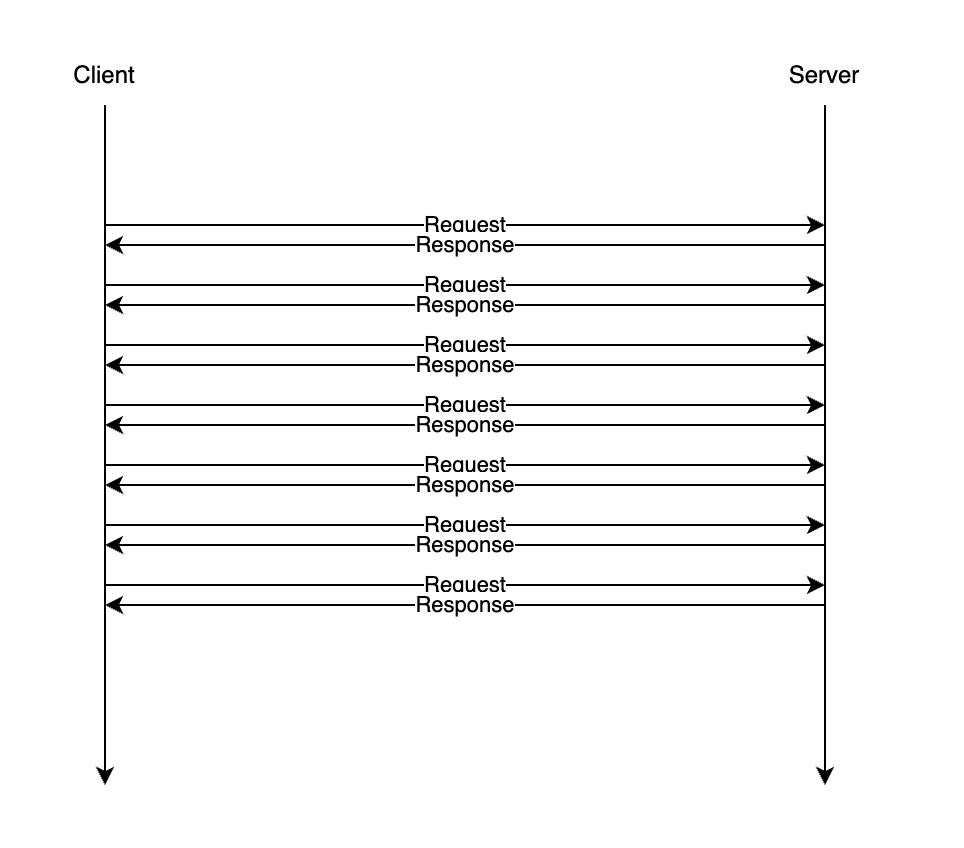
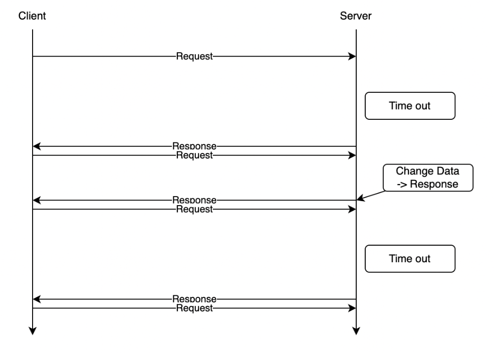
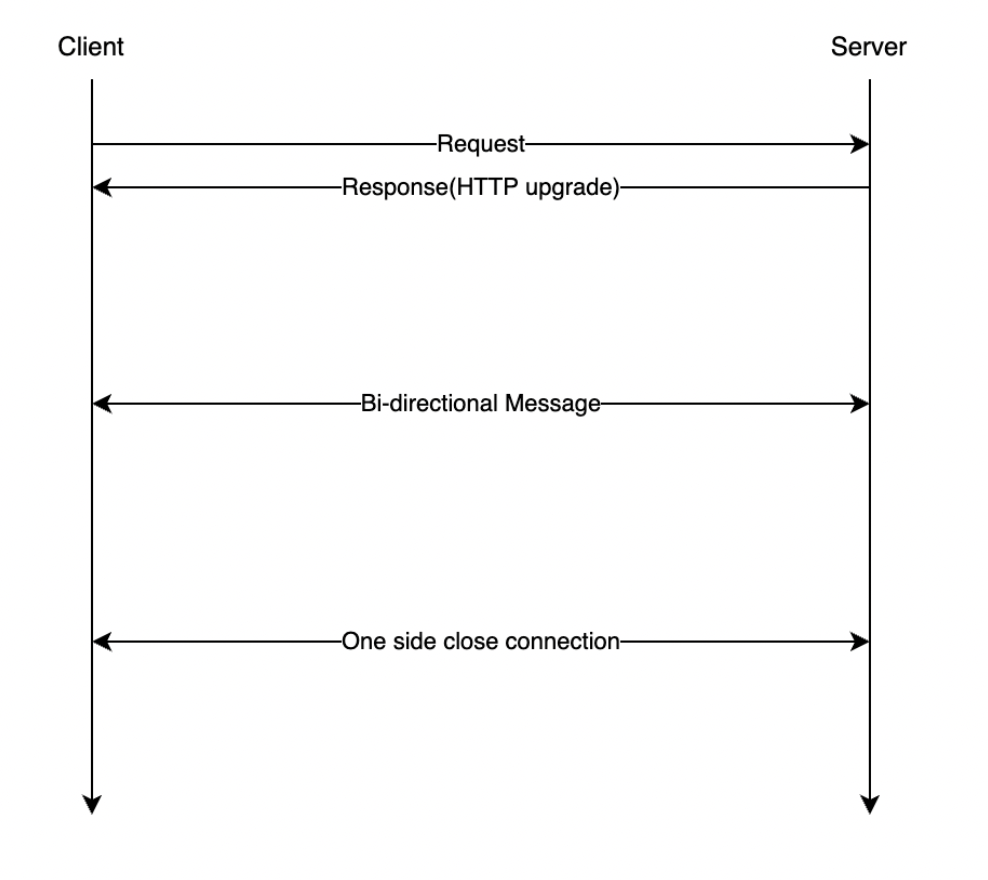
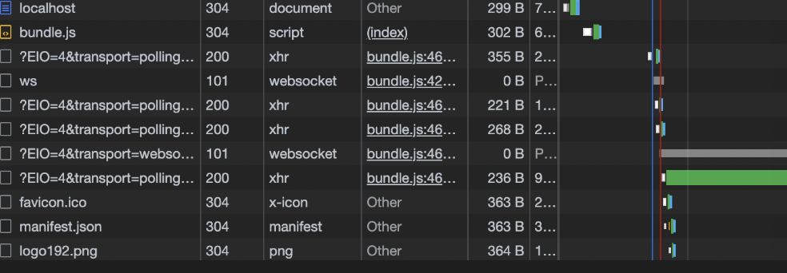
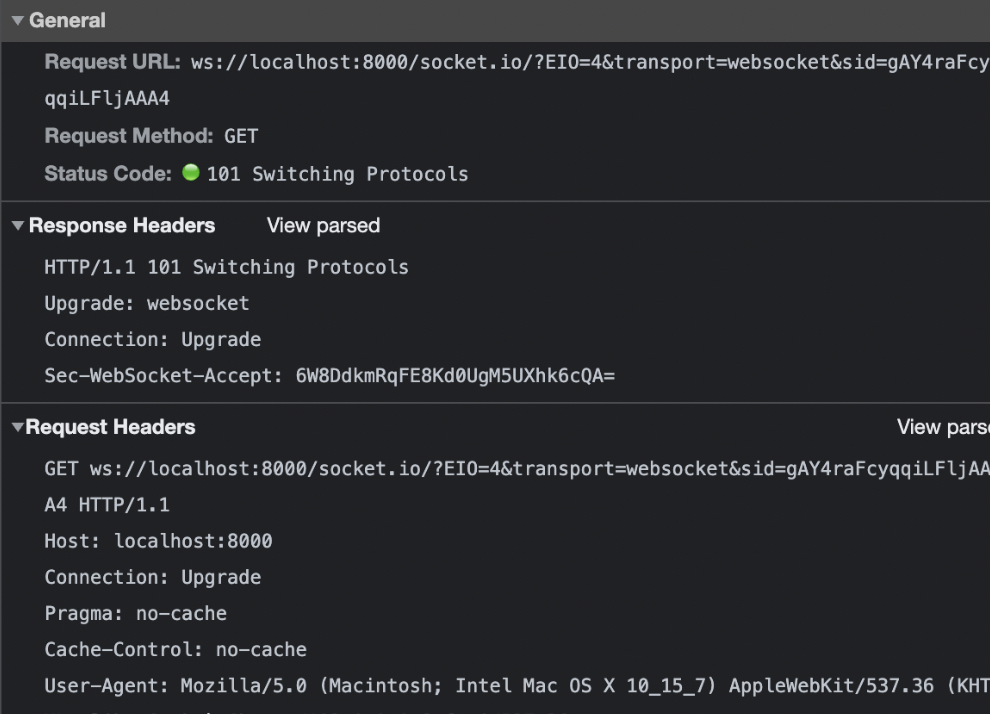

## Intro

Web 프로젝트를 진행하다보면 자연스럽게 WebSocket에 대해 들어보셨을 수 있습니다. 채팅을 구현하거나 실시간성이 필요한 사이트의 경우 필요한 통신 프로토콜이 바로 **WebSocket** 입니다. 이를 통해 Server에서 데이터를 전송할 필요가 생기면 Client에게 데이터를 바로 전송하여 실시간 어플리케이션을 작성 할 수 있습니다.

이번에 다룰 주제는 바로 이 WebSocket과 관련된 것들입니다. WebSocket 이전에 존재하던 기술들과 현재 WebSocket 기술, 그리고 마지막으로 WebSocket의 기능을 비슷하게 수행할 수 있는 SSE(Server-sent Event), WebRTC 를 중심으로 구성하였습니다.

> 1. WebSocket 이전 기술.
> 2. WebSocket 기술, 주의할 점.
> 3. SSE(Server-sent Event), WebRTC

## 1. WebSocket 이전 기술.

WebSocket 이전에도 실시간성을 위한 기술이 있었습니다. 이는 Polling 기법과 좀 더 발전한 Long Polling 기법입니다.

### 1-1. Polling

Polling 기법은 Client에서 지속적으로 서버에 Request를 보내는 방법입니다.



Polling 방식은 Client에서 계속해서 Request를 보내고 Response를 받으면서 값의 변화를 실시간으로 가져올 수 있습니다. 하지만 이 방법은 서버에 엄청난 부하를 줄 수 있기 때문에 좋지 않은 방법인 것을 알 수 있습니다. 만약 많은 사용자가 이런 식으로 Server에 Request를 보낸다면 Server는 버티지 못할 것입니다.

> Polling: Client에서 짧은 주기로 Request를 보내고 Response를 받음.
>
> 한계점: 서버에 엄청난 부하를 주게 됨. 값이 변하지 않아도 계속해서 같은 Response를 받음.

### 1-2. Long Polling

위의 Polling(Short Polling) 방식을 보완해서 나온 방법이 Long Polling 방법입니다. TCP 환경에서 connection을 연결하기 위해서는 3-way-handshake 등 같은 작업들이 필요하기 때문에 계속해서 연결을 요청하고 처리하는 방식은 비효율적입니다. 이를 위해 Request를 보내고 값이 변했을 때만 Response를 보내는 방법이 Long Polling의 핵심입니다.




Long Polling에서는 서버에서 변화가 있을 때만 Response를 보내기 때문에 이전 Polling 방식보다 커넥션에 대한 부담이 줄어듭니다. 서버에서 응답을 보내기 전까지 Client에서는 대기 상태로 있게 되며 응답을 기다립니다. 하지만 여기서도 Client의 갯수가 많아진다면 커넥션에 대한 부담이 증가하고, 서버에서 빠르게 데이터가 변화하는 상황이라면 기존 Polling 방식과 비슷하게 동작하게 됩니다.

> Long Polling: Client에서 Request를 보내면 대기 상태로 전환하고, 서버에서 데이터가 변하는 이벤트가 발생했을 때 응답함.
>
> 한계점: Client가 많아진다면 커넥션 부담이 여전히 존재하며, Server의 데이터가 수시로 변하는 상황이라면 Polling과 비슷하게 동작하게 됨.

위의 문제는 HTTP 프로토콜이 Request-Response 형태로 동작하기 때문에 발생하는 문제입니다. 이를 해결하기 위해 IEFE에서 [**RFC 6455**](https://datatracker.ietf.org/doc/html/rfc6455)로 양방향 통신을 위한 표준 WebSocket Protocol을 정의합니다.

## 2. WebSocket 기술, 주의할 점

### 2-1. WebSocket 이란?

WebSocket은 양방향 통신을 위한 프로토콜로 기존에 HTTP의 Request, Response로 동작하는 프로토콜의 한계를 극복하기 위한 기술입니다.

이전까지는 Client에서 먼저 Request를 보내면 Server에서 Response를 응답하는 방식이었지만, WebSocket을 이용하면 **커넥션을 유지하면서 Server에서 먼저 데이터를 보낼 수 있습니다.**

### 2-2. WebSocket 동작.




위의 그림을 보면 먼저 Request를 요청하고 응답으로 Response(HTTP upgrade)를 받습니다. 그러면 Client와 Server에서 커넥션이 생성되고, 이를 유지하면서 데이터를 주고 받을 수 있게 됩니다.

여기서 주목할 점은 **먼저 HTTP Request를 보내서 Protocol Upgrade를 진행한다는 점입니다.** 이를 확인하기 위해 간단히 Server와 Client를 제작하여 확인 해보겠습니다.

(Client, react)
```
import io from 'socket.io-client'
import { useState, useEffect } from 'react';

const socket = io('http://localhost:8000')

function App() {
	const [message, setMessage] = useState("")
	const publish = (message) => {
		socket.emit('message', message)
	}
	useEffect(() => {
		socket.on('message', (message) => {
			console.log(message)
		})
	}, [])
	
  return (
    <div>
      <div>
        <input
          type={"text"}
          placeholder={"message"}
          value={message}
          onChange={(e) => setMessage(e.target.value)}
        />
        <button onClick={() => publish(message)}>send</button>
      </div>
    </div>
  );
}

export default App;
```

(Server, node.js + express)
```
const app = require('express')()
const server = require('http').createServer(app)
const cors = require('cors')
const io = require('socket.io')(server,{
    cors : {
        origin :"*",
        credentials :true
    }
});

io.on('connection', socket=>{
    socket.on('message',(message) => {
        io.emit('message',(message))
    })
})

server.listen(8000, function(){
    console.log('listening on port 8000');
})
```

간단하게 Socket.io를 활용하여 Server와 Client에서 WebSocket 연결 코드를 작성하고 개발자 도구를 확인해보면 다음과 같은 것을 확인할 수 있습니다.





위에서 말했던 것과 같이 먼저 HTTP 요청을 먼저 보내고 응답 코드 101과 함께 Protocol Upgrade를 확인할 수 있습니다. 이제 정상적으로 connection이 연결되었고, 양방향 통신을 위한 준비는 끝났습니다.

### 2-3. WebSocket 주의사항

이런 편리한 사용법과 양방향 통신을 제공한다는 점에서 쉽게 사용할 수 있지만 WebSocket을 사용하기 위해서는 몇 가지 주의 사항이 있습니다.

#### 2-3-1. proxy 서버

WebSocket Protocol은 HTTP Protocol과 다르지만 연결을 위해 HTTP를 통해 연결을 수행합니다. 이 방법은 HTTP 방화벽 룰을 사용할 수 있기 때문에 WebSocket을 사용하기 쉽게 만듭니다.

WebSocket은 long-running 연결을 유지하고 있으며 Upgrade와 Connection 헤더를 통해 업그레이드를 수행합니다. 하지만 리버스 프록시 서버를 구성한 경우 WebSocket을 사용하는데 문제가 생길 수 있습니다.

WebSocket은 **hop-by-hop** 프로토콜이기 때문에 프록시 서버에서 가로챈 요청에 대해 WebSocket 연결이라는 정보를 추가적으로 명시해야 합니다. 즉, Server에 WebSocket 연결 정보를 제공하기 위해 프록시 서버에서 명시적으로 작성해야 전달이 가능하다는 점입니다. 또한, HTTP와 다르게 WebSocket은 계속 연결되어 있기 때문에 프록시 서버에서 연결이 닫히지 않도록 구성해야 합니다.

이와 관련된 추가 정보는 하단에 참고링크를 통해 제공하겠습니다.

#### 2-3-2. 인증, 인가

WebSocket의 특성 상 한번 연결이 될 때 HTTP protocol을 사용하기 때문에 인증, 인가를 해당 url에 맞춰서 적용해주면 됩니다. 그럼 정상적으로 인증이 되지만 이 후 커넥션이 끊어지지 않는다면 따로 인증 과정을 수행하지 않습니다. 커넥션이 연결될 따 이미 인증이 끝난 상태로 가정하기 때문에 중복해서 인증 할 필요가 없다고 가정합니다.

WebSocket 메세지에 대한 인증을 하기 위해서는 따로 커넥션이 연결되어 있는 동안 메세지 헤더를 통해 인증, 인가를 수행하는 방법으로 해결 할 수 있습니다.

#### 2-3-3. connection leak

WebSocket은 connection을 통해 메세지를 주고 받기 때문에 중요한 부분입니다. connection이 종료되면 가지고 있던 리소스를 정상적으로 반납하고 종료되어야 합니다. 하지만 Client 또는 Server에서 정상적으로 connection이 종료되지 않는 경우 이를 위한 error 처리를 잘 수행해야 합니다. 간혹 에러 상황에서 메모리 관리가 되지 않는 경우가 발생할 수 있는데 메모리 사용량을 잘 보고 정상적으로 connection이 종료되고 있는지 확인해야 합니다.

이와 관련한 추가 정보는 밑에 참고 자료 부분에 링크를 제공하겠습니다.

## 3. SSE(Server-sent Event), WebRTC

WebSocket과 비슷하게 서버에서 데이터를 먼저 전송하는 SSE 방법도 있고, 양방향 통신을 구현하기 위한 WebRTC 기술도 존재합니다.

### 3-1. SSE (Server-sent Event)

SSE는 Server에서 발생하는 이벤트를 Client에 제공하기 위한 방법입니다. Client에서 Server로 먼저 Request를 보내면 streaming을 위한 연결이 생성됩니다. 이를 통해 Server에서 이벤트가 발생할 때 마다 연결된 Client에게 데이터를 전달 할 수 있습니다.

WebSocket과 다른점은 **일방향 통신**이라는 점입니다. streaming 연결을 위한 Client 요청을 제외하면, 이후 Server에서 Client의 방향으로만 통신이 가능합니다. 이를 통해 알림 서비스를 제공하는 등, 서버에서 이벤트가 발생했을 때 실시간으로 데이터를 제공할 수 있게 합니다.

기존 HTTP protocol을 그대로 수행하고, 간단하게 구현할 수 있기 때문에 특수한 상황에서는 좋은 방법입니다. 하지만 장점보다는 단점이 더 많은 기술이라 특정 상황을 제외하고는 보통 WebSocket을 이용하는게 좋다고 합니다.

[* SSE 단점에 대한 추가 정보 및 의견](https://news.ycombinator.com/item?id=30312897)

### 3-2. WebRTC

WebRTC는 WebSocket과 동일하게 양방향 통신을 위해 만들어진 프로젝트 입니다. 기존 WebSocket과 다른 점은 peer-to-peer 통신 이라는 점입니다. 브라우저마다 각자 연결되어 있기 때문에 양방향 통신을 제공하기 위한 서버가 필요하지 않고, 각 사용자마다 connection을 구성해서 임의의 데이터를 주고 받을 수 있는 방법입니다.

하지만 공인 네트워크를 통해 데이터를 주고 받아야 하는데 개개인의 컴퓨터는 방화벽과 사설 IP 등 여러 보안장치가 필요하기 때문에 STUN/TURN Server 등을 따로 구성하여 P2P 통신이 가능할 수 있도록 별도로 구성해야 합니다.

소규모 통신에서 실시간 양방향성을 제공하기 위한 방법으로 채택할 수 있는 기술입니다.

[* MDN Docs for WebRTC](https://developer.mozilla.org/ko/docs/Web/API/WebRTC_API)

## 정리

이전까지는 단순히 실시간성을 보장하기 위한 방법으로 WebSocket만 생각하고 있었지만, 이 기술을 사용하며 주의해야 할 점과 다른 기술에 대해서는 잘 알지 못하고 사용했던 것 같습니다.

다시 한번 WebSocket에 대한 글을 정리하며 실시간 통신을 제공하기 위한 방법과 다른 다양한 기술들이 제공하고 있는 것들을 알 수 있게 되었고, 각 기술에 장단점과 Trade Off가 있기 때문에 적절한 상황에 알맞은 기술을 선택할 수 있도록 꾸준히 공부해야 할 것 같습니다.

긴 글 읽어주셔서 감사합니다. 😁

---

### 참고 자료

Toss Youtube: [토스증권 실시간 시세 적용기](https://www.youtube.com/watch?v=WKYE-QtzO6g)

Nginx: [WebSocket and Nginx](https://www.nginx.com/blog/websocket-nginx/)

Socket.io: [WebSocket Library](https://socket.io/)
