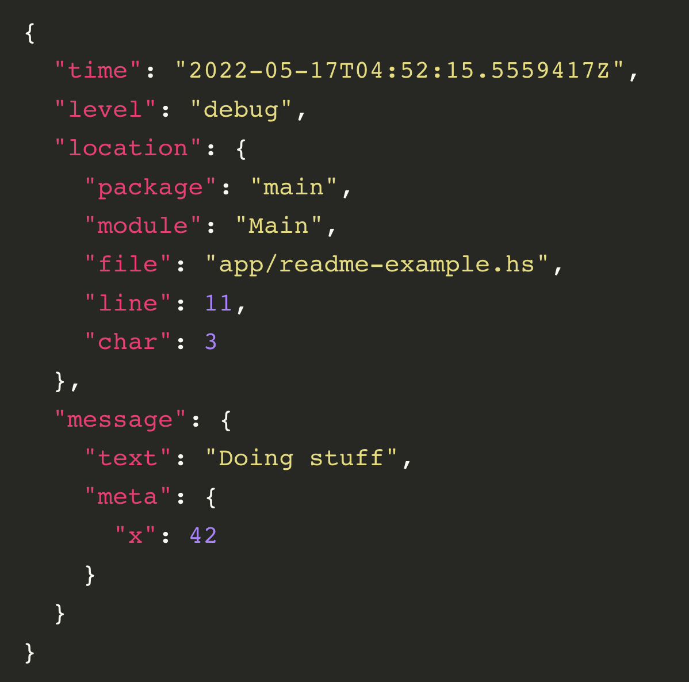

## 로그를 주제로 다룬 이유
최근 로그를 모니터링하는 것에 큰 흥미를 갖게 되었습니다.  

스프링 액추에이터를 프로젝트에 적용해보며 콘솔에 남아 있는 로그를 http로 볼 수 있다는 것도 신기했고 Backend 팀에서 스크럼을 진행하며 인프라 분야 분들이 스프링 액추에이터와 다른 서비스를 연동하여 매트릭 관리를 하고 있다는 것을 언급해주셨어서 로깅하는 것에 대한 관심이 깊어졌습니다.  

또한, 이슈 트래킹 시간을 줄이기 위해 로그를 기록하는 것은 필수적이라는 말을 들으며 평소에 로그를 적극적으로 활용하지 못했던 것 같아 이제부터 로그를 기록하는 습관을 들이고자 합니다.

# 로그를 왜 남기는 가
  
1. 에러에 대한 단서(= 문제 대응)
    - 예기치 않은 에러가 발생할 수 있는 가변적인 데이터에 대해 로그를 남긴다면 에러를 찾을 확률이 올라갑니다. 특히, 로그 레벨(ERROR, INFO, DEBUG 등)을 활용해서 장애 원인을 더욱 빠르게 파악할 수 있도록 할 수 있습니다.
    - 로그 레벨을 활용하여 설정한 레벨 이상의 로그 메시지를 찍을 수 있습니다.
2. 자신이 분담한 파트에 대한 결백
    - 로그의 결과를 보여줌으로서, 자신이 맡은 부분에 있어서 에러는 없었다는 것을 입증할 수 있습니다.
3. 테스트나 디버깅에서 활용성이 높습니다.
4. 트래킹, 모니터링에 활용
    - 데이터 분석
    - 진단용
5. 에러의 규모를 파악하기 위해서 활용(= 에러 관리 측면)
6. 복구용
    - 트랜잭션 실패 시, 로그를 참고하여 롤백할 수 있습니다.
        - 데이터 복제에도 사용될 수 있습니다.

## print문으로 로그를 남기는 것이 적절한가
개인 프로젝트라면 사용해도 무방하다고 생각합니다. 그러나 좋은 개발 습관을 위해서라면 로깅 라이브러리를 활용한 로깅이 적합하다고 생각합니다.  

추가적으로 print문을 사용한 로깅은 성능에 영향을 많이 준다고 해서 찾아보니, 파일이나 콘솔에 로그를 남기게 되면 해당 Print문이 완전히 프린트 되기 전까지 뒤에 프린트하려는 부분은 대기할 수 밖에 없어 대기 시간이 발생한다고 합니다.  

printf가 비효율적인 이유에 대해 더 자세히 알아봤습니다.  
1. 중복적으로 작성이 되어야 하고, 하드코딩할 필요가 없어집니다.
2. printf는 동기적인 방식이라 작업이 io 작업이라면 부하가 커져 성능에 있어 단점이 됩니다.
3. 로그 파일을 따로 남기지 않는다면 배포 이후에는 로그를 활용할 수 없습니다.

## 어떤 정보를 로그로 남겨야 하고, 남기지 말아야 하는 가
  

남기면 좋은 데이터  
- 날짜와 시간
- 요청자의 ID와 같은 유일한 값
- 접근한 경로, 에러코드
- 행동 로그, 서비스 로그
    - 고유한 ID 값을 저장해서 추적용으로 사용하기도 합니다.
        - 필요한 context 저장
        - 쓰레드 별로 로그 분류하기

남기면 안되는 데이터  
- 개인정보
  - 남겨야한다면 암호화 이후 저장하는 것을 추천합니다.
- 시스템 계정 정보

추가적으로, DevOps나 Infra 관리를 시스템적으로 하지 않는다면, 로그가 저장되는 저장소 관리는 어떻게 이루어질 건지 명확한 계획이 있어야 할 것입니다.

## 로그를 어디에 남기는 가
1. 코드 위치 기반
    - 클래스나 메소드에 진입하거나 결과를 리턴하기 직전 등의 위치를 기반으로 로그를 작성합니다.
    - 기능 문맥 기반에 비해 서비스 로직의 전후를 잘 살필 수 있습니다.
    - 에러가 발생했을 때, 시간 순으로 어떻게 흘러갔는 지 파악하기 용이하지만 여러 요청들이 혼합되어 로그가 매우 많이 쌓였을 때, 필요한 부분을 필터링해서 보는 것이 좀 까다로울 수 있습니다.
2. 기능 문맥 기반
    - 기능별, 레이어별로 로그를 파악할 수 있고, 키워드 검색이 가능합니다.
    - 같은 기능에 따라 중복된 로그가 남겨지기에 구별할 수 있는 정보가 추가적으로 필요합니다.  

개인적으로 자신이 구상한대로 서비스가 잘 흘러가고 있는 지 파악하는 용도로 사용하는 경우가 많았어서 코드 위치 기반으로 로그를 남겼던 경우가 많았던 거 같습니다.

## 무엇으로 로그를 분석하는 가
1. Elastic Search
    - appender를 사용하여 로그를 consumer에게 제공하기도 합니다.
    - 오래된 로그는 cold storage, 주로 쓰는 것은 object storage에 저장하기도 합니다.
2. kafka
    - 메시지 큐 활용
3. 스프링 액추에이터
    - 로그 시각화
    - 로그 분석

## 로깅 라이브러리
1. slf4j (추상체)
    - 자체적인 로킹 프레임워크가 아니고 logger 추상체로써 다른 로깅 프레임워크가 접근할 수 있도록 도와주는 추상화 계층이입니다.
      - 즉, logback이나 log4j2와 같은 로킹 프레임워크의 인터페이스의 역할을 합니다.
    - 코드를 일정하게 유지하면서 구현체의 전환을 통해 다른 로깅 프레임워크로의 전환을 쉽고 간단하게 할 수 있습니다.
2. LogBack
    - slf4j의 구현체로 springboot 환경에서는 spring-boot-starter-web에 포함되어 있어 dependency 추가 없이 사용 가능합니다.
    - 로그 레벨 변경에 대해 서버 재시작 없는 자동 리로딩을 지원해줍니다.
3. log4j
    - 가장 오래된 로깅 프레임워크로 콘솔 및 파일 출력의 형태로 로깅 지원합니다.
4. log4j2
    - logback과의 가장 큰 차이는 Multi Thread 환경에서 비동기 로거(Async Logger)의 경우 다른 로깅 프레임워크보다 처리량이 훨씬 많고, 대기 시간이 훨씬 짧습니다.
    - Java8부터 도입된 람다식을 지원합니다.
    - 쓰레드 로컬을 사용하지 않아 성능이 더욱 좋습니다.
        - async appender
        - async logger
            - 쓰레드 로컬을 사용하지 않아 garbage collector를 거의 사용하지 않아도 되는 게 성능 향상의 원인입니다.

## 매트릭이란
  
- 타임스탬프와 보통 한두 가지 숫자 값을 포함하는 이벤트입니다.
- 로그와 다르게 주기적으로 발생합니다.
- 단순한 상태를 보여줍니다.
- 리소스 사용 모니터링, 데이터베이스 실행 메트릭 모니터링 등 소프트웨어나 하드웨어의 상태 모니터링 맥락에서 사용합니다.
- 주로 원인이 있어 찍는 것이 로그에 해당하며, 단순히 상태를 보여주는 것이 매트릭입니다.

## 블로그를 마치며..
여러분들도 글을 읽어 보며 어떻게 하면 로그를 잘 쓰고 남길 수 있을 지 고민해보시길 바랍니다.  
부족함이 많은 글이지만, 로그에 대한 자신의 생각을 정리해볼 수 있는 계기가 되는 글이 되었으면 좋겠습니다.  
따라서 저도 기존 프로젝트에 스프링 액추에이터를 적용하고 기록해보며 로깅에 대한 좋은 개발 습관을 만들어보고자 합니다.