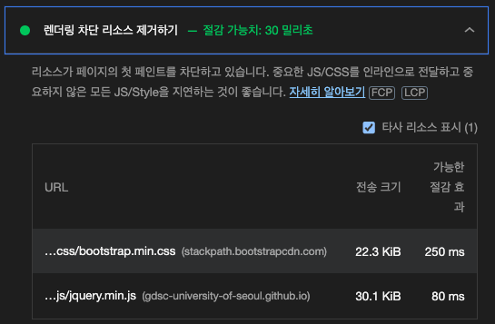
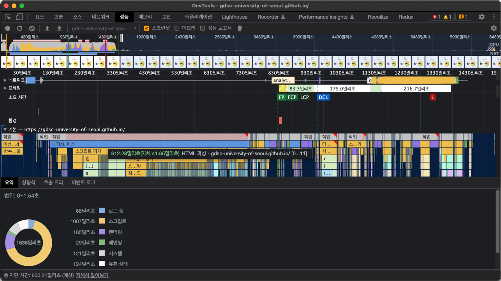

# 브라우저의 렌더링 과정을 말해보세요.

너무나도 유명한 면접 단골문제입니다. 오늘은 이에 대한 답을 **아주 얕고 가볍게** 정리해보고자 합니다.

실제로는 이보다 훨씬 방대한 내용이므로 이 포스팅을 계기로 더 자세한 과정을 각자 찾아보면 좋겠습니다.

## 브라우저

웹 브라우저는 서버로부터 파일을 받아와 저희에게 보여주고, 상호작용 가능하게 도와주는 소프트웨어입니다. 이 때 받은 파일에 따라 어떻게 보여줄지를 결정하는 소프트웨어가 바로 **브라우저 엔진**입니다.

> 브라우저가 HTML과 CSS를 어떻게 해석해야 하는지에 대한 정의는 W3C에서 관리하고 있습니다. JS는 Ecma International에서 관리하고 있고요.

**대표적인 브라우저 엔진들**

- Firefox - Gecko
- Chrome - Blink (Webkit의 포크)
- Safari - Webkit

브라우저의 웹페이지 렌더링 과정은 전체적으로 비슷하지만, 내부적으로 일어나는 동작 과정은 차이가 있습니다.

이하 '브라우저 엔진'과 '브라우저'는 같은 뜻이라고 생각하고 포스팅을 이어가겠습니다.

## 브라우저가 정보를 주고받는 방법

데이터는 인터넷을 통해 움직일 때 **바이트 단위의 패킷**으로 움직입니다. 브라우저 엔진 또한 HTML, CSS, JS 파일의 raw byte를 읽게 됩니다.

당연히 브라우저는 바이트 데이터를 바로 읽지 못합니다. 따라서 어떤 식으로든 브라우저가 읽을 수 있는 형식으로 바꿔줄 필요가 있습니다.

### raw bytes of HTML to DOM

브라우저 엔진이 동작하기 위해 가장 먼저 필요한건 HTML을 기반으로 생성되는 Document Object Model(DOM)입니다. 브라우저 엔진은 어떻게 raw byte 상태의 데이터로부터 DOM 트리를 얻어낼까요?

그 과정을 풀어보면 다음과 같습니다.

1. byte를 문자(Character)들로 바꿉니다.
   이를 통해 브라우저 엔진은 HTML 코드를 읽을 수 있게 됩니다.
2. 문자들을 token으로 바꿉니다.
   - 브라우저는 `.html` 확장자로 작성된 문서의 문자들을 가지고 token을 만드는 과정을 진행합니다. 이를 tokenization(토큰화)이라고 부릅니다.
   - tokenization의 첫 단계로 파싱(parsing)을 진행합니다. 여기에서 파싱이란 파서(parser)를 통해 각 HTML 요소를 토큰화하는 것을 의미하며, 그 결과로 각 요소들이 토큰으로서 파악됩니다.
     > 예를 들어 `<a></a>` 라는 문자열이 있다면 파서는 **'`<a>` anchor 여는 태그와 `</a>` anchor 닫는 태그 토큰이 있고, 각 토큰에 attribute는 없구나!'** 라고 정리해줍니다.
3. 각 token들을 이번에는 node(노드)들로 바꿔줍니다.
   - 여기에서 node란 Document Object Tree에서의 각 엔티티를 말합니다.
4. node들로 DOM tree를 만듭니다.
   - DOM은 각 node들의 부모 자식 관계, 형제 관계 등을 파악할 수 있도록 해줍니다.

중요한 점은 JS나 CSS 파일을 여는게 아니라, HTML만을 열고 있다는 점입니다. 모든 것이 진행되려면 가장 먼저 이 DOM이 생성돼야 합니다.

### fetching CSS

브라우저는 HTML 파싱을 시작함과 동시에, `<link>` 요소를 마주치는 순간 fetch 요청을 날립니다.

`<link rel="stylesheet" href="style.css">` 같은 코드를 통해 가져오는 `.css` 또한 raw byte 형태로 받게 되며, HTML의 raw byte로부터 DOM을 만들었듯 CSSOM(CSS Object Model)을 만드는 과정이 진행됩니다. DOM처럼 CSSOM도 바이트를 문자로 바꾸고, 토큰화하고, node로 바꾼 후 트리 구조로 완성됩니다.

부모 요소로부터 스타일을 물려받고 있거나(inherit), 각 요소에 직접 스타일이 지정되어 있는 복잡한 상태의 스타일을 브라우저는 CSSOM 트리를 재귀적으로 돌며 파악합니다. 이를 위해 CSSOM 트리가 필요한거죠.

### render tree

지금까지의 상황을 정리해보면, DOM과 CSSOM이라는 두개의 독립적인 트리 구조를 만들어냈습니다. 이제 브라우저는 이 두 트리를 가지고 render tree를 만듭니다.

<strong style="color: tomato; font-size: 1.5rem;">DOM + CSSOM = Render tree</strong>

render tree는 페이지의 DOM content에 대한 정보와 이 때 필요한 CSSOM 정보를 가지고 있습니다.

> `display: none;` 등으로 가려진 요소는 render tree에 들어가지 않게 됩니다.

### layout

layout 단계에서는 각 요소가 브라우저 viewport 내에서 정확히 어디에, 어떤 사이즈로 위치해야 하는지를 계산합니다.

> 참고로 이 단계에서의 연산이 생각보다 무겁기 때문에 잦은 렌더링은 퍼포먼스에 큰 악영향을 줍니다. 이를 해결하기 위해 렌더링 횟수를 줄이고자 나온 개념이 바로 Virtual DOM입니다. DOM을 추상화한 가상의 객체를 만들어 그곳에 변경 내역을 싹 모으고, 실제 DOM과 Virtual DOM의 차이를 비교해 한 번만 렌더링하면 되겠다고 생각한거죠!

### paint

각 요소에 대한 정보(DOM), 스타일(CSSOM), 위치와 크기(layout) 모두 준비됐으니 이제 스크린에 그리면 됩니다. 드디어 스크린에 요소들이 렌더링됐네요!

## 자바스크립트는 DOM 생성을 멈춥니다

지금까지는 HTML과 CSS만 다뤘는데, 그렇다면 JS는 어떻게 읽어들일까요?

우리는 JS를 이용해 요소를 추가, 삭제, 수정하거나 스타일을 바꿀 수 있습니다. 이런 연유인지, 브라우저가 `<script>` 태그를 마주치면 DOM 생성을 일시 정지합니다. 아래의 예시로 확인해보겠습니다.

```html
<body>
  <script>
    const above = document.querySelector(".target");
  </script>
  <p><span class="target">바나나</span> 우유 맛있어요</p>
  <p>어떤 우유가 맛있어요?</p>
  <ul>
    <li class="ans">위에 있는 script:</li>
    <li class="ans">아래에 있는 script:</li>
  </ul>
  <script>
    const bottom = document.querySelector(".target");

    /*
      정답 확인
    */

    const ans = document.querySelectorAll(".ans");

    const setAns = (ansNode, ele) =>
      ansNode.appendChild(document.createTextNode(" " + (ele ? ele.textContent : "비어있음")));

    console.log(above);

    setAns(ans[0], above);
    setAns(ans[1], bottom);
  </script>
</body>
```

<iframe src="../assets/images/post-how-browser-renders-a-website/example.html"></iframe>

보시다시피 `body` 요소의 위쪽에 위치한 script에서는 요소를 선택하지 못했고(`null`), 아래에 위치한 script에서는 제대로 가져와서 '바나나' 우유라고 잘 답하고 있습니다. (본 포스트 웹페이지의 개발자도구를 열어보면 'example.html'의 26번째 줄에서 null이 찍히고 있는 것이 확인될겁니다.)

즉, 파싱이 끝나기 전에 script를 마주치면 브라우저는 JS interpreter의 동작을 우선시하고, 이는 결국 요소가 아직 DOM에 추가되지 않았다면 스크립트에서 접근할 수 없도록 만든다는 것입니다. 이런 이유로 script를 거의 대부분 `body` 요소의 맨 밑에 배치하거나 지연로드 하는거죠.

덧붙여서 스크립트를 fetch해 가지고 올 경우 네트워크의 속도가 느리다면 DOM 생성이 멈추는 시간이 길어지므로 퍼포먼스에 악영향을 주게 됩니다.

또한 아래같은 코드처럼 JS에서 요소의 스타일 정보를 필요로 할 경우,

```js
document.querySelector("body").style.backgroundColor = "tomato";
```

브라우저는 CSSOM의 생성이 완료될때까지 기다렸다가 스크립트를 실행합니다. 즉, CSSOM이 준비돼야 JS가 실행되고, JS의 실행이 끝나야 DOM 생성이 마저 진행되는 것입니다.

> 이런 점 때문에 대부분 CSS 파일을 `<header>` 요소에서 로드해 최대한 빨리 CSSOM을 구성하도록 합니다.

이렇게 파싱을 막아 DOM 생성을 중지하는 요소들을 **parser blocker**라고 부릅니다. 모든 script는 parser blocker인 것입니다.

### 다양한 `<script>` 로드 방법

script를 `body` 요소의 맨 밑에 배치하는 것 외에 다른 방법도 여럿 있습니다.

HTML5 이후부터는 `async` 혹은 `defer` attribute를 활용하기도 합니다. 둘 다 JS script load를 파싱과 병렬적으로 진행하며, 전자는 다운로드가 완료되는 순으로 script를 실행(실행하는 도중에는 파싱이 중단됨), 후자는 파싱이 끝나 DOM 생성이 완료된 후 script 순서대로 실행한다는 특성을 가지고 있습니다.

`type` attribute로 `module`을 지정하는 경우에도 `defer` attribute를 붙인 것처럼 실행됩니다. 다만 `type="module"`과 `async`를 동시에 줄 경우 `async` attribute를 붙인 것처럼 로딩이 끝나면 다른 스크립트나 HTML 문서의 처리가 끝나기 전에 실행됩니다.

> `async`의 실사용 예가 헷갈릴 수 있는데, 광고, 조회수 카운터처럼 다른 요소나 스크립트에 종속되지 않는 기능을 구현할 때 더 빠른 로드를 구현하기 위해 사용합니다.

## Critical Rendering Path (CRP)

지금까지 보신 일련의 과정을 CRP라고 부르며, CRP 최적화는 웹사이트 퍼포먼스 개선에 큰 도움이 됩니다. 최적화가 잘된 웹사이트는 CRP 중간에 block되는 일 없이 점진적으로 렌더링됩니다.

Lighthouse를 활용하면 CRP가 잘 최적화 됐는지 확인하기 좋습니다. 다음은 Lighthouse를 통해 GDSC UOS 블로그의 render-blocking 리소스를 확인한 내용입니다. (통과했네요!)



또는 Chrome DevTools를 활용해도 좋습니다.



## 끝마치며

서두에도 적었지만 본 포스트는 브라우저의 렌더링 과정을 아주 짧게 줄인것입니다. 더 깊게 파야 할 내용이 정말 많고, 재밌습니다. 그러니 꼭 한번 공부해보시길 권장드리겠습니다 😁 (저도 더 자세히 정리해서 개인 블로그에 올려볼 예정입니다.)

렌더링 뿐만 아니라 전체 동작 과정을 쭉 보는것도 정말 좋겠네요! (MDN 영문 문서에 잘 나와있습니다!)

### 참고한 자료

- [web.dev](https://web.dev/howbrowserswork/])
- [MDN 문서](https://developer.mozilla.org/en-US/docs/Web/Performance/How_browsers_work)
- [https://blog.logrocket.com/how-browser-rendering-works-behind-scenes/](https://blog.logrocket.com/how-browser-rendering-works-behind-scenes/)
