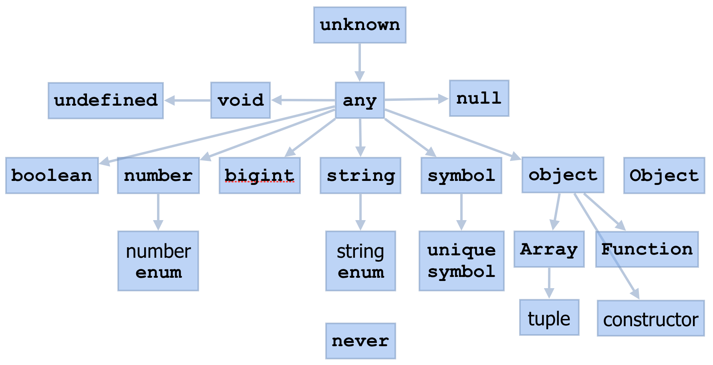

# 타입의 마술사가 되고 싶어요!

현대의 웹 어플리케이션에서 TS(Typescript)는 더 이상 빠질 수 없는 요소 중 하나가 되었습니다. 이러한 TS를 잘 활용하기 위해서는 TS의 타입에 대해서 알아두시면 도움이 되리라고 생각합니다. 타입의 마술사가 되어봅시다.

## TS의 타입 선언

TS에서 제공하는 타입과 이를 활용해 타입을 선언하는 방법에 대해 간단하게 소개를 드리고자 합니다.

### TS의 기본 제공 타입

타입은 기본적으로 소문자, 대문자를 구별하며, TS가 기본제공하는 타입은 모두 소문자로 이루어져 있습니다.

```typescript
1. boolean

    const isYouBestProgrammer: boolean = true;

2. number

    const nowYear: number = 2022;

3. string

    const bestDeveloperGroup: string = "GDSC_UOS";

4. null

    const thisIsNull: null = null;

5. undefined

    const iCantDefineThisValue: undefined = undefined;

6. object

    const thisIsVeryGeneralType: object = {};

7. array

    const thisIsNumberArray: number[] = [1, 2, 3];

8. tuple
    //고정된 요소들의 타입을 미리 선언하여 순서에 맞게 배열하여 배열 표현
    const tupleIsFixedAmountOfElementArray: [number, string] = [1, "www"];

9. enum
    //특정 상수들의 집합을 의미하는 자료형
    enum Color {
        Magenta,
        UltraMarine,
        Violet,
    }
    const enumIsGroupOfConst: Color = Color.Magenta:

10. any
    //어떤 타입도 가능한 타입, 타입 추론이 불가하거나 타입 체크가 필요 없는(?) 변수에 사용
    const itCanBeAllType: any = 4;

11. void
    //갑이 없다라는 의미로 반환갑이 없는 함수에 주로 적용
    const notification = (text: string): void => {
        console.log(text);
    }

12. never
    //결코 발생하지 않는 값
    const thisIsNeverOccuringValue = (): never => {
        while(true) {}
    }

13. unknown
    //any와 동일하게 어떤 타입도 대입이 가능한 타입입니다. 세부적으로 다른 점은 아래에서 언급하도록 하겠습니다.
    const unknowNumber: unknown = 10;
```

위에서 대표적인 TS의 기본 제공 타입들을 알아보았습니다. 궁금한 점이 여럿 있으리라고 생각하는데 이 중에서 하나를 설명드리도록 하겠습니다.

**any랑 unknown은 뭐가 다른가요?**

일단 any와 unknown은 둘다 모든 타입을 허용합니다. 하지만 세부적인 동작에서 다른 양상을 보입니다.

먼저 **any** 에 대해서 이야기하자면, 타입을 엄격하게 검사하고 처리하는 TS에서 any 타입은 치명적입니다. Typescript는 타입의 정보를 통해 IDE 상에서 미리 문제가 될 만한 내용을 사전 보고하여 문제를 방지할 수 있습니다. 하지만 any는 이러한 엄격한 Type 검사 대상의 예외가 되어 검사 또는 체크되지 않기에 더욱 심각한 런타임 에러를 발생시킬 수 있습니다. 그렇기에 피할 수 있다면 피하는 것이 좋습니다.

```typescript
const thisIsNumber: nubmer = 1;
console.log(thisIsNumber.length);
// error를 발생, number에는 length 프로퍼티가 존재하지 않습니다.

const thisIsAny: any = 1;
console.log(thisIsAny.length);
//error가 발생하지 않고 undefined를 출력
```

**unknown** 은 TS 3.0에서 도입되었습니다. **unknown** 은 any와 동일하게 모든 타입을 허용하지만 할당된 값이 어떤 값인지 모르기에 이를 통해 연산이나 프로퍼티를 활용할 수는 없습니다. **unknown** 타입으로 변수를 정의하면 컴파일러에게 변수의 타입이 **unknown** 타입이니 어떠한 값이든 올 수 있고 이를 엄격하게 검사하라는 것과 동일합니다. 이 경우 타입의 검사를 거쳐 타입이 확정된 이후에는 문제 없이 작동합니다.

```typescript
const thisIsUnknownNumber: unknown = 10;
const thisIsUnknownString: unknown = "Test";

console.log(thisIsUnknownNumber.length); //error
console.log(thisIsUnknownString.length); //error

//thisIsUnknownString의 경우 실제 String임에도 불구하고 에러 발생 - 이는 unknown 타입이기에 문제가 발생했다는 뜻입니다

if (typeof thisIsUnknownNumber === "number") {
  console.log(thisIsUnknonwNumber.length); //에러 발생 number에는 length 프로퍼티가 없습니다
}

if (typeof thisIsUnknownString === "string") {
  console.log(thisIsUnknownString.length); //정상 작동
}
```

체크해야할 부분은 많아지겠지만 타입에 대한 체크를 강제하므로 any보다 바람직하다고 볼 수 있습니다.

위에서 살펴본 이러한 타입들은 각각이 독립적인 것이 아니라 일련의 관계(relationships)를 가지고 있습니다. 이를 한 눈에 보여주는 그림을 첨부합니다.



해당 그림에 대해서 설명할 완벽한 방법을 가지고 있지만 지면상의 부족으로 설명을 생략하겠습니다. TS Type Structure와 관련하여 검색을 하시면 이와 관련하여 더 자세히 알아보실 수 있습니다.

### 타입 선언하기

크게 두 가지의 방법을 통해서 TS의 기본 제공 타입을 활용한 적절한 타입을 선언할 수 있습니다.

인터페이스(interface)

```typescript
interface 인터페이스이름 {
  property: type; // requiredType
  property?: type; // optionalType
  readonly property: type; // this type is readonly
  [propsName: string]: string; // key, value에 대한 타입을 지정
}
```

타입 앨리어스(type alias)

```typescript
type String = "GDSC"; // 문자열 리터럴로 타입 지정

type union = string | null; // 유니온 타입으로 타입 지정

type Tuple = [string, boolean]; //튜플 타입으로 타입 지정

type GroupPerson = {
  name: string;
  age: number;
  role: string;
};
```

여기까지 보면 사실상 type alias랑 interface는 거의 같아 보입니다. 일단 둘의 정의를 살펴보자면

> _A type alias is exactly that - a name for any type. An interface declaration is another way to name an object type_

이를 해석해보자면 둘 다 타입에 이름을 붙여줄 수 있으며, type alias는 모든 타입에 이름을 붙여줄 수 있지만 interface는 오직 객체 타입에만 붙여줄 수 있다는 것입니다.

하지만 이것만으로는 의문이 해결되지는 않을 것 같습니다. 사실상 inteface는 type의 객체 버전 subset처럼 느껴지기 때문일 것입니다. 이에 대해서 조금 더 깊게 파헤쳐 보도록 하겠습니다.

TS의 공식 문서에도 이러한 사람들의 의견이 반영된듯이 둘의 차이점에 대한 글이 있습니다.

> _Type aliases and interfaces are very similar, and in many cases you can choose between them freely. Almost all features of an interface are available in type, the key distinction is that a type cannot be re-opened to add new properties vs an interface which is always extendable._

해석해보자면 주요한 차이점은 type alias는 새로운 프로퍼티에 대해 열려있지 않고, interface는 항상 열려있다는 점입니다.

이러한 차이점을 보여주는 확장 방법으로 선언 병합이 있습니다. 일단 아래의 예시를 통해 살펴보겠습니다.

```typescript
interface chestEx {
  bench: string;
}

interface chestEx {
  raise: string;
}
// add new fields 'raise' in existing interface chestEx

type programming = {
  cleanCode: string;
};

type programming = {
  spaghetti: string;
};
//Type alias Type can't be changed after being created
```

interface는 다른 프로퍼티를 통한 재선언을 통해 타입 확장을 일으킴을 확인할 수 있었고 이를 선언 병합이라고 부릅니다. 이를 두고 interface는 새로운 프로퍼티에 대해 열려 있다고 말합니다. 하지만 type alias에서 이러한 선언 병합은 허용되지 않습니다.

이러한 두 가지 방법의 타입선언은 개발자로 하여금 다양한 상황에서 대처할 수 있도록 합니다.

## 요약

- TS는 다양한 기본 제공 타입들을 지니며 이러한 타입은 서로 관계를 가지고 연결되어 있다.
- any와 unknown은 모든 타입을 대입할 수 있다는 점은 같지만 세부 동작은 같지 않다.
- 타입을 선언하는 방법에는 interface, type alias가 있으며, 이 둘은 세부적인 부분에서 차이를 보인다.

## 끝내며

Type의 개념은 단순히 TS 뿐만 아니라 많은 언어에서 사용하고 있기에 이러한 타입들을 활용해 견고한 소프트웨어를 구성하는 것은 중요한 역량 중 하나라고 생각됩니다. 추가적으로 TS의 공식 문서를 읽어보는 것도 추천 드립니다!

[TS 공식 문서](https://www.typescriptlang.org/docs/)

[TS Type Structure](https://objectcomputing.com/resources/publications/sett/typescript-the-good-parts)
