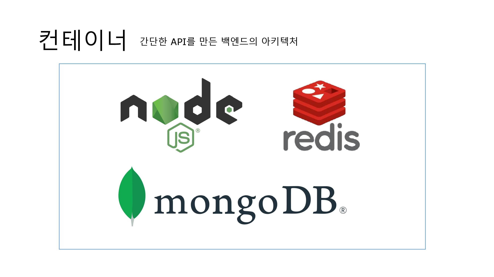
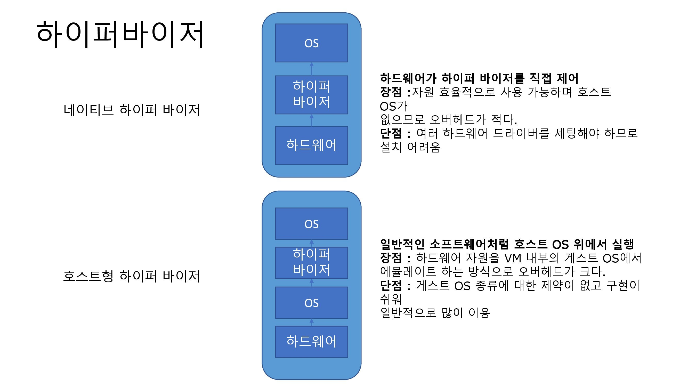
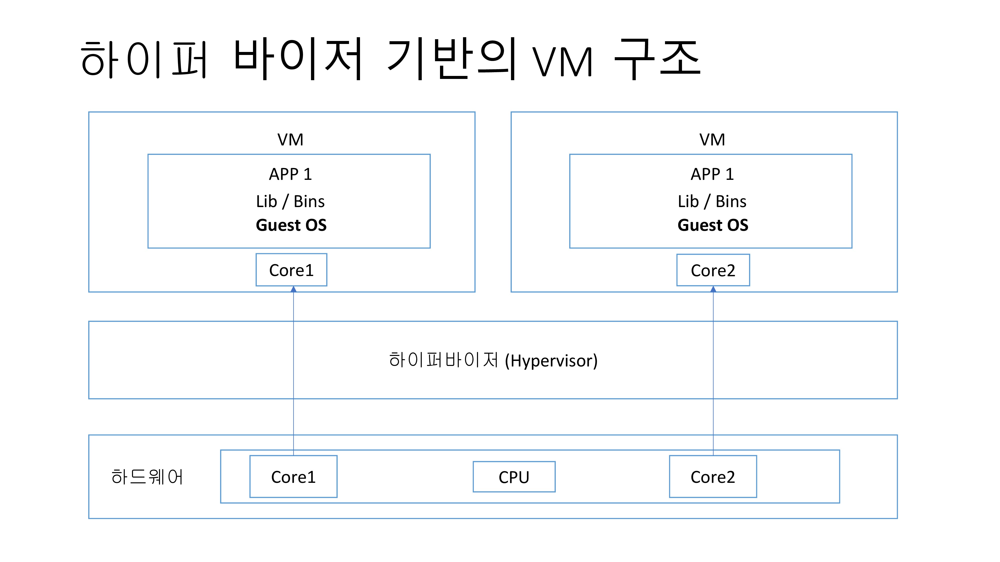
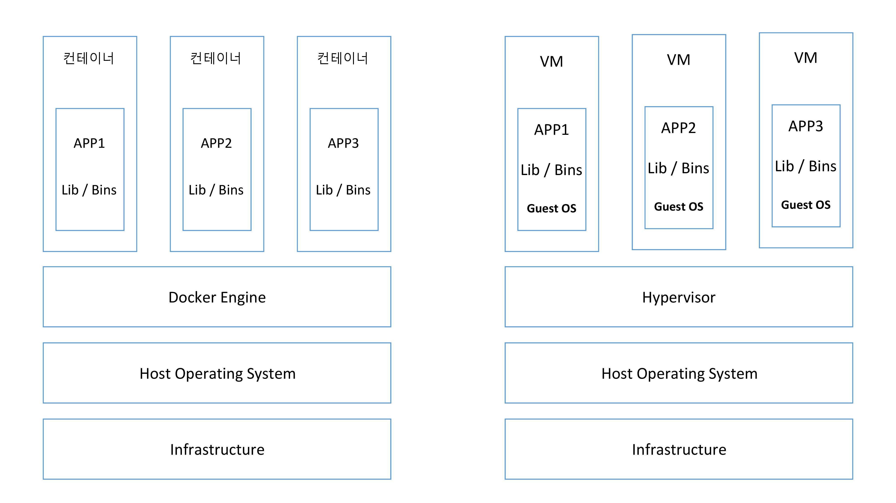

## 우리는 왜 도커를 사용하는가?

인프라에 대해서 공부하면 docker라는 기술을 많이 사용하는 것을 알 수 있는데요,
과연 어떠한 이점이 있고 왜 도커를 사용하는 것일까요?
간단한 결론부터 말하면, **어떤 프로그램을 다운로드 하는 과정을 간단하게 만들기 위해서**입니다.
도커를 다룰 수 있게 되기 위해선 많은 과정이 필요하기 때문에 이번 포스팅에서는 개념적인 부분만 다루어 보려고 합니다.

## docker의 인스톨 과정

docker 없이 프로그램을 다운받을 때의 순서는 아래와 같습니다.

1. 인스톨러 내려받기
2. 인스톨러 실행
3. 프로그램 설치 완료

해당 방식을 통해서 설치가 이루어집니다. 실제로 Redis를 설치하려고 한다면, Redis.io로 이동하여 인스톨러를 다운해야 합니다.
Mac OS 기준으로는 .dmg 파일을 실행시키게 될텐데, 일반적으로 이때 문제가 발생하게 됩니다.
해당 방식을 통해서 인스톨러를 실행시키면 wget이 없기 때문에 인스톨 과정에서 에러가 발생하게 됩니다.

위와 같은 방법은 번거롭고 에러가 발생할 부분이 많습니다 **하지만 docker를 사용한다면?**

```bash
docker run -it redis
```

해당 명령어를 통해 손쉽게 패키지를 설치할 수 있습니다. 이러한 이점 때문에 docker를 사용합니다. 이 외에도 **컨테이너**라는 독특한 서버 환경을 구성할 수 있기
때문에, docker를 사용하곤 합니다.

## docker의 컨테이너

> 도커는 컨테이너를 사용하여 응용 프로그램을 더 쉽게 만들고 배포하고 실행할 수 있도록 설계된 도구이며, 컨테이너 기반의 오픈소스 가상화 플랫폼이며 생태계입니다.

컨테이너 안에 다양한 프로그램, 실행 환경을 컨테이너로 추상화하고 동일한 인터페이스를 제공하여 프로그램의 배포 및 관리를 단순하게 하는 것이 컨테이너입니다.
이런 식으로 환경을 구성하여 AWS, Azure, Google Cloud 등 다양한 클라우스 서비스에서 작동하기 쉽게 만들어줍니다.



위 사진은 백엔드 아키텍쳐를 nodejs, redis, mongoDB를 사용하여 구성하였는데, docker를 통해 해당 패키지들의 버전을 명시하고, 각 프로그램들이 돌아가는
환경을 할당함으로서 좀 더 효율적으로 서버 환경을 구성할 수 있게 합니다.

## docker의 이미지

> 컨테이너 이미지는 코드, 런타임, 시스템 도구, 시스템 라이브러리 및 설정과 같은 응용 프로그램을 실행하는 데 필요한 모든 것을 포함하는 가볍고 독립적이며
> 실행 가능한 소프트웨어 패키지입니다.

도커 이미지는 프로그램을 실행하는데 필요한 설정이나 종속성을 갖고 있습니다. **도커 컨테이너는 이미지의 인스턴스** 즉 도커를 실행하면 이미지들을 통해서 컨테이너를
돌아가게 만들고 이러한 여러개의 멀티 컨테이너 환경을 통해서 프로그램을 안전하게 작동시키는 것이 도커의 원리인 것입니다.

즉 위에 있는 백엔드 아키텍처를 **이미지**로 만들어 클라우드 서비스에 올리게 되면, 해당 이미지를 통해 컨테이너를 만들게 됩니다.
특히 위에 있는 경우에는 nodejs, mongoDB, redis 세 개의 컨테이너를 사용해야 하기 때문에 docker-compose라는 여러 개의
멀티 컨테이너를 다룰 수 있는 기술을 사용하곤 합니다.

## 기존 가상화 기술, 하이퍼 바이저(VM)



가상 머신 모니터라고도 하는 **하이퍼바이저는 가상 머신(VM)을 생성하고 실행하는 프로세스**를 뜻합니다. 위 그림과 같이
하이퍼바이저를 구현하는 방법은 두가지로 나뉘게 됩니다.



하이퍼바이저 기반의 VM 구조는 위 사진과 같습니다. 하드웨어의 일부분을 각 VM에다 할당해주는데, 이때 게스트 OS까지
할당하게 된다. 하이퍼바이저에 의해 구동되는 VM은 각각 독립된 가상 하드웨어 자원을 할당 받습니다.
논리적으로 분리되어 있기 때문에 한 VM에 문제가 발생하여도 다른 VM으로 퍼지지 않습니다. 이는 기존의 하이퍼 바이저를 사용하는 가상환경 구조입니다.

## docker의 가상화 기술



왼쪽은 도커를 사용한 가상화 기술, 오른쪽은 기존의 VM를 사용한 가상화 기술입니다.

VM과 비교했을 때, **컨테이너는 하이퍼바이저와 게스트 OS가 필요하지 않으므로 더 가볍습니다.**

어플리케이션을 실행할 때, 컨테이너 방식에서는 호스트 OS 위에 어플리케이션의 실행 패키지인 **이미지**를 배포하면 되는데,
VM은 어플리케이션을 실행 하기 위해서 VM를 띄우고 자원을 할당한 다음 게스트 OS를 부팅하여 어플리케이션을 실행해야합니다
따라서 VM의 방식은 훨씬 복잡하고 무거운 부피를 가지고 있습니다.

### 공통점

> **도커 컨테이너**와 **가상 머신**은 기본 하드웨어에서 격리된 환경 내에 애플리케이션을 배치하는 방식

### 차이점

> 가장 큰 차이점은 격리된 환경을 얼마나 **격리**를 시키는 지

### 특징

**도커 컨테이너**에서 돌아가는 애플리케이션은 컨테이너가 제공하는 격리 기능 내부에 샌드박스가 있지만, 여전히
같은 호스트의 다른 컨테이너와 **동일한 커널**을 공유합니다. 결과적으로 컨테이너 내부에서 실행되는 프로세스는 호스트 시스템에서 볼 수 있습니다.
예를 들어, docker와 함께 MongoDB 컨테이너를 시작하면 호스트의 일반 쉘에 ps-e grep 몽고를 실행하면 프로세스가 표시됩니다.
또한 컨테이너가 전체 OS를 내장할 필요가 없는 이유로, 멀티 컨테이너들은 매우 가볍고, 일반적으로 5-100MB입니다.

**가상 머신**과 함께 VM 내부에서 실행되는 모든 것은 호스트 운영 체재 또는 하이퍼 바이저와 독립되어 있습니다.
가상 머신 플랫폼은 특정 VM에 대한 가상화 프로세스를 관리하기 위해 프로세스를 시작하고, 호스트 시스템은 그것의 하드웨어 자원의 일부를 VM에 할당합니다.

그러나 컨테이너와 근본적으로 다른 점은 시작 시간에 이 VM 환경을 위해 새롭고, 이 특정 VM을 위한 커널을 부팅하고, 운영 체제 프로세스도 시작해야합니다.
이것은 **응용 프로그램만을 포함하는 일반적인 컨테이너**보다 VM의 크기를 훨씬 크게 만듭니다.

OS까지 가상화하여 맥에서 윈도우를 까는 등의 방법은 비교적 사용법이 간단할 수 있으나 굉장히 느립니다.

## 컨테이너를 격리시키는 방법?

이는 리눅스에서 사용하는 Cgroup과 namespaces라는 방법을 이용합니다.

이 방법들은 컨테이너와 호스트에서 실행되는 다른 프로세스 사이에 벽을 만드는 리눅스에 원래 존재하는 커널 기능들입니다.

### C Group

CPU, 메모리, Network Bandwith, HD i/o 등 프로세스 그룹의 시스템 리소스 사용량을 관리
어떤 어플이 사용량이 너무 많다면 그 어플리케이션 같은 것을 C group에 집어 넣어서 CPU와 메모리 사용 제한 가능

### namespaces

하나의 시스템에서 프로세스를 격리시킬 수 있는 가상화 기술
별개의 독립된 공간을 사용하는 것처럼 격리된 환경을 제공하는 경량 프로세스 가상화 기술

## 마무리

직접 만든 프로그램을 클라우드 서비스에 배포하려고 하는 과정에 docker에 대해서 알아보게 되었는데,
docker 자체만을 공부하면서 서버가 어떤 식으로 작동하는지도 알 수 있는 기회가 되었습니다.

굉장히 재미있는 기술이니 다들 한번 알아보셨으면 좋겠습니다!

## 참고자료

- [inflearn/docker](https://www.inflearn.com/course/%EB%94%B0%EB%9D%BC%ED%95%98%EB%A9%B0-%EB%B0%B0%EC%9A%B0%EB%8A%94-%EB%8F%84%EC%BB%A4-ci/dashboard)
