# AE(AutoEncoder) - 오토인코더

<b>AE(AutoEncoder)</b>는 <b>인코더(encoder)</b> 와 <b>디코더(decoder)</b> 로 이루어진 신경망으로, 데이터에 대한 정답 값을 주지 않고 스스로 학습하게 하는 비지도 학습(unsupervised learning) 방법을 사용합니다.  
&nbsp;encoder-decoder 모델은 다양한 분야에 사용되는데, 실제로 제가 고등학교 때 음성 배경 잡음 제거 인공지능을 만들 때도 encoder-decoder 모델을 사용하였습니다. 

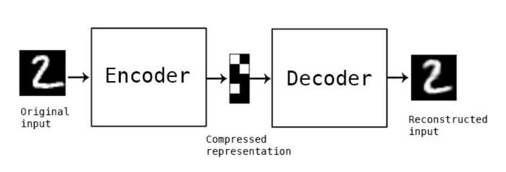  
<br/>
<b>인코더(encoder)</b> 네트워크는 주로 고차원의 입력 데이터를 저차원의 표현 벡터로 압축시킵니다. 여기서 표현 벡터란 원본 이미지를 저차원 잠재 공간으로 압축한 것을 뜻합니다.  
<br/>
<b>디코더(decoder)</b> 네트워크는 인코더를 통과한 표현 벡터를 다시 원본 차원으로 압축 해제합니다. 디코더는 인코더를 통과하여 잠재 공간에 있는 포인트를 올바른 이미지로 변환하는 방법을 학습합니다.  

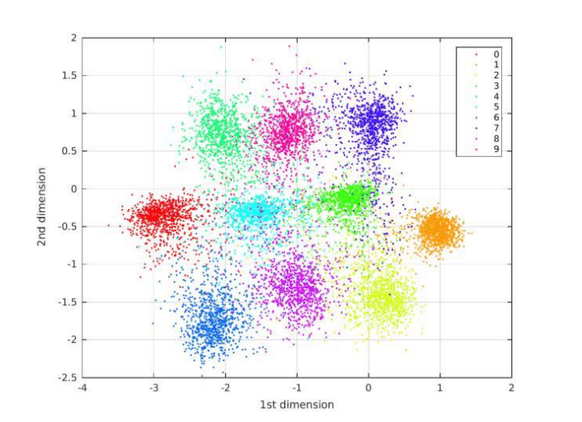

&nbsp;숫자 손글씨를 예로 들면 인코더에 원본 데이터(손글씨 사진)를 입력하면 2차원의 잠재 공간 안의 표현 벡터로 압축시킵니다. 위 사진은 2차원 공간에 표현 벡터 값을 시각화한 모습입니다. 그리고 해당 좌표는 디코더를 거쳐 사진으로 재구성되어 출력됩니다.  
<br/>  
&nbsp;2차원 잠재 공간은 시각화하기는 좋지만 이미지의 미묘한 차이를 잘 감지하여 원본 데이터의 여러 정보들을 담아 인코딩하기에는 너무 작습니다. 그래서 실제 오토 인코더를 사용할 때는 2차원 이상의 잠재 공간 안의 표현 벡터를 사용합니다. 그렇다고 잠재 공간의 차원을 추가하자니, 잠재 공간 차원이 증가할수록 뒤에서 살펴볼 AE의 문제점이 뚜렷하게 드러나게 됩니다.   
&nbsp;인코더는 데이터의 숨어있는 중요한 특징을 압축하기 때문에, 잠재 공간 안에 랜덤한 잡음까지 나타내기 어려워 AE는 이미지의 잡음을 제거하기 위해서 사용되기도 합니다.

## AE(AutoEncoder) 실습
손글씨 생성 모델 실습 설명을 코드와 합성곱 층 설명을 중심으로 진행하겠습니다. 저는 keras 라이브러리를 사용하여 colab에서 실습을 진행했습니다.
&nbsp; Autoencoder 클래스를 정의해 준 뒤, 인코더와 디코더에 들어갈 때의 데이터의 형태와 인코더와 디코더의 filter 수, kernel size, strides를 정의해 줍니다.  

```python
AE = Autoencoder(
    input_dim = (28,28,1)
    , encoder_conv_filters = [32,64,64, 64]
    , encoder_conv_kernel_size = [3,3,3,3]
    , encoder_conv_strides = [1,2,2,1]
    , decoder_conv_t_filters = [64,64,32,1]
    , decoder_conv_t_kernel_size = [3,3,3,3]
    , decoder_conv_t_strides = [1,2,2,1]
    , z_dim = 2
)
```
&nbsp;먼저 입력 이미지의 형태를 정의합니다. (28, 28, 1)은 28 * 28 사이즈의 이미지가 흑백인 것을 의미합니다. (28, 28, 3)일 경우 R, G, B의 컬러 이미지를 뜻합니다.  
<br/>
&nbsp;다음으로 입력 이미지 데이터를 받아 2차원 잠재 공간으로 인코딩할 인코더를 만들 것입니다.  
&nbsp;위에서 입력한 데이터들을 이용해 합성곱 층을 쌓을 준비를 하고 합성곱 층을 차례대로 쌓습니다. flatten을 사용하여 하나의 2차원 데이터를 하나의 벡터로 쭉 펼친 뒤, Z_dim을 2로 함으로써 벡터를 2차원 잠재 공간으로 연결합니다. 마지막으로 인코더를 정의하는 모델을 만듭니다.  

```python
encoder_input = Input(shape=self.input_dim, name='encoder_input')

x = encoder_input

for i in range(self.n_layers_encoder):
    conv_layer = Conv2D(
        filters = self.encoder_conv_filters[i]
        , kernel_size = self.encoder_conv_kernel_size[i]
        , strides = self.encoder_conv_strides[i]
        , padding = 'same'
        , name = 'encoder_conv_' + str(i)
        )

        x = conv_layer(x)

        x = LeakyReLU()(x)

        if self.use_batch_norm:
            x = BatchNormalization()(x)

        if self.use_dropout:
            x = Dropout(rate = 0.25)(x)
    

    shape_before_flattening = K.int_shape(x)[1:]

    x = Flatten()(x)
    encoder_output= Dense(self.z_dim, name='encoder_output')(x)

    self.encoder = Model(encoder_input, encoder_output)
```

&nbsp;각 층에서는 2차원 데이터를 받아 filter들과 해당하는 kernel size로 strides씩 움직이며 합성곱 연산을 합니다. 그래서 합성곱 연산의 결과 데이터는 입력 데이터보다 작아지게 됩니다. filter들은 값을 조절하며 학습되어 특성들을 담게 됩니다. 밑에 사진은 모델 구조입니다.  

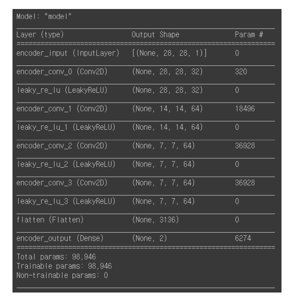

&nbsp;다음으로 잠재 공간에 존재하는 한 포인트의 벡터 값을 받아 원본 이미지 차원으로 디코딩하는 디코더를 만들 것입니다. 디코더는 인코더의 반대 형태로 정의하여 만들어줄 수 있습니다. 그러나 꼭 디코더가 인코더의 완전한 반대 구조를 가질 필요는 없습니다.  
<br/>
&nbsp;디코더의 입력 데이터의 형태를 정해주는 데에는 인코더와 차이가 있습니다. 디코더는 인코더를 통해 나온 2차원 잠재 공간의 벡터를 입력 데이터로 받기 때문에 z_dim (2)을 입력 형태로 정의합니다.

```python
decoder_input = Input(shape=(self.z_dim,), name='decoder_input')
```

&nbsp;또, 디코더와 인코더 구조를 정의할 때 눈에 띄는 차이점 중 하나는 <b>인코더</b>에서는 일반적인 <b>합성곱 층(Convolutional Layer)</b>을 이용하는 반면 <b>디코더</b>에서는 <b>전치 합성곱 층(Transposed Convolutional	 Layer)</b>을 사용한다는 점입니다. 합성곱 층을 거치면 데이터의 크기는 줄어들게 되는데 전치 합성곱 층을 거치면 데이터의 크기가 커집니다. 전치 합성곱 층의 출력 사이즈와 층에서 필터가 움직이는 간격을 뜻하는 strides에 따라 데이터 주위를 0으로 둘러싸는 제로 패딩(zero padding)의 형태가 결정됩니다.

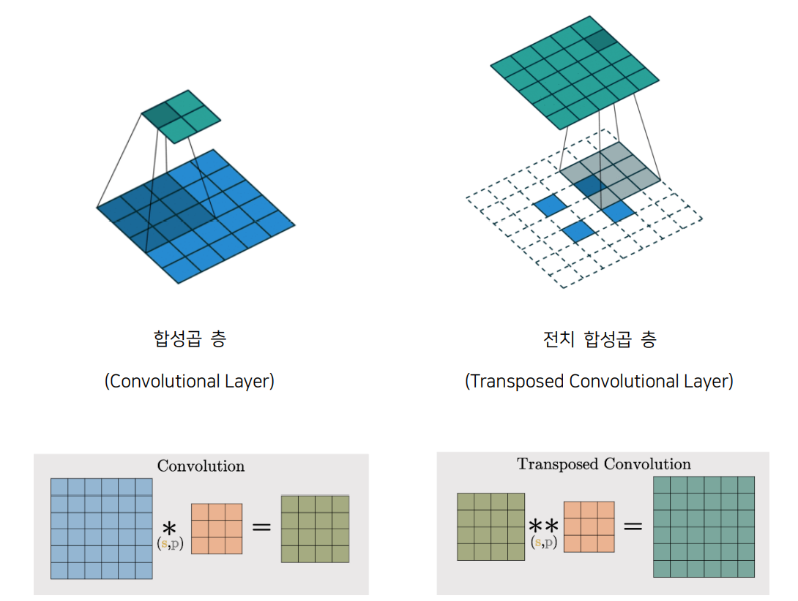

&nbsp;인코더의 마지막 합성곱 층 (7, 7, 64)를 담고 있는 텐서 shape_before_flattening을 np.prod 함수를 거쳐 Dense 층에 연결하는데, np.prod 함수는 배열의 원소 곱을 반환하기 때문에 np.prod (shape_before_flattening)의 값은 7 * 7 * 64로 3,136이 됩니다. 그다음 맨 위에서 정의했던 값들을 이용하여 전치 합성곱 층을 쌓을 준비를 하고 층을 차례대로 쌓습니다.  
<br/>
&nbsp;Endcoder와 Decoder를 만들 때 Dropout은 과적합 방지를 위해 층 별로 랜덤하게 노드 간 연결을 끊어 학습시키는 역할을 합니다. Rate 0.25는 25퍼센트 연결을 끊는 것을 의미합니다.  
<br/>
&nbsp;코드와 모델 구조입니다.  

```python
x = Dense(np.prod(shape_before_flattening))(decoder_input)
x = Reshape(shape_before_flattening)(x)

for i in range(self.n_layers_decoder):
    conv_t_layer = Conv2DTranspose(
        filters = self.decoder_conv_t_filters[i]
        , kernel_size = self.decoder_conv_t_kernel_size[i]
        , strides = self.decoder_conv_t_strides[i]
        , padding = 'same'
        , name = 'decoder_conv_t_' + str(i)
        )

    x = conv_t_layer(x)

    if i < self.n_layers_decoder - 1:
        x = LeakyReLU()(x)
                
        if self.use_batch_norm:
            x = BatchNormalization()(x)
                
        if self.use_dropout:
            x = Dropout(rate = 0.25)(x)
    else:
        x = Activation('sigmoid')(x)

decoder_output = x

self.decoder = Model(decoder_input, decoder_output)
```
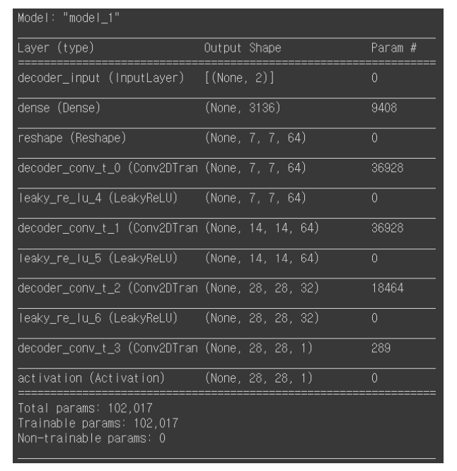

&nbsp;위에서 모델을 만들 때 활성화 함수로 Leaky ReLU가 쓰였습니다. 일반 ReLU 함수는 x가 0이하일 때는 y가 0인 상수 함수, x가 0보다 클 때는 항등 함수로 이루어져 있습니다. 반면에, Leaky ReLU 함수는 x가 0보다 클 때는 기존 ReLU 함수와 같이 항등 함수를 갖지만 x가 0이하일 때는 기울기가 0.001이고 절편이 0인 일차 함수를 갖습니다.
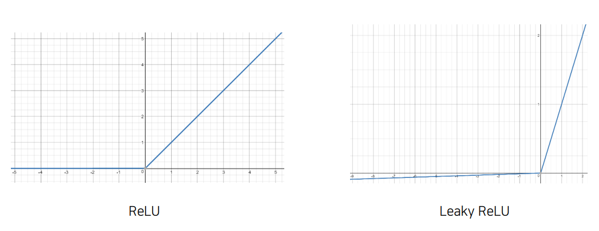
<br/>
&nbsp;저는 Autoencoder 클래스를 따로 정의해서 실습했지만, 만약 클래스를 정의하지 않고 모델을 만들고 싶다면 다음과 같이 코드를 짜면 됩니다.

```python
encoder_input = Input(shape=(28, 28, 1))

x = Conv2D(32, 3, padding='same')(encoder_input) 
x = BatchNormalization()(x)
x = LeakyReLU()(x) 

x = Conv2D(64, 3, strides=2, padding='same')(x)
x = BatchNormalization()(x) 
x = LeakyReLU()(x) 

x = Conv2D(64, 3, strides=2, padding='same')(x)
x = BatchNormalization()(x)
x = LeakyReLU()(x)

x = Conv2D(64, 3, padding='same')(x)
x = BatchNormalization()(x)
x = LeakyReLU()(x)

x = Flatten()(x)
encoder_output = Dense(2)(x) # 위에서 실습했던 변수값 z_dim = 2

encoder = Model(encoder_input, encoder_output)
```
```python
decoder_input = Input(shape=(2, )) # z_dim = 2

x = Dense(7*7*64)(decoder_input) 
# (7*7*64)는 위에서 실습했던 코드에서 np.prod (shape_before_flattening)값과 같다.
x = Reshape((7, 7, 64))(x)

x = Conv2DTranspose(64, 3, strides=1, padding='same')(x)
x = BatchNormalization()(x)
x = LeakyReLU()(x)

x = Conv2DTranspose(64, 3, strides=2, padding='same')(x)
x = BatchNormalization()(x)
x = LeakyReLU()(x)

x = Conv2DTranspose(64, 3, strides=2, padding='same')(x)
x = BatchNormalization()(x)
x = LeakyReLU()(x)

x = Conv2DTranspose(32, 3, strides=1, padding='same')(x)
x = BatchNormalization()(x)
x = LeakyReLU()(x)

decoder_output = Conv2DTranspose(1, 3, strides=1, padding='same', activation='tanh')(x)

decoder = Model(decoder_input, decoder_output)
```  
<br/>   
&nbsp;인코더와 디코더를 동시에 훈련시키기 위해서는 데이터가 인코더를 지나 디코더로 나오는 하나의 모델을 만들어야 합니다. 다음 코드와 같이 오토 인코더 모델의 입력을 인코더의 입력으로 하고 디코더의 입력은 인코더의 출력으로 한 뒤 오토 인코더 모델의 출력을 디코더의 출력을 하여 AE 모델을 만듭니다.  

```python
model_input = encoder_input
model_output = self.decoder(encoder_output)

self.model = Model(model_input, model_output)
```

&nbsp;모델을 정의했으니 이제 손실 함수(Loss Function)와 optimizer를 정해주어야 합니다. 손실 함수로는 MSE에 루트를 씌운 RMSE(평균 제곱근 오차)를 사용하였고 손실 함수가 최소가 되는 파리미터를 찾는 optimizer로는 adam을 선택하였습니다. 

```python
    def compile(self, learning_rate):
        self.learning_rate = learning_rate

        optimizer = Adam(lr=learning_rate)

        def r_loss(y_true, y_pred):
            return K.mean(K.square(y_true - y_pred), axis = [1,2,3])

        self.model.compile(optimizer=optimizer, loss = r_loss)
```

&nbsp;이제 모델을 학습시킬 차례입니다. Train 함수를 정의하여 한 번 전체 데이터를 한 번 학습할 때마다 모델의 가중치들을 저장(갱신)하게 하여 중간에 꺼져도 학습한 모델이 유지되게 합니다. 그리고 데이터가 너무 많아 학습이 오래 걸릴 수 있어 일단 2000개의 데이터로만 학습을 진행하고 전체 데이터를 200번 학습시켰습니다.  
```python
def train(self, x_train, batch_size, epochs, run_folder, print_every_n_batches = 100, initial_epoch = 0, lr_decay = 1):

    custom_callback = CustomCallback(run_folder, print_every_n_batches, initial_epoch, self)
    lr_sched = step_decay_schedule(initial_lr=self.learning_rate, decay_factor=lr_decay, step_size=1)

    checkpoint2 = ModelCheckpoint(os.path.join(run_folder, 'weights/weights.h5'), save_weights_only = True, verbose=1)

    callbacks_list = [checkpoint2, custom_callback, lr_sched]

    self.model.fit(     
        x_train
        , x_train
        , batch_size = batch_size
        , shuffle = True
        , epochs = epochs
        , initial_epoch = initial_epoch
        , callbacks = callbacks_list
    )
```
```python
AE.train(     
    x_train[:2000]
    , batch_size = BATCH_SIZE
    , epochs = 200
    , run_folder = RUN_FOLDER
    , initial_epoch = INITIAL_EPOCH
)
```

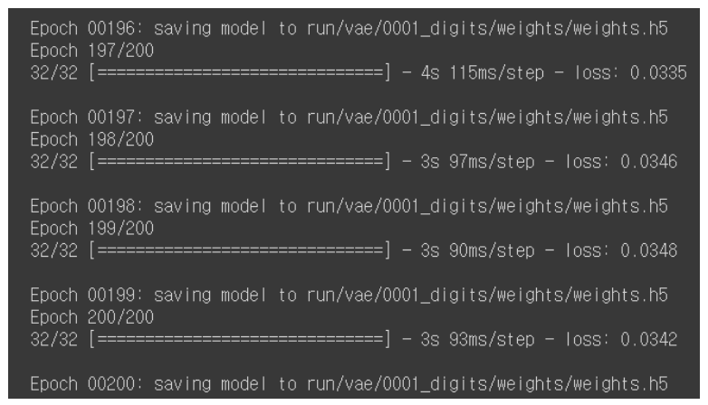  
<br/>  

## AE 학습 결과
&nbsp;이제 모델에 학습시키지 않은 test 데이터를 이용해서 제가 만든 AE에 입력 데이터(위)와 출력 데이터(아래), 그리고 2차원 잠재 공간의 벡터 값을 살펴보겠습니다.

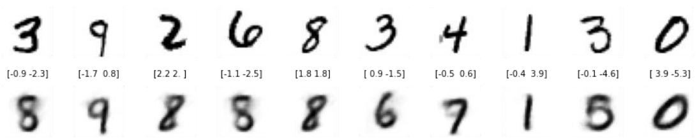  
<br/>  
&nbsp;그다음, 숫자에 따라 색을 구분하여 산점도를 그려보겠습니다. 모델에게 해당 사진 데이터에 해당하는 숫자 레이블을 입력해 주지 않았음에도 AE는 자연스럽게 비슷한 숫자를 잠재 공간의 같은 영역에 모은 것을 볼 수 있습니다.

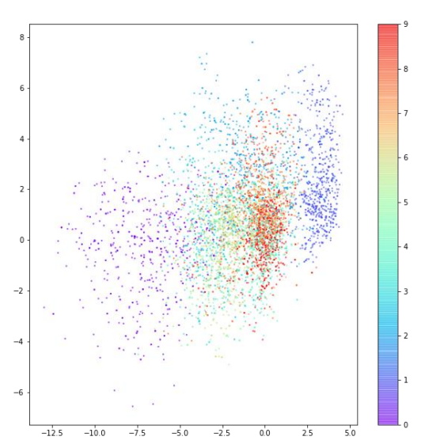

&nbsp;AE의 목표는 잠재 공간에서 랜덤한 포인트를 선택하여 디코더를 통과시켜 실제와 같은 숫자 이미지를 얻어, 여러 번 실행했을 때 여러 종류의 숫자가 고르게 나오도록 하는 것입니다. 그러나 위 그래프에서 우리는 몇 가지 문제를 찾을 수 있습니다.  
<br/>
## AE의 문제점  

&nbsp;첫 번째로, 포인트가 (0, 0)에 대칭이 아니고 값의 범위도 제한되어 있지 않습니다. 포인트들이 비대칭적으로 퍼져 있고, 다른 데이터들과 동떨어져 있는 데이터도 존재합니다. 두 번째로, 어떤 숫자에 해당하는 포인트는 밀집되어 있지만 다른 어떤 숫자에 해당하는 포인트는 훨씬 넓은 영역에 퍼져 있습니다. 

<br/>
&nbsp;아래 사진은 구간을 정해 잠재 공간 상의 세 포인트를 찍어 디코딩한 모습입니다. 위에서 말한 그래프 특징과 중복되는 이야기이긴 하지만 다시 한번 강조하면, 인코더는 잠재 공간에 포인트를 매핑할 때 (0, 0) 근처에 모이게 선택할 것을 보장할 수 없습니다. 또한 포인트를 랜덤하게 선택하여 디코딩하였을 때 숫자가 고르게 생성되지도 않습니다.

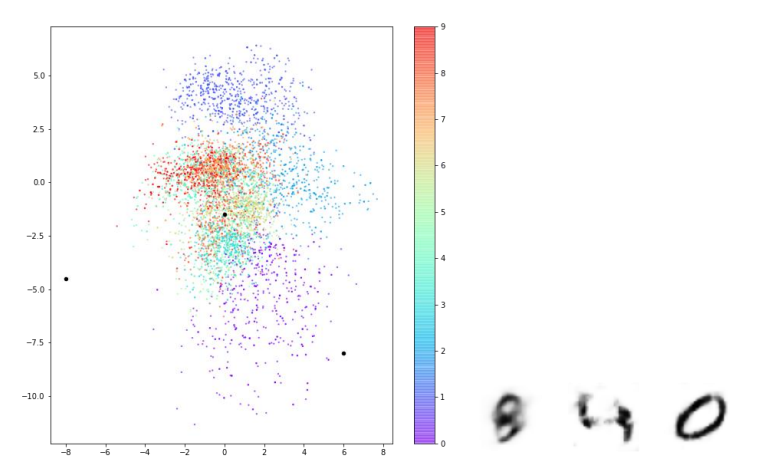

&nbsp;예를 들면 숫자 0의 영역이 숫자 다른 영역보다 넓어 랜덤하게 포인트를 선택하여 디코딩했을 때 0과 유사한 이미지가 더 많이 출력될 것입니다. 밑에 사진은 잠재 공간의 포인트를 고르게 선택하였을 때 나오는 숫자 이미지들입니다. 숫자 ‘0’처럼 보이는 이미지는 매우 많은 반면, ‘6’처럼 보이는 이미지는 거의 없는 것을 볼 수 있습니다.  

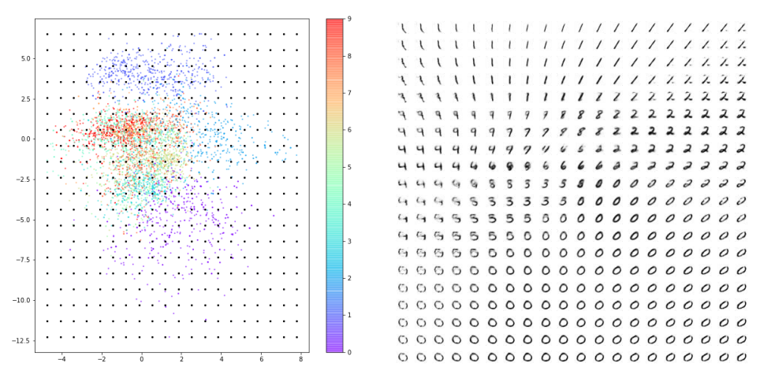

&nbsp;잠재 공간이 2차원이기 때문에 이러한 문제점들을 감지하기 어려울 수 있지만 복잡한 이미지를 생성하기 위해 잠재 공간의 차원을 늘린다면 오히려 이 문제들이 더욱 뚜렷해질 가능성이 높습니다. 어떻게 하면 이 AE(오토인코더) 생성 모델의 문제들을 해결할 수 있을까요?  
<br/>
# VAE(Variational AutoEncoder) - 변이형 오토인코더
VAE(변이형 오토인코더)는 AE(오토인코더)를 약간 변형하여 AE가 갖고 있는 문제들을 해결합니다. 바꿀 부분은 단지 인코더와 손실 함수, 이 두 부분밖에 없습니다. 이 부분에 대해 설명할 때 수식들이 나오는데 해당 함수가 어떤 역할을 하는지 아는 것을 우선으로 하겠습니다.
<br/>
## 1) VAE의 인코더
&nbsp;첫 번째로, VAE의 인코더를 살펴보겠습니다. AE에서는 인코더를 통해 각 이미지가 잠재 공간의 한 포인트에 직접 매핑되는 반면, VAE는 각 이미지가 잠재 공간에 있는 포인트 주변의 다변수 정규 분포(multivariate normal distribution)에 매핑됩니다.

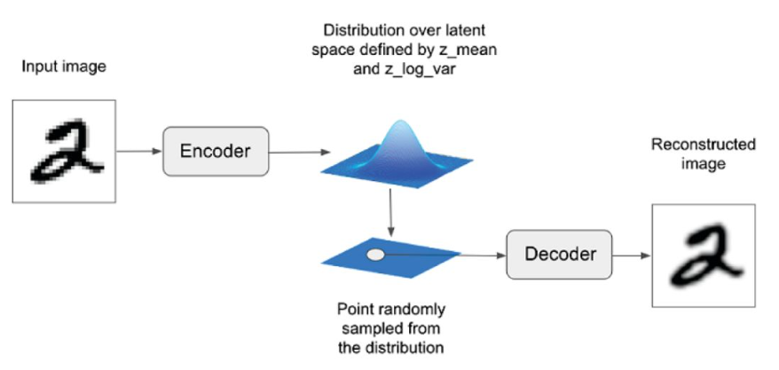

&nbsp;정규 분포(normal distribution)는 종 모양의 곡선을 가진 확률 분포로, 1차원일 때에 평균(μ)과 분산(σ²), 2개의 변수로 정의됩니다. 그리고 표준 편차(σ)는 분산의 제곱근입니다.
<br/>
&nbsp;1차원 정규 분포의 확률 밀도 함수(standard normal distribution)는 다음과 같습니다. m은 평균, e는 자연 상수를 뜻합니다. 

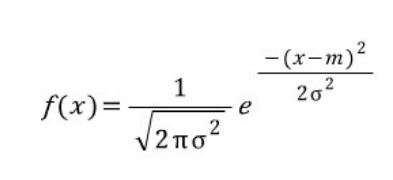

&nbsp;밑에 그림을 예를 들면 빨간색 곡선은 평균이 0이고 분산이 1인 표준 정규 분포이고, 초록색 곡선은 평균이 -2이고 분산이 0.5인 표준 정규 분포입니다.

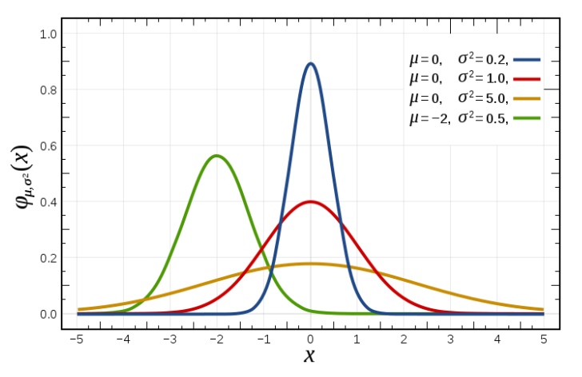

&nbsp;정규 분포의 개념을 1차원보다 더 크게도 확장 가능합니다. 차원 D에 대한 다변수 정규 분포에 대한 확률 밀도 함수는 다음과 같습니다. 
 
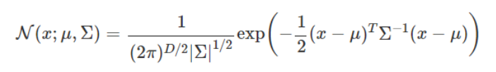

&nbsp;다변수 정규 분포의 확률 밀도 함수는 평균 벡터 μ와 공분산 행렬 Σ가 필요한데, 2차원일 경우에는 평균 벡터와 행렬을 다음과 같이 정의합니다. 여기서 ρ는 두 차원 x_1, x_2사이의 상관 계수입니다.  

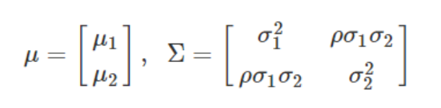

&nbsp;VAE에서는 공간의 차원 사이에 상관관계가 없다고 가정하여 상관 계수ρ가 0이 되기 때문에 공분산 행렬 Σ는 대각 행렬이 되고 차원 간의 공분산은 신경 쓰지 않아도 됩니다. 인코더는 이러한 이유로 데이터를 입력받아 잠재 공간에 평균 벡터와 분산 벡터만 매핑해도 되게 됩니다.  
<br/>
&nbsp;인코더가 데이터를 입력받아 잠재 공간에 매핑하는 값은 (-∞, ∞)에 해당하는 실수 전체 범위에서 나올 수 있어야 하는데 표준 편차의 제곱인 분산은 항상 0보다 크거나 같으므로 음수 값이 나오게 하기 위해 로그를 취해줍니다.  
<br/>
&nbsp;다음 식은 인코더를 통해 들어온 데이터를 잠재 공간에 특정 포인트 z로 인코딩하기 위해 쓰입니다. 평균 μ, 표준편차 σ, 표준 정규 분포에서 추출된 값 ϵ를 이용하여 포인트 z를 추출할 수 있습니다.


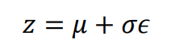
<br/>
&nbsp;파이썬에서 VAE를 구현하기 위해 위의 식을 작성해 보았습니다. exp()는 자연상수 e를 밑으로 하는 지수함수를 뜻하고 log_var은 위에서 설명했듯이 음수 값도 나오게 하기 위해 차원별 분산에 로그를 취한 값 log(σ²)을 뜻합니다. Mu는 해당 분포에서의 평균 벡터를 의미합니다.  

```python
sigma = exp(log_var / 2)
```

```python
z = mu + sigma * epsilon
```

&nbsp;요약하자면, mu는 인코더가 잠재 공간에 나타내고 벡터들의 평균을, epsilon은 mu에서 얼마나 떨어져 포인트를 표시할지 나타냅니다. epsilon에 곱해진 sigma는 encoder의 mu에 대한 확실성에 따라 달라집니다.  
<br/>
&nbsp;이제 mu 주변 지역에서 랜덤한 포인트들이 샘플링되기 때문에 잠재 공간에서 다른 랜덤한 포인트를 디코딩해도 제대로 된 데이터가 생성될 수 있게 됩니다.  
<br/>
다음은 VAE의 인코더의 구조입니다.

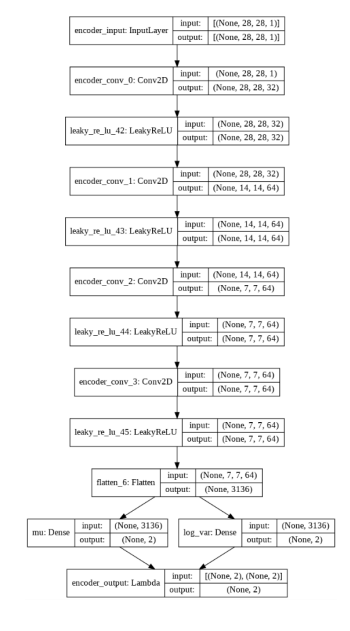

## 2) VAE의 손실 함수

&nbsp;이제 두 번째로, VAE의 손실 함수를 살펴보겠습니다. 기존 AE에서 손실 함수는 원본 이미지와 AE를 통과하여 구성된 이미지 사이의 RMSE 손실(재구성 손실)로만 구성됐던 반면에, VAE에서는 이 재구성 손실에 쿨백-라이블러 발산(이하 KL 발산)이 추가적으로 사용되는 것이 차이점입니다. KL 발산은 평균이 mu이고 분산이 log_var인 정규 분포가 표준 정규 분포와 얼마나 다른지 측정하여 이를 손실로 사용하기 위해 쓰입니다. KL 발산은 다음과 같이 코드로 작성할 수 있습니다.  

```python
kl_loss = -0.5 * sum(1+log_var - mu^2 - exp(log_var))
```
<br/>
&nbsp;수학적 식은 다음과 같습니다.  

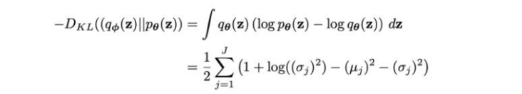

&nbsp;VAE의 손실 함수는 기존 재구성 손실에 위에서 말한 KL 발산 손실항에 가중치를 곱한 값을 더하여 만듭니다. 가중치는 너무 크게 되면 재구성 손실의 값의 중요도가 떨어지고 너무 작게 되면 KL 발산 손실이 제 역할을 못 하기 때문에 적절한 값을 찾아줘야 합니다.  
<br/>
&nbsp;VAE의 인코더와 손실 함수 코드 외에는 AE와 같으므로 인코더와 손실 함수 코드만 살펴보도록 하겠습니다.  
<br/>
&nbsp;아래 코드를 보면 AE 인코더를 만들 때와 달리 flatten으로 펼쳐진 데이터를 잠재 공간에 표현 벡터 값을 정하는 데에 사용하지 않고 mu(평균 벡터)와 log_var(분산에 로그 취함) 층에 연결된 뒤 lambda(케라스 라이브러리에서 불러옴) 층에서 정의한 샘플링 함수를 이용하여 mu와 log_var로 정의되는 정규분포로부터 표현 벡터 값을 정합니다.  

```python
 encoder_input = Input(shape=self.input_dim, name='encoder_input')

        x = encoder_input

        for i in range(self.n_layers_encoder):
            conv_layer = Conv2D(
                filters = self.encoder_conv_filters[i]
                , kernel_size = self.encoder_conv_kernel_size[i]
                , strides = self.encoder_conv_strides[i]
                , padding = 'same'
                , name = 'encoder_conv_' + str(i)
                )

            x = conv_layer(x)

            if self.use_batch_norm:
                x = BatchNormalization()(x)

            x = LeakyReLU()(x)

            if self.use_dropout:
                x = Dropout(rate = 0.25)(x)

        shape_before_flattening = K.int_shape(x)[1:]

        x = Flatten()(x)
        self.mu = Dense(self.z_dim, name='mu')(x)
        self.log_var = Dense(self.z_dim, name='log_var')(x)

        self.encoder_mu_log_var = Model(encoder_input, (self.mu, self.log_var))

        def sampling(args):
            mu, log_var = args
            epsilon = K.random_normal(shape=K.shape(mu), mean=0., stddev=1.)
            return mu + K.exp(log_var / 2) * epsilon

        encoder_output = Lambda(sampling, name='encoder_output')([self.mu, self.log_var])

        self.encoder = Model(encoder_input, encoder_output)
```

&nbsp;다음은 기존 AE의 손실 함수에 kl 발산 kl_loss를 추가하고 기존 손실 함수에 더해 VAE 손실 함수를 정의한 코드입니다.  

```python
 def vae_r_loss(y_true, y_pred):
            r_loss = K.mean(K.square(y_true - y_pred), axis = [1,2,3])
            return r_loss_factor * r_loss

        def vae_kl_loss(y_true, y_pred):
            kl_loss =  -0.5 * K.sum(1 + self.log_var - K.square(self.mu) - K.exp(self.log_var), axis = 1)
            return kl_loss

        def vae_loss(y_true, y_pred):
            r_loss = vae_r_loss(y_true, y_pred)
            kl_loss = vae_kl_loss(y_true, y_pred)
            return  r_loss + kl_loss

        optimizer = Adam(lr=learning_rate)
        self.model.compile(optimizer=optimizer, loss = vae_loss,  metrics = [vae_r_loss, vae_kl_loss])
```
&nbsp;학습 후, 테스트 데이터 중 랜덤한 데이터를 골라 변이형 오토 인코더에 넣어 나온 결과를 출력해 봅니다. 

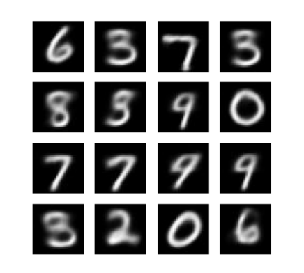  

&nbsp;아래 사진은  TensorFlow Probability를 사용하여 잠재 공간에 대한 표준 정규 분포를 생성하여 서로 다른 숫자의 연속적인 분포를 표시할 수 있습니다.  
 
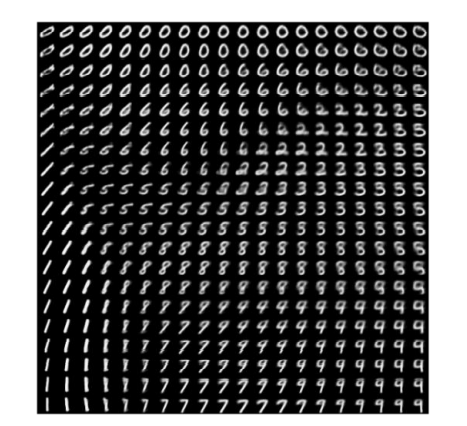  

산점도 그래프를 그려보면 AE에서 언급했던 문제가 많이 개선된 것을 확인할 수 있습니다.

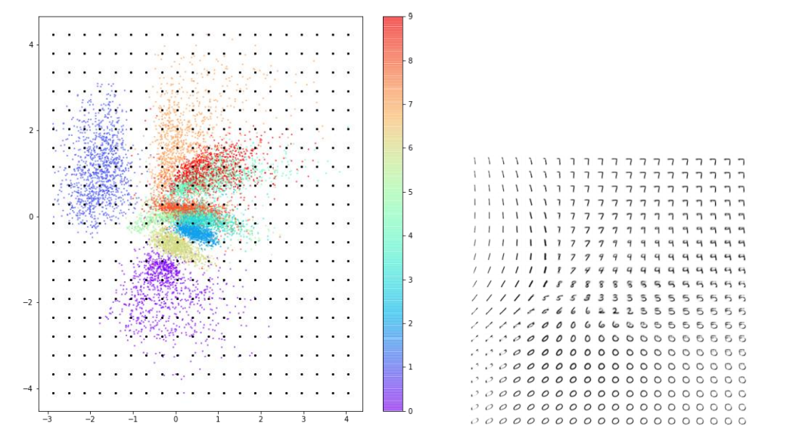  

### 참고 서적: 미술관에 GAN 딥러닝 실전 프로젝트(https://github.com/rickiepark/GDL_code)
