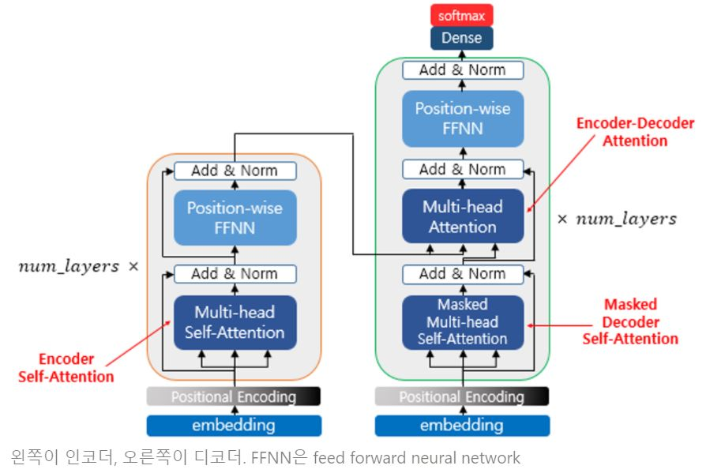
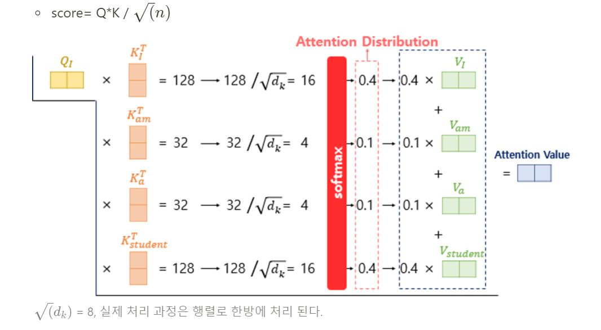
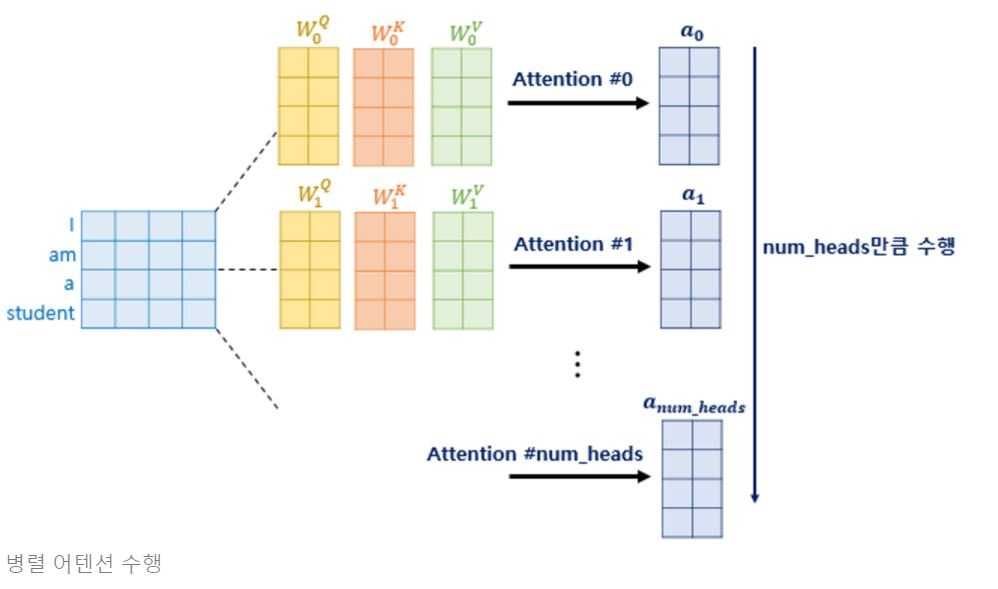
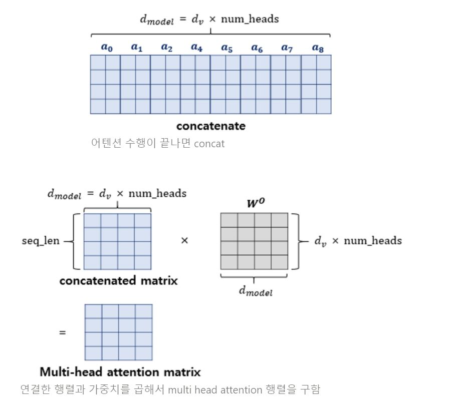
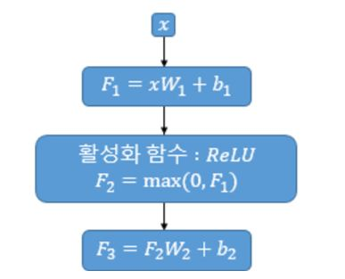
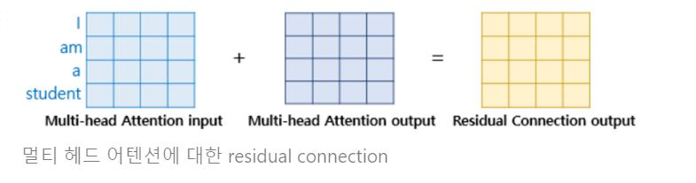
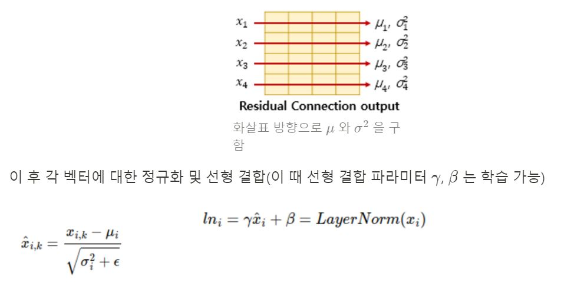
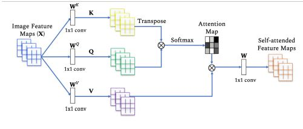

## INTRO

2019년 구글팀에서 발표한 **Vision Transformer(An Image is Worth 16x16 Words: Transformers for Image Recognition at Scale)** 의 등장은 게임 체인저가 되어, 이후 **CNN(Convolutional Neural Network)** 알고리즘 기반에서 **transformer** 기반으로 옮겨갔습니다. 거대한 데이터를 사전학습한 vision transformer 기반 모델들이 SOTA를 갱신하고 있습니다. 대표적인 예로 가장 유명한 데이터 중 하나인 ImageNet 분류 문제에서 상위 10개 모델 중 9개가 해당 모델을 기반으로 만들어졌습니다.

이제는 필수로 알아야 하는 구조가 된 만큼, 본 글에서는 Vision transformer 모델을 이해하는데 알아야하는 선행지식인 NLP 영역의 전반적인 지식과 함께 transformer에서 사용된 기법들을 요약하겠습니다.

## Transformer 모델의 구조

기존에 나왔던 자연어 처리 모델은 RNN 기반의 LSTM(GLU) 셀들로 이루어져 있었습니다. 단어가 입력될 때 마다 이전 단어(hidden state)상태 포함해서 hidden state 갱신되었고 마지막 state는 전체 문장 대표하는 하나의 context vector로 사용됩니다(전체 문맥적인 정보를 담고 있습니다). 고정된 크기에 정보 압축하려고 하니까 다양한 길이의 문장에 대해 고정된 크기로 가지고 있는게 문제가 되었고 비슷한 맥락으로 하나의 문맥 벡터가 소스 문장의 모든 정보를 가지고 있어야 해서 성능 저하를 야기했습니다. 따라서 Transformer 구조에서는 위에서 살펴본 "어텐션" 구조만을 활용하였습니다. RNN 계열 구조는 순차적으로 이전 단어에서 나온 값을 입력으로 사용하기 때문에 위치정보를 자체적으로 함축하고 있었지만, 어텐션 구조는 문장 내 단어들의 위치정보를 가질 수 없기 때문에 추가적으로 positional encoding이라는 것을 활용하여 위치정보를 더해주었습니다.
(사인 함수와 코사인 함수의 값을 임베딩 벡터에 더해주므로서 단어의 순서 정보를 더해주게 되는 것입니다.)

모델의 전반적인 구조는 다음과 같습니다.

transformer에서는 위와 같은 구조의 인코더와 디코더가 각 6개씩 구성되어 있습니다.
각 인코더와 디코더 셀은 크게 멀티헤드 어텐션, FFNN(FeedForword Neural Network)층, 그리고 layer norm과 residual connection으로 구성되어 있습니다. 
각 층별 역할과 구조를 더 자세하게 알아보기 전에, trasformer구조의 핵심이 되는 self attention 구조에 대하여 먼저 보겠습니다.

### transformer에서의 self attention 
(설명 이미지 출처: https://wikidocs.net/31379)

self attention 이란 input 데이터(여기서는 문장을 input 데이터로 이용하여 설명하겠습니다)내에서 자기 자신의 연관관계를 찾는다고 하여 붙여진 이름입니다. 
예를 들어 입력 문장으로 '나는 멋진 서울시립대학교 학생입니다' 라는 문장이 입력으로 들어온다면 '나는' 이라는 단어(Query)는 문장 내 다른 단어들과 얼마나 관련성이 있는지 살핍니다. 다시 말해, '멋진', '서울시립대학교', '학생입니다' 라는 단어들의 벡터들과 비교하여 점수를 매기고, 이 점수를 해당 단어 벡터와 선형결합합니다. 아래에서 좀 더 자세히 살펴보겠습니다.

**1. Q,K,V 벡터를 구한다**

문장에서 임베딩 벡터를 뽑은 이 후, 해당 단어에 대한 query, key, value 벡터를 구합니다. 이 때, transformer구조에서는 어텐션을 여러번 해주는 'multi head attention'(병렬적으로 어텐션을 여러번 하면 한번만 어텐션하는 것 보다 성능이 높다고 합니다)을 적용하기 때문에 Q,K,V 벡터는 모델이 가져야 하는 차원보다 더 낮은 차원으로 변환됩니다. 

**2. 어텐션 값 구하기**

이후 Q로부터 Key 와의 유사도를 구하고(내적은 해당 query와 key가 얼마나 ‘유사한지’ 나타낼 수 있는 척도로 사용 할 수 있습니다- 어텐션 스코어) 이를 기반으로 어텐션 분포를 만들고(어텐션 스코어를 소프트맥스 함수에 통과)이 후 어텐션 분포의 각 값와 해당 단어의 value값를 선형 결합(weighted sum)하여 각 단어와 단어간 연관성을 나타내는 어텐션 값을 구합니다. 트랜스포머에서는 dot product 어텐션에서 발전하여 scaled dot product attention 이라는 방법을 사용합니다. 

**3. 멀티 헤드 어텐션**

앞서 Q,K,V를 실제 한번만 수행될 때 나오는 차원보다 작게 하여 여러번 어텐션 수행한다고 하였습니다. 어텐션을 병렬로 수행하여 다른 시각으로 정보들을 수집하므로써 단어들의 연관성을 더 잘 파악할 수 있습니다. 각 병렬 어텐션 수행된 값은 어텐션 헤드라고 부릅니다. 

어텐션이 모두 끝나면 각 헤드에서 나온 어텐션 값을 하나로 이어줍니다(concatenate)
이 후, 구하고자 하는 차원으로 바꿔주기 위해 weight를 곱하여 멀티헤드 어텐션 행렬을 얻습니다.

### FFNN

FFNN층은 단순한 선형결합층과 활성화 함수인 relu 층을 사용합니다.
위 그림에서의 매개변수 W1, b1, W2, b2는 하나의 인코더 층 내에서는 다른 문장, 다른 단어들마다 동일하게 사용됩니다.

### Add

여기서의 Add층은 ResNet에서 나온 개념인 residual connection을 의미합니다. residual connection이란 간단히 말해서 블럭을 통과한 출력과 해당 블럭의 입력으로 들어간 벡터를 더해 주는 기법을 말합니다. 해당 기법은 기울기 소실을 방지하는 효과를 지닙니다.

### Norm

여기서의 Norm이란 layer normalization(층 정규화)을 의미합니다. 해당 기법은 텐서의 마지막 차원에 대해서 평균과 분산을 구하고, 이를 가지고 어떤 수식을 통해 값을 정규화하여 학습을 돕습니다.

## Vision Transformer
기존 이미지 처리 분야 에서도 어텐션을 적용하려는 노력을 하긴 했지만 CNN을 벗어날 순 없었습니다(CNN과 함께 사용되거나 전체 CNN 구조를 유지하면서 CNN의 특정 구성 요소를 대체) 하지만 본 논문은 이미치 패치의 시퀀스를 입력값으로 사용하는 transformer를 적용하여 CNN 기반의 모델의 성능을 넘는 성능을 보였습니다.
전반적인 매커니즘은 Transformer와 거의 동일합니다.

NLP영역에서의 모델 구조와 Vision Transformer구조를 비교해보겠습니다.

우선 출력이 시퀀스가 아니기 때문에 디코더는 MLP(MLP head 블럭)로 대체된 것을 볼 수 있으며 인코더의 구조가 살짝 변경되었습니다.(LayerNorm 먼저 진행 후 attention)

이미지를 transformer 구조에 넣기 위한 절차는 다음과 같습니다.
- Transformer와 동일한 구조의 입력 데이터를 만들기 위해서 이미지를 패치 단위(패치란 이미지의 일부 영역을 뜻합니다)로 나누고 각 패치를 나열하여 시퀀스 데이터 처럼 만듭니다.
- 각 패치를 linear projection(단어를 임베딩 벡터로 만드는 것과 유사)를 통해 벡터화 합니다.
- 임베딩 결과에 클래스를 예측하는 클래스 토큰을 하나 추가 합니다.
- 이미지에서도 각 패치의 위치가 중요하기 때문에 입력 값에 Positional Embedding을 더해줍니다. 

예시: **224 * 224** 이미지 사용한다고 가정
- 16*16 패치로 자른다고 하면 → 총 14*14개의 sequence 생성
- 3*224*224 ⇒ 196*16*16*3
- linear projection⇒ 196*768 
- 클래스 토큰(cls_token) 하나 더 끼워넣으면 ⇒ 197*768
- positional embedding 값 더해주면 197*768 사이즈 벡터를 얻습니다.

이 후 위에서 살펴본 transformer 구조와 같이 MSA(Multi-head Self Attention) 층 거치고 →Residual connection→ MLP→ Residual connection → layer normalization을 반복합니다. 

이미지 데이터에서의 셀프어텐션은 다음과 같습니다.

출처: https://arxiv.org/pdf/2101.01169.pdf/

## 단점
대표적인 단점이 데이터가 많이 필요하다는 것 입니다. vision transformer는 inductive bias의 부족으로 인하여 CNN 보다 데이터가 많이 요구됩니다.
여기서 inductive bias라는 것은 모델이 처음보는 입력에 대한 출력을 예측하기 위하여 사용하는 가정이라고 말할 수 있습니다.
위에서 언급하였듯, 입력 이미지를 패치단위로 쪼갠 후, flatten 하여 벡터화 하는 과정을 거칩니다. 이 때 위치 정보가 손실되기 때문에 2차원의 지역적인 정보가 유지되지 않습니다. CNN의 경우 이미지 전체에서 Convolution 필터가 이미지의 일부분만 보게 되는데 이 특정 영역만을 보고 특징을 추출할 수 있다는 것을 가정합니다. attention 구조는 데이터 전체를 보고 attention할 위치를 정하는 메커니즘이기 때문에 이 패턴을 익히기 위해서 CNN 보다 더 많은 데이터를 필요로 하게 됩니다. 
따라서 large scale 데이터셋에서 학습을 하고 transfer learning을 이용해야 효과적으로 모델을 활용할 수 있으며 CNN 모델보다 우수한 결과를 얻을 수 있습니다.

## 마치며
vision transformer를 이해하기 위해 NLP에서 처음 나온 transformer 논문의 개념부터 간단히 살펴보았습니다. 사실 timm 라이브러리 등에서 코드 몇줄을 통해 간단히 모델을 불러와서 사용할 수도 있지만, 모델이 나오게 된 배경과 디테일들을 알아야 모델을 task에 맞게 튜닝할 수도 있고, 최신 딥러닝 트렌드를 따라갈 수 있다고 생각합니다.
다음번에는 vision transformer를 이용한 다른 논문 리뷰와 함께 해당 모델을 이용한 task를 직접 수행하며 코드 리뷰까지 해보겠습니다 :)

## Reference

[Vision Transformer (AN IMAGE IS WORTH 16X16 WORDS, TRANSFORMERS FOR IMAGE RECOGNITION AT SCALE)](https://gaussian37.github.io/dl-concept-vit/)  
[트랜스포머(Transformer)](https://wikidocs.net/31379)  
[Attention Is All You Need](https://arxiv.org/pdf/1706.03762.pdf)  
[AN IMAGE IS WORTH 16X16 WORDS, TRANSFORMERS FOR IMAGE RECOGNITION AT SCALE](https://arxiv.org/pdf/2010.11929.pdf/)  
[Transformers in Vision: A Survey](https://arxiv.org/pdf/2101.01169.pdf/)  
