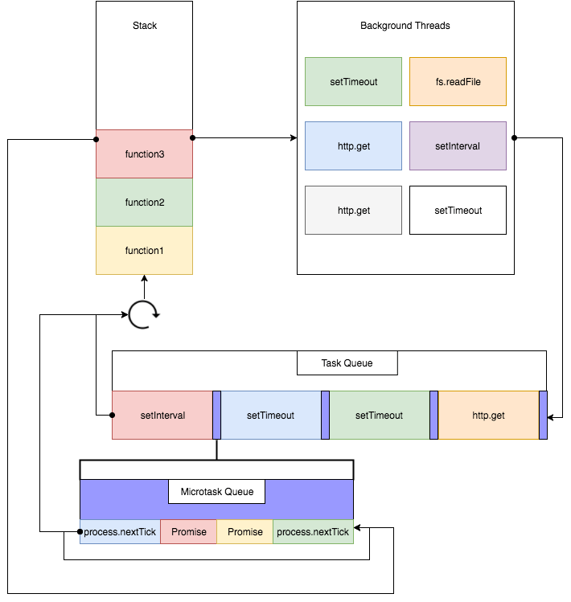

## Event Loop

이벤트 루프는 자바스크립트 엔진이 아니라, 브라우저 혹은 노드에서 가지고 있다.

콜 스택과, 태스크 큐를 감시하여 콜 스택이 비어있으면 태스크 큐에 있는 콜백을 가져와 콜스택에 넣는다.

태스크큐를 자세하게 설명하면 마이크로 태스크 큐와 일반 태스크 큐로 나눌 수 있다.

여기서는 태스크 큐와 마이크로 태스크 큐의 차이에 대해 알아보자.

## 태스크 큐 vs 마이크로 태스크 큐

2개의 큐 모두 콜백함수가 들어간다.

### 콜백함수를 태스크 큐에 넣는 함수들

`setTimeout`, `setInterval`, `setImmediate`, `requestAnimationFrame`, `I/O`, `UI 렌더링`

### 콜백함수를 마이크로태스크 큐에 넣는 함수들

`process.nextTick`, `Promise`, `Object.observe`, `MutationObserver`

익숙한 함수인 Web API의 setTimeout() 의 콜백함수가 태스크 큐에 들어가고 Promise 의 콜백함수가 마이크로태스크 큐에 들어간다는 것을 알 수 있다. 이벤트 루프는 각 콜백함수를 태스크/마이크로태스크 큐에서 꺼내쓰는 것인데, 그렇다면 어떤게 먼저일까?

### 마이크로태스크가 더 우선순위가 높다

결론부터 말하자면, 마이크로태스크가 먼저이다.

```javascript
function call() {
  console.log('콜 스택!');
  setTimeout(() => console.log('태스크 큐!'), 0);
  Promise.resolve().then(() => console.log('마이크로태스크 큐!'));
}

call();
// 콜 스택!
// 마이크로태스크 큐!
// 태스크 큐!
```

`setTimeOut`과 `Promise`의 위치를 바꾸어도 마이크로태스크가 먼저 출력이 된다.

### process.nextTick

`process.nextTick()`이 기술적으로는 이벤트 루프의 일부가 아니다.

대신 nextTickQueue는 이벤트 루프의 현재 단계와 관계없이 현재 작업이 완료된 후에 처리한다.

여기에서 작업이란 기저의 C/C++ 핸들러에서 전환하는 것, 또 실행되어야 하는 JavaScript를 처리하는 것을 말한다.

해당 단계에서 `process.nextTick()`을 호출하면 `process.nextTick()`에 전달한 모든 콜백은 언제나 이벤트 루프를 계속 진행하기 전에 처리한다.

이 동작 때문에 재귀로 `process.nextTick()`을 호출하면 이벤트 루프가 poll 단계에 다다르는 것을 막아서 I/O가 starving 될 수 있으므로 좋지 않은 상황을 만들 수 있다.

### setImmediate

`process.nextTick()` vs `setImmediate()`

개발자가 관심 가질 두 가지 유사한 호출이 있다.

`process.nextTick()`은 같은 단계에서 바로 실행된다.
`setImmediate()`는 이어진 순회나 이벤트 루프의 'tick'에서 실행된다.

사실 이름은 서로 바뀌어야 한다. `process.nextTick()`이 `setImmediate()`보다 더 즉시 실행된다.

### Summary



요약하면 위의 그림과 같다.
