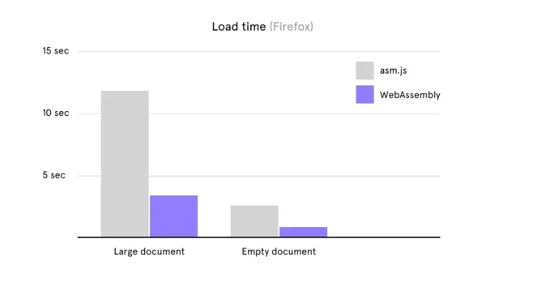

### 앵귤러, 리액트, 뷰를 넘어서

'프론트엔드 개발 방법'이라고 하면 무엇이 떠오르시나요? 현재(2022년)로서는 아마 많은 분들이 '리액트'를 가장 먼저 떠올리지 않으실까 생각합니다. 조금 더 넓게 보자면, 리액트와 함께 프론트엔드 프레임워크 3대장으로 불리는 앵귤러와 뷰 정도를 더 생각할 수 있을 것 같습니다. 그럼, 이것들로 프론트엔드의 개발 세계는 끝인 걸까요?

### 프레임워크? 라이브러리?

본격적인 내용에 앞서, 프레임워크와 라이브러리가 혼용되는 경우가 많아 정리를 해보고자 합니다. 추상적인 개념들은 보통 은유로서 이해할 때가 가장 쉬운 것 같습니다. 위 경우에도 은유를 적용해보자면 다음과 같이 이해될 수 있습니다.

- **프레임워크**는 특정한 **양식**을 가진 건물을 짓는 것으로 비유될 수 있다.
  → 즉, 프레임워크는 전체적인 개발에 대해 전반적인 환경과 양식을 제공한다.

- **라이브러리**는 가구점에서 필요한 **가구와 집기**를 구매하는 것으로 비유될 수 있다.
  → 즉, 라이브러리는 개발의 일부로 포함되는 코드의 모음이다.

한편 [Web.dev](https://web.dev/choose-js-library-or-framework/)의 글을 인용하면, 실제 코드에 적용되는 방향에 따라서 다음과 같이 이해될 수도 있습니다.

- **라이브러리**를 사용할 때는, 애플리케이션 코드가 라이브러리 코드**를 부른다.**
- **프레임워크**를 사용할 때는, 애플리케이션 코드가 프레임워크 코드**에 의해 불린다.**

하지만 프레임워크와 라이브러리의 경계가 명확한 것은 아닙니다. 리액트의 경우만 해도, 라이브러리에 더 가깝다고 평가되고 있고 공식 홈페이지에서도 분명 'A Javascript **Library**'라고 소개하고 있지만, 프레임워크로 받아들이는 개발자도 많이 존재합니다. (당장 리액트의 주요 비교대상인 뷰제이에스(Vue.js) 공식 문서에서도 리액트를 프레임워크라고 지칭합니다.) 게다가 프레임워크에 가깝다고 평가되는 앵귤러와 비교대상이 된다는 점은 판단을 더 혼란스럽게 만듭니다. 이 때문에 많은 사람들이 이러한 분류를 통틀어서 개발 도구(Developing tool)라고 지칭하기도 합니다. 저도 이 글에서는 '개발 도구'라는 명칭으로 통합하여 지칭하겠습니다.

# 차례

1. [프론트엔드 개발 도구 3대장](#1-프론트엔드-개발-도구-3대장)
   1. [앵귤러](#11-앵귤러angular)
   2. [리액트](#12-리액트react)
   3. [뷰제이에스](#13-뷰제이에스vuejs)
2. [다른 개발 도구](#2-다른-개발-도구)
   1. [스벨트](#21-스벨트svelte)
   2. [아스트로](#22-아스트로astro)
3. [그 외](#3-그-외)
   1. [플러터](#31-플러터-flutter)
   2. [코틀린](#32-코틀린-kotlin)
4. [웹 어셈블리](#4-어쩌면-웹의-미래-웹어셈블리webassembly)
5. [추가적으로 읽으면 좋은 글들](#5-추가적으로-읽으면-좋은-글들)

# 1. 프론트엔드 개발 도구 3대장

이 글에서는 잘 알려진 앵귤러, 리액트, 뷰제이에스의 경우 간단히만 짚고 넘어가겠습니다.

## 1.1. 앵귤러(Angular)

앵귤러는 현대적인 웹 프론트엔드 개발 도구 중 가장 오랜된 역사를 가지고 있습니다. 구글에서 2010년 선보인 프레임워크입니다. 앵귤러는 프론트엔드 개발에 무려 MVC 패턴을 도입하는 등 혁명적인 변화를 이끌었습니다. 게다가 많은 개발 도구들, 예컨대 뷰(Vue)와 같은 도구의 탄생에도 영감을 주었다고 합니다.

##### MVC

MVC는 Model-View-Controller의 준말로, 세 영역으로 나누어 개발하는 디자인 패턴(모델; 아키텍처)입니다. 아래는 가장 간단한 MVC 패턴의 한 *예시*를 나타낸 것입니다.



모델(Model)은 데이터나 행동(Behavior)과 같은, 서비스에 필요한 도메인을 가집니다. 뷰(View)는 모델의 정보에 기반해 실제 사용자가 이용하는 UI를 나타냅니다. 컨트롤러(Controller)는 서비스의 비즈니스 로직을 처리하며, 그 결과를 반영하기 위해 모델을 수정(Manipulate)합니다. 모델이 수정되기 때문에 결과적으로는 뷰까지 업데이트가 이루어지게 됩니다.

큰 틀에서는 위와 같은 구조를 가지지만 보통 이를 변형한 MVC 구조가 많이 사용되며(예컨대 컨트롤러가 뷰를 직접 수정하는 경우도 많이 있습니다), 컨트롤러 대신 뷰모델(ViewModel)을 도입하는 MVVM 등의 변형 또한 존재합니다. 현재 앵귤러는 MV\*(Model-View-Whatever; 모델과 뷰의 개념만 명확히 하고, 컨트롤러 역할은 자유로이 함)라는 개념으로 앵귤러의 패턴을 소개하고 있습니다. (앵귤러의 경우 MVC 패턴을 프론트엔드 개발에 본격적으로 도입시켰지만, 현재는 패턴으로부터 어느정도 자유로울 것을 지향하고 있습니다.)

아래는 하나의 컴포넌트를 나타내는 앵귤러 코드의 예시입니다.

```js
import { Component } from "@angular/core";

@Component({
  selector: "hello-world",
  template: `
    <h2>Hello World</h2>
    <p>This is my first component!</p>
  `,
})
export class HelloWorldComponent {
  // The code in this class drives the component's behavior.
}
```

[https://angular.kr](https://angular.kr)

## 1.2. 리액트(React)

오늘날 가장 많이 쓰이는 프론트엔드 개발 도구가 무엇인가 하면 단연 리액트가 독보적일 것입니다. ([구글 트렌드](https://trends.google.com/trends/explore?cat=31&q=React,Angular,Vue)에서 검색량 비교를 볼 수 있습니다.) 리액트는 2013년 페이스북(현재의 메타)에서 대중에 공개되었습니다.

리액트는 여러 개념을 새로이 또는 대중적으로 도입하였습니다. 그 중에서도 [가상 DOM(가상 문서 객체 모델; Virtual DOM)](https://reactjs.org/docs/faq-internals.html)이 가장 중요한 특징으로 꼽힙니다.

##### 가상 DOM

인터넷 브라우저는 화면을 적절히 렌더링하기 위해 HTML 소스를 구조화해야 하는데, 구조화된 결과물이 바로 DOM입니다. 렌더링하는 데 전적으로 참고하는 결과물이기 때문에, 이것이 수정되면 렌더링 자체가 새로 일어나게 됩니다. 따라서 변화가 많은 웹을 구성할 때 DOM을 직접 수정하는 것은 좋지 않은 성능을 야기할 수 있습니다.

리액트는 이러한 문제를 해결하기 위해 가상 DOM이라는, DOM과 별개의 모델을 도입했습니다. 가상 DOM 자체는 실제 브라우저의 렌더링 과정과는 독립적이기 때문에, 얼마든지 수정되어도 성능 상에서 큰 문제가 발생하진 않습니다. 리액트는 개발자에게 가상 DOM을 사용하도록 한 뒤, 그저 가상 DOM을 이전 상태와 비교하여 차이가 있을 때만(즉, 필요할 때만) 그 부분의 재 렌더링을 유도합니다. 이러한 특징 덕분에 개발자는 그냥 DOM을 직접 제어하듯이 개발하면서도 성능 상에서는 영향을 크게 받지 않을 수 있습니다.

[GDSC UOS 블로그의 글](https://gdsc-university-of-seoul.github.io/VirtualDOM/)에서 더욱 자세한 설명을 볼 수 있습니다.

이외에도 [컴포넌트 개념](https://reactjs.org/docs/components-and-props.html)(UI 요소를 독립적이고, 재사용 가능한 덩어리로 생각), [단방향 데이터 바인딩](https://velog.io/@sunaaank/data-binding)(데이터 흐름이 상위에서 하위 컴포넌트로만 존재) 등 많은 특징들을 가지고 있습니다.

아래는 하나의 컴포넌트를 나타내는 리액트의 `jsx` 형태로 작성된 코드의 예시입니다.

```js
function Welcome(props) {
  return <h1>Hello, {props.name}</h1>;
}
```

[https://reactjs.org](https://reactjs.org)

> 리액트라는 '라이브러리'를 기반으로 한 넥스트제이에스(Next.js), 리믹스(Remix), 개츠비(Gatsby)와 같은 프레임워크도 존재합니다.

## 1.3. 뷰제이에스(Vue.js)

뷰제이에스는 리액트처럼 가상 DOM을 사용하고, 컴포넌트 기반 개발 환경을 제공합니다. 한편, 뷰제이에스의 `vue` 형식은 리액트의 `jsx` 형식에 비해서 스크립트(자바스크립트, 타입스크립트)의 비중이 낮다는 것이 특징입니다. 또한 스타일, 템플릿, 스크립트를 한 파일에서 선언한다는 점에서 컴포넌트의 독립성이 높은 편입니다.

다음은 하나의 컴포넌트를 나타내는 `vue` 형식으로 작성된 코드의 예시입니다.

```html
<script>
  export default {
    data() {
      return { count: 0 };
    },
  };
</script>

<template>
  <button @click="count++">Count is: {{ count }}</button>
</template>

<style scoped>
  button {
    font-weight: bold;
  }
</style>
```

[https://vuejs.org](https://vuejs.org)

# 2. 다른 개발 도구

앞서 프론트엔드 개발 도구 3대장으로 불리는 앵귤러, 리액트, 뷰제이에스에 대해 살펴보았는데요, 이외에도 꽤 많은 개발 도구들이 존재합니다. 앞서 나온 도구들을 확장한 도구들도 있고, 완전히 다른 개념으로 존재하는 도구들도 있습니다. 이 글에서는 **스벨트**, **아스트로**, 그리고 **코틀린**과 **플러터**와 같은 도구를 소개하려 합니다. 그리고 마지막으로는, 차세대 웹 기술로 기대를 모으고 있는 **웹어셈블리**에 대해서 소개하겠습니다.

## 2.1. 스벨트(Svelte)

신생 개발 도구 중 가장 핫한 것을 꼽자면 바로 이, 스벨트가 아닐까 싶습니다. 2016년 출시한 오픈소스 프레임워크인 스벨트는, 스택오버플로우에서 진행된 2021년 개발자 설문 조사결과 웹 프레임워크 부문에서 '가장 사랑받는' 프레임워크 1위에 오르기도 할 정도로 큰 인기를 얻고 있습니다. 스벨트는 아래와 같은 형식의 `.svelte`를 사용합니다.

```html
<script>
  let a = 1;
  let b = 2;
</script>

<input type="number" bind:value="{a}" />
<input type="number" bind:value="{b}" />

<p>{a} + {b} = {a + b}</p>
```

스벨트의 공식 사이트에서는 다음과 같은 특징을 내세우고 있습니다.

##### 적은 양의 코드 – Write less code

스벨트는 적은 코드의 양이 버그 또한 줄일 수 있다는 논리 아래서 필요한 코드 양을 줄이는 것을 중요한 목표로 두고 있습니다. 실제로, 스벨트는 리액트나 뷰제이에스에 비해서 코드 양이 매우 적은 편입니다. 위의 코드 예시에서도 볼 수 있듯이, 프레임워크 또는 라이브러리 구현에 필요한 형식적인 코드가 짧거나 거의 없습니다.

##### 가상 DOM을 사용하지 않는다. – No virtual DOM

리액트와 뷰제이에스는 가상 DOM을 사용합니다. 가상 DOM은 실제 DOM의 갱신 횟수를 줄여준다는 점에서 속도적인 이득이 큽니다. 하지만 가상 DOM을 사용하는 환경에서도 가상 DOM의 정보와 이전 정보(스냅샷)를 비교하는 데 오버헤드가 발생할 수 있습니다.

스벨트는 가상 DOM을 사용하지 않았습니다. 그렇다면 어떻게 반응성(reactive)을 구현하였을까요? 바로 스벨트가 컴파일러의 기능을 일부 수행하기 때문입니다. 컴파일타임에 스벨트는 바닐라 자바스크립트 코드로 변환되는데, 이때 어느 부분이 반응성을 가지는지 미리 정의한다는 점이 반응성 구현의 핵심입니다.

즉, 리액트와 같은 가상 DOM은 런타임에 가상 DOM과 실제 DOM의 차이를 비교하고 이를 반영하는 반면, 스벨트는 컴파일타임에 미리 어느 부분이 반응성(유동성)을 가지고 있는지 체크하고 이를 반영하는 자바스크립트 파일을 생성합니다. 따라서 런타임에는 어느 부분이 바뀌었는지 체크할 필요없이, 그저 자바스크립트 코드를 실행하면 되는 것입니다.

##### 진짜 반응성 – Truly reactive

복잡한 상태(state) 관리 라이브러리 또는 별도의 형식(예컨대 리액트의 `setState`, `useState`)을 필요로 하지 않고, 순수하게 자바스크립트만으로 반응성을 구현하였습니다. 또한 반응성을 구현하기 위한 형식적 코드들은 대부분 스벨트의 컴파일러가 추가해줍니다. (아래는 공식 홈페이지의 예시입니다.)

```js
count += 1;
// 위의 코드는 아래와 같이 컴파일됩니다.
count += 1;
$$invalidate("count", count);
```

> 해당 설명은 스벨트 버전 2 이후에 해당하는 내용입니다.
>
> 스벨트 버전 1의 경우엔 상태 관리를 리액트의 `setState` 훅과 거의 같은 형태로 제공하였습니다.

[https://svelte.dev](https://svelte.dev)

## 2.2. 아스트로(Astro)

아스트로는 아주 따끈따끈한 신생 프레임워크입니다. 2021년부터 개발 버전이 나오기 시작하였고, 무려 2022년 8월에 정식버전이 나왔습니다. 역사가 짧은 만큼, 많이 생소하고 커뮤니티 또한 작지만 아주 특이한 특징들을 가지고 있어 소개시켜드리고 싶습니다.

> 아스트로는 리액트와 같은 라이브러리보다는 Next.js와 같은 프레임워크에 가깝습니다.

위에서 소개해드린 여러 개발 도구들의 등장은 프론트엔드의 폭발적인 성장을 가져왔지만, 동시에 **너무 큰 복잡성**을 가져왔습니다. 이러한 문제를 해결하기 위해 등장한 방법 중 하나가 바로 아스트로입니다. (아스트로 외에도 개츠비나 SSR 지원 프레임워크 등 많은 방법이 있습니다.) 아래는 아스트로에서 사용하는 `.astro` 파일의 예시로, 페이지 정보를 담고 있습니다.

```html
---
import React from '../components/React.jsx';
import Vue from '../components/Vue.vue';
---

<div>
  <React client:load />
  <Vue client:load />
</div>
```

아스트로의 특이하면서도 대표적인 특징은 두 가지가 있습니다. (모든 용어는 아스트로의 공식 문서에 나오는 내용을 기반으로 작성하였습니다.)

##### **Component Islands**

'Islands'라는 단어에서 알 수 있듯, 이는 '섬'으로 은유될 수 있는 특징입니다. 웹 페이지 자체를 하나의 덩어리로 보는 것이 아니라 '바다'로 보고, 그곳에 각각의 컴포넌트가 '떠 있는 섬'과 같이 부유하고 있는 구조로 보는 패러다임입니다.

이 패러다임에 의해 아스트로는 정적인 부분은 모두 순수한 HTML로 대체하고, 필요한 부분만을 컴포넌트로 불러옵니다. 따라서 서버로부터 받아오는 HTML에도 정적인 부분은 이미 포함되게 됩니다. (순수한 리액트에서의 경우, HTML에 의미있는 정보를 전혀 담지 않는 것과 대비됩니다.)

##### **UI-agnostic**

'agnostic'은 영어로 '불가지론적'이라는 뜻을 가집니다. 여기서 확장되어 아스트로에서 'UI-agnostic'은 UI를 구성하는 형태를 특정하지 않는다는 특징을 나타냅니다. 다시 말해, 다중 프레임워크/라이브러리(Multi-framework/Multi-library)로 이해할 수 있습니다. 아스트로는 컴포넌트에 대해 이러한 개념이 적용되는데, 컴포넌트를 제공하는 개발 도구로서 여러 도구를 지원한다는 뜻이 됩니다.

앞서 설명한 'Component Islands' 특징과 맞물려, 아스트로에서는 '부유하고 있는' 컴포넌트를 리액트, 뷰와 같은 다른 개발 도구로 작성할 수 있고, 컴포넌트는 모두 독립적이기 때문에 하나의 페이지 안에서도 여러 개발 도구를 사용할 수 있습니다. 현재 공식적으로 지원하는 프레임워크(공식 문서에서 프레임워크로 분류됨)는 다음과 같습니다.

- alpinejs
- lit
- preact
- react
- solid-js
- svelte
- vue

[https://astro.build](https://astro.build)

# 3. 그 외

일반적이지는 않지만, 프론트엔드를 개발하는 여러 방식 중 몇 가지를 소개하고자 합니다.

## 3.1. 플러터 (Flutter)

플러터는 잘 알려져있다시피 멀티플랫폼 도구입니다. 언어로는 Dart를 사용하고 구글에서 제공 및 관리하고 있습니다. 플러터 2.0부터는 _공식적으로_(그 전에는 베타 버전으로 지원) 웹 빌드를 지원하며 웹 프론트엔드 개발이 본격적으로 가능하게 되었습니다.

모바일 우선 정책에 가깝게 만들어진 관계로, 웹 개발보다는 앱 개발에 가깝게 활용되지만, 플러터로도 충분히 웹을 개발할 수 있습니다. 오히려 웹 서비스를 앱 서비스로, 혹은 앱 서비스에서 웹 서비스로 확장하기 수월하다는 점에서, 소규모 또는 1인 개발 형태에서 특히 유용합니다.

특이한 점이라면, HTML 형태로만 출력되지 않는다는 점입니다. HTML 형태로 출력할 수도 있지만, 보통은 Skia라고 하는 렌더링 엔진과 이후 설명할 웹어셈블리(WebAssembly)가 사용되는 Canvaskit이라는 형태로 구현됩니다. 기본적인 설정은 모바일에서는 HTML 형태로, 컴퓨터 환경에서는 Canvaskit 형태로 구동됩니다. 이러한 점 때문에 다른 웹과의 연동성은 많이 떨어지는 편입니다.

[여기](https://flutter.github.io/samples/#?platform=web)서 플러터로 구현한 웹의 예시를 확인할 수 있습니다. 아래는 플러터 코드의 예시입니다.

```dart
void main() => runApp(
  MaterialApp(
    title: 'MyApp',
    home: MyApp(),
  ),
);

class MyApp extends StatelessWidget {
  @override
  Widget build(BuildContext context) {
    return Scaffold(
      appBar: AppBar(
            title: Text('Welcome to Flutter'),
          ),
      body: Center(
            child: Text('Hello World'),
          ),
    );
  }
}
```

[https://flutter.dev](https://flutter.dev)

## 3.2. 코틀린 (Kotlin)

주로 안드로이드 앱 개발과 백엔드 개발에 사용되는 코틀린 언어로도 프론트엔드 개발을 할 수 있습니다. 코틀린 언어의 개발사인 제트브레인(JetBrains) 사에서는 아래와 같은 코틀린 언어 기반 프레임워크를 제공하고 있습니다.

- Kotlin/JS for brower
- Kotlin/JS for Node.js
- Kotlin/Multiplatform

기본적으로 Kotlin/JS는 HTML의 태그에 해당하는 컴포저블 함수를 모두 구현해놓은 환경입니다. 또, 재미있게도 리액트에 대해서도 구현해놓았기 때문에 리액트 개발을 코틀린으로도 진행할 수 있습니다. 자바스크립트나 타입스크립트와 비교했을 때 코틀린의 강력한 _정적 타입 체킹_, 강력한 *코루틴 비동기 처리(Coroutines)*와 *널값 안전성(Null Safety)*는 장점이 될 수 있습니다.

멀티플랫폼을 지원해야 하고 공통 비즈니스 로직이 매우 핵심적이고 복잡하다면, 다음의 Kotlin/Multiplatform과 결합하여 사용하면 꽤 유용한 선택이 될 수 있습니다.

Kotlin/Multiplatform은 이름에서 알 수 있듯, 코틀린으로 멀티플랫폼 앱을 작성할 수 있는 환경을 제공합니다. 다만, 플러터처럼 완전히 하나의 코드베이스만을 사용하는 것은 아니고, 공통되는 부분만 하나의 코드로 작성하고, UI와 같은 부분은 별도로 작성합니다. 여기서 웹 부분은 Kotlin/JS로 작성하게 됩니다.

아래는 Kotlin/JS로 작성된 _리액트_ 코드의 예시입니다.

```kotlin
fun main() {
    val container = document.getElementById("root") ?: error("Couldn't find root container!")
    createRoot(container).render(Fragment.create {
        h1 {
            +"Hello, React+Kotlin/JS!"
        }
    })
}>)
```

[https://kotlinlang.org/docs/js-overview.html](https://kotlinlang.org/docs/js-overview.html)

# 4. 어쩌면 웹의 미래, 웹어셈블리(WebAssembly)

원래의 웹 생태계는 어떤 방법을 사용하든, 결론적으로는 브라우저 상에서 자바스크립트 파일을 실행하게 되는 형식이었습니다. 웹어셈블리가 등장하기 전까지는 말이죠. 웹어셈블리는 JVM의 바이트코드와 같은 '중간 코드'입니다. 꼭 자바스크립트를 사용하지 않아도 웹어셈블리, 즉 `.wasm` 파일로 변환 또는 컴파일만 된다면 어떤 언어를 사용해도 웹에서 직접 실행될 수 있습니다. 현재 C, C++, Rust가 대표적으로 웹어셈블리 컴파일러를 가지고 있어 활발히 사용되고 있고, 이외에도 여러 언어들이 웹어셈블리를 지원하거나 지원할 계획을 가지고 있습니다. 앞서 소개한 코틀린 또한 웹어셈블리로의 컴파일을 일부 지원하고 있습니다.

#### 빠른 속도

잘 알려져있다시피, 자바스크립트는 코드를 실행시점에 해석하는 '인터프리터 방식'으로 동작합니다. 또한 메모리 관리를 기기에게 맡기는 가비지 콜렉터를 사용하는 등 몇 가지 특성들은 결과적으로 느린 실행 속도를 가져옵니다. 하지만 웹어셈블리는 저급언어에 가까운 형태를 띄고 있기 때문에 상대적으로 빠른 속도를 가지고 있습니다. 웹어셈블리로 실행되는 피그마(Figma) 서비스의 경우, 같은 C++ 코드를 자바스크립트로 변환(asm.js를 이용)했을 때보다 웹 어셈블리로 전환한 뒤 [세 배의 속도 향상을 보여줬다고 합니다.](https://www.figma.com/blog/webassembly-cut-figmas-load-time-by-3x/) 다음 그래프는 파이어폭스 환경에서 피그마를 웹 어셈블리로 전환하였을 때와 그 전의 속도를 비교하고 있습니다. (출처: 위의 링크)



#### 자유로움

웹어셈블리는 여러 측면에서 자유롭다고 할 수 있습니다. 일단 기본적으로 버전이 없는(versionless) 웹 환경을 지원하기 때문에, 브라우저의 호환성을 확보하는 데 상당히 유리합니다. 또한 웹 브라우저와 같은 자바스크립트 문맥의 안팎에서 모두 사용될 수 있기 때문에, 웹이 아닌 분야(WASI)에서도 실행될 수 있습니다. 그밖에도 웹 개발은 자바스크립트가 아닌 언어로 할 수 있다는 기본적인 자유도 있습니다.

웹어셈블리는 현재 주요 브라우저 4개(파이어폭스, 크롬, 사파리, 엣지)에서 모두 지원되고 있기 때문에 지금도 사용해볼 수 있습니다. 앞서 언급했던 피그마 뿐 아니라 [플러터의 렌더러(Skia)](https://skia.org/docs/user/modules/canvaskit/), [유니티](https://blog.unity.com/technology/webassembly-is-here) 등의 서비스에서 현재 웹어셈블리를 사용하고 있습니다.

[https://webassembly.org/](https://webassembly.org/)

# 5. 추가적으로 읽으면 좋은 글들

여기서는 모두 소개하지 못하였지만, 이밖에도 흥미로운 개발 도구들이 많이 있습니다.

- **Qwik**: 엄청난 속도를 자랑하는 신생 웹 프론트엔드 프레임워크입니다.

  [공식홈페이지의 소개글(영어)](https://qwik.builder.io/docs/think-qwik/), [Qwik을 소개하는 국내 기사](https://www.ciokorea.com/news/261550)

- **Gatsby**: 정적 사이트 생성(SSG; Static Site Generation)에 특화된 리액트 기반 프레임워크입니다.

  [공식홈페이지의 소개글(영어)](https://www.gatsbyjs.com/docs/conceptual/)

# 참고 문헌

1. Hansa, Umar. _Choose a JavaScript library or framework_. 2022. 05. 23. web.dev.
2. 각 프레임워크 및 라이브러리의 공식 홈페이지
3. 이윤석. _개발자가 사랑하는 프론트엔드 프레임워크1: 스벨트(Svelte)의 특징_. https://www.samsungsds.com/kr/insights/svelte.html (2021. 11. 26.)
